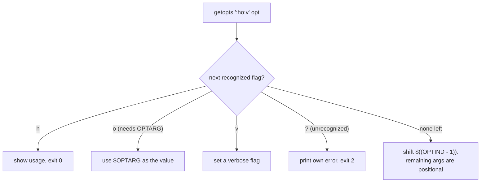

# Lesson 14. Argument Parsing with getopts and a Usage Convention

**Mission link:** Stage 10 opens where a script actually meets its caller: its own command-line flags and arguments. Every prior stage assumed a script's inputs arrived cleanly; this lesson is parsing them itself, with the same discipline the mission has applied to everything else so far.
**Primary source:** [Docs: "Shell Command Language", POSIX.1-2017, The Open Group](https://pubs.opengroup.org/onlinepubs/9699919799/utilities/V3_chap02.html)
**Prerequisites:** [Lesson 13](0013-pipes-subshells-and-process-substitution.md), [Word splitting](../GLOSSARY.md)

## Warm-up

1. ▢ `grep "ERROR" logfile.txt | while read -r line; do count=$((count + 1)); done; echo "Found: $count"`. What does this print, and why?

Check

It prints `Found: ` with an empty (or unset) `count`, because the `while` loop runs in a subshell created for the pipe; every `count` it sets updates only that subshell's copy, which vanishes once the pipeline ends, never reaching the parent shell.

2. ▢ Why does `diff <(sort file1.txt) <(sort file2.txt)` avoid needing two temporary files?

Check

Each `<(...)` expands to a path bash arranges to behave like a readable file containing that command's output, so `diff` reads both sorted outputs directly without either one ever being written to disk.

## Know this

### `getopts`: a loop that consumes one flag per iteration

`while getopts ":ho:v" opt; do case "$opt" in ... esac; done` is the standard shape: `getopts` reads the next recognized option from the script's own arguments each time it's called, assigns its letter to `opt`, and returns nonzero once options are exhausted, ending the loop. The **option string** (`":ho:v"`) names which flags exist: `h` and `v` take no argument, `o:` (the trailing colon) means `-o` requires one, available afterward in `$OPTARG`. The **leading colon** in `":ho:v"` switches `getopts` into silent mode: instead of printing its own error message for an unrecognized flag or a missing argument, it sets `opt` to `?` (unrecognized) or `:` (missing argument) and leaves reporting to the script's own `case`, which is what lets a script's error messages match its own usage convention instead of `getopts`'s generic one.

### `OPTIND` and `shift`: separating flags from the arguments after them

`getopts` tracks its position in `$OPTIND`, not by consuming arguments itself; after the loop, `shift $((OPTIND - 1))` discards everything `getopts` already consumed, leaving `$1`, `$2`, and so on as the script's actual positional arguments, the ones that come after any flags (`script.sh -v -o out.txt file1.txt file2.txt` leaves `file1.txt` and `file2.txt` as `$1`/`$2` after the shift). Skipping this step is a common mistake: without it, `$1` is still whatever the first flag was, not the first real argument the script was meant to operate on.

### `getopts` handles short flags only; long flags need a different tool entirely

`getopts` (the shell builtin, POSIX-specified) parses single-letter flags (`-v`, `-o value`) and nothing else; it has no concept of `--verbose` or `--output value` at all. A script wanting long-option support commonly either hand-rolls a `case "$1" in --verbose) ...; --output) shift; out="$1";; esac` loop over the raw arguments instead, or reaches for the external `getopt` command (not `getopts`, a genuinely different program, present on GNU/Linux systems but not portable to every POSIX environment) which does support long options. Neither substitute is drop-in for `getopts`; the choice depends on whether long-option support is worth the portability and complexity it costs.

### A usage convention: one function, called consistently, exit status `2`

A `usage()` function, printing a one-line synopsis (`Usage: script.sh [-v] [-o FILE] ARG1 ARG2`) to standard error and returning, called from both `-h` (with exit `0`, since asking for help isn't an error) and from the `?`/`:` cases (with exit `2`, the conventional status many CLI tools use specifically for a usage error, distinct from `1`'s more generic failure), gives a script one place its calling convention is documented and enforced, rather than scattered error messages that drift out of sync with what the script actually accepts.

## Practice

1. ▢ A script is called as `deploy.sh -v -e prod myapp`. Using `while getopts ":ve:" opt; do ...; done` followed by `shift $((OPTIND - 1))`, what does `$1` hold after the loop and the shift?

Hint

Consider which arguments `getopts` actually consumed versus which ones are left over.

Check

`myapp`. `getopts` consumes `-v` and `-e prod` (with `prod` captured in `$OPTARG` during the `e` case), advancing `OPTIND` past both; `shift $((OPTIND - 1))` then discards those two consumed arguments, leaving `myapp` as the new `$1`.

2. ▢ Why does the leading colon in `":ho:v"` matter, and what changes if it's left out (`"ho:v"` instead)?

Check

With the leading colon, an unrecognized flag or a missing required argument sets `opt` to `?` or `:` respectively, silently, letting the script's own `case` print an error matching its usage convention. Without the leading colon, `getopts` prints its own generic error message directly and still sets `opt` to `?`, giving the script no control over the wording or format of that error.

3. ▢ A script needs to support `--dry-run` as a flag. Why can't `getopts` parse this directly, and what are the two common alternatives?

Check

`getopts` (the POSIX-specified builtin) only recognizes single-letter flags; it has no mechanism for multi-character, double-dash options at all. The two common alternatives: hand-roll a `case "$1" in --dry-run) ...; esac` loop over the raw arguments, or use the external `getopt` command, a different program from `getopts` that does support long options but isn't guaranteed portable to every POSIX system.

4. ▢ Why does calling `usage` from `-h` with exit `0` but from an invalid-flag case with exit `2` matter, rather than using the same exit code for both?

Check

Exit status is part of the script's contract with whatever calls it (lesson 2): `-h` is a successful, intentional request for help, so exit `0` correctly tells a caller (or CI) nothing went wrong. An invalid flag is a genuine usage error, and exit `2` (the conventional usage-error status) lets a caller's own error handling distinguish "the user asked for help" from "the user's invocation was wrong" by checking the exit status alone, without parsing the printed message.

5. ▢ Which claim correctly describes what `getopts` and `shift $((OPTIND - 1))` do together?

    - a) `getopts` parses both short and long options; `shift` is only needed for long options
    - b) `getopts` parses one recognized short flag per call, tracking its position in `OPTIND`; `shift $((OPTIND - 1))` then discards the consumed flags, leaving the remaining arguments as `$1`, `$2`, and so on
    - c) `shift $((OPTIND - 1))` is optional and only affects performance, not correctness
    - d) `OPTARG` holds the name of the current flag; `opt` holds its argument value

Check

**b)** That's the precise mechanism and why the shift step is necessary. (a) is false: `getopts` handles short flags only. (c) is false: skipping the shift leaves `$1` pointing at a flag instead of the first real positional argument. (d) is false: it's the reverse, `opt` holds the flag letter, `OPTARG` holds its argument value.

## Real-world reps

- [ ] Find a script you have access to that parses its own arguments. Check whether it uses `getopts`, a hand-rolled loop, or neither (positional arguments only), and whether it calls `shift $((OPTIND - 1))` correctly if it does use `getopts`.
- [ ] Add a `-h`/`--help` usage message to a script you maintain that doesn't have one, following this lesson's convention (usage to stderr, exit `0` for `-h`, exit `2` for an invalid invocation).
- [ ] Tomorrow: read the primary source's section on `getopts` in full, and compare its exact description of `OPTIND` and `OPTARG` against your own mental model.

## Going further

- [Docs: "Shell Command Language", POSIX.1-2017, The Open Group](https://pubs.opengroup.org/onlinepubs/9699919799/utilities/V3_chap02.html)
- [Site: "Shell Style Guide", Google](https://google.github.io/styleguide/shellguide.html)
- [Resources](../RESOURCES.md)

---

Not landing? Reread the primary source at the top, since this lesson compresses it and compression is where understanding leaks. Check the [glossary](../GLOSSARY.md) for any term that felt slippery.

If the lesson itself is unclear rather than the material, that is a defect: [open an issue](https://github.com/TokenCemetery/teach/issues).
