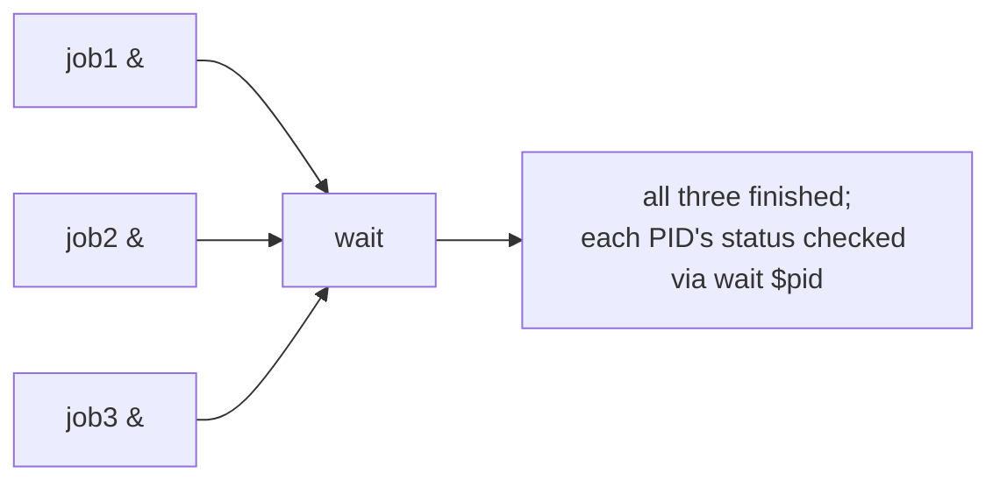

# Lesson 15. Signals, Background Jobs, and wait

**Mission link:** This is stage 10's capstone. Lesson 14 covered a script parsing its own inputs; this lesson is a script managing its own concurrency and its own shutdown, going past lesson 3's cleanup `trap` into named signals, background jobs, and collecting their results.
**Primary source:** [Docs: "Shell Command Language", POSIX.1-2017, The Open Group](https://pubs.opengroup.org/onlinepubs/9699919799/utilities/V3_chap02.html)
**Prerequisites:** [Lesson 14](0014-argument-parsing-with-getopts.md), [Word splitting](../GLOSSARY.md)

## Warm-up

1. ▢ What does `getopts` handle, and what does it not, when a script needs to support `--dry-run`?

Check

`getopts` handles single-letter flags only; it has no mechanism for multi-character, double-dash options. A script needing `--dry-run` either hand-rolls a case-based loop over the raw arguments or reaches for the external, non-`getopts` `getopt` command instead.

2. ▢ Why does calling `usage` with exit `0` from `-h` but exit `2` from an invalid flag matter?

Check

Exit status is part of the script's contract with its caller: `-h` is an intentional, successful request, so `0` correctly signals nothing went wrong. An invalid flag is a genuine usage error, and the conventional `2` lets a caller distinguish the two by checking the exit status alone.

## Know this

### Signals have names and numbers, and one of them can't be caught at all

A **signal** is an asynchronous notification sent to a process: `SIGINT` (2, what `Ctrl-C` sends), `SIGTERM` (15, the default, catchable request to terminate that `kill` sends), `SIGHUP` (1, historically "the terminal hung up," now commonly used to ask a daemon to reload), and `SIGKILL` (9), which cannot be trapped, ignored, or handled at all; it terminates the process unconditionally, which is exactly why `kill -9` is a last resort, not a first one, since it gives the target no chance to clean up anything. Lesson 3's cleanup `trap ... EXIT` fires on any exit, for any reason; `trap 'handler' TERM INT` (or `SIGTERM SIGINT`, both accepted) fires specifically when one of those named signals arrives, and unlike an `EXIT` trap, catching a signal doesn't terminate the script on its own: the handler runs, and the script keeps going afterward unless the handler itself calls `exit`.

### Background jobs: `&`, `$!`, and the jobs a shell is tracking

Appending `&` to a command (`long_task.sh &`) starts it in the background, returning control to the script immediately rather than waiting for it to finish; `$!` immediately after holds that background job's **PID** (process ID), the handle needed to check on or wait for it specifically. `jobs -l` lists a shell's currently tracked background jobs with their PIDs; `fg %1` brings job `1` to the foreground (blocking until it finishes), `bg %1` resumes a stopped job `1` in the background. A script launching several background jobs in a loop, capturing each `$!` into an array (lesson 11) as it goes, is the common shape for "run these N things concurrently, then wait for all of them."

### `wait`: collecting the result of work that already started

`wait` with no arguments blocks until every background job the current shell started has finished. `wait "$pid"` waits for one specific job and returns *that job's* exit status, letting a script check each one individually (`wait "$pid"; echo "job $pid exited $?"`) rather than only knowing that everything eventually finished. `wait -n` (bash-only, and version-sensitive: added in bash 4.3, worth checking against `bash --version` rather than assuming) waits for the *next* background job to finish, whichever it is, returning that job's status, useful for reacting to jobs as they complete instead of only after all of them have.

### Forwarding a signal to background children, so a script's shutdown doesn't orphan them

A script that launches background jobs and then receives `SIGTERM` itself (a CI system cancelling the job, an operator killing the script) doesn't automatically terminate its background children; they're separate processes that keep running, orphaned, unless the script explicitly propagates the signal: `trap 'kill $(jobs -p) 2>/dev/null; exit 1' TERM INT` sends `SIGTERM` to every job the shell is still tracking before the script itself exits. Skipping this is how a cancelled CI job leaves stray background processes running on a shared machine long after the script that started them is gone, exactly the kind of failure mode that looks like "the network" or "flakiness" until someone traces it back to a missing trap.

## Practice

1. ▢ A script runs `worker.sh &` and immediately checks `$?`. What does `$?` actually report, and why is it almost never useful here?

Hint

Consider what has actually finished by the time the script checks `$?`.

Check

`$?` reports the exit status of starting the background job itself (essentially always `0`, since launching a background process succeeds), not `worker.sh`'s eventual exit status, since `worker.sh` hasn't necessarily finished, or even started running, by the time the check happens. The actual result has to come from `wait "$pid"` later, using the PID captured in `$!` right after the `&`.

2. ▢ Why can't `SIGKILL` be handled with a `trap`, and what real cost does that have for a process killed with `kill -9`?

Check

`SIGKILL` terminates a process unconditionally at the kernel level; it was deliberately designed with no way for a process to catch, ignore, or react to it. The cost: a process killed with `kill -9` gets no chance to run any cleanup at all, no matter what `trap` handlers it registered, unlike `SIGTERM`, which a well-behaved script can catch and use to shut down gracefully.

3. ▢ A script launches three background jobs, capturing each PID in an array, then calls plain `wait` (no arguments). What does it know once `wait` returns, and what does it not know?

Check

It knows all three jobs have finished, since plain `wait` blocks until every background job the shell started has completed. It does not know which of them succeeded or failed individually; plain `wait`'s own exit status doesn't distinguish per-job outcomes, so checking each one specifically requires `wait "$pid"` per captured PID instead.

4. ▢ Why does a script that launches background jobs need to explicitly forward `SIGTERM` to them, rather than assuming they'll be cleaned up automatically when the script itself is killed?

Check

A background job is a separate process; receiving a signal terminates the script's own shell process, but that termination doesn't automatically propagate to any child processes still running in the background. Without an explicit `trap 'kill $(jobs -p) ...' TERM INT` forwarding the signal, those children become orphaned, continuing to run even after the script that started them is gone.

5. ▢ Which claim correctly describes `wait` and signal handling for background jobs?

    - a) `$?` immediately after `cmd &` reports `cmd`'s eventual exit status
    - b) `wait "$pid"` returns that specific job's exit status; a `trap` on `TERM`/`INT` is needed to forward the signal to any background children before the script itself exits, since termination doesn't propagate to them automatically
    - c) `SIGKILL` can be trapped like any other signal, given a handler registered early enough
    - d) Plain `wait` (no arguments) returns the exit status of whichever background job finishes first

Check

**b)** That's the precise mechanism for both collecting a specific job's result and preventing orphaned children. (a) is false: `$?` right after `&` reports whether starting the background job succeeded, not the job's own eventual result. (c) is false: `SIGKILL` cannot be trapped under any circumstances. (d) is false: plain `wait` blocks until every job finishes and doesn't single out one job's status the way `wait "$pid"` or `wait -n` do.

## Real-world reps

- [ ] Find (or write) a script that launches more than one background job. Check whether it captures each `$!`, waits for each specifically, and forwards `TERM`/`INT` to its children via a `trap`.
- [ ] Run `kill -l` on a system you have access to and find `SIGTERM`, `SIGINT`, `SIGHUP`, and `SIGKILL`'s numbers, confirming they match this lesson.
- [ ] Tomorrow: read the primary source's section on signals and the `trap`/`wait` builtins in full, and note any signal name this lesson didn't cover that seems relevant to work you do.

## Going further

- [Docs: "Shell Command Language", POSIX.1-2017, The Open Group](https://pubs.opengroup.org/onlinepubs/9699919799/utilities/V3_chap02.html)
- [Docs: "Bash Reference Manual", GNU](https://www.gnu.org/software/bash/manual/bash.html)
- [Resources](../RESOURCES.md)

---

Not landing? Reread the primary source at the top, since this lesson compresses it and compression is where understanding leaks. Check the [glossary](../GLOSSARY.md) for any term that felt slippery.

If the lesson itself is unclear rather than the material, that is a defect: [open an issue](https://github.com/TokenCemetery/teach/issues).
