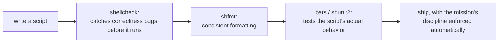

# Lesson 17. shellcheck, shfmt, and Testing a Script

**Mission link:** This is the final lesson of the extended arc. Every prior stage taught a piece of the language or a way a script quietly breaks; this lesson is the concrete tooling that catches most of those breaks before a script ever runs, and how to test the behavior that tooling can't see.
**Primary source:** [Tool: ShellCheck](https://www.shellcheck.net/)
**Prerequisites:** [Lesson 16](0016-mktemp-safe-temp-files-and-the-eval-injection-surface.md), [Word splitting](../GLOSSARY.md)

## Warm-up

1. ▢ Why does a predictable temp filename (`/tmp/report.$$`) expose a script to a symlink attack, and what does `mktemp` do differently?

Check

A predictable name lets an attacker create a symlink at that exact path before the script runs, so the script's write follows the symlink to whatever the attacker chose. `mktemp` creates a file with an unpredictable name atomically, so there's no name to pre-create a symlink at and no race window to exploit.

2. ▢ Why is `eval "grep $pattern $file"` dangerous when `$pattern` comes from untrusted input, even if it's quoted where it's first assigned?

Check

`eval` re-parses its entire argument a second time, so a shell metacharacter inside `$pattern` (like `;`) is interpreted as syntax rather than literal text; quoting at assignment time doesn't survive that second parse, which is exactly what makes `eval` on untrusted input unsafe regardless of how carefully the variable was quoted upstream.

## Know this

### ShellCheck: nearly every lesson in this workspace, automated

**ShellCheck** is a static analyzer that reads a script without running it and flags exactly the kinds of mistakes this workspace has covered lesson by lesson: an unquoted expansion that risks word splitting (lesson 1), a variable used before it's ever assigned, a pipeline whose exit status gets checked wrong (lesson 2), a useless `cat` piped into something that could read the file itself, and dozens of narrower cases besides. Running it is `shellcheck script.sh`; each finding names a specific rule code (`SC2086`, for an unquoted variable, is the one most scripts hit first) with a link to a page explaining exactly what's wrong and why. This turns most of this mission's discipline from something a person has to remember and apply by hand into something a tool checks automatically, the same relationship a linter has to a style guide in any other language.

### Suppressing a specific warning, with a reason, not silence

A finding that's a deliberate, understood choice rather than a mistake can be suppressed inline: `# shellcheck disable=SC2086 -- word splitting is intentional here, $flags is meant to expand to multiple arguments`, placed directly above the line it applies to. The comment explaining *why* is not optional decoration; a bare `disable=SC2086` with no justification looks identical to someone silencing a warning they didn't understand, and the next person reading the script (including a future version of whoever wrote it) has no way to tell the two apart without it.

### `shfmt`: consistent formatting, a different job from correctness

**`shfmt`** reformats a script's indentation and layout to a consistent style, the same relationship `gofmt` has to Go or `black` has to Python: it says nothing about whether the script is *correct*, only about whether it's formatted consistently with the rest of a codebase. Running ShellCheck and `shfmt` together covers two genuinely different concerns, correctness and style, the same division of labor lesson 5 and lesson 6 already drew between different tools for different jobs; neither substitutes for the other.

### Testing a script's actual behavior: `bats`, since most of what a script does is side effects

A shell script is mostly side effects (files written, commands run, exit statuses returned), which makes it awkward to test the way a pure function is tested, but not impossible. **bats** (Bash Automated Testing System) writes tests as `@test "description" { ... }` blocks in a `.bats` file, commonly using its `run` helper to invoke a command and capture its exit status into `$status` and its combined output into `$output` without letting either escape the test: `run my_script.sh --dry-run; [ "$status" -eq 0 ]; [[ "$output" == *"would delete"* ]]`. **shunit2** is an alternative, xUnit-style framework (`setUp`/`tearDown`, `assertEquals`) for teams more comfortable with that shape of test API; either one turns "did this script actually do what it claims" from something checked by running it manually into something checked automatically, on every change.

## Practice

1. ▢ A script runs `cat "$file" | grep "$pattern"`. What would ShellCheck likely flag here, and why is it a legitimate finding even though the pipeline works correctly?

Hint

Consider whether `cat` is actually doing anything `grep` couldn't do on its own.

Check

A "useless use of cat" finding (commonly `SC2002`): `grep "$pattern" "$file"` reads the file directly, with no need for `cat` to pipe it in first. The pipeline isn't broken, but it spawns an extra process and adds an unnecessary pipe stage for no benefit, exactly the kind of small, real inefficiency ShellCheck is built to catch even when nothing is technically wrong.

2. ▢ A script legitimately needs an unquoted expansion, `$flags`, to split into multiple separate arguments (`build.sh $flags` where `flags="--verbose --dry-run"`). How should this be marked so ShellCheck's `SC2086` warning doesn't look like an overlooked mistake to a future reader?

Check

`# shellcheck disable=SC2086 -- flags is meant to expand to multiple separate arguments here`, placed directly above the line, naming both the suppressed rule and the reason. A bare `disable=SC2086` with no explanation is indistinguishable from a mistake someone silenced without understanding it.

3. ▢ Why doesn't running `shfmt` on a script provide any assurance that the script is correct?

Check

`shfmt` only normalizes indentation and layout for consistency; it has no model of what the script is supposed to do and doesn't analyze logic, quoting, or exit-status handling at all. A script can be perfectly, consistently formatted by `shfmt` and still contain every bug ShellCheck would catch.

4. ▢ Write, in words, a bats test checking that `greet.sh --name Ada` prints a message containing "Ada" and exits successfully.

Check

Something like: `@test "greets by name" { run greet.sh --name Ada; [ "$status" -eq 0 ]; [[ "$output" == *"Ada"* ]]; }`. `run` invokes the script and captures its exit status into `$status` and its output into `$output`, so both the exit status and the presence of "Ada" in the output can be asserted without either one interfering with the test itself.

5. ▢ Which claim correctly describes how ShellCheck, `shfmt`, and a test framework like bats fit together?

    - a) They all check the same thing, so running more than one is redundant
    - b) ShellCheck catches correctness bugs statically, `shfmt` normalizes formatting, and bats/shunit2 test actual runtime behavior; each covers a concern the others don't
    - c) A script that passes `shfmt` formatting is guaranteed to also pass ShellCheck
    - d) Testing a shell script is impossible because scripts are mostly side effects

Check

**b)** That's the precise division of labor this lesson describes. (a) is false: correctness, style, and runtime behavior are three genuinely distinct concerns. (c) is false: formatting and correctness are unrelated; a perfectly formatted script can still have real bugs. (d) is false: bats and shunit2 exist specifically to make testing a side-effect-heavy script practical, via capturing exit status and output rather than avoiding the problem.

## Real-world reps

- [ ] Run ShellCheck against a script you maintain and fix (or deliberately, justifiably suppress with a comment) at least one finding.
- [ ] Run `shfmt` against the same script and check whether its current formatting already matches, or what changes.
- [ ] Tomorrow: write one bats (or shunit2) test for a script you maintain, checking its exit status and a piece of its output for one realistic input.

## Going further

- [Tool: ShellCheck](https://www.shellcheck.net/)
- [Site: "Shell Style Guide", Google](https://google.github.io/styleguide/shellguide.html)
- [Resources](../RESOURCES.md)

---

Not landing? Reread the primary source at the top, since this lesson compresses it and compression is where understanding leaks. Check the [glossary](../GLOSSARY.md) for any term that felt slippery.

If the lesson itself is unclear rather than the material, that is a defect: [open an issue](https://github.com/TokenCemetery/teach/issues).
