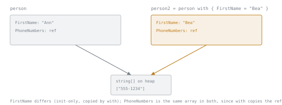

# Lesson 8. Record Types

**Mission link:** Modelling a domain means choosing the right type rather than a class for everything, and `record` is the type that carries data. It is also the first C# feature where the Java equivalent is close enough that the differences are the whole lesson.
**Primary source:** [Docs: "Records (C# reference)", Microsoft Learn](https://learn.microsoft.com/en-us/dotnet/csharp/language-reference/builtin-types/record)
**Prerequisites:** [Lesson 7](0007-properties.md), [Lesson 1](0001-structs-and-classes.md)

## Warm-up

1. ▢ Name what each of `required`, `init` and a non-nullable type promises, and what each one does not.

Check

`required`: every construction expression must initialise the member, but the value may be null. `init`: assignable only during construction, but it need not be assigned at all. A non-nullable type: the value should not be null, but nothing says it must be set or cannot change. Three mechanisms, three diagnostics.

2. ▢ Does `public string Name => $"{First} {Last}";` allocate a backing field?

Check

No. An expression-bodied property has no backing field and computes its value on each access, so it cannot disagree with the parts it is derived from. The cost is that every read does the work.

3. ▢ `var b = a;` where `a` is a class instance. What did the assignment copy?

Check

The reference, not the object. Both names now denote the same instance, so a mutation through either is visible through the other. For a struct the same line copies the value instead.

## Know this

**`record` is a modifier, not a third kind of type.** `record class` (which you may write as just `record`) defines a reference type, and `record struct` defines a value type ([Records](https://learn.microsoft.com/en-us/dotnet/csharp/language-reference/builtin-types/record)). What the modifier adds is generated members, and one precision worth having early: the compiler creates properties from primary constructor parameters **only** on types carrying the `record` modifier. A plain class with a primary constructor gets constructor parameters, not properties.

**What positional syntax generates.** From `public record Person(string FirstName, string LastName);` the compiler produces:

|Generated|Detail|
|---|---|
|One public auto-property per positional parameter|**Init-only** for `record class` and `readonly record struct`; **read-write** for `record struct`|
|A primary constructor|Parameters matching the positional parameters|
|A parameterless constructor|Only for `record struct` types, setting each field to its default|
|A `Deconstruct` method|One `out` parameter per positional parameter. It covers only the positional properties and **ignores** any property you declared with ordinary syntax|
|`ToString`, via a synthesized `PrintMembers`|Prints the type name and then each public property and field as name and value|

That `Deconstruct` row is the first gotcha: mix positional parameters with hand-written properties and deconstruction silently covers only half your type.

**Value equality, and the mechanism underneath it.** Without the modifier, `class` equality means the same object in memory and `struct` equality means the same type and the same values. All three record forms use the `struct` definition: same type, same values. The difference is how it is implemented. A plain `struct` inherits `ValueType.Equals`, which **relies on reflection**; a record's equality is **compiler synthesized** from the declared data members. Same semantics, very different cost.

**Equality follows the runtime type, not the declared one.** This applies to `record class` and is the surprise worth predicting. Given an abstract `Person` record with `Teacher` and `Student` deriving from it, two instances with identical property values compare **unequal** if their runtime types differ, even when both variables are declared as `Person`. Meanwhile a `Person`-typed variable and a `Student`-typed variable holding equal `Student` values compare **equal**. The compiler implements this with a synthesized `EqualityContract` property, so the runtime type is part of the comparison rather than an accident of it.

**`with` copies, then changes.** A `with` expression produces a copy of the instance with the named properties replaced, leaving the original untouched, and it works for both record classes and record structs. Two details worth knowing: `original == modified` is false after a real change, and `original with { }` produces a copy that compares **equal** to the original, which is a neat way to see that equality is about values rather than identity.

**Shallow immutability is the trap, and lesson 1 predicted it.** Init-only properties, whether generated from positional parameters or written by hand, give **shallow** immutability: after initialisation you cannot change a value-type property's value or a reference-type property's reference. What you can still change is the data the reference points at. The documentation's own example is a positional record holding a `string[]`, where `person.PhoneNumbers[0] = "555-6789"` succeeds.

So a record freezes its fields, not the objects they name, which is the same distinction lesson 1 drew for struct against class assignment. If a record's contents must not change, the property's type has to be something that cannot be mutated, and `with` does not help: it copies the reference into the new instance, so both records then share the same mutable array.

**Where records are the wrong choice, which matters for this workspace's mission.** Some data models require **reference** equality. Entity Framework Core depends on it to guarantee one instance per conceptual entity, and the documentation is explicit that records and record structs are therefore not appropriate as EF Core entity types. It also notes that EF Core does not support updating with immutable entity types. Stage 6 reaches EF Core, and this is the constraint that decides the shape of a domain model there.

**Against Java.** Java records also give value equality, a canonical constructor and a generated `toString`, so equality is the part that transfers. Three things do not: C# has a **value-type** record form, C# records may participate in **inheritance** (with the runtime-type equality rule above), and C# has **`with`**, which is the feature that makes an immutable model pleasant to work with rather than merely correct. If you have written Java records, the new habit to build is reaching for `with` instead of a constructor call that repeats every unchanged argument.

## Practice

1. ▢ `public abstract record Person(string FirstName, string LastName);` with `Teacher` and `Student` both deriving from it and both adding `int Grade`. Predict `teacher == student` where both are `Person`-typed variables holding the same three values.

Check

`False`. Record equality requires the **runtime** types to match, and one is a `Teacher` while the other is a `Student`, so identical values do not make them equal. The declared type of the variable is irrelevant: a `Person`-typed variable holding a `Student` compares equal to a `Student`-typed variable holding the same values. The compiler implements this through a synthesized `EqualityContract`, which is worth knowing because it explains why the behaviour cannot be talked out of: the type is one of the compared members.

2. ▢ `public record Person(string FirstName, string LastName, string[] PhoneNumbers);` Does `person.PhoneNumbers[0] = "555-6789";` compile and run? And does `person with { }` protect against it?

Hint

Ask what the init-only property actually holds, and what the assignment is actually changing.

Check

It compiles and it works. The property is init-only, which freezes the **reference**, and the assignment changes an element of the array that reference points at. The documentation calls this shallow immutability, and lesson 1 is the reason: the property holds a reference, so freezing it freezes which array, not what is in it.

`with` makes it worse rather than better. It copies the instance, which copies the reference, so the original and the copy then share one array and a mutation through either is visible through both. The only real fix is at the type level: hold something that cannot be mutated, such as a read-only collection type, so that no caller has an array to write into.

3. ▢ For each of `record class Point(double X, double Y)`, `record struct Point(double X, double Y)` and `readonly record struct Point(double X, double Y)`, say whether the generated properties are writable after construction.

Check

`record class`: init-only, so no. `readonly record struct`: init-only, so no. `record struct`: **read-write**, so yes, which is the one that surprises people, because it is the form whose name contains the word most associated with values. A positional `record struct` gives you mutable properties unless you add `readonly`, and it also gets a parameterless constructor that sets every field to its default. If you want the value-type record to behave the way its name suggests, write `readonly record struct`.

4. ▢ A colleague proposes making every Entity Framework Core entity a `record` for the free equality and `ToString`. Give the argument against.

Check

EF Core depends on **reference** equality to ensure it uses only one instance for what is conceptually one entity, and the documentation states directly that records and record structs are not appropriate as EF Core entity types for that reason. Value equality would make two separately loaded rows with equal column values indistinguishable to code that is supposed to be tracking one identity. There is a second reason in the same section: EF Core does not support updating with immutable entity types, so init-only positional properties fight the change tracker as well.

The useful generalisation: value equality is a claim that two instances with the same contents *are* the same thing. That is right for a money amount or a coordinate, and wrong for a row that has an identity of its own.

5. ▢ Which claim about record equality is correct?

    - a) Two records of different derived types with equal values still compare equal
    - b) Two records compare equal only when their runtime types and values match
    - c) Two records compare equal when the declared variable types and values match
    - d) Two records compare equal only if they reference the same underlying object

Check

**b)** Same runtime type and same values, which is why a `Teacher` and a `Student` holding identical data are unequal. (a) is the intuition that value equality means "compare the fields and ignore the type", and the `EqualityContract` exists to prevent it. (c) uses the wrong type: the declared type of the variable never enters the comparison, which is why a `Person`-typed and a `Student`-typed variable can compare equal. (d) is what a plain `class` does, and getting away from it is the reason to write `record` in the first place.

## Real-world reps

- [ ] Find a C# type used purely to carry data. Decide whether it would be better as a record, and specifically whether anything relies on comparing two instances by identity.
- [ ] Find a record with a collection-typed property. Work out whether a caller can mutate that collection through it, and whether `with` would give two records a shared one.
- [ ] Tomorrow: take one immutable type you have written with a constructor and hand-written equality, and rewrite it as a positional record. Count the lines that disappear, then check whether any of them were doing something the generated members do not.

## Going further

- [Docs: "Records (C# reference)", Microsoft Learn](https://learn.microsoft.com/en-us/dotnet/csharp/language-reference/builtin-types/record)
- [Docs: "C# record types", Microsoft Learn](https://learn.microsoft.com/en-us/dotnet/csharp/fundamentals/types/records)
- [Docs: "Properties (C# Programming Guide)", Microsoft Learn](https://learn.microsoft.com/en-us/dotnet/csharp/properties)
- [Resources](../RESOURCES.md)

---

Not landing? Reread the primary source at the top, since this lesson compresses it and compression is where understanding leaks. Check the [glossary](../GLOSSARY.md) for any term that felt slippery.

If the lesson itself is unclear rather than the material, that is a defect: [open an issue](https://github.com/TokenCemetery/teach/issues).
