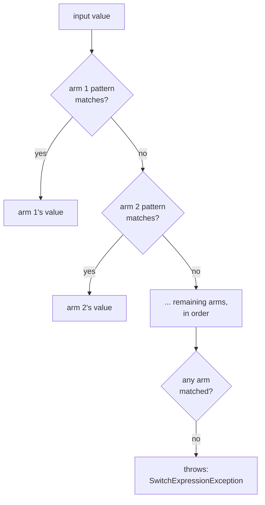

# Lesson 9. Pattern Matching

**Mission link:** Modelling a domain is only half the work; the other half is taking it apart safely. Pattern matching is where C# turns a chain of type checks and casts into something the compiler can reason about.
**Primary source:** [Docs: "Patterns (C# reference)", Microsoft Learn](https://learn.microsoft.com/en-us/dotnet/csharp/language-reference/operators/patterns)
**Prerequisites:** [Lesson 8](0008-record-types.md), [Lesson 5](0005-control-flow.md)

## Warm-up

1. ▢ Two records of different derived types hold identical property values, and both variables are declared as the base record type. Are they equal?

Check

No. Record equality requires the runtime types to match, implemented through a synthesized `EqualityContract`, so the type is one of the compared members. The declared type of the variable never enters the comparison.

2. ▢ A positional record also declares two properties with ordinary property syntax. What does its generated `Deconstruct` cover?

Check

Only the positional parameters. The generated `Deconstruct` has one `out` parameter per positional parameter and ignores properties declared with standard syntax, so deconstruction silently covers only part of the type.

3. ▢ What must every section of a `switch` **statement** end with?

Check

`break`, `goto` or `return`. Falling through to the next section is a compiler error, and multiple labels on one section are how C# expresses cases that share a body.

## Know this

**Patterns are one vocabulary used in three places**: an `is` expression, the `switch` statement from lesson 5, and the `switch` **expression**, which is new here ([Patterns](https://learn.microsoft.com/en-us/dotnet/csharp/language-reference/operators/patterns)). Learn the patterns once and they work in all three.

|Pattern|Example|Matches when|
|---|---|---|
|Declaration and type|`o is string s`|The result is non-null and its runtime type satisfies the check, binding `s` on success|
|Constant|`x is 0`, `x is null`|The result equals the constant|
|Relational|`x is > 15.0`|The comparison holds|
|Logical|`not`, `and`, `or`|Combining the above, as in `>= 0 and < 10.0`|
|Property|`date is { Year: 2020, Month: 5 }`|The result is non-null and every nested pattern matches the named member|
|Positional|`point is (0, 0)`|`Deconstruct` succeeds and each nested pattern matches|
|List|`numbers is [1, 2, 3]`|Each nested pattern matches the corresponding element|
|`var` and discard|`[var first, _, _]`|Always, binding or ignoring respectively|

**Two null idioms worth knowing together.** `input is not null` is a negated constant `null` pattern, which is the documented way to test for non-null. And the **empty property pattern** `is { }` matches everything non-null, which means it can do the same job while binding a variable: `somethingPossiblyNull is { } definitelyNotNull`. That second form is the one people do not discover on their own.

**Positional patterns call `Deconstruct`, and this is where lesson 8 pays.** The documentation marks it Important: the order of members in a positional pattern must match the order of parameters in the `Deconstruct` method, because the generated code calls that method. A positional record therefore supports positional patterns for free. A record that declares its properties with ordinary syntax does not, and a record that mixes the two supports patterns over the positional half only, which is the same gap warm-up 2 asked about seen from the matching side.

Positional patterns also work on **tuples**, which lets one `switch` match several inputs at once: `(groupSize, visitDate.DayOfWeek) switch { (<= 0, _) => throw ..., (_, DayOfWeek.Saturday or DayOfWeek.Sunday) => 0.0m, ... }`. That is the shape to reach for instead of nesting two switches.

**List patterns, briefly, because of the slice.** A list pattern matches an array or list element by element, any pattern is allowed inside, `_` ignores an element and `var` captures it. The **slice pattern** `..` matches "any number of elements here", so `[> 0, > 0, ..]` means the first two are positive and the rest are unconstrained.

**The `switch` expression, and the gap in its safety net.** Lesson 5 covered the statement, which directs execution. The expression produces a value, with arms of the form `pattern => value`. Three facts about exhaustiveness, and the third is the one to remember:

- If no arm matches, the runtime **throws**: a `SwitchExpressionException` on .NET Core 3.0 and later, an `InvalidOperationException` on .NET Framework.
- In most cases the compiler **warns** when the arms do not cover all possible inputs.
- **List patterns do not produce that warning** when all possible inputs are not handled ([switch expression](https://learn.microsoft.com/en-us/dotnet/csharp/language-reference/operators/switch-expression)).

So the compiler is a strong safety net with one hole in it, and the documentation's own tip is the fix: to guarantee that a `switch` expression handles every input, give it an arm with the discard pattern. Reach for `_` deliberately in a switch over sequences, where nothing will remind you.

**Arm order is a compile-time question, not a style one.** Arms are considered in order, and an arm already covered by an earlier one is an error rather than dead code you might not notice: the compiler reports CS8510, the pattern is unreachable, naming the arm that already handled it. So `Car => ...` before `Sedan => ...` fails to build, while the reverse order compiles and both arms are reachable.

That is worth contrasting with what pattern matching replaces. A chain of `if` and `else if` with type checks has exactly the same ordering hazard and no diagnostic at all: put the base-type check first and the derived branch is simply never taken, silently, forever. Moving that chain to a `switch` expression converts a silent logic bug into a build failure, which is the strongest argument for the feature and a better one than brevity.

## Practice

1. ▢ In a switch expression over a `Vehicle`, an arm for `Car` appears above an arm for `Sedan`, where `Sedan` derives from `Car`. What does the compiler do, and what would the equivalent `if`/`else if` chain have done?

Check

The compiler rejects it with CS8510: the `Sedan` pattern is unreachable, because the `Car` arm already handles every `Car` value including its subtypes. Swap the two and it builds, with both arms reachable.

The `if`/`else if` version has the identical bug and no diagnostic: `if (v is Car)` first means the `Sedan` branch never runs, and nothing tells you. That is the trade the feature offers. You give up the freedom to order branches however you like, and you get an ordering mistake turned into a compile error.

2. ▢ A switch expression over an `int[]` has arms for `[1, 2]` and `[3, ..]` and nothing else. It compiles without warnings. What happens for `[9, 9, 9]`?

Hint

The compiler usually warns about uncovered inputs. Ask which family of patterns is documented as an exception.

Check

It throws at run time: a `SwitchExpressionException` on .NET Core 3.0 or later, an `InvalidOperationException` on .NET Framework. The reason it compiled silently is that **list patterns do not generate the usual warning** when the arms fail to cover all possible inputs, which the switch-expression documentation states explicitly.

So this is the one place where the compiler's exhaustiveness help is absent rather than merely approximate, and the remedy is to add a discard arm on purpose. A useful habit: when the patterns in a switch expression are list patterns, treat `_` as mandatory rather than optional.

3. ▢ What does `if (GetName() is { } name)` do that `if (GetName() is not null)` does not?

Check

It binds. The empty property pattern `is { }` matches any non-null value, and because it is a property pattern it can declare a variable, so `name` is in scope and already known to be non-null. `is not null` performs the same test and gives you nothing to use, so the following line has to call `GetName()` again or the value has to be captured beforehand.

Both are correct; the difference is whether the check and the capture are one step. Note the family resemblance to `TryGetValue` from lesson 4: C# repeatedly offers a form that answers a question and produces the value together, and the idiomatic choice is usually that one.

4. ▢ `public record Money { public decimal Amount { get; init; } public string Currency { get; init; } }` is matched with `m is (var amount, var currency)`. Why does that not compile?

Check

Because there is no `Deconstruct` method to call. A positional pattern is compiled into a call to `Deconstruct`, and the compiler generates that method only from **positional** parameters. This record declares its properties with ordinary syntax, so nothing was generated and there is nothing to deconstruct.

Two ways forward: declare it positionally, `public record Money(decimal Amount, string Currency);`, which generates the `Deconstruct` and makes the positional pattern work; or keep the current declaration and match with a **property** pattern, `m is { Amount: var amount, Currency: var currency }`, which reads the members by name and needs nothing generated. The property pattern is also the more robust choice, since it does not depend on parameter order.

5. ▢ Which claim about a non-exhaustive switch expression is correct?

    - a) A switch expression that misses an input returns the type's default value silently
    - b) A switch expression that misses an input throws at run time, usually warned
    - c) A switch expression is always checked exhaustively, so a discard arm is unnecessary
    - d) A switch expression falls through to the next arm when a pattern fails

Check

**b)** An unmatched input throws, and in most cases the compiler warns first. The qualifier matters: list patterns are the documented exception that produces no warning. (a) would be the quiet failure mode, and the language deliberately chose the loud one. (c) overstates the compiler's reach and is exactly why the docs recommend a discard arm. (d) imports fall-through, which the `switch` statement forbids and the expression has no concept of, since each arm is a complete answer rather than a block of statements.

## Real-world reps

- [ ] Find a chain of `if`/`else if` type checks in C# you have access to. Rewrite it as a switch expression on paper, and note whether the compiler would have rejected the original's order.
- [ ] Find a switch expression whose arms are list patterns. Check whether it has a discard arm, and decide what input would reach the exception.
- [ ] Tomorrow: take a type you match on often and decide whether it should be positional. Then write both a positional pattern and a property pattern for it and pick the one you would rather maintain.

## Going further

- [Docs: "Patterns (C# reference)", Microsoft Learn](https://learn.microsoft.com/en-us/dotnet/csharp/language-reference/operators/patterns)
- [Docs: "switch expression (C# reference)", Microsoft Learn](https://learn.microsoft.com/en-us/dotnet/csharp/language-reference/operators/switch-expression)
- [Docs: "Records (C# reference)", Microsoft Learn](https://learn.microsoft.com/en-us/dotnet/csharp/language-reference/builtin-types/record)
- [Resources](../RESOURCES.md)

---

Not landing? Reread the primary source at the top, since this lesson compresses it and compression is where understanding leaks. Check the [glossary](../GLOSSARY.md) for any term that felt slippery.

If the lesson itself is unclear rather than the material, that is a defect: [open an issue](https://github.com/TokenCemetery/teach/issues).
