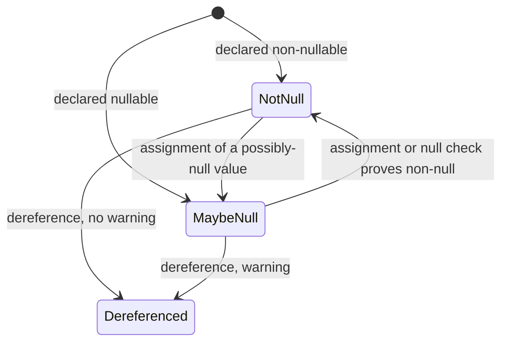

# Lesson 15. Nullable Reference Types

**Mission link:** Lesson 2 split a pair and promised to close it here. Same `?` character, entirely different mechanism, and the difference decides whether the guarantee exists at run time or only at build time.
**Primary source:** [Docs: "Nullable reference types", Microsoft Learn](https://learn.microsoft.com/en-us/dotnet/csharp/nullable-references)
**Prerequisites:** [Lesson 2](0002-nullable-value-types.md), [Lesson 9](0009-pattern-matching.md), [Lesson 7](0007-properties.md)

## Warm-up

1. ▢ What is `int?`, and what happens when you box one that has a value?

<details markdown="1"><summary>Check</summary>

`Nullable<T>`, a value type whose null is a flag rather than an absent reference. Boxing one that has a value boxes the **underlying** value rather than the wrapper, so `GetType()` reports `System.Int32` and the nullability is not there to see.

</details>

2. ▢ What does `x is { } value` match, and what does it give you?

<details markdown="1"><summary>Check</summary>

Any non-null value, bound to `value`. It is the empty property pattern, doing in one step what `is not null` does without producing the value.

</details>

3. ▢ Name what `required`, `init` and a non-nullable type each promise.

<details markdown="1"><summary>Check</summary>

`required`: every construction expression must initialise it, though the value may be null. `init`: assignable only during construction, though it need not be assigned. A non-nullable type: the value should not be null. This lesson is the third one, finally explained.

</details>

## Know this

**The two features that share a character are not the same kind of thing at all.**

|`int?`, from lesson 2|`string?`, from this lesson|
|---|---|
|`Nullable<T>`, a real value type|**Not a new type**: `string` and `string?` are both `System.String`|
|Has `HasValue` and `Value` at run time|Has nothing at run time|
|Boxing behaviour, comparison behaviour, an exception from `Value`|**No runtime difference** from the non-nullable form|

The documentation is unambiguous: nullable reference types are not new class types but **annotations on existing reference types**, there is no runtime difference between a nullable and a non-nullable reference type, and the compiler adds **no runtime checking**. All the benefit is in compile-time analysis ([Nullable reference types reference](https://learn.microsoft.com/en-us/dotnet/csharp/language-reference/builtin-types/nullable-reference-types)).

The design in one sentence, which is also the documentation's: **you declare your intent, and the compiler warns you when your code violates that intent.**

**How to declare it.** In a nullable enabled context every reference type is non-nullable by default, and appending `?` makes it nullable. Used well, that puts the shape of your data in the type system: a `Person` whose `FirstName` and `LastName` are `string` and whose `MiddleName` is `string?` has said which parts are required and which are optional, in the signature, where a reader will see it.

**Null-state analysis is the machinery, and it is more capable than people expect.** The compiler tracks the **null-state** of every expression as either *not-null* or *maybe-null*. A non-nullable reference defaults to not-null and a nullable one to maybe-null, and then two things update a local variable's state: **assignments** and **null checks** ([Nullable reference types](https://learn.microsoft.com/en-us/dotnet/csharp/nullable-references)).

So this warns on the first line and not the third:

```csharp
string? message = null;
Console.WriteLine(message.Length);   // warning: dereference of a possibly null reference
message = "Hello, World!";
Console.WriteLine(message.Length);   // no warning: the compiler knows it is not-null now
```

The analysis follows `if` checks, **pattern matching** such as `is null` and `is { }`, and control flow that loops or returns early. That is lesson 9 paying off from an unexpected direction: the patterns you learned for taking types apart are also how you inform the null-state analysis, which is why `if (x is { } value)` both binds a variable and tells the compiler the rest of the branch is safe.



**These are warnings.** Nothing here stops a build by default and nothing checks at run time, which is the honest summary of the feature's strength and its limit. The type system records a design decision and the compiler tells you when you contradict it, and that is the whole of the guarantee.

**`!` is the escape hatch, and the documentation attaches its own discipline to it.** The null-forgiving operator declares that an expression is not-null even when the analysis says otherwise. The guidance is worth quoting almost directly: use it sparingly, because **each occurrence is a place the compiler can no longer protect you**, and prefer adding a null check, restructuring the code, or annotating the relevant API so that the compiler reaches the right conclusion on its own.

**One important exception to "no runtime effect", and it matters for this workspace's mission.** Nullable annotations introduce no behaviour changes by themselves, but other libraries may read them by reflection and behave differently. **Entity Framework Core reads nullable attributes and interprets a nullable reference as an optional value and a non-nullable reference as a required one.**

So in an EF Core model the annotation stops being advice to the compiler and becomes a decision about the database: `string` means a required column and `string?` means an optional one. Lesson 8 recorded the other half of this pattern, that records are not appropriate as EF Core entity types. Both are deposits for stage 6, and both say the same thing in different words: the framework reads more of your type declarations than the compiler does.

## Practice

1. ▢ What is the runtime difference between a `string` parameter and a `string?` parameter, and what does the answer mean for a library that validates its inputs?

<details markdown="1"><summary>Check</summary>

There is none. Both are `System.String`, the annotation is not a type, and the compiler adds no runtime checking, so a caller who ignores the warnings, or who was compiled without a nullable context, can pass null to either.

For a library that means annotations are documentation the compiler enforces **on code it can see**, and not a validation strategy. A public API that must not receive null still needs an actual check, because the annotation stops nothing at the boundary. The two are complementary: the annotation tells honest callers what you expect, and the check handles the rest.

</details>

2. ▢ `string? name = GetName();` then `Console.WriteLine(name.Length);` warns. Give two different ways to make the warning go away legitimately, and say what each one tells the compiler.

<details markdown="1"><summary>Check</summary>

Assign a known non-null value first, which sets the null-state to not-null from that point, or perform a null check and dereference inside the branch where the state is not-null, whether with `if (name is not null)`, `if (name is { } n)`, or an early return for the null case.

Both work because the same two things update a local's null-state: assignments and null checks. The compiler is not pattern-matching on your syntax, it is tracking a state through your control flow, which is why an early `return` in the null case makes the rest of the method warning-free without any further ceremony.

Note what is not on this list: `!`. It also removes the warning, and it removes the analysis with it.

</details>

3. ▢ A pull request changes `name.Length` to `name!.Length` to clear a warning. Write the review comment.

<details markdown="1"><summary>Hint</summary>

The documentation names three alternatives to reach for before this one. The comment is more persuasive if it offers them.

</details>

<details markdown="1"><summary>Check</summary>

Something with this shape: the `!` asserts the value is not null without establishing it, so this line is now a place the compiler can no longer protect us, and if the assumption is ever wrong the failure is a null reference at run time with nothing in the code to explain why we expected otherwise.

Then the alternatives, which are the documentation's own: add a null check so the analysis concludes it itself; restructure the code so the value cannot be null on that path; or annotate the API that produced it, if the real problem is that a method returns `string?` when it never returns null. The third is the best when it applies, because it fixes every call site rather than this one.

And the case where `!` is right: the author genuinely knows something the compiler cannot, and can say what it is. A comment naming that fact is the minimum, since the next reader has no other way to check the assumption.

</details>

4. ▢ Why does a nullable annotation stop being advisory in an Entity Framework Core model?

<details markdown="1"><summary>Check</summary>

Because EF Core reads the nullable attributes by reflection and acts on them: it interprets a nullable reference as an **optional** value and a non-nullable reference as a **required** one. So `string` against `string?` on an entity property is not a hint to the compiler, it decides whether the mapped column is required, and changing an annotation changes the model.

The general lesson is worth extracting: the claim "annotations have no runtime effect" is a claim about the **compiler**, not about the program. Anything that reads metadata by reflection can act on them, and serializers, validators and mappers frequently do. So the practical question is never "does this annotation matter at run time" but "does anything in this process read it".

</details>

5. ▢ Which claim about a nullable reference type is correct?

    - a) A nullable reference type is a distinct runtime type wrapping the reference
    - b) A nullable reference type is an annotation, and string? is still System.String
    - c) A nullable reference type adds a runtime check that throws on dereference
    - d) A nullable reference type is enforced at run time, making warnings redundant

<details markdown="1"><summary>Check</summary>

**b)** Nullable reference types are annotations on existing reference types, not new class types, and there is no runtime difference between the two forms. (a) describes `Nullable<T>` from lesson 2, which is the confusion this lesson exists to remove. (c) invents a check the compiler explicitly does not add. (d) inverts the design: the warnings are the entire mechanism, because nothing is enforced later.

</details>

## Real-world reps

- [ ] Find a `!` in C# you have access to. Decide which of the documentation's three alternatives would have worked, and whether the author could have stated what they knew that the compiler did not.
- [ ] Find a public method taking a non-nullable reference parameter. Check whether it also validates the argument, and decide whether it should.
- [ ] Tomorrow: pick one type in your own work and annotate every reference member as required or optional. Note how many you had to think about, because each of those was previously an undocumented decision.

## Going further

- [Docs: "Nullable reference types", Microsoft Learn](https://learn.microsoft.com/en-us/dotnet/csharp/nullable-references)
- [Docs: "Nullable reference types (C# reference)", Microsoft Learn](https://learn.microsoft.com/en-us/dotnet/csharp/language-reference/builtin-types/nullable-reference-types)
- [Docs: "Nullable value types (C# reference)", Microsoft Learn](https://learn.microsoft.com/en-us/dotnet/csharp/language-reference/builtin-types/nullable-value-types)
- [Resources](../RESOURCES.md)

---

Not landing? Reread the primary source at the top, since this lesson compresses it and compression is where understanding leaks. Check the [glossary](../GLOSSARY.md) for any term that felt slippery.

If the lesson itself is unclear rather than the material, that is a defect: [open an issue](https://github.com/TokenCemetery/teach/issues).
