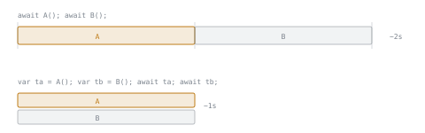

# Lesson 19. Task Composition

**Mission link:** Predicting what an asynchronous program does means knowing which operations overlap. Composition is where that is decided, and the most common mistake in asynchronous C# is a program that is correct and serial when it was meant to be correct and concurrent.
**Primary source:** [Docs: "Asynchronous programming scenarios", Microsoft Learn](https://learn.microsoft.com/en-us/dotnet/csharp/asynchronous-programming/async-scenarios)
**Prerequisites:** [Lesson 18](0018-async-and-await.md), [Lesson 17](0017-the-task-model.md), [Lesson 13](0013-linq.md)

## Warm-up

1. ▢ What does `await` do to the enclosing method, and what does it do to the thread?

<details markdown="1"><summary>Check</summary>

It suspends the enclosing async method until the awaited operation completes, and returns control to the caller when it suspends. It does **not** block the thread that was evaluating the method.

</details>

2. ▢ Does every `await` suspend?

<details markdown="1"><summary>Check</summary>

No. When the operand represents an already completed operation, `await` returns the result immediately without suspending. `async` marks a method that may yield, not one that does.

</details>

3. ▢ A LINQ query sits in a variable and nothing has iterated it. What has run?

<details markdown="1"><summary>Check</summary>

Nothing. A query is not executed until you iterate the query variable, so the variable holds a question rather than an answer. Keep that in mind, because this lesson is where it becomes dangerous.

</details>

## Know this

**Composition is possible because calling an async method starts the work.** Lesson 18 traced a method that called `GetStringAsync`, kept the returned task in a variable, did other work, and only then awaited. That is the shape everything here is built on: the operation is already under way while you hold the task, so several operations can be in flight before any of them is awaited.

Which gives the rule this lesson exists for. **Awaiting each call in turn serialises them.** `await A(); await B();` starts A, waits for it, and only then starts B. Starting both and awaiting afterwards overlaps them. The two versions differ by the position of one keyword and by the entire latency of the slower operation.



**`Task.WhenAll` waits for a set of operations without blocking.** It has overloads for a set of non-generic tasks, a non-uniform set of generic ones, and a uniform set, so it covers waiting for several void-returning operations, several value-returning ones of different types, or several of the same type ([Consuming the Task-based Asynchronous Pattern](https://learn.microsoft.com/en-us/dotnet/standard/asynchronous-programming-patterns/consuming-the-task-based-asynchronous-pattern)). Awaiting a uniform set of `Task<T>` gives you the results as an array, and awaiting the combined task lets exceptions **propagate out of that `await`**, so a `try`/`catch` around it is how you handle failures.

**Now the trap, and it is this lesson's centre because it is made of two things you already know.** The documented way to build the task list with LINQ is:

```csharp
var getUserTasks = userIds.Select(id => GetUserAsync(id)).ToArray();
return await Task.WhenAll(getUserTasks);
```

The `ToArray` is not tidiness. The documentation is explicit: LINQ uses deferred execution, **which means that without immediate evaluation, the async calls don't happen until the sequence is enumerated**, and the example is correct and safe **because** `ToArray` immediately evaluates the query and stores the tasks ([Asynchronous programming scenarios](https://learn.microsoft.com/en-us/dotnet/csharp/asynchronous-programming/async-scenarios)).

So lesson 13's coldness and lesson 17's hotness meet here and disagree. A task is hot: hold one and the work is running. A LINQ query is cold: hold one and nothing has happened. Project a sequence into tasks and you are holding a **cold sequence of hot things**, which has produced no tasks at all until something enumerates it.

The documentation carries a second, broader caution under its own heading: asynchronous lambdas in LINQ use deferred execution, so **the code can execute at an unexpected time**, introducing blocking tasks into that situation **can easily result in a deadlock**, and nesting asynchronous code makes execution hard to reason about. Both techniques are powerful and should be combined carefully and clearly.

**`Task.WhenAny` needs two awaits, and the reason is in its return type.** The interleaving pattern from the documentation is worth learning as a shape:

```csharp
while (imageTasks.Count > 0)
{
    Task<Bitmap> imageTask = await Task.WhenAny(imageTasks);
    imageTasks.Remove(imageTask);
    Bitmap image = await imageTask;
    // use image
}
```

The first `await` yields the **task that finished**, not its value, which is why the second `await` is there. That second one is also what surfaces the failure if the completed task faulted, so it is doing two jobs. And removing the task from the list is what stops the loop handing you the same completed task forever.

**Which combinator for which shape.** Lesson 17 named `WhenAny`'s four documented uses; this is where each one lands in code.

|You need|Reach for|
|---|---|
|Every result, and nothing to do until all arrive|`WhenAll`|
|The first answer, then cancel the rest|`WhenAny`, redundant operations|
|Every result, but processed as each arrives|`WhenAny` in a loop, removing each completed task|
|A cap on how many run at once|`WhenAny` throttled, starting a new one as each finishes|
|The work, or a timeout, whichever comes first|`WhenAny` against a delay|

**One caution against over-correcting.** Not every `await` in a loop is a bug. Sequential is right when each step depends on the previous result, when an external service imposes a rate limit or ordering, or when concurrency would exhaust something scarce. The mistake this lesson names is serialising work that had no reason to be serial, which is a different thing from choosing to serialise.

## Practice

1. ▢ Compare `var a = await GetAAsync(); var b = await GetBAsync();` with `var ta = GetAAsync(); var tb = GetBAsync(); var a = await ta; var b = await tb;`, where the calls are independent and each takes a second.

<details markdown="1"><summary>Check</summary>

The first takes about two seconds and the second about one. In the first, `GetBAsync` is not even called until A has finished, because the `await` suspends the method at that point and the next statement has not run. In the second, both calls happen before either is awaited, so both operations are in flight together and the total is roughly the slower of the two.

Nothing about threads explains this. It is entirely about **when the call happens**, and the call is what starts the work. That is why lesson 17 spent its length on tasks being hot: if a task were a recipe that ran when awaited, the two versions would behave identically.

</details>

2. ▢ `var tasks = userIds.Select(id => GetUserAsync(id)); await Task.WhenAll(tasks);` What is wrong with it, and what fixes it?

<details markdown="1"><summary>Hint</summary>

Ask how many tasks exist at the moment `WhenAll` is called.

</details>

<details markdown="1"><summary>Check</summary>

At the moment `WhenAll` is called, none exist. `Select` is deferred, so the projection has not run and no `GetUserAsync` call has been made: the documentation states that without immediate evaluation, the async calls do not happen until the sequence is enumerated. The fix is `.ToArray()` or `.ToList()`, which immediately evaluates the query and stores the tasks, which is exactly why the documented example has it.

There is a worse consequence than a late start. A deferred sequence produces its elements **again** on each enumeration, so a sequence of async calls that is enumerated more than once starts the operations more than once. The habit worth forming: when a LINQ projection produces tasks, materialise it in the same expression, every time, and treat a `Select` returning tasks without a `ToArray` or `ToList` as a defect on sight.

</details>

3. ▢ Why does the `WhenAny` interleaving loop contain two `await` expressions?

<details markdown="1"><summary>Check</summary>

Because `WhenAny` completes with **the task that finished**, not with its value. The first `await` gives you a `Task<T>`; the second awaits that task to get the `T`.

The second `await` earns its place twice, because it is also what surfaces an exception from that task. Reading the completed task's value is how the failure reaches your `catch`, which is lesson 18's rethrow rule doing the work. And the `Remove` between the two is not optional: without it, `WhenAny` keeps returning the same already-completed task and the loop never ends.

</details>

4. ▢ Five tasks are passed to `Task.WhenAll` and two of them fail. What happens to the other three, and how do you learn about both failures?

<details markdown="1"><summary>Check</summary>

All five run to completion. `WhenAll` waits for the whole set rather than stopping at the first failure, so the three that succeed still finish and the two that fail both complete as faulted.

What the `await` gives you is a single exception, because awaiting rethrows rather than wrapping, as lesson 18 established. To see every failure you have to look at the tasks themselves: inspect each one's status, or read the `Exception` property of the combined task, which is where lesson 17's `AggregateException` is waiting with the full set. So the shape to remember is that `WhenAll` collects the failures and `await` shows you one of them, which is fine for logging a single error and wrong for reporting which three of five uploads succeeded.

</details>

5. ▢ Which claim about composing two independent asynchronous calls is correct?

    - a) Awaiting two calls in sequence runs them concurrently, since both return tasks
    - b) Awaiting each call in turn serialises them; start both first to overlap
    - c) Task.WhenAll starts the tasks, so they do not begin before it runs
    - d) Awaiting in a loop is always a bug that WhenAll should replace

<details markdown="1"><summary>Check</summary>

**b)** The `await` suspends the method, so the second call has not happened yet; starting both and awaiting afterwards is what overlaps them. (a) is the mistake this lesson is about, and it is easy to hold because both versions look asynchronous. (c) treats tasks as cold, which lesson 18's multiple choice already flagged: `WhenAll` waits, it does not start anything, and the tasks were running before it was called. (d) over-corrects: sequential is correct when steps depend on each other or when a service imposes ordering or a rate limit, and the defect is serialising work that had no reason to be serial.

</details>

## Real-world reps

- [ ] Search C# you have access to for `await` inside a `foreach` or `for`. For each, decide whether the iterations genuinely depend on each other.
- [ ] Search for `.Select(` whose lambda returns a task. Check every one for an immediate `ToArray` or `ToList`, and work out what happens where there is none.
- [ ] Tomorrow: find a method that makes two or more independent asynchronous calls and time it. Then restructure it to start them all before awaiting, and time it again.

## Going further

- [Docs: "Asynchronous programming scenarios", Microsoft Learn](https://learn.microsoft.com/en-us/dotnet/csharp/asynchronous-programming/async-scenarios)
- [Docs: "Consuming the Task-based Asynchronous Pattern", Microsoft Learn](https://learn.microsoft.com/en-us/dotnet/standard/asynchronous-programming-patterns/consuming-the-task-based-asynchronous-pattern)
- [Docs: "Task-based asynchronous programming", Microsoft Learn](https://learn.microsoft.com/en-us/dotnet/standard/parallel-programming/task-based-asynchronous-programming)
- [Resources](../RESOURCES.md)

---

Not landing? Reread the primary source at the top, since this lesson compresses it and compression is where understanding leaks. Check the [glossary](../GLOSSARY.md) for any term that felt slippery.

If the lesson itself is unclear rather than the material, that is a defect: [open an issue](https://github.com/TokenCemetery/teach/issues).
