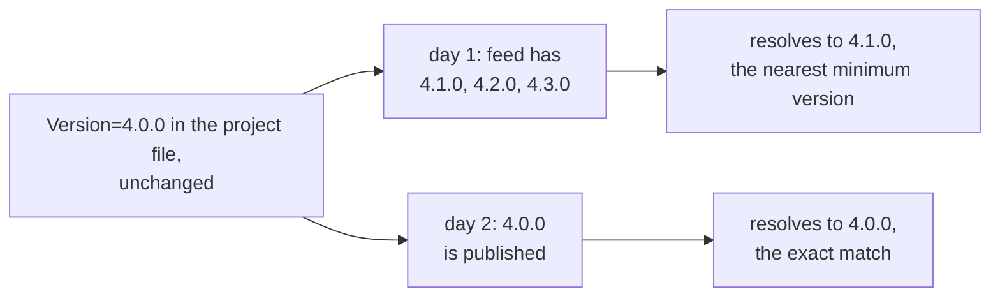

# Lesson 24. The dotnet CLI and Packages

**Mission link:** Stage 5 is done when someone else can clone, build, test and run what you wrote. That sentence is about a project file and a command line, not about your code, and it fails for reasons your compiler never sees: an edge nobody added, a version nobody pinned, an SDK nobody wrote down.
**Primary source:** [Docs: ".NET CLI overview", Microsoft Learn](https://learn.microsoft.com/en-us/dotnet/core/tools/)
**Prerequisites:** [Lesson 23](0023-mocking.md), [Lesson 22](0022-xunit-and-nunit.md)

## Warm-up

1. ▢ Under xUnit, how many instances of a test class exist while its three tests run, and what does that decide?

<details markdown="1"><summary>Check</summary>

Three. A new instance is created for every test, which is why the constructor is the setup and `Dispose` the teardown, and why sharing anything expensive has to be asked for by name.

</details>

2. ▢ Why can a substitution library not replace a static method?

<details markdown="1"><summary>Check</summary>

Because a fake is a proxy that overrides or implements, and static members, including extension methods, cannot be overridden. There is no instance dispatch to intercept.

</details>

3. ▢ You clone a C# repository you have never seen. Before reading any code, which file tells you what it depends on?

<details markdown="1"><summary>Check</summary>

The project file, the `.csproj`. This lesson is about what it can and cannot tell you, and the answer turns out to be less than you would expect from a version number written in plain sight.

</details>

## Know this

**The CLI is the front door, and one property of it removes most of the ceremony.** The basic commands are `new`, `restore`, `build`, `publish`, `run`, `test`, `pack`, `clean`, `sln`, `watch` and `format` ([.NET CLI overview](https://learn.microsoft.com/en-us/dotnet/core/tools/)). The property worth knowing before any of them is **implicit restore**: you do not have to run `dotnet restore`, because it **is run implicitly by all commands that require a restore to occur**, such as `dotnet new`, `dotnet build`, `dotnet run`, `dotnet test`, `dotnet publish` and `dotnet pack`, and `--no-restore` turns that off ([dotnet package add](https://learn.microsoft.com/en-us/dotnet/core/tools/dotnet-add-package)).

So the stage 5 done-when has a short answer. A person who clones the repository types `dotnet test`. Restore happens because that command needs it, and the build happens because `dotnet test` **builds the solution and runs the tests** ([dotnet test](https://learn.microsoft.com/en-us/dotnet/core/tools/dotnet-test)). The documented reason to run `dotnet restore` yourself is a continuous integration build, where the pipeline wants explicit control over when the restore occurs.

**A project file is a list of edges, and there are two kinds.** A package dependency is a `PackageReference`, and a dependency on another project in the same repository is a project-to-project reference, added by `dotnet reference add` ([dotnet reference add](https://learn.microsoft.com/en-us/dotnet/core/tools/dotnet-add-reference)). Both show up as items in the file, which is why a missing reference reads as a namespace error rather than as anything about packaging:

```xml
<Project Sdk="Microsoft.NET.Sdk">

  <PropertyGroup>
    <TargetFramework>net10.0</TargetFramework>
    <Nullable>enable</Nullable>
  </PropertyGroup>

  <ItemGroup>
    <PackageReference Include="xunit.v3" Version="4.0.0" />
  </ItemGroup>

  <ItemGroup>
    <ProjectReference Include="../../src/Ordering/Ordering.csproj" />
  </ItemGroup>

</Project>
```

**The sharpest fact in the lesson: that `Version` is a floor, not a pin.** NuGet's own documentation walks through it as a two-day story. Day 1, you write `Version="4.0.0"` and the versions on the feed are 4.1.0, 4.2.0 and 4.3.0, so **NuGet resolves to 4.1.0, the nearest minimum version**. Day 2, 4.0.0 is published, and now **NuGet finds the exact match and starts resolving to 4.0.0** ([PackageReference in project files](https://learn.microsoft.com/en-us/nuget/consume-packages/package-references-in-project-files)). Same commit, same file, different build.

Floating versions such as `Version="3.6.*"` say the same thing out loud, and the documentation lists both alongside a third case, a version disappearing from a feed, as the reasons a lock file exists: restore's input is the set of direct `PackageReference` items and its output is **the full closure of all package dependencies including transitive ones**, and NuGet tries to reproduce that closure but cannot always do so. If you have carried the habit that a declared version is the version you get, this is where it breaks.



**Central package management moves the version out of the project file entirely.** Put a `Directory.Packages.props` at the root of the repository, set `ManagePackageVersionsCentrally` to `true`, and declare the versions there; each project then references the package with no `Version` at all ([Central Package Management](https://learn.microsoft.com/en-us/nuget/consume-packages/central-package-management)):

```xml
<Project>
  <PropertyGroup>
    <ManagePackageVersionsCentrally>true</ManagePackageVersionsCentrally>
  </PropertyGroup>
  <ItemGroup>
    <PackageVersion Include="PackageA" Version="1.0.0" />
    <PackageVersion Include="PackageB" Version="2.0.0" />
  </ItemGroup>
</Project>
```

`dotnet new packagesprops` creates that file. Once it is in place, `dotnet package add` splits its work: the `PackageVersion` element goes into `Directory.Packages.props`, and a version-less `PackageReference` goes into the project file. The gain is one place per package version for the whole repository. The cost is that a single `.csproj` no longer answers the question it used to.

**Two things moved in .NET 10, and both make a copied command line fail.** The first is the shape of the commands themselves. `dotnet reference add` and `dotnet package add` are noun-first, and the documentation is explicit about the boundary: if you are using the .NET 9 SDK or earlier, use the verb-first form, `dotnet add reference`, because **the noun-first form was introduced in .NET 10**.

The second is what runs your tests. `dotnet test` runs them with **either VSTest or Microsoft Testing Platform**, and which one you get **determines the available command-line options and behavior**; runner selection starts with the .NET 10 SDK, and in earlier versions tests are always executed with VSTest. That is the missing context for the `TestingPlatformDotnetTestSupport` property sitting in the xUnit v3 template you saw in lesson 22.

The general form of both is worth more than either detail. A command line copied from a blog post has an SDK version attached to it that nobody wrote down, so `dotnet --version` is the first thing to check when a command that "definitely works" does not.

**Stage 5 capstone.** Four questions now cover this stage, and the last practice item asks all of them at once:

- How many times is this test class constructed, and what survives between its tests? (lesson 22)
- Can this member be substituted at all, or is the test only pretending? (lesson 23)
- What does a fresh clone have to type, and what does that command do on its own? (this lesson)
- Would this commit build the same thing next month? (this lesson)

Stage 6 starts building the service itself, and every one of these questions follows it there.

## Practice

1. ▢ A README says: clone the repository, then run `dotnet restore`, `dotnet build`, `dotnet test`. Which of those three do you actually need, and when would you want the others anyway?

<details markdown="1"><summary>Check</summary>

Only `dotnet test`. Restore is run implicitly by every command that requires it, `dotnet test` among them, and `dotnet test` builds the solution before running anything. The other two lines are describing the machinery rather than instructing the reader.

They stop being redundant in a pipeline. The documented case for an explicit `dotnet restore` is continuous integration, where the build system wants to control when the restore happens, which is what lets it be cached, retried or run against different feeds as its own step. `--no-restore` is the same requirement from the other side: once restore is a separate step, the later commands should not quietly repeat it.

</details>

2. ▢ A project file has said `Version="4.0.0"` for a year and nobody has edited it. Can the build have changed in that time?

<details markdown="1"><summary>Hint</summary>

Ask what the number means to NuGet. It is not the question "which version", it is the question "which versions are acceptable".

</details>

<details markdown="1"><summary>Check</summary>

Yes, and the documentation spells out how. With 4.1.0, 4.2.0 and 4.3.0 on the feed and no 4.0.0, NuGet resolves the **nearest minimum version**, so the build used 4.1.0. When 4.0.0 was later published, NuGet found the exact match and began resolving to 4.0.0. Nothing in the repository changed; the answer to a question the repository was asking changed.

The version there is a floor. `Version="4.*"` is the same idea written explicitly, and a version being removed from a feed is a third route to the same outcome. That trio is exactly the list the documentation gives when explaining why lock files exist: restore takes the direct references as input and produces the whole transitive closure as output, and it cannot always reproduce that closure from the same input.

If you want reproducibility, you have to ask for it. The project file alone does not promise it, however precise its numbers look.

</details>

3. ▢ Under central package management, what is in the project file, and what changes about `dotnet package add`?

<details markdown="1"><summary>Check</summary>

The project file carries `<PackageReference Include="PackageA" />` with no `Version` attribute at all. The version lives in `Directory.Packages.props` at the repository root, as a `<PackageVersion Include="PackageA" Version="1.0.0" />` item, with `ManagePackageVersionsCentrally` set to `true` in that same file.

`dotnet package add` then writes to both files: the `PackageVersion` element into `Directory.Packages.props`, and the version-less `PackageReference` into the project you named. It behaves this way whether or not you passed a version, and passing one just decides which version it records centrally.

The thing to notice is what reading has become. A `.csproj` used to be a complete answer to "what does this depend on, at which version"; under central management it answers only the first half, and a reviewer looking at a project file diff cannot see a version change that is happening one directory up.

</details>

4. ▢ You paste `dotnet add package Serilog` from a blog post and it fails. A colleague pastes `dotnet package add Serilog` and it fails for them. Neither of you mistyped. Explain.

<details markdown="1"><summary>Check</summary>

You are on different SDKs. The noun-first forms, `dotnet package add` and `dotnet reference add`, were introduced in .NET 10; on the .NET 9 SDK or earlier the verb-first form is the one that exists. Each of you ran the form the other one's machine wants.

`dotnet --version` is the diagnosis, and the same release gives a second reason to run it: from .NET 10 the test runner behind `dotnet test` can be VSTest or Microsoft Testing Platform, and which one you get determines the options and the behaviour you see, while earlier versions always use VSTest. So it is not only whether a command exists, it is whether the flags after it mean anything.

The habit worth forming: a command line found on the internet carries an unstated SDK version, and when a command that obviously works does not, that is the variable nobody printed.

</details>

5. ▢ **Stage 5 capstone.** A repository has `src/Ordering` (a class library), `src/Ordering.Api` (which references it), and `tests/Ordering.Tests` (an xUnit project). A new engineer clones it, runs `dotnet test`, and gets: the type or namespace name `Ordering` could not be found. Answer all four.

    - a) What is missing, and what would you type to add it?
    - b) Once it is fixed, what does `dotnet test` do, and what does the engineer not need to run first?
    - c) The test class builds an `HttpClient` in its constructor, and the suite has been getting slower as classes were added. What is happening, and what would sharing it cost?
    - d) One test substitutes `IPaymentGateway` and asserts it was charged. Another substitutes the concrete `PricingService`, whose `Calculate` is not `virtual`, and asserts it was called. Both are green. Which result is evidence?

<details markdown="1"><summary>Check</summary>

**a)** A project-to-project reference from the test project to the library. It is an edge in the project file, so its absence shows up as a compile error about a namespace rather than as anything mentioning projects or packages. `dotnet reference add ../../src/Ordering/Ordering.csproj --project tests/Ordering.Tests/Ordering.Tests.csproj` on the .NET 10 SDK, or the verb-first `dotnet add reference` on .NET 9 and earlier. Check with `dotnet --version` before typing either.

**b)** It restores, builds the solution and runs the tests. Nothing needs to precede it: restore is implicit in every command that requires it, and the build is part of what `dotnet test` does. If the repository uses central package management, the versions come from `Directory.Packages.props` rather than from the project files, which is worth knowing before trying to explain a restore failure from a `.csproj` alone.

**c)** xUnit creates a new instance of the test class for every test, so that `HttpClient` is being constructed once per test, and the cost grows with the number of tests rather than with the number of classes. Sharing it is a named feature: `IClassFixture<T>` for one class, or a collection fixture across several. The collection fixture is the one with a price, because the default parallel mode is `collections` with one collection per class, so putting classes in a shared collection also stops them running in parallel with each other. The assembly fixture is the documented exception that changes no parallelization.

**d)** Only the first. `IPaymentGateway` is an interface, so every member is intercepted by the proxy and the assertion is real. `PricingService.Calculate` is not virtual, so two things went wrong quietly: the real method ran during the test, and an assertion on a non-overridable member does not run an assertion at all and always passes, including when the call never happened. Deleting the charge from the second code path would leave that test green. Extract an interface, or mark the member `virtual` and accept it as an extension point.

Read the four together and the stage has a shape. Two of these failures are loud, a namespace error and a slow suite; two are silent, a version that drifted and a test that asserts nothing. The loud ones get fixed by whoever hits them. The quiet ones are why the stage exists.

</details>

## Real-world reps

- [ ] Open a `.csproj` you have access to and sort its edges into two piles: packages, and other projects in the same repository.
- [ ] Check whether that repository has a `Directory.Packages.props`. If it does, pick one package the project references and find where its version is actually written.
- [ ] Tomorrow: run `dotnet --version`, then read your team's README and check whether the commands in it are the form that SDK accepts.

## Going further

- [Docs: ".NET CLI overview", Microsoft Learn](https://learn.microsoft.com/en-us/dotnet/core/tools/)
- [Docs: "dotnet test command", Microsoft Learn](https://learn.microsoft.com/en-us/dotnet/core/tools/dotnet-test)
- [Docs: "dotnet package add command", Microsoft Learn](https://learn.microsoft.com/en-us/dotnet/core/tools/dotnet-add-package)
- [Docs: "dotnet reference add command", Microsoft Learn](https://learn.microsoft.com/en-us/dotnet/core/tools/dotnet-add-reference)
- [Docs: "PackageReference in project files", Microsoft Learn](https://learn.microsoft.com/en-us/nuget/consume-packages/package-references-in-project-files)
- [Docs: "Central Package Management", Microsoft Learn](https://learn.microsoft.com/en-us/nuget/consume-packages/central-package-management)
- [Resources](../RESOURCES.md)

---

Not landing? Reread the primary source at the top, since this lesson compresses it and compression is where understanding leaks. Check the [glossary](../GLOSSARY.md) for any term that felt slippery.

If the lesson itself is unclear rather than the material, that is a defect: [open an issue](https://github.com/TokenCemetery/teach/issues).
