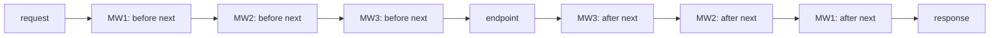

# Lesson 25. Routing and Middleware

**Mission link:** Stage 6 ships the service. Before writing a line of it you have to be able to read a `Program.cs` and say which lines run for a given request, in which order, and which ones quietly do not run at all. That file holds two different systems, and they answer that question by different rules.
**Primary source:** [Docs: "Routing in ASP.NET Core", Microsoft Learn](https://learn.microsoft.com/en-us/aspnet/core/fundamentals/routing)
**Prerequisites:** [Lesson 24](0024-the-dotnet-cli-and-packages.md), [Lesson 18](0018-async-and-await.md), [Lesson 14](0014-delegates-and-events.md)

## Warm-up

1. ▢ Someone clones the service and runs `dotnet test`. What happens before a single test does?

<details markdown="1"><summary>Check</summary>

A restore, because it is implicit in every command that needs one, and a build, because `dotnet test` builds the solution. Nothing has to be run first.

</details>

2. ▢ What does a delegate type's signature include that an overload's does not?

<details markdown="1"><summary>Check</summary>

Its return type. Worth having in mind here, because the request pipeline is built out of delegates, and the predicates that branch it are ordinary `Func<HttpContext, bool>` values.

</details>

3. ▢ Three functions in a chain, each of which may call the next. What can the first one do that the third cannot, and what can it do only after the third has finished?

<details markdown="1"><summary>Check</summary>

The first sees the request before anyone has touched it, and it decides whether the rest of the chain runs at all. What it can only do afterwards is react to the outcome, because control comes back to it last. A component in such a chain has two halves, one on the way in and one on the way out, and this lesson is largely about what belongs in each.

</details>

## Know this

**One file, two systems, and only one of them cares about the order you wrote.** A minimal `Program.cs` interleaves pipeline calls (`Use`, `Run`, `Map`) with endpoint declarations (`MapGet`, `MapPost`). They look alike and they are not alike: the pipeline runs in the order it was assembled, and endpoint selection ignores that order entirely. Holding both models at once is the skill this lesson is for.

**The pipeline: every middleware is two bodies with the whole application in between.** The shape is a delegate that receives the context and the next link ([ASP.NET Core middleware](https://learn.microsoft.com/en-us/aspnet/core/fundamentals/middleware/)):

```csharp
app.Use(async (context, next) =>
{
    Console.WriteLine("Work that can write to the response.");
    await next.Invoke(context);
    Console.WriteLine("Work that doesn't write to the response.");
});
```

Those two comments are the documentation's own, and the asymmetry they describe is the point. Before `next`, you are ahead of everything downstream and the response is yours to write. After `next` returns, the rest of the application has already run, and what the documentation puts in that position is work that does not write to the response. The outward halves also run in reverse: the first middleware registered gets its second half last.



`Run` is the other end of the same idea. It takes a delegate with no `next`, so nothing follows it. In the documentation's branching example, `app.Run` at the top level is what answers every request that did not match a branch.

**Branching, and the difference between a detour and an insert.** Three ways to split the pipeline, and they do not behave the same:

|Call|Branches on|Comes back|
|---|---|---|
|`Map("/map1", branch)`|the request path, when it **starts with** the given path|no|
|`MapWhen(predicate, branch)`|any `Func<HttpContext, bool>`|no|
|`UseWhen(predicate, branch)`|any `Func<HttpContext, bool>`|**yes**, rejoined to the main pipeline unless the branch short-circuits or contains a terminal middleware|

`Map` also edits the request on the way in: **the matched path segments are removed from `HttpRequest.Path` and appended to `HttpRequest.PathBase`**. So inside a branch mapped at `/admin`, a request for `/admin/settings` has a `Path` of `/settings`. Code moved into a branch that reads `Request.Path` stops seeing what it used to see, and nothing warns you.

**Routing is a pair of middleware, and you usually did not write either.** `UseRouting` **adds route matching to the middleware pipeline**, looking at the endpoints the app defines and selecting the best match; `UseEndpoints` **adds endpoint execution**, running the delegate belonging to the selected endpoint. Apps typically call neither, because `WebApplicationBuilder` **configures a middleware pipeline that wraps middleware added in `Program.cs` with `UseRouting` and `UseEndpoints`**. Calling them explicitly is how you change where in the pipeline matching happens.

**Which gives a middleware exactly three possible positions, and they are not interchangeable:**

|Where it sits|What `HttpContext.GetEndpoint()` returns|When it runs|
|---|---|---|
|Before `UseRouting`|**always null**|every request|
|Between `UseRouting` and `UseEndpoints`|the matched endpoint, or null when nothing matched|every request|
|After `UseEndpoints`|the matched endpoint|**only when no match was found**, because `UseEndpoints` is terminal on a match|

That table answers two questions people usually debug the hard way. A middleware that inspects endpoint metadata, the way an authorization middleware reads the policy attached to an endpoint, has to sit after `UseRouting` or it will read null forever. And a middleware placed after `UseEndpoints` is a 404 handler, whether or not that is what you thought you were writing.

**Now the other half of the split: endpoint selection does not use order.** Route templates are ranked by **route template precedence**, a value assigned by how specific the template is, which the documentation says exists to **avoid the need to adjust the order of endpoints in common cases**. The rules:

- Templates with more segments are more specific.
- A literal segment is more specific than a parameter segment.
- A parameter segment with a constraint is more specific than one without.
- Catch-all parameters are the least specific.

So `/Products/List` wins over `/Products/{id}` for the path `/Products/List`, and it wins whichever one you registered first. If no template matches, there is nothing to run and the response is a 404.

Say the whole thing in one line, because it is the sentence to carry into the rest of stage 6: **in the same file, `Use` and `Map` are decided by the order you wrote, and `MapGet` is decided by how specific its template is.**

**One forward pointer.** Nothing here says where a handler's dependencies come from. `MapGet("/orders/{id}", ...)` needs a repository, and the answer is the container, which is lesson 26. Configuration is 27, Entity Framework Core is 28, and 29 puts them together into something testable, which is where the stage's capstone lands.

## Practice

1. ▢ A middleware calls `HttpContext.GetEndpoint()` to read the endpoint's metadata and always gets null, on every request, including ones that clearly matched. What is wrong?

<details markdown="1"><summary>Check</summary>

It is running before route matching. The endpoint is **always null before `UseRouting`**, and it becomes non-null only between `UseRouting` and `UseEndpoints`. Nothing about this fails loudly: the middleware reads null, decides there is no policy to apply, and lets the request through.

The fix is positional rather than logical. Move the middleware after `UseRouting`, which in an app that never calls `UseRouting` explicitly means understanding where the framework put it, which is the next question.

</details>

2. ▢ Nobody in your `Program.cs` calls `UseRouting`, yet a middleware you added there does see a non-null endpoint. Then a colleague adds an explicit `app.UseRouting()` line and your middleware starts seeing null. Explain both halves.

<details markdown="1"><summary>Hint</summary>

Ask what `WebApplicationBuilder` does to the middleware you register, and what changes when you name one of those calls yourself.

</details>

<details markdown="1"><summary>Check</summary>

`WebApplicationBuilder` configures a pipeline that **wraps the middleware added in `Program.cs` with `UseRouting` and `UseEndpoints`**. Wrapped means surrounded: matching has already happened by the time your middleware runs, and endpoint execution has not happened yet. Without writing either call, you were in the middle position, which is why the endpoint was there.

Calling `UseRouting` explicitly places matching at that line instead. Anything registered above it now runs before matching and sees null, which is exactly what the documentation's example shows when it puts an `app.Use` call above an explicit `app.UseRouting()` and notes that route matching now runs after the custom middleware.

The lesson underneath is that the position of your middleware is defined against calls you may not have written. Reading only the lines in the file will mislead you.

</details>

3. ▢ Code inside a branch mapped at `/admin` reads `context.Request.Path` and finds `/settings` where it expected `/admin/settings`. Where did the prefix go, and what should the code read instead?

<details markdown="1"><summary>Check</summary>

`Map` moved it. When `Map` is used, **the matched path segments are removed from `HttpRequest.Path` and appended to `HttpRequest.PathBase`**, so the branch sees the remainder of the path and the prefix is in `PathBase`.

This is the kind of bug that appears during a refactor rather than when the code is written. A middleware that worked at the top level, matching on a full path, is moved into a `Map` branch to tidy the file up, and it silently stops matching anything, because the string it is comparing against no longer contains the prefix it is looking for.

</details>

4. ▢ You want to log a header for requests carrying a particular query string, and then let those requests be handled exactly as they would have been. `MapWhen` or `UseWhen`?

<details markdown="1"><summary>Check</summary>

`UseWhen`. Its branch **is rejoined to the main pipeline** as long as it does not short-circuit or contain a terminal middleware, so the request continues to whatever would have handled it anyway. `MapWhen` is a detour with no way back: the branch handles the request or nothing does.

The documented example is exactly this shape, an `app.Use` inside the branch that logs and awaits `next`, with the main pipeline's `Run` still producing the response for every request. The distinction to keep is a question about intent: are you adding a step, or are you diverting the request? `UseWhen` and `MapWhen` answer that differently despite taking the same predicate.

</details>

5. ▢ Which statement is correct?

    - a) Endpoints match in registration order, so declaring `MapGet("/products/{id}")` before `MapGet("/products/list")` shadows the second
    - b) Endpoint selection uses route template precedence, where a literal segment is more specific than a parameter segment, so registration order does not decide the match
    - c) A middleware registered after `UseEndpoints` runs on every request, once the endpoint's delegate has produced its response
    - d) `Map` and `UseWhen` both return to the main pipeline once their branch has finished

<details markdown="1"><summary>Check</summary>

**b)** Precedence is computed from the template: more segments, literal over parameter, constrained parameter over unconstrained, catch-all last. The documentation's stated purpose for the whole mechanism is to avoid having to adjust the order of endpoints in common cases.

(a) is the model brought from routers where the first match wins, and it is the single most useful thing to unlearn here. (c) inverts the rule: `UseEndpoints` is terminal when a match is found, so middleware after it runs only when nothing matched. (d) is true of `UseWhen` and false of `Map`, which branches without rejoining.

Notice that (a) and (c) are both wrong in the same direction: they assume the whole file obeys one rule. It does not, and knowing which line obeys which is most of what reading a `Program.cs` involves.

</details>

## Real-world reps

- [ ] Open a `Program.cs` you have access to and label every line as pipeline or routing. Note where `UseRouting` and `UseEndpoints` are, including when nobody wrote them.
- [ ] Pick one middleware in it and decide whether it needs the matched endpoint. Then check whether its position actually gives it one.
- [ ] Tomorrow: find two endpoint templates that could both match some path, and work out which one wins by precedence before testing it.

## Going further

- [Docs: "Routing in ASP.NET Core", Microsoft Learn](https://learn.microsoft.com/en-us/aspnet/core/fundamentals/routing)
- [Docs: "ASP.NET Core middleware", Microsoft Learn](https://learn.microsoft.com/en-us/aspnet/core/fundamentals/middleware/)
- [Docs: "ASP.NET Core fundamentals", Microsoft Learn](https://learn.microsoft.com/en-us/aspnet/core/introduction-to-aspnet-core)
- [Resources](../RESOURCES.md)

---

Not landing? Reread the primary source at the top, since this lesson compresses it and compression is where understanding leaks. Check the [glossary](../GLOSSARY.md) for any term that felt slippery.

If the lesson itself is unclear rather than the material, that is a defect: [open an issue](https://github.com/TokenCemetery/teach/issues).
