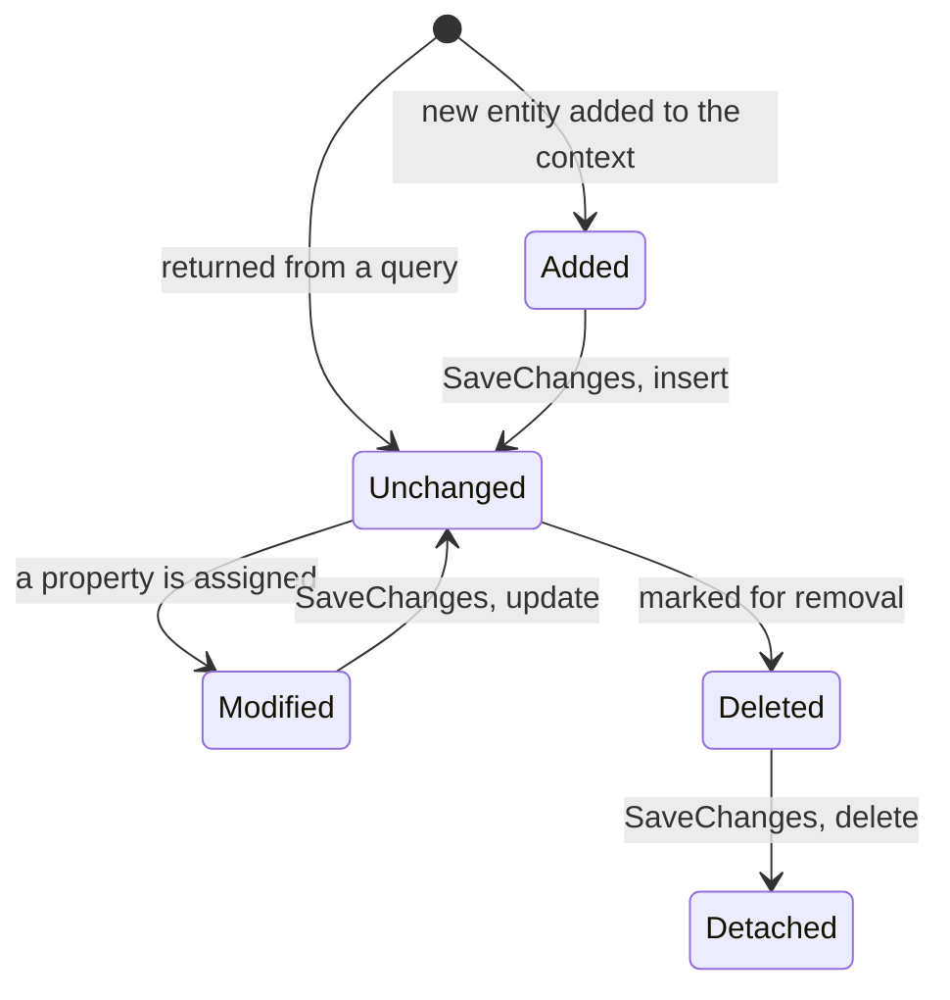

# Lesson 28. Entity Framework Core

**Mission link:** The data layer is where a service stops being a program and starts being a system with state. EF Core makes that easy in a way worth being suspicious of: objects you queried stay connected to the database, a LINQ query you wrote may not be the query that runs, and the concurrency habit stage 4 spent five lessons building is, against a single context, a corruption bug.
**Primary source:** [Docs: "DbContext Lifetime, Configuration, and Initialization", EF Core](https://learn.microsoft.com/en-us/ef/core/dbcontext-configuration/)
**Prerequisites:** [Lesson 27](0027-configuration.md), [Lesson 19](0019-task-composition.md), [Lesson 13](0013-linq.md)

## Warm-up

1. ▢ Two providers set `ConnectionStrings:DefaultConnection`. Which value does the app get?

<details markdown="1"><summary>Check</summary>

The one from the provider added last. Precedence is order, and nothing in the reading code can tell you which source answered.

</details>

2. ▢ Why does `await A(); await B();` take longer than starting both and awaiting afterwards?

<details markdown="1"><summary>Check</summary>

The first `await` suspends the method before the second call is reached, so `B` does not start until `A` finishes. Starting both first puts them in flight together. Hold on to that habit, because this lesson names the one place it does damage.

</details>

3. ▢ What lets the same LINQ query run against a list in memory and against a database?

<details markdown="1"><summary>Check</summary>

The query compiles to a delegate or to an **expression tree** depending on the type being queried, and a provider can translate the tree into SQL. Which raises the question this lesson answers: what happens to the parts it cannot translate.

</details>

## Know this

**A `DbContext` is a unit of work, and its lifetime is the work rather than the application.** The documentation is direct: **the lifetime of a `DbContext` begins when the instance is created and ends when the instance is disposed**, an instance is designed for a **single** unit of work, and therefore **the lifetime of a `DbContext` instance is usually very short** ([DbContext lifetime](https://learn.microsoft.com/en-us/ef/core/dbcontext-configuration/)). The documented cycle is: create the context, let it track entities, change those entities, call `SaveChanges`, dispose.

In a web application **each HTTP request corresponds to a single unit of work**, which makes tying the context to the request the good default, and `AddDbContext` registers the context as a **scoped** service:

```csharp
var connectionString =
    builder.Configuration.GetConnectionString("DefaultConnection")
        ?? throw new InvalidOperationException("Connection string"
        + "'DefaultConnection' not found.");

builder.Services.AddDbContext<ApplicationDbContext>(options =>
    options.UseSqlServer(connectionString));
```

Two lessons meet in those four lines. The connection string comes from configuration, with all of lesson 27's ordering behind it, and the registration is lesson 26's scoped lifetime, which is also what disposes the context at the end of the request. The context class **must expose a public constructor with a `DbContextOptions<ApplicationDbContext>` parameter**, which is how the configuration from `AddDbContext` reaches it: constructor injection again, one level down.

**Change tracking is the part with no equivalent in stages 1 to 5.** Every entity carries an `EntityState`, and the state decides what `SaveChanges` does to it ([Change tracking](https://learn.microsoft.com/en-us/ef/core/change-tracking/)):

|State|Tracked by the context|Exists in the database|Action on `SaveChanges`|
|---|---|---|---|
|`Detached`|no|not applicable|none|
|`Added`|yes|no|insert|
|`Unchanged`|yes|yes|none|
|`Modified`|yes|yes|update|
|`Deleted`|yes|yes|delete|

**All entities returned from queries are initially `Unchanged`**, and EF Core **tracks changes at the property level**, so modifying one property updates only that column.



Read the `Modified` row as an instruction about your own code. There is no update call. You query an object, assign to a property, call `SaveChanges`, and a row changes. That is convenient exactly as long as every assignment you make to a tracked object is one you meant to persist, and the failure mode is an entity mutated for some unrelated reason, such as normalising a value before returning it, being written back without anyone deciding to.

**`AsNoTracking` is a different promise, not just a faster one.** No-tracking queries are for read-only results and are **generally quicker to execute because there is no need to set up the change tracking information** ([Tracking vs. no-tracking queries](https://learn.microsoft.com/en-us/ef/core/querying/tracking)). Two behavioural differences come with the speed:

- Tracking queries do **identity resolution**: an entity already tracked is returned as the same instance, and an entity appearing several times in a result is the same instance each time. No-tracking queries **do not**, and **return a new instance of the entity even when the same entity is contained in the result multiple times**.
- A no-tracking query **gives results based on what is in the database, disregarding any local changes or added entities**. Work already done in this unit of work is invisible to it until it is saved.

`AsNoTrackingWithIdentityResolution` exists for when you want the first behaviour back without the tracking.

**The LINQ you wrote is not the query that ran, and there is exactly one place it may fall back.** EF Core **attempts to evaluate a query on the server as much as possible**, turning parts of it into parameters. It supports **partial client evaluation in the top-level projection, essentially the last call to `Select()`**: if that projection cannot be translated, EF fetches the data it needs and finishes the work on the client. **If EF Core detects an expression, in any place other than the top-level projection, which cannot be translated to the server, then it throws a runtime exception** ([Client vs. server evaluation](https://learn.microsoft.com/en-us/ef/core/querying/client-eval)).

So the rule is positional, like lesson 25's rule about where a middleware sits. Your own method called inside `Where` throws; the same method called in the final `Select` quietly moves work to the client, which is a performance decision made by where you typed it. Two footnotes worth having: **before version 3.0, client evaluation was supported anywhere in the query**, which is why older code and older blog posts disagree with the compiler; and a client-evaluated projection can capture constants in the cached query plan, so using an instance method there keeps the instance alive, with the documented fix being to make the method static or to pass the data it needs as arguments.

**And the rule that contradicts stage 4.** In the documentation's words: **EF Core does not support multiple parallel operations being run on the same `DbContext` instance. This includes both parallel execution of async queries and any explicit concurrent use from multiple threads. Therefore, always `await` async calls immediately, or use separate `DbContext` instances for operations that execute in parallel.** When it notices, you get an `InvalidOperationException` saying a second operation started on this context before a previous operation completed. When it does not notice, the documented outcome is **undefined behavior, application crashes and data corruption**.

Lesson 19 taught you to start work before awaiting it and to combine tasks with `WhenAll`, and that is the correct habit for independent operations. A single context is not independent operations. Scoped registration is safe **because there is only one thread executing each client request at a given time and each request gets its own scope**, and that safety ends the moment you parallelise inside a request. The documented ways to parallelise anyway are to create a scope per thread with `IServiceScopeFactory`, or to register the context as transient.

**Migrations, in one line, because the rest is a tools reference.** `dotnet ef migrations add InitialCreate` creates a `Migrations` directory and generates the files that move the schema, and the documentation's advice is to inspect what was generated, and possibly amend it, rather than to trust it unread.

**One forward pointer.** Lesson 29 assembles routing, injection, configuration and this into one typed, tested service, and closes stage 6.

## Practice

1. ▢ A handler queries a customer, assigns `customer.Email = normalised;` and calls `SaveChangesAsync`. There is no update call anywhere. Why does the row change, and what else might this code be writing?

<details markdown="1"><summary>Check</summary>

Because the entity is tracked. Everything returned from a query starts `Unchanged`, an assignment moves it to `Modified`, and `SaveChanges` updates it, at property level, so only that column changes.

What else it might be writing is the real question. Any assignment to any tracked entity in this unit of work is a pending update, including ones made for reasons that have nothing to do with persistence: trimming a string before returning it, filling in a display field, a mapper that copies values onto the entity instead of onto a separate type. None of it looks like a database call, and all of it is one.

Two defences follow from what the lesson has already said. Query with `AsNoTracking` when the result is only going to be read, so there is nothing to accidentally modify. And keep the unit of work short, which is what the scoped registration is already doing for you.

</details>

2. ▢ A colleague describes `AsNoTracking` as a performance flag with no behavioural effect. Name two ways that is wrong.

<details markdown="1"><summary>Check</summary>

First, identity resolution. A tracking query returns the same instance for an entity that appears several times in a result, and for one already tracked. A no-tracking query does not do identity resolution at all and **returns a new instance even when the same entity is in the result multiple times**, so reference equality between two rows that are "the same" customer is false, and a change to one is not visible through the other.

Second, visibility of local work. A no-tracking query **gives results based on what is in the database, disregarding any local changes or added entities**, so an entity added earlier in the same unit of work and not yet saved will not appear.

`AsNoTrackingWithIdentityResolution` is the option for wanting the first behaviour without the tracking, at the cost of a stand-alone change tracker being used to build the results.

</details>

3. ▢ A handler receives the injected `DbContext` and does the stage 4 thing: starts three queries, then awaits all three together. It works in development and fails in production with a message about a second operation starting before a previous one completed. What happened, and what are the fixes?

<details markdown="1"><summary>Hint</summary>

Ask what "the same instance" means here. The registration is scoped, so how many contexts exist during one request?

</details>

<details markdown="1"><summary>Check</summary>

One context exists for the request, and **EF Core does not support multiple parallel operations being run on the same `DbContext` instance**, explicitly including parallel execution of async queries. Starting three before awaiting any is exactly that.

The scoped registration is safe **because only one thread executes each client request at a time and each request gets its own scope**. That reasoning holds only while the request is sequential. Parallelising inside a request removes the premise, and the same registration that was safe becomes the thing being shared.

It works in development because the race needs the timing. And the message is the good outcome: when concurrent access goes undetected the documented result is undefined behaviour, crashes and data corruption.

The documented fixes are to await each call immediately, or to use separate context instances for operations that run in parallel, creating a scope per thread with `IServiceScopeFactory` or registering the context as transient. Note what this costs conceptually: separate contexts are separate units of work, so they no longer save together.

</details>

4. ▢ A helper method of yours throws at run time when called inside `Where`, and works when called in the final `Select` of the same query. Explain both halves.

<details markdown="1"><summary>Check</summary>

EF Core supports partial client evaluation **in the top-level projection**, essentially the last `Select()`, and there only. Inside `Where` the expression has to be translated to the server, and when it cannot be, EF **throws a runtime exception** rather than fetching the table and filtering in memory.

The half that "works" deserves the scare quotes. In the projection EF fetches the data it needs and evaluates the rest on the client, so the query succeeds while doing more work, over more rows, than the SQL suggests. Where you typed the call decided that, and nothing in the type system marks the boundary.

Two things make this confusing in the wild. Before EF Core 3.0 client evaluation was supported anywhere in a query, so older code and older answers describe behaviour that no longer exists. And a client-evaluated projection can hold constants alive in the cached query plan, so calling an instance method there can keep that instance, and anything it references, from being collected; the documented fix is to make the method static or pass in only the data it needs.

</details>

5. ▢ Which statement is correct?

    - a) EF Core evaluates untranslatable expressions on the client wherever they appear, so a query may be slow but will not fail to translate
    - b) EF Core allows client evaluation only in the top-level projection and throws a runtime exception for an untranslatable expression anywhere else
    - c) `AsNoTracking` affects performance only, returning the same instances a tracking query would
    - d) A scoped `DbContext` is safe to use from several parallel operations, because each request already has its own instance

<details markdown="1"><summary>Check</summary>

**b)** One place is allowed to fall back, and it is the last `Select()`.

(a) describes EF Core before version 3.0, which is why it still sounds right to people who learned it then. (c) misses identity resolution and the fact that a no-tracking query disregards local changes and added entities. (d) confuses isolation between requests with isolation between operations: one instance per request is precisely why parallel work inside a request shares one context, and EF Core does not support that.

</details>

## Real-world reps

- [ ] Find a query in a C# service you have access to whose results are only read. Check whether it uses `AsNoTracking`, and what it would cost if the entity were mutated later in the same request.
- [ ] Find a place where an entity is modified. Trace how far the assignment is from the `SaveChanges` that persists it.
- [ ] Tomorrow: look for two database calls in one request that are started before either is awaited, and decide whether they share a context.

## Going further

- [Docs: "DbContext Lifetime, Configuration, and Initialization", EF Core](https://learn.microsoft.com/en-us/ef/core/dbcontext-configuration/)
- [Docs: "Change Tracking in EF Core", EF Core](https://learn.microsoft.com/en-us/ef/core/change-tracking/)
- [Docs: "Tracking vs. No-Tracking Queries", EF Core](https://learn.microsoft.com/en-us/ef/core/querying/tracking)
- [Docs: "Client vs. Server Evaluation", EF Core](https://learn.microsoft.com/en-us/ef/core/querying/client-eval)
- [Docs: "Migrations Overview", EF Core](https://learn.microsoft.com/en-us/ef/core/managing-schemas/migrations/)
- [Resources](../RESOURCES.md)

---

Not landing? Reread the primary source at the top, since this lesson compresses it and compression is where understanding leaks. Check the [glossary](../GLOSSARY.md) for any term that felt slippery.

If the lesson itself is unclear rather than the material, that is a defect: [open an issue](https://github.com/TokenCemetery/teach/issues).
