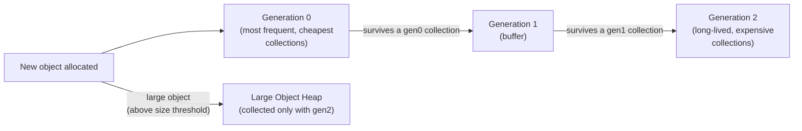

# Lesson 32. The Managed Heap and Generations

**Mission link:** Lesson 1 drew the line at "a class instance lives on the managed heap, a struct is typically stored inline." This lesson is where "what the CLR does with what you wrote" actually starts for anything that crosses that line: the managed heap isn't one undifferentiated pool, it's split into generations, and which generation an object ends up in, and for how long, is exactly what a collection has to do work for.
**Primary source:** [Docs: "Fundamentals of garbage collection", Microsoft Learn](https://learn.microsoft.com/en-us/dotnet/standard/garbage-collection/fundamentals)
**Prerequisites:** [Lesson 1](0001-structs-and-classes.md)

## Warm-up

1. ▢ Per lesson 1, what's the difference between where a struct's data lives and where a class instance's data lives?

Check

A struct's data is typically stored inline, wherever it's used (on the stack, inside a containing object, inside an array slot). A class instance always lives on the managed heap, and a variable of that type holds a reference to it.

2. ▢ Why does passing a small struct around potentially avoid a heap allocation that the equivalent class would require?

Check

The struct's data is copied inline wherever it's used, so there's no separate heap object being created or referenced at all. A class of the same shape always needs an object on the managed heap for its instance to live in, which is exactly what a heap allocation is.

## Know this

### The heap is split into generations because compacting all of it every time is wasteful

The managed heap is divided into three generations, **0**, **1**, and **2**, specifically so the collector can reclaim memory in a portion of the heap rather than the entire heap every time it runs. Compacting (moving surviving objects together, freeing the space behind them) a small portion is faster than compacting everything, and this split is what lets a collection's cost scale with how much of the heap actually needs checking, not with the heap's total size.

### Generation 0 is where everything starts, and where the collector hopes it dies

Every new (small) object is allocated into **generation 0**, the youngest generation, and it's the one collected most frequently. The underlying assumption, stated directly by the documentation, is that in a well-tuned application most objects die in generation 0: short-lived, temporary objects (a local variable's backing object, the allocations one web request creates and no longer needs once it responds) that become garbage before a gen0 collection ever runs long enough to see them survive. A gen0 collection only has to examine gen0's own small set of live objects, which is exactly why it's cheap and can run often.

### Generation 1 buffers what survives; generation 2 is where long-lived objects actually live

An object that's still reachable when a gen0 collection runs gets **promoted** to **generation 1**, which acts as a buffer between short-lived and long-lived objects: some gen1 objects still die soon after, without ever earning a place in gen2. An object that survives collection in gen1 is promoted again, into **generation 2**, which holds genuinely long-lived objects, ones created early in an application's lifetime and still reachable much later (a cache, a singleton service, application-wide configuration). Gen2 collections are the expensive ones, since they have to examine a generation that can hold everything that's survived this long, which is exactly why the generational split exists: to keep the common case (gen0) cheap and reserve the expensive case (gen2) for objects that actually need it.

### Large objects skip the queue entirely, onto their own heap

An object above a size threshold doesn't follow the gen0 → gen1 → gen2 promotion path at all: it's allocated directly onto the **Large Object Heap (LOH)**, sometimes called generation 3, a physically separate heap that's logically collected only as part of a generation 2 collection. This means a large object is never cheaply collected the way a small, short-lived gen0 object is; every LOH collection rides along with the most expensive kind of collection this system has.

### Lesson 1's struct-versus-class choice is really a choice about who has to play this game at all

A struct stored inline, on the stack or inside a containing object, never enters this generational system: there's nothing on the managed heap for a collector to track, promote, or eventually reclaim. A class instance always does, starting in gen0 with a bet that it dies quickly and cheaply there. A program that allocates many small, short-lived class instances is betting the generational hypothesis holds, most of that gen0 garbage dies before promotion; a program that holds onto references longer than it needs to is what quietly pushes objects into gen1 and gen2, turning cheap gen0 collections into the more expensive kind this whole scheme was built to avoid running often.

## Practice

1. ▢ Why does dividing the managed heap into generations make garbage collection cheaper, rather than just adding bookkeeping overhead?

Hint

Think about what a collection actually has to examine, and how that set's size changes across generations.

Check

A collection only has to examine the generation (or generations) it's collecting, not the entire heap. Since generation 0 holds a small, frequently-turned-over set of objects, a gen0 collection is fast; without the split, every collection would have to examine and potentially compact the whole heap, including long-lived objects that were never going to be freed anyway.

2. ▢ A web application creates several short-lived objects per incoming request (parsed request data, a temporary result object) that are no longer referenced once the response is sent. Which generation are these objects allocated into, and what does the documentation say should typically happen to them?

Check

They're allocated into generation 0, the youngest generation, along with every new object. In a well-tuned application, most objects die in generation 0, and these request-scoped objects are exactly the kind expected to become unreachable and get collected there, without ever surviving long enough to be promoted to generation 1 or 2.

3. ▢ An object survives two consecutive collections of the generation it's currently in. Trace which generation it starts in, and which generations it passes through to end up long-lived.

Check

It starts in generation 0. Surviving a gen0 collection promotes it to generation 1; surviving a gen1 collection promotes it to generation 2, where long-lived objects live. Two survived collections, one per generation, is exactly the path from newly allocated to long-lived.

4. ▢ A service allocates a 500 KB array on every request and lets it go out of scope once the request finishes. Why doesn't this array follow the same gen0 → gen1 → gen2 path a small temporary object would?

Check

An object above the size threshold is allocated directly onto the Large Object Heap instead of generation 0, bypassing the normal promotion path entirely. It's only collected as part of a generation 2 collection, so this array is never reclaimed as cheaply as a small gen0 object would be, even though it's just as short-lived.

5. ▢ Which claim correctly describes why a struct, per lesson 1, never enters this generational system at all?

    - a) Structs are collected in generation 0 exclusively and never promoted
    - b) A struct stored inline (stack, containing object, array slot) never has heap-allocated data for a collector to track, promote or reclaim, unlike a class instance which always starts on the heap in generation 0
    - c) Structs are stored on the Large Object Heap regardless of size
    - d) The generational system applies only to arrays, not to individual objects

Check

**b)** That's the connection back to lesson 1 this lesson draws. (a) is false: a struct's inline data was never on the managed heap to begin with, so there's nothing to place in any generation. (c) is false: the LOH is for large objects that are heap-allocated in the first place, regardless of struct or class. (d) is false: the generational system applies to any heap-allocated object, individual instances included.

## Real-world reps

- [ ] For a C# program you have access to (or a small one you write), identify a few objects that are likely allocated per-request or per-iteration and short-lived, and a few that are meant to live for the whole application (a singleton service, a cache). Name which generation each is aimed at, per this lesson's model.
- [ ] Check the size threshold your .NET version documents for the Large Object Heap, and check whether any array or buffer type you commonly allocate in a hot path is large enough to land there.
- [ ] Tomorrow: read the primary source's section on ephemeral segments and note which generations share one, and why that segment specifically is kept partly committed rather than decommitted after a collection.

## Going further

- [Docs: "Fundamentals of garbage collection", Microsoft Learn](https://learn.microsoft.com/en-us/dotnet/standard/garbage-collection/fundamentals)
- [Docs: "Large object heap (LOH) on Windows", Microsoft Learn](https://learn.microsoft.com/en-us/dotnet/standard/garbage-collection/large-object-heap)
- [Resources](../RESOURCES.md)

---

Not landing? Reread the primary source at the top, since this lesson compresses it and compression is where understanding leaks. Check the [glossary](../GLOSSARY.md) for any term that felt slippery.

If the lesson itself is unclear rather than the material, that is a defect: [open an issue](https://github.com/TokenCemetery/teach/issues).
