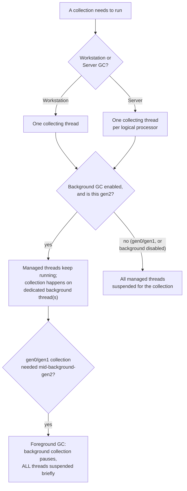

# Lesson 33. GC Modes and Trade-offs

**Mission link:** Lesson 32 established the generational heap and the promotion path an object travels. This lesson covers how a collection actually executes against that heap: **workstation** versus **server** GC (how many threads do the collecting, and for what kind of app), and **background** GC (whether a generation 2 collection blocks every managed thread or lets most of them keep running), plus the one case where even background GC still has to stop everything.
**Primary source:** [Docs: "Workstation vs. server garbage collection (GC)", Microsoft Learn](https://learn.microsoft.com/en-us/dotnet/standard/garbage-collection/workstation-server-gc), [Docs: "Background garbage collection", Microsoft Learn](https://learn.microsoft.com/en-us/dotnet/standard/garbage-collection/background-gc)
**Prerequisites:** [Lesson 32](0032-the-managed-heap-and-generations.md)

## Warm-up

1. ▢ Per lesson 32, what makes a generation 2 collection more expensive than a generation 0 collection?

Check

A generation 2 collection has to examine the generation that holds everything that's survived long enough to become long-lived, which can be a much larger and more varied set of objects than generation 0's small, frequently-turned-over set.

2. ▢ What does an object have to do to be promoted from generation 1 to generation 2?

Check

Survive a collection while it's in generation 1; surviving that collection is what promotes it to generation 2, the same rule that promotes a surviving generation 0 object into generation 1.

## Know this

### Workstation and server GC differ in how many threads collect

**Workstation GC** is the default for a standalone app, and it's the flavor Java-style intuition would expect: essentially one thread's worth of collection work at a time. **Server GC** is built for server applications that need high throughput and scalability, and it does its collecting across multiple threads, more work happening in parallel when a collection runs. A hosted app (one running inside ASP.NET, for instance) doesn't necessarily get workstation GC by default; the host decides which flavor it starts with.

### Server GC's own multi-threading is exactly what can turn against it

Server GC's parallelism is a genuine throughput win for a machine dedicated to running one demanding process. But the documentation is explicit about where this backfires: if many processes on the same machine are all running server GC, each with server GC's per-core collection threads, and they happen to collect around the same time, those threads all compete for the same small number of logical CPUs, and the processes interfere with each other. The documentation's own example: twelve processes using server GC on a four-logical-CPU machine, all colliding for the same four CPUs at once. For that shape of deployment (many small instances sharing a host), the recommended fix is workstation GC with concurrent GC disabled, which produces less context switching, not server GC tuned down.

### Background GC lets other threads keep running, but only for generation 2

**Background GC** (the current name for what used to be called concurrent GC) lets managed threads continue running while a generation 2 collection proceeds on a dedicated thread. This only ever applies to generation 2: generation 0 and generation 1 collections are always non-concurrent, because lesson 32 already established they're fast enough that making them concurrent wouldn't be worth the added complexity. Background workstation GC uses one dedicated background thread; background server GC uses several, typically one per logical processor, mirroring server GC's own per-core parallelism.

### Foreground GC is the one moment background GC still stops everything

While a background generation 2 collection is in progress, generation 0 or generation 1 can still need their own collection, since new allocations keep happening the whole time. When that happens, it's called a **foreground GC**, and during it, every managed thread is suspended, the dedicated background thread checks at frequent safe points for exactly this kind of request, pauses the background collection to let the foreground one run, then resumes once it's done. Background GC's whole point is letting most work continue during the expensive generation 2 collection; foreground GC is the reminder that generation 0 and generation 1 collections were never made concurrent in the first place, and still briefly stop everything when they have to run mid-background-collection.

### Choosing a mode is a question about the deployment shape, not just the workload

A single, dedicated server process handling a high-throughput workload is exactly server GC's target case: multiple cores, one process free to use all of them for collection. Many small, similarly-loaded processes sharing one host (containers on a shared node, several worker instances on one machine) is the opposite case, where server GC's own per-core threads start competing with each other's, and workstation GC with concurrent GC disabled is the documented fix. The choice isn't "server GC is for servers, workstation GC is for desktops" as a label; it's a question about whether a process gets a machine's cores mostly to itself or is sharing them with siblings running the identical collector.

## Practice

1. ▢ A service runs as the only heavyweight process on a dedicated multi-core machine, handling a high-throughput workload. Which GC flavor fits this deployment, and why?

Hint

Think about how many cores this process actually has available to itself.

Check

Server GC. It's built for exactly this case, a server application needing high throughput and scalability, with multiple cores available for its own collection threads to use without competing against another process's collection threads for the same CPUs.

2. ▢ Twelve identical worker processes, each configured for server GC, run on a single four-logical-CPU machine and tend to collect around the same time. What goes wrong, and what does the documentation recommend instead?

Check

Each process's server GC threads (roughly one per logical CPU) all compete for the same four CPUs when their collections overlap, causing the processes to interfere with each other through contention and context switching. The documented fix for this shape of deployment is workstation GC with concurrent GC disabled, which produces less context switching than twelve sets of server GC threads fighting over four CPUs.

3. ▢ Why does background GC only ever apply to generation 2 collections, never to generation 0 or generation 1?

Check

Generation 0 and generation 1 collections are always non-concurrent because they finish quickly enough on their own that making them run in the background wouldn't be worth the added complexity; only generation 2, the expensive collection, benefits enough from letting other threads keep running during it.

4. ▢ A background generation 2 collection is in progress when generation 0 fills up and needs its own collection. What happens, and does it contradict background GC's purpose?

Check

A foreground GC occurs: the background collection notices the request at one of its frequent safe points, pauses itself, and every managed thread is suspended while the generation 0 (or generation 1) collection runs, resuming the background collection afterward. It doesn't contradict background GC's purpose, since generation 0 and generation 1 were never concurrent in the first place; background GC's promise was only ever about letting threads keep running during the expensive generation 2 collection, and a foreground GC is exactly the ordinary, always-brief, always-blocking generation 0/1 collection lesson 32 already described.

5. ▢ Which claim correctly distinguishes workstation GC from server GC?

    - a) Workstation GC is faster in every scenario, and server GC exists only for legacy compatibility
    - b) Workstation GC collects with essentially one thread; server GC collects across multiple threads (typically one per logical processor), which helps a dedicated, high-throughput process but can cause contention when many processes running it share the same CPUs
    - c) Server GC is the only mode that supports generational collection at all
    - d) Workstation GC always runs in the background; server GC never does

Check

**b)** That's the distinction and the trade-off this lesson draws. (a) is false: which is faster depends on the deployment shape, and the twelve-processes example shows server GC actively hurting under contention. (c) is false: lesson 32's generational model (gen 0/1/2, the LOH) applies under both flavors. (d) is false: both workstation and server GC have background variants, and both also have non-concurrent variants; "background" and "workstation/server" are two separate choices, not one implying the other.

## Real-world reps

- [ ] Check whether a C# service you have access to sets `ServerGarbageCollection` in its project file (or leaves it at the default), and whether that setting matches the deployment shape (dedicated machine vs. many similarly-loaded processes sharing one host) this lesson describes.
- [ ] Check whether `ConcurrentGarbageCollection` (background GC) is enabled for that same service, and whether its workload's generation 2 collection frequency would make that setting matter in practice.
- [ ] Tomorrow: read the primary source's section on the GC config settings page and note the exact project-file property names and their default values, rather than relying on this lesson's paraphrase of them.

## Going further

- [Docs: "Workstation vs. server garbage collection (GC)", Microsoft Learn](https://learn.microsoft.com/en-us/dotnet/standard/garbage-collection/workstation-server-gc)
- [Docs: "Background garbage collection", Microsoft Learn](https://learn.microsoft.com/en-us/dotnet/standard/garbage-collection/background-gc)
- [Docs: "Garbage collector config settings", Microsoft Learn](https://learn.microsoft.com/en-us/dotnet/core/runtime-config/garbage-collector)
- [Resources](../RESOURCES.md)

---

Not landing? Reread the primary source at the top, since this lesson compresses it and compression is where understanding leaks. Check the [glossary](../GLOSSARY.md) for any term that felt slippery.

If the lesson itself is unclear rather than the material, that is a defect: [open an issue](https://github.com/TokenCemetery/teach/issues).
