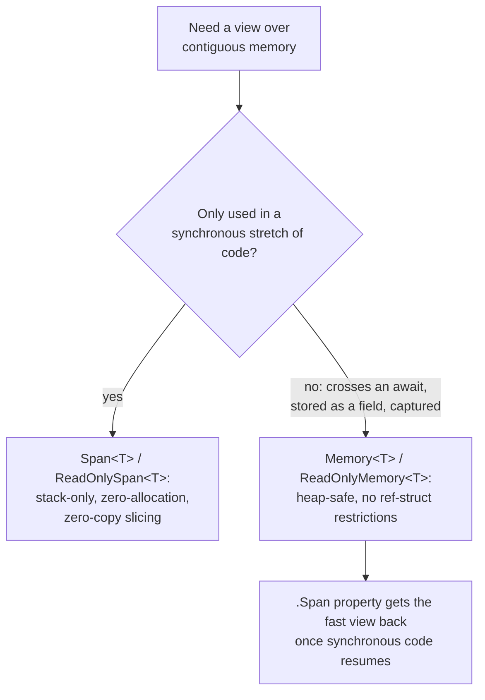

# Lesson 34. Span and Memory

**Mission link:** Lesson 32 put a class instance on the managed heap and put a struct's data inline; `Span<T>` is the strongest version of "inline": a view over existing memory (an array, a string, a `stackalloc`'d buffer) that never allocates and never enters the generational system at all. That safety comes from real compiler restrictions, and lesson 18's `await` mechanism is exactly where one of them bites, which is why `Memory<T>` exists.
**Primary source:** [API: "`Span<T>` Struct", Microsoft Learn](https://learn.microsoft.com/en-us/dotnet/api/system.span-1), [Docs: "`Memory<T>` and `Span<T>` usage guidelines", Microsoft Learn](https://learn.microsoft.com/en-us/dotnet/standard/memory-and-spans/memory-t-usage-guidelines)
**Prerequisites:** [Lesson 32](0032-the-managed-heap-and-generations.md), [Lesson 18](0018-async-and-await.md)

## Warm-up

1. ▢ Per lesson 32, what makes a struct's inline storage never enter the generational heap system at all?

Check

A struct stored inline (on the stack, inside a containing object, inside an array slot) is never placed on the managed heap in the first place, so there's nothing for a collector to track, promote, or reclaim across generations.

2. ▢ Per lesson 18, what happens to an async method's execution when it hits an `await` that actually suspends, and where does control go?

Check

The method suspends; control returns to the caller, which is free to continue. The thread is not blocked, and the remainder of the method runs later, when the awaited operation completes.

## Know this

### A view over memory, not a copy of it

`Span<T>` (and its read-only counterpart, `ReadOnlySpan<T>`) is a type-safe, allocation-free view over a contiguous region of existing memory: a managed array, a slice of a string, a `stackalloc`'d buffer, or unmanaged memory. Creating one, or slicing it into a smaller `Span<T>` over part of the same memory, allocates nothing at all; it's bounds-checked the same way an array is, and a slice is a view over the *same* underlying memory, so a write through the slice is visible through the original and vice versa.

### It's a ref struct, and that's an enforced restriction, not a suggestion

`Span<T>` is a **ref struct**, allocated on the stack rather than the managed heap, and the documentation is explicit that ref struct types carry restrictions specifically to guarantee they can never be promoted to the heap. A `Span<T>` can't be boxed, can't be assigned to a variable of type `object`, `dynamic`, or any interface type, can't be a field of an ordinary (non-ref-struct) class, can't be the element type of an array, and can't be captured by a lambda expression or local function. Every one of these is a way an ordinary value could otherwise outlive the stack frame that created it; a ref struct is barred from all of them so the compiler can guarantee it never does.

### Crossing an `await` is the one restriction lesson 18 explains directly

The same list includes: a ref struct variable can't be used across an `await` (or a `yield`) boundary. Lesson 18 already established why this specific one matters: an `await` that actually suspends returns control to the caller and resumes the method later, potentially long after the original call's stack frame would ordinarily have been popped. A `Span<T>` might be viewing `stackalloc`'d memory that belongs to that exact frame; if the method could hold onto it across a real suspension, resuming later could mean reading through a view of memory that no longer means anything. The compiler refuses the combination outright rather than let that happen. (C# 13 narrowed this from the whole method to just the same block as the `await` expression, and separately allowed ref struct locals in iterators outside any block containing `yield return`, but the underlying reason, a stack-only view surviving past its frame, is unchanged.)

### `Memory<T>` is the heap-safe type built for exactly this gap

Because `Span<T>` can't be stored on the heap or held across an `await`, .NET provides `Memory<T>` (and `ReadOnlyMemory<T>`) as the complementary type: not a ref struct, so it *can* be a field, captured by a closure, or held across a suspension, with none of `Span<T>`'s heap-avoidance restrictions. The trade is that `Memory<T>` itself isn't the fast, direct view; code gets back to that by calling `.Span` on a `Memory<T>` once it's in a synchronous stretch of code that can use it. The pattern this produces: hold a `Memory<T>` across anything that spans an `await`, and convert to `.Span` only for the synchronous window where the fast view is actually used.

### Claiming only read access is the same discipline lesson 4 already taught

The official usage guidelines give a direct rule: use `ReadOnlySpan<T>` or `ReadOnlyMemory<T>` when a buffer should only be read, not written, the same way lesson 4 argued for accepting `IEnumerable<T>` over a concrete collection type when a method only needs to enumerate. A method that only inspects a buffer's contents and takes a mutable `Span<T>` anyway is claiming a capability, the right to overwrite the caller's data, that its own body never uses; the read-only variants make that claim visible in the signature instead of leaving it to be discovered by reading the method body.

## Practice

1. ▢ A method slices a `Span<T>` into two smaller spans over the front and back halves of the same array. Does this allocate any new memory, and can a write through one slice be seen through the original array?

Hint

Think about what a span actually stores, a pointer and a length, versus a copy of data.

Check

No new memory is allocated; slicing produces another view over the same underlying memory, not a copy. A write through either slice is visible through the original array, since both the slices and the original array are all views over the identical underlying storage.

2. ▢ Why can't a `Span<T>` be stored as a field on an ordinary class?

Check

`Span<T>` is a ref struct, restricted specifically so it can never be promoted to the managed heap. A field on an ordinary (non-ref-struct) class lives wherever that class instance lives, which for a heap-allocated class instance would mean the span itself ends up on the heap, exactly what the ref struct restrictions exist to prevent.

3. ▢ A method holds a `Span<T>` over a `stackalloc`'d buffer, then tries to use it after an `await` that actually suspends. What does the compiler do, and why?

Check

The compiler rejects it: a ref struct variable can't be used across an await boundary. If the suspension is real, the method resumes later, potentially after the stack frame that owned the `stackalloc`'d memory would ordinarily be gone; letting a `Span<T>` survive that would risk it pointing at memory that no longer means anything, which the restriction exists to prevent outright.

4. ▢ A class needs to hold onto a buffer view across several `await` points in an async method, sometimes storing it as a field between calls. Which type fits, `Span<T>` or `Memory<T>`, and why?

Check

`Memory<T>`. It isn't a ref struct, so it carries none of `Span<T>`'s heap-avoidance restrictions: it can be a field, held across an `await`, and captured, which is exactly what this scenario needs. `Span<T>` is ruled out by the same restriction that forbids it crossing an await at all.

5. ▢ Which claim correctly distinguishes when to use `Span<T>` versus `Memory<T>`?

    - a) `Span<T>` and `Memory<T>` are interchangeable, and the choice is purely a style preference
    - b) `Memory<T>` is always faster, since it avoids the ref struct restrictions entirely
    - c) Use `Span<T>` for a fast, zero-allocation view in synchronous code that never needs to be stored as a field, captured, or held across an `await`; use `Memory<T>` when the view needs to survive any of those, converting back to `.Span` for the synchronous window that uses it
    - d) `Span<T>` should be used whenever a buffer needs to be read-only, and `Memory<T>` whenever it needs to be mutable

Check

**c)** That's the decision this lesson draws from the ref struct restrictions and lesson 18's await mechanics. (a) is false: the restrictions are enforced by the compiler, not a style choice, and violating them is a compile error, not a preference. (b) is false: `Memory<T>` isn't faster, it's a wrapper that gets back to the fast `Span<T>` view via `.Span` when it can; the restrictions exist for safety, not performance. (d) is false: read-only versus mutable (`ReadOnlySpan<T>`/`ReadOnlySpan<T>` vs `Span<T>`/`Memory<T>`) is an entirely separate axis from stack-only versus heap-safe.

## Real-world reps

- [ ] Find a method in code you have access to that parses or processes part of a string or array (a `Substring` call, a manual loop over an array slice). Check whether rewriting it against a `ReadOnlySpan<T>` slice would remove an allocation.
- [ ] Find (or write) an async method that needs a buffer across an `await`. Confirm `Span<T>` is rejected by the compiler there, and rewrite it using `Memory<T>`, converting to `.Span` only in the synchronous parts.
- [ ] Tomorrow: read the usage guidelines' Ownership and Consumption sections in full, and note what the documentation says a `Memory<T>`'s single owner is responsible for that a consumer is not.

## Going further

- [API: "`Span<T>` Struct", Microsoft Learn](https://learn.microsoft.com/en-us/dotnet/api/system.span-1)
- [API: "`Memory<T>` Struct", Microsoft Learn](https://learn.microsoft.com/en-us/dotnet/api/system.memory-1)
- [Docs: "`Memory<T>` and `Span<T>` usage guidelines", Microsoft Learn](https://learn.microsoft.com/en-us/dotnet/standard/memory-and-spans/memory-t-usage-guidelines)
- [Docs: "ref struct", Microsoft Learn](https://learn.microsoft.com/en-us/dotnet/csharp/language-reference/builtin-types/ref-struct)
- [Resources](../RESOURCES.md)

---

Not landing? Reread the primary source at the top, since this lesson compresses it and compression is where understanding leaks. Check the [glossary](../GLOSSARY.md) for any term that felt slippery.

If the lesson itself is unclear rather than the material, that is a defect: [open an issue](https://github.com/TokenCemetery/teach/issues).
