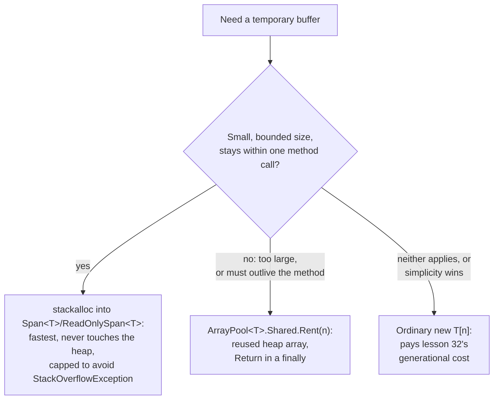

# Lesson 35. stackalloc and ArrayPool

**Mission link:** Lesson 34 showed a `Span<T>` viewing memory `stackalloc`'d on the stack, and named it the strongest way to avoid lesson 32's generational heap entirely. This lesson covers what `stackalloc` itself actually does, why it needs `Span<T>` specifically to be safe, the real risk it carries that has nothing to do with garbage collection, and `ArrayPool<T>` as the fallback for a buffer too large, or too long-lived, for the stack.
**Primary source:** [Docs: "stackalloc expression", Microsoft Learn](https://learn.microsoft.com/en-us/dotnet/csharp/language-reference/operators/stackalloc), [API: "`ArrayPool<T>` Class", Microsoft Learn](https://learn.microsoft.com/en-us/dotnet/api/system.buffers.arraypool-1)
**Prerequisites:** [Lesson 34](0034-span-and-memory.md), [Lesson 32](0032-the-managed-heap-and-generations.md)

## Warm-up

1. ▢ Per lesson 34, what compiler restriction on `Span<T>` guarantees it can never outlive the stack frame that created it?

Check

`Span<T>` is a ref struct, and ref struct restrictions (no boxing, no heap fields, no lambda capture, no crossing `await`/`yield`) exist specifically to guarantee it can never be promoted to the managed heap or held past the point where it was created.

2. ▢ Per lesson 32, what happens to memory once a method that allocated it on the managed heap returns, versus what happens on the stack?

Check

Heap-allocated memory outlives the method call; it stays reachable (and collectible only once nothing references it) until the generational collector determines it's garbage. Lesson 32 didn't cover stack memory directly, but the implication is that a struct's inline, stack-based storage is reclaimed automatically when its frame returns, with no collector involved at all.

## Know this

### `stackalloc` allocates on the stack, and never enters lesson 32's system at all

A `stackalloc` expression allocates a block of memory directly on the stack, not the managed heap. That memory is automatically discarded when the method that allocated it returns; it's never subject to garbage collection, and it can't be explicitly freed, because there's nothing to free, it simply stops existing when its frame does. This is the mechanism behind lesson 34's claim in full: memory allocated this way never enters generation 0, is never promoted, and is never examined by any collector, because it was never on the heap lesson 32 described to begin with.

### Pairing it with `Span<T>` is what makes it safe, not a stylistic choice

Since C# 7.2, `stackalloc`'d memory can be assigned directly to a `Span<T>` or `ReadOnlySpan<T>` variable without an `unsafe` context, and Microsoft's own guidance is to use exactly this pairing whenever possible. This isn't incidental: `Span<T>`'s ref-struct restrictions (lesson 34) are precisely what let the compiler allow this without `unsafe`, since those restrictions already guarantee the `Span<T>` can never be boxed, stored in a field, or held past the method's own execution, which means it can never outlive the stack frame the `stackalloc`'d memory belongs to. The older, pointer-based form of `stackalloc` has none of this protection: it requires `unsafe`, and nothing stops the resulting pointer from being copied somewhere that outlives the frame, which is exactly the class of bug `Span<T>`'s restrictions were built to make impossible.

### The real risk is a stack overflow, not anything lesson 32 or 33 covered

Stack memory is a small, fixed-size resource, commonly around 1 MB for a 64-bit process, and allocating too much of it with `stackalloc` throws a `StackOverflowException`, which is unrecoverable and terminates the process outright. This has nothing to do with generations, GC modes, or collection pauses; it's a hard resource ceiling with no collector standing between a program and hitting it. The CLR automatically enables buffer-overrun detection whenever `stackalloc` is used, and if it detects one, it terminates the process as fast as possible specifically to reduce the chance that corrupted memory lets malicious code run. The practical consequence: `stackalloc` is reached for only when a buffer's size is small and bounded, commonly capped somewhere around 512 bytes to 1 KB in real guidance, never for a size that depends on unbounded input.

### `ArrayPool<T>` is the fallback for what `stackalloc` can't safely do

`ArrayPool<T>.Shared` maintains a pool of reusable arrays in several size buckets; renting one (`Rent(n)`) hands back an existing array of at least the requested size (possibly larger, never smaller) if the pool has one, or allocates a new one if it doesn't. This is the tool for a buffer too large for the stack, or one that needs to survive past the method that requested it (held as a field, or across an `await`, exactly where lesson 34 ruled `Span<T>` itself out). The pattern is rent, use inside a `try`, and always `Return` inside a `finally`, because the pool is cooperative and caller-managed: there's no finalizer that reclaims a rented array on your behalf, so forgetting to return one is a real leak, the array stays out of circulation, and sustained forgetting empties the pool, forcing `Rent` to keep allocating new arrays instead of reusing anything.

### The three levers, in the order their actual cost puts them

Measured comparisons put `stackalloc` fastest for small buffers, roughly 7 times faster than an ordinary `new` array and roughly 28 times faster than a pooled one, because it avoids both the heap allocation `new` pays and the pool's own bookkeeping and thread-safety overhead. `ArrayPool<T>` beats a fresh `new` array under repeated, memory-pressuring allocation, but it isn't free: renting and returning cost real, measurable work, work `stackalloc` never has to do at all. The decision this leaves: `stackalloc` for small, method-local, bounded-size buffers; `ArrayPool<T>` for larger buffers, or ones that need to escape a single method call; an ordinary `new` array (paying lesson 32's generational cost in full) when neither applies, or when the code's simplicity is worth more than the allocation this lesson just showed how to avoid.

## Practice

1. ▢ A method `stackalloc`s a small buffer and assigns it to a `Span<byte>`. Why doesn't this need an `unsafe` context, the way pointer-based `stackalloc` does?

Hint

What does lesson 34 already guarantee about where a `Span<T>` can and can't go?

Check

`Span<T>`'s ref-struct restrictions already guarantee it can never be boxed, stored in a field, captured, or held past the method's own execution, which means it can never outlive the stack frame the `stackalloc`'d memory belongs to. Because that guarantee already holds, the compiler doesn't need `unsafe` to allow the assignment; a raw pointer has no such guarantee, which is exactly why the pointer-based form still requires it.

2. ▢ A method `stackalloc`s a buffer sized directly from unbounded user input, with no upper limit checked. What can go wrong, and is it recoverable?

Check

If the requested size exceeds the available stack space (commonly around 1 MB for a 64-bit process), a `StackOverflowException` is thrown, and it's unrecoverable: it terminates the process outright. This is why practical guidance caps `stackalloc` to small, bounded sizes and never lets it scale directly with unbounded input.

3. ▢ A service rents a buffer with `ArrayPool<byte>.Shared.Rent(4096)` inside a method, uses it, and returns without ever calling `Return`. What happens over sustained use?

Check

There's no finalizer that reclaims a rented array automatically, so each forgotten buffer is a real leak: it stays out of circulation, unusable by the pool. Under sustained load this depletes the pool, forcing subsequent `Rent` calls to allocate brand-new arrays instead of reusing anything, which defeats the point of pooling in the first place.

4. ▢ Why is `ArrayPool<T>` the right choice, and `stackalloc` the wrong one, for a buffer that needs to be held as a field and used again after an `await`?

Check

`stackalloc`'d memory is discarded when its method returns, and a `Span<T>` viewing it can't cross an `await` or be stored as a field at all (lesson 34's ref-struct restrictions). A rented array from `ArrayPool<T>` is an ordinary heap array, so it can be held as a field or wrapped in a `Memory<T>` and used across an `await` without any of `Span<T>`'s restrictions applying.

5. ▢ Which claim correctly orders `stackalloc`, `ArrayPool<T>`, and an ordinary `new` array by when each is the right call?

    - a) `ArrayPool<T>` is always fastest, since pooling eliminates allocation entirely
    - b) `stackalloc` is fastest for small, bounded, method-local buffers; `ArrayPool<T>` fits a buffer too large for the stack or one that must outlive the method; an ordinary `new` array is the fallback when neither applies or simplicity wins
    - c) `stackalloc` should be used for any buffer, regardless of size, since it never touches the managed heap
    - d) `ArrayPool<T>` and `stackalloc` are interchangeable and differ only in syntax

Check

**b)** That's the decision this lesson draws from the measured performance ordering and each option's actual constraints. (a) is false: renting and returning cost real, measurable work, more than `stackalloc` but still less allocation pressure than a fresh `new` under sustained use. (c) is false: an unbounded or large `stackalloc` risks an unrecoverable `StackOverflowException`, which is exactly why practical guidance caps its size. (d) is false: `stackalloc`'d memory can't outlive its method or cross an `await`, while a rented array can, which is a real constraint difference, not just syntax.

## Real-world reps

- [ ] Find a place in code you have access to that allocates a small, short-lived buffer with `new byte[]` (or similar) inside one method. Check whether it's small and bounded enough to `stackalloc` into a `Span<T>` instead.
- [ ] Find (or write) a hot path that repeatedly allocates and discards a moderately large buffer. Rewrite it against `ArrayPool<T>.Shared`, with `Rent` and `Return` in a `try`/`finally`, and check whether the pattern actually fits (does the buffer need to escape the method, or is it just large?).
- [ ] Tomorrow: read the primary source's guidance on the size threshold real teams use before falling back from `stackalloc` to `ArrayPool<T>`, and note whether it matches this lesson's 512 byte to 1 KB figure.

## Going further

- [Docs: "stackalloc expression", Microsoft Learn](https://learn.microsoft.com/en-us/dotnet/csharp/language-reference/operators/stackalloc)
- [API: "`ArrayPool<T>` Class", Microsoft Learn](https://learn.microsoft.com/en-us/dotnet/api/system.buffers.arraypool-1)
- [API: "`ArrayPool<T>`.Shared Property", Microsoft Learn](https://learn.microsoft.com/en-us/dotnet/api/system.buffers.arraypool-1.shared)
- [Resources](../RESOURCES.md)

---

Not landing? Reread the primary source at the top, since this lesson compresses it and compression is where understanding leaks. Check the [glossary](../GLOSSARY.md) for any term that felt slippery.

If the lesson itself is unclear rather than the material, that is a defect: [open an issue](https://github.com/TokenCemetery/teach/issues).
