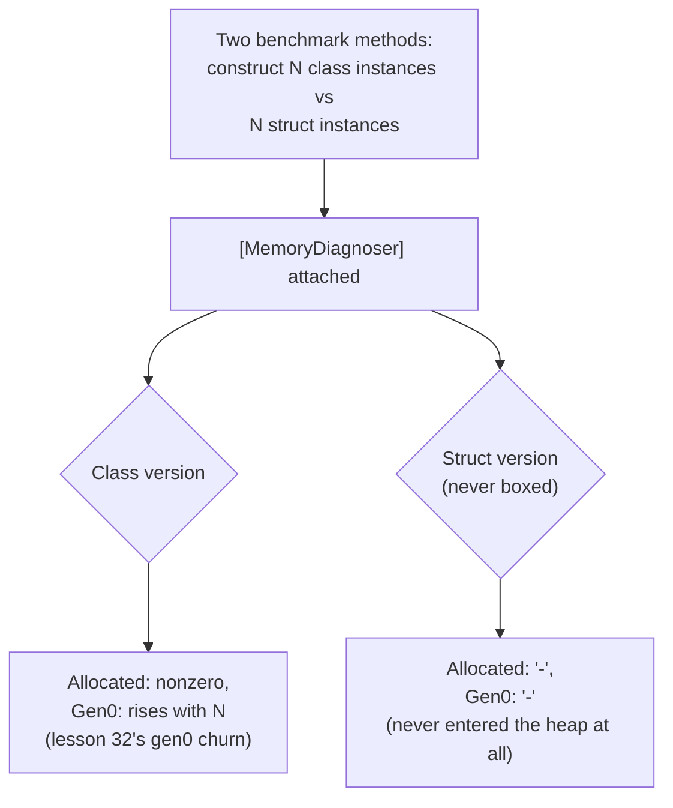

# Lesson 36. Struct vs Class, Measured

**Mission link:** Lesson 1 argued, from how the CLR treats each type, that passing a small struct around can avoid a heap allocation the equivalent class would require. An argument from reasoning is not a measurement, and this lesson is where BenchmarkDotNet turns that argument into an exact, reproducible number, once the harness itself is set up in a way that doesn't lie.
**Primary source:** [Docs: "How BenchmarkDotNet works", BenchmarkDotNet](https://benchmarkdotnet.org/articles/guides/how-it-works.html), [Docs: "Diagnosers", BenchmarkDotNet](https://benchmarkdotnet.org/articles/configs/diagnosers.html)
**Prerequisites:** [Lesson 1](0001-structs-and-classes.md), [Lesson 32](0032-the-managed-heap-and-generations.md), [Lesson 35](0035-stackalloc-and-arraypool.md)

## Warm-up

1. ▢ Per lesson 1, why can passing a small struct around avoid a heap allocation that a class of the same shape requires?

Check

A struct's data is typically stored inline, wherever it's used (the stack, a containing object, an array slot), rather than as a separate object on the managed heap. A class instance always lives on the managed heap, so creating one is always a heap allocation; creating a struct, stored inline, may not need one at all.

2. ▢ Per lesson 35, does a `stackalloc`'d buffer ever get counted the same way a heap allocation does?

Check

No. `stackalloc`'d memory lives on the stack, never enters the managed heap, and is never subject to garbage collection at all, so it's a fundamentally different kind of memory than anything a heap-allocation count would be tracking.

## Know this

### A raw stopwatch loop measures the JIT, not your code

The obvious way to time something in C# is two `Stopwatch` readings around a loop. That number answers a question you didn't ask: the very first calls to any method run before the JIT has finished compiling it, and .NET's tiered compilation means a hot method gets recompiled, more than once, at increasing optimization levels, while your loop is still running. A raw timing loop folds all of this into one number with no way to tell, afterward, how much of it was your code versus the compiler still warming up underneath it.

### BenchmarkDotNet isolates each benchmark and subtracts its own overhead

BenchmarkDotNet's documented approach runs each benchmark in its own isolated, Release-mode process, specifically so one benchmark's JIT and compilation state can't bleed into another's. Within that process, a **Pilot** stage first works out how many invocations produce a measurable duration; then a **Warmup** stage and an **Actual** stage run on an empty method to establish the harness's own overhead, before the same two stages run again on the real benchmark method, with the empty-method overhead subtracted from the result. It also invokes every benchmark method through a delegate rather than calling it directly, specifically because the JIT cannot inline through a delegate call, which is what stops the compiler from optimizing an entire benchmark away by inlining it into code that never really executes it.

### `MemoryDiagnoser` turns lesson 1's claim into an exact byte count

Attaching `[MemoryDiagnoser]` reports the number of bytes a benchmark method allocates per operation, computed via `GC.GetAllocatedBytesForCurrentThread` and documented as 99.5% accurate at default settings. Its `Gen0`/`Gen1`/`Gen2` columns report how many collections of each generation happened per 1,000 operations, the same generational vocabulary lesson 32 already gave you, and a `-` in either column means exactly zero: no allocation, no collection. One documented limit matters directly here: the `Allocated` count covers managed heap memory only. Lesson 35's `stackalloc`'d memory is never counted at all, because it was never on the managed heap `MemoryDiagnoser` is measuring in the first place.

### Applying it to lesson 1's own claim, predicted before it's run

Two benchmark methods, one constructing a small class-typed value N times and returning it, one constructing the struct-typed equivalent the same way: lesson 1 and `MemoryDiagnoser`'s own semantics together predict what each should report, before either is actually run. The class version should report a nonzero `Allocated` figure and a `Gen0` count that rises with the iteration count, since every constructed instance is a fresh object entering generation 0 exactly as lesson 32 described. The struct version, so long as nothing in the benchmark boxes it (assigns it to `object`, for instance), should report `-` in both columns: inline, stack-based data was never a heap-tracked allocation for the diagnoser to see at all. This is a prediction from already-established facts, not a substitute for running it; the exact numbers depend on the struct's actual size and what the surrounding benchmark code does with it, which is why the real-world reps below ask you to run this yourself rather than take a number on faith.

### A benchmark's result has to be consumed, and the environment has to be real

The same discipline that makes the timing trustworthy applies to what the benchmark actually measures: a benchmark method's result has to be returned so BenchmarkDotNet's generated harness code does something with it, since a computed value nothing ever uses is exactly the kind of code a sufficiently aggressive optimizer is free to remove. And the measurement itself is only meaningful under the conditions BenchmarkDotNet already builds for you: Release configuration, no debugger attached. A debug build disables many JIT optimizations outright, and a debugger attached suppresses tiered compilation; running either way doesn't produce a smaller or larger version of the real number, it measures a different, slower thing entirely and calls it your code's performance.

## Practice

1. ▢ A raw `Stopwatch` loop times a method at 50 ns per call on its first 1,000 iterations, then 12 ns per call on the next 1,000. Why does this happen, and what does it say about trusting the first number?

Hint

Think about what the JIT is doing to a method while it's being called repeatedly.

Check

.NET's tiered compilation recompiles a hot method at increasing optimization levels while it keeps running, so the first 1,000 calls include slower, less-optimized code (and possibly the very first, uncompiled calls) while the later calls run against a more optimized version. The first number isn't trustworthy on its own; it's measuring warm-up, not the method's steady-state cost.

2. ▢ Why does BenchmarkDotNet invoke each benchmark method through a delegate instead of calling it directly?

Check

The JIT cannot inline through a delegate call. Calling a benchmark method directly risks the compiler inlining it into surrounding code and optimizing away work the benchmark meant to measure; invoking it through a delegate closes off that path.

3. ▢ A benchmark constructs a small `readonly struct` N times in a loop, never boxes it, and never crosses it through a `Span<T>` or heap-allocating conversion. What would you predict `[MemoryDiagnoser]`'s `Allocated` and `Gen0` columns to show, and why?

Check

Both should show `-`: no allocation, no collection. `MemoryDiagnoser` counts managed heap allocations, and a struct's inline, stack-based data was never placed on the heap in the first place, so there's nothing for `GC.GetAllocatedBytesForCurrentThread` to count, exactly the same reason lesson 35's `stackalloc`'d memory doesn't appear there either.

4. ▢ A benchmark method computes a value but never returns it and never hands it to anything the harness observes. Why is this a problem, independent of whether the JIT actually optimizes the computation away?

Check

A computed value nothing uses is exactly the kind of work a sufficiently aggressive optimizer is free to remove, and whether it actually does so in any given case isn't something to rely on either way. Returning the result (or otherwise having the harness observe it) removes the guess entirely, rather than trusting an optimization decision you don't control and can't predict.

5. ▢ Which claim correctly describes what makes a BenchmarkDotNet result for the struct-vs-class question trustworthy?

    - a) Any `Stopwatch`-based timing loop is equally trustworthy, since the numbers come from the same machine either way
    - b) The benchmark must run in Release configuration without a debugger attached, use BenchmarkDotNet's own harness (which isolates JIT state, subtracts empty-method overhead, and invokes methods through a non-inlinable delegate), and return every computed result so nothing is silently optimized away
    - c) Running under a debugger produces the same numbers, just slightly slower, so it's fine for a quick check
    - d) `MemoryDiagnoser`'s `Allocated` column includes `stackalloc`'d memory, so it fully accounts for every kind of allocation a benchmark might make

Check

**b)** That's the full set of conditions this lesson establishes. (a) is false: a raw stopwatch loop measures JIT warm-up and tiered recompilation folded into the code's own time, which BenchmarkDotNet's harness specifically isolates against. (c) is false: a debugger attached suppresses tiered compilation, measuring a fundamentally different, slower execution mode, not a merely-slower version of the real one. (d) is false: `Allocated` only counts managed heap memory; `stackalloc`'d memory is never included, since it never touches the heap `MemoryDiagnoser` measures.

## Real-world reps

- [ ] Write the two benchmark methods this lesson describes (a small class constructed N times, the struct-typed equivalent constructed the same way), attach `[MemoryDiagnoser]`, and run them yourself. Compare the actual `Allocated` and `Gen0` figures against this lesson's prediction.
- [ ] Take a method you'd normally time with `Stopwatch` and rewrite it as a BenchmarkDotNet benchmark instead. Compare the two numbers, and note how large the gap is between the naive timing and the isolated one.
- [ ] Tomorrow: read the primary source's section on `IterationTime` and the Pilot stage in full, and note what happens to the benchmark's precision if a method's single invocation is too fast for the default settings to measure reliably.

## Going further

- [Docs: "How BenchmarkDotNet works", BenchmarkDotNet](https://benchmarkdotnet.org/articles/guides/how-it-works.html)
- [Docs: "Diagnosers", BenchmarkDotNet](https://benchmarkdotnet.org/articles/configs/diagnosers.html)
- [Resources](../RESOURCES.md)

---

Not landing? Reread the primary source at the top, since this lesson compresses it and compression is where understanding leaks. Check the [glossary](../GLOSSARY.md) for any term that felt slippery.

If the lesson itself is unclear rather than the material, that is a defect: [open an issue](https://github.com/TokenCemetery/teach/issues).
