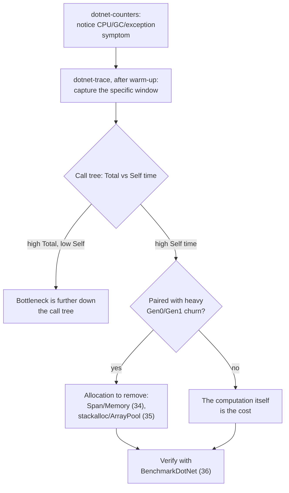

# Lesson 37. Profiling a C# Service

**Mission link:** Stage 8 closes here, and its done-when is optimizing from a profile and defending the win with a trustworthy benchmark. Lesson 36 gave you the benchmark half, proving a change actually helped; this lesson is the profile half, finding what to change in the first place, and the capstone sends a profile's finding back through this stage's own levers rather than a guess.
**Primary source:** [Docs: "Profiling tools in .NET", Microsoft Learn](https://learn.microsoft.com/en-us/dotnet/core/diagnostics/profilers), [Docs: "dotnet-trace", Microsoft Learn](https://learn.microsoft.com/en-us/dotnet/core/diagnostics/dotnet-trace), [Docs: "dotnet-counters", Microsoft Learn](https://learn.microsoft.com/en-us/dotnet/core/diagnostics/dotnet-counters)
**Prerequisites:** [Lesson 36](0036-struct-vs-class-measured.md), [Lesson 33](0033-gc-modes-and-tradeoffs.md), [Lesson 32](0032-the-managed-heap-and-generations.md)

## Warm-up

1. ▢ Per lesson 36, why does timing a method's very first calls give a misleadingly slow number?

Check

The very first calls run before the JIT has finished compiling the method, and .NET's tiered compilation keeps recompiling a hot method at increasing optimization levels while it's still running, so early calls measure warm-up rather than the method's steady-state cost.

2. ▢ Per lesson 33, what's the difference between what `Gen0`/`Gen1` collections cost versus what a `Gen2` collection costs?

Check

Generation 0 and generation 1 collections are cheap and frequent, examining only a small, fast-turning-over set of objects; generation 2 collections are the expensive ones, since they examine everything that's survived long enough to become long-lived.

## Know this

### `dotnet-counters` catches the symptom; `dotnet-trace` finds the cause

**`dotnet-counters`** is a lightweight, ad-hoc health-monitoring tool: attached to a running process, it observes performance counters published via the `EventCounter` or `Meter` API, giving a quick read on CPU usage, GC counts, exception rate, and similar signals, cheaply enough to run continuously. **`dotnet-trace`** is the deeper tool: a cross-platform CLI that collects a diagnostic trace over a window of time, producing a `.nettrace` file openable in Visual Studio, PerfView, or Speedscope, detailed enough to show exactly which call stacks were running when. The documented workflow runs them in that order: `dotnet-counters` first, to notice that something's actually wrong (CPU pegged, GC running constantly), then `dotnet-trace` second, to capture the specific window and find the hot stack behind the symptom `dotnet-counters` already pointed at.

### Sampling is what makes a production trace affordable

`dotnet-trace`'s current default profile combines `dotnet-common` (lightweight GC, loader, JIT, exception and threading events) with `dotnet-sampled-thread-time`, which samples every managed thread's call stack roughly 100 times a second rather than recording every single call and return. This statistical approach costs a small, low overhead, commonly cited around 1-5%, which is exactly why it's the one safe to run against a live production service; a hot method simply shows up in a larger share of the samples. The trade is that a very fast, very short-lived hot path can be sampled too rarely to show up reliably, which is a real limitation to know about rather than a reason to distrust every result.

### Profile after warm-up, for exactly the reason lesson 36 already gave

A trace captured from the moment a service starts mixes JIT compilation and tiered recompilation events into the same window as the code's actual steady-state behavior, the identical problem lesson 36 diagnosed for a raw stopwatch loop, now showing up in a system-level trace instead of a microbenchmark. The fix is the same idea in a different setting: let the service serve real traffic for a while first, so the methods that matter have already reached their optimized tier, and only then start the capture window that's meant to represent steady-state behavior.

### The GC profiles turn stage 8's own vocabulary into a live trace

`dotnet-trace` offers dedicated profiles for exactly the concepts this stage has been building: `gc-verbose` tracks garbage collections and samples object allocations, while `gc-collect` tracks collections only, at very low overhead. Either one turns lesson 32's abstract "an object is allocated into generation 0, and might get promoted" story into a timestamped record of when collections of each generation actually happened in a running service, and can confirm or contradict a workstation-versus-server GC choice (lesson 33) with real evidence instead of reasoning about it in the abstract.

### Total time versus self time decides where a finding actually points

A call-tree view built from a trace reports, for each method, **Total** time (time spent in that method, including everything it calls) and **Self** time (time spent in the method's own code, excluding its callees). A method with high Total but low Self is a thin wrapper around something expensive further down the tree; the fix belongs to whatever it calls, not to the wrapper itself. A method with high Self time is where the actual work is happening, and that's the finding worth sending back through this stage's own levers: high self time paired with heavy `Gen0` churn points at an allocation to remove (lesson 34's `Span<T>`, or lesson 35's `stackalloc`/`ArrayPool<T>`), high self time with no allocation signal at all points at the computation itself, and either way, lesson 36's `BenchmarkDotNet` is what proves the fix actually helped before it ships.

## Practice

1. ▢ `dotnet-counters` shows a service's GC-related counters climbing steadily under normal load. What's the documented next step, and why not skip straight to reading a call tree?

Check

The next step is `dotnet-trace`, capturing a targeted window (with a GC-specific profile like `gc-verbose` or `gc-collect`) to find the actual hot stack behind the symptom. Skipping straight to a call tree without first confirming there's a real symptom risks profiling a healthy system and chasing noise; `dotnet-counters` is what establishes there's something worth a deeper, more expensive trace in the first place.

2. ▢ Why does `dotnet-trace`'s default sampled-thread-time profile cost only about 1-5% overhead, and what's the real cost of that cheapness?

Check

It samples call stacks statistically, roughly 100 times a second, rather than recording every call and return, so the overhead is bounded and small regardless of how much code actually runs. The real cost is that a very fast, short-lived hot path can be sampled too rarely to show up reliably in the results, an undercount rather than a false result.

3. ▢ A trace captured starting from the moment a service process launches shows unusually high JIT and compilation activity in its first few seconds. Is this a performance bug in the service's own code?

Check

Not necessarily, and probably not: that activity is the same tiered-compilation warm-up lesson 36 already described for a microbenchmark, now visible in a system-level trace. A trace meant to represent steady-state behavior should start capturing after the service has already served real traffic for a while, past that warm-up window, not from process launch.

4. ▢ A call tree shows `ProcessOrder` with high Total time but low Self time, and `ProcessOrder` calls `SerializeToJson`, which has high Self time. Where does the actual fix belong?

Check

With `SerializeToJson`. High Total but low Self on `ProcessOrder` means it's a thin wrapper spending most of its time in what it calls, not doing expensive work itself; `SerializeToJson`'s high Self time is where the actual computation is happening, and that's the method worth investigating further.

5. ▢ **Stage capstone.** A trace shows a method with high Self time, paired with a `gc-verbose` capture showing heavy `Gen0` collection activity concentrated in calls to that same method. Walk through, using this stage's own lessons, what you'd check and in what order before proposing a fix.

Check

First, confirm the allocation is real and sizeable: attach `[MemoryDiagnoser]` (lesson 36) to a BenchmarkDotNet benchmark isolating that method, and read its `Allocated`/`Gen0` columns to get an exact, reproducible number rather than trusting the trace's sampled view alone. Second, ask whether the allocated data could avoid the heap entirely: could it be a `Span<T>` view over existing memory, or a small, bounded, method-local buffer suited to `stackalloc` (lessons 34 and 35), rather than a fresh heap object every call? Third, if the buffer must survive past this method or is too large for the stack, reach for `ArrayPool<T>` (lesson 35) instead of a fresh array every time. Fourth, only after removing what allocation can genuinely be removed, check whether the remaining collection cost is actually a GC-mode question (lesson 33): is this workload sharing a host with other processes in a way that makes server GC's own threads contend, or would background GC already be smoothing out the pause this trace is showing? Finally, benchmark the change (lesson 36) to prove the fix actually reduced `Allocated` and improved the timing, rather than assuming it did because the reasoning sounded right.

## Real-world reps

- [ ] Run `dotnet-counters monitor` against a running C# service you have access to, and note which counters (CPU, GC, exceptions, or a custom one) look worth investigating further.
- [ ] Capture a `dotnet-trace` session against that same service using the `gc-verbose` profile, after letting it handle some real traffic first, and find the method with the highest Self time in the resulting call tree.
- [ ] Tomorrow: for whatever method you found, decide which of this stage's levers (lesson 33's GC mode, lesson 34's `Span<T>`/`Memory<T>`, lesson 35's `stackalloc`/`ArrayPool<T>`) actually applies, and verify any fix with a BenchmarkDotNet benchmark (lesson 36) before treating it as done.

## Going further

- [Docs: "Profiling tools in .NET", Microsoft Learn](https://learn.microsoft.com/en-us/dotnet/core/diagnostics/profilers)
- [Docs: "dotnet-trace", Microsoft Learn](https://learn.microsoft.com/en-us/dotnet/core/diagnostics/dotnet-trace)
- [Docs: "dotnet-counters", Microsoft Learn](https://learn.microsoft.com/en-us/dotnet/core/diagnostics/dotnet-counters)
- [Resources](../RESOURCES.md)

---

Not landing? Reread the primary source at the top, since this lesson compresses it and compression is where understanding leaks. Check the [glossary](../GLOSSARY.md) for any term that felt slippery.

If the lesson itself is unclear rather than the material, that is a defect: [open an issue](https://github.com/TokenCemetery/teach/issues).
