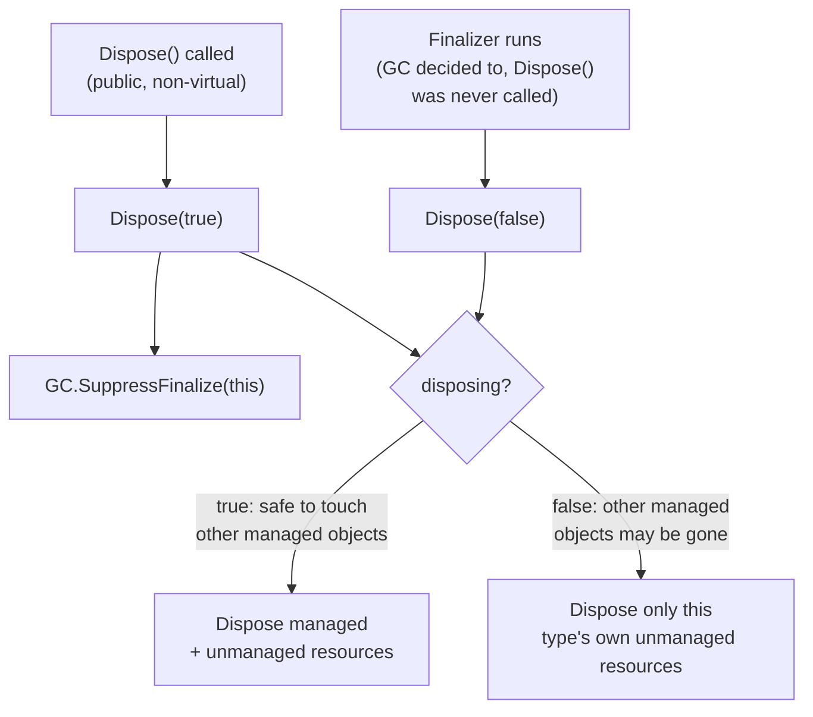

# Lesson 38. IDisposable and IAsyncDisposable

**Mission link:** Lesson 6 taught `using` from the consumer's side: dispose whatever the block acquired, deterministically. Lesson 26 taught that a DI container disposes what it creates, and that a resolved dependency should never be disposed by the code that received it. Neither lesson taught the other half: what a type actually has to implement to make `using` (or a container's own cleanup) safe to call more than once, safe to run from a finalizer, and safe to `await`. That's this lesson.
**Primary source:** [Docs: "Implement a Dispose method", Microsoft Learn](https://learn.microsoft.com/en-us/dotnet/standard/garbage-collection/implementing-dispose), [Docs: "Implement a DisposeAsync method", Microsoft Learn](https://learn.microsoft.com/en-us/dotnet/standard/garbage-collection/implementing-disposeasync)
**Prerequisites:** [Lesson 6](0006-exceptions.md), [Lesson 26](0026-dependency-injection.md)

## Warm-up

1. ▢ Per lesson 6, what does a `using` statement guarantee, even when an exception is thrown inside the block?

Check

The acquired `IDisposable` instance is disposed when control leaves the block, including when it leaves because an exception was thrown, not only on the normal path out.

2. ▢ Per lesson 26, who is responsible for disposing a service the DI container resolved, and who should never do it?

Check

The container is responsible for cleanup of the types it creates, disposing transient and scoped instances at the end of their scope and singletons at shutdown. A service resolved from the container should never be disposed by the code that received it, even if that dependency is itself `IDisposable`.

## Know this

### The full pattern has two methods, and only one of them does the actual work

The documented shape is a public, non-virtual, parameterless `Dispose()` that calls a `protected virtual void Dispose(bool disposing)`, then calls `GC.SuppressFinalize(this)`. `Dispose()` itself never contains cleanup logic; `Dispose(bool disposing)` holds all of it, guarded by a flag so a second call is a safe no-op rather than a double-free. This split exists so a derived class can override `Dispose(bool disposing)` to add its own cleanup while still going through the same public entry point every caller already knows how to use.

### The `disposing` parameter says who's calling, and that changes what's safe to touch

`disposing` is `true` when the call came from `Dispose()` itself (a deliberate, ordinary call) and `false` when it came from a finalizer. Inside the `true` branch, it's safe to dispose other managed objects this instance holds, since they're still guaranteed to be alive. Inside the `false` branch, it isn't: a finalizer runs at a nondeterministic time the garbage collector chose, and any other managed objects this instance references may already have been finalized themselves by then, so a finalizer-driven `Dispose(bool disposing)` call only ever touches the type's own unmanaged resources, never other managed objects.

### A finalizer is a rare, last-resort safety net, not a default

A finalizer is only worth adding when a class directly owns an unmanaged resource (a raw handle, not merely a field that happens to be `IDisposable`), and its entire job is to call `Dispose(false)` as a fallback for the case where nobody ever called `Dispose()` at all. By default, the collector calls a finalizer before reclaiming an object's memory; calling `GC.SuppressFinalize(this)` inside a well-behaved `Dispose()` call tells the collector that cleanup already happened deliberately, so it can skip that step entirely for this instance. A type with no finalizer gains nothing from calling `GC.SuppressFinalize`, and most types, holding only other managed, already-disposable resources, never need a finalizer at all.

### `IAsyncDisposable` adds one more method, and one deliberate difference

For a class that could be a base class, the async pattern adds `protected virtual ValueTask DisposeAsyncCore()`, holding the asynchronous cleanup of managed resources. The public `DisposeAsync()` awaits `DisposeAsyncCore()`, then calls `Dispose(false)`, **not** `Dispose(true)`, then `GC.SuppressFinalize(this)`. That's deliberate: `DisposeAsyncCore` already disposed managed resources asynchronously, so the synchronous `Dispose(bool disposing)` call afterward should only reach the unmanaged-resource branch, the same one a finalizer would use, not repeat the managed cleanup a second time. A sealed class skips `DisposeAsyncCore` entirely and does its async cleanup directly inside `DisposeAsync()`, since nothing can derive from it to need the extra override point.

### Idempotency and cascading are requirements, not suggestions

Both `Dispose()` and `DisposeAsync()` must tolerate being called more than once: every call after the first must be a silent no-op (a completed `ValueTask` for the async case), never an exception. And an object holding other disposable objects has to cascade the call: if A holds B and B holds C, disposing A must dispose B, which must dispose C, and a type must also dispose its base class if the base itself implements the interface. This is the same responsibility lesson 26 described from the container's side, now seen from the type author's side: something has to actually walk that chain, and it's whichever `Dispose`/`DisposeAsync` implementation sits at the top of it.

## Practice

1. ▢ Why does `Dispose()` itself never contain the actual cleanup logic?

Hint

Think about what a derived class needs to be able to override, and what every caller needs to stay the same.

Check

The cleanup logic lives in `protected virtual void Dispose(bool disposing)` so a derived class can override it and add its own cleanup, while `Dispose()` stays a fixed, non-virtual entry point every caller already knows how to call. Splitting the two lets the pattern extend through inheritance without changing the public contract.

2. ▢ A finalizer calls `Dispose(true)` instead of `Dispose(false)`. What could go wrong?

Check

The `true` branch assumes it's safe to touch other managed objects this instance holds, but a finalizer runs at a nondeterministic time the garbage collector chose, and those other managed objects may already have been finalized themselves by then. Calling `Dispose(true)` from a finalizer risks touching objects that no longer exist in a valid state, which is exactly why the finalizer must pass `false` instead.

3. ▢ A class holds only other `IDisposable` fields (no raw unmanaged handle of its own) and adds a finalizer anyway, "just in case." What's wrong with this?

Check

A finalizer is only useful when a class directly owns an unmanaged resource; a class holding only other managed, already-disposable objects gains nothing from one, since those objects have (or should have) their own cleanup path. Adding a needless finalizer costs the object an extra step before the collector can reclaim it, for no benefit, which is why the guidance limits finalizers to the case that actually needs one.

4. ▢ Why does `DisposeAsync()` call `Dispose(false)` rather than `Dispose(true)` after awaiting `DisposeAsyncCore()`?

Check

`DisposeAsyncCore()` already handled the asynchronous cleanup of managed resources, so calling `Dispose(true)` afterward would repeat that managed-resource cleanup a second time. Passing `false` routes the call to only the unmanaged-resource branch, the same one a finalizer would use, avoiding the duplicate work.

5. ▢ Which claim correctly describes what `Dispose()`/`DisposeAsync()` must do when called a second time?

    - a) Throw an exception, since disposing an already-disposed object is a programming error that should be surfaced
    - b) Silently do nothing on every call after the first, never throwing, for both the synchronous and asynchronous methods
    - c) Re-run the full cleanup logic again each time, since re-disposing the same object is harmless
    - d) Only `DisposeAsync()` needs to tolerate repeated calls; `Dispose()` may throw

Check

**b)** Idempotency is a requirement for both: every call after the first must be a safe no-op, a completed `ValueTask` in the async case, never an exception. (a) and (d) both get the requirement backwards. (c) is wrong in a different way: re-running cleanup logic risks operating on already-freed or already-disposed resources, which is exactly the double-free the `_disposed` guard exists to prevent.

## Real-world reps

- [ ] Find a class in code you have access to that implements `IDisposable`. Check whether it follows the full pattern (a `Dispose(bool disposing)` overload, a `_disposed` guard) or just puts cleanup directly in `Dispose()`, and decide whether the simpler version is actually safe for that class (no finalizer, sealed, no derived classes to support).
- [ ] Find (or write) a class holding several other `IDisposable` fields. Confirm its `Dispose` (or `DisposeAsync`) actually disposes each of them, cascading the call the way this lesson describes.
- [ ] Tomorrow: read the primary source's guidance on when a finalizer is and isn't needed, and check whether any class you maintain has one it doesn't actually need.

## Going further

- [Docs: "Implement a Dispose method", Microsoft Learn](https://learn.microsoft.com/en-us/dotnet/standard/garbage-collection/implementing-dispose)
- [Docs: "Implement a DisposeAsync method", Microsoft Learn](https://learn.microsoft.com/en-us/dotnet/standard/garbage-collection/implementing-disposeasync)
- [Resources](../RESOURCES.md)

---

Not landing? Reread the primary source at the top, since this lesson compresses it and compression is where understanding leaks. Check the [glossary](../GLOSSARY.md) for any term that felt slippery.

If the lesson itself is unclear rather than the material, that is a defect: [open an issue](https://github.com/TokenCemetery/teach/issues).
