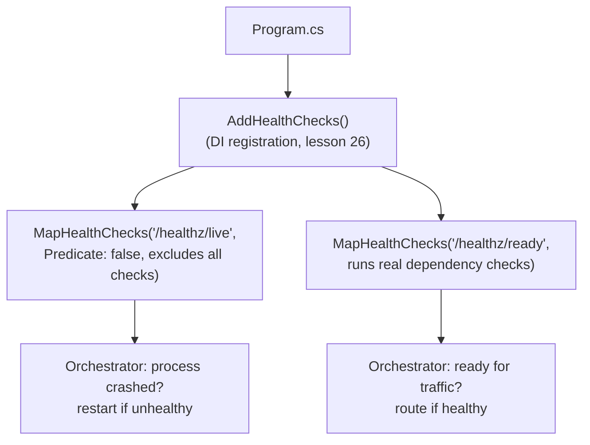

# Lesson 39. Logging and Health Checks

**Mission link:** Lesson 29 shipped a typed, tested ASP.NET Core backend, and stage 6 ended there. But a service nobody can observe while it runs, and that infrastructure can't ask "are you actually working," isn't operable yet, only built. This lesson covers the two most basic operability questions: what happened (`ILogger`'s structured logging), and is this instance actually able to serve traffic right now (health checks), wired in with the same `AddX`/`MapX` vocabulary lessons 25 and 26 already taught.
**Primary source:** [Docs: "Logging in .NET and ASP.NET Core", Microsoft Learn](https://learn.microsoft.com/en-us/aspnet/core/fundamentals/logging/), [Docs: "Health checks in ASP.NET Core", Microsoft Learn](https://learn.microsoft.com/en-us/aspnet/core/host-and-deploy/health-checks)
**Prerequisites:** [Lesson 25](0025-routing-and-middleware.md), [Lesson 26](0026-dependency-injection.md)

## Warm-up

1. ▢ Per lesson 26, what's the difference between `AddScoped` and `AddSingleton` in terms of when the container creates and disposes an instance?

Check

A scoped service is created once per scope (typically once per request) and disposed at the end of that scope; a singleton is created once for the whole application and disposed at shutdown.

2. ▢ Per lesson 25, what decides which of several registered endpoints handles a given request?

Check

Route template precedence: more segments, a literal segment over a parameter, and a constrained parameter over an unconstrained one, rather than the order the endpoints were registered in.

## Know this

### An `ILogger<T>`'s category is what makes a flood of log lines searchable

Injecting `ILogger<T>` (the same constructor-injection lesson 26 already taught, just for a framework-provided service instead of one of your own) gives a logger whose **category** is `T`'s full type name, attached to every entry it writes. That category is what lets a production log search narrow down to "everything `OrderService` logged" instead of scrolling through an entire service's undifferentiated output; it's the practical reason to inject `ILogger<OrderService>` into `OrderService` rather than passing around one shared, uncategorized logger.

### A log level is a filter, and it's configuration, not code

Each log call states a severity: `Trace`, `Debug`, `Information`, `Warning`, `Error`, `Critical` (and `None` to suppress everything). The minimum level that actually gets emitted is a configuration value, exactly lesson 27's own vocabulary: a provider can set a different minimum per environment (verbose `Debug` output locally, `Warning` and above in production) without touching a single logging call in the code, the same environment-driven behavior lesson 27 already described for ordinary settings.

### A message template is structured data, not an interpolated string

`_logger.LogInformation("Getting user {UserId}", userId)` looks like it could have been written `_logger.LogInformation($"Getting user {userId}")`, and the two look almost identical, but they are not the same thing. The first passes a **template** (a fixed string with named placeholders) and the value separately; a structured logging provider keeps `UserId` as its own named property in the emitted log entry, queryable on its own. The second collapses everything into one flat string at the call site, before the logger ever sees it, destroying the structure a log backend could otherwise search or filter on. This is the habit most worth unlearning from ordinary string formatting: the template's placeholders are property names, not just fill-in-the-blank text, and only the template form keeps them queryable.

### Liveness and readiness are different questions, and conflating them causes real restarts

**Readiness** answers "is this instance ready to receive requests right now"; **liveness** answers "has this process crashed and does it need to be restarted." The documentation's own example is exactly why the split matters: an app that has to download a large configuration file before it can serve traffic should report readiness as unhealthy until that download finishes, without reporting liveness as unhealthy at all, since the process itself hasn't crashed, it's just not ready yet. An orchestrator (Kubernetes is the documented example) uses readiness to decide whether to route traffic to an instance, and liveness to decide whether to kill and restart it; if a slow, still-in-progress startup dependency is allowed to fail the liveness check too, the orchestrator restarts a process that was never actually broken, and the new instance hits the exact same slow startup all over again.

### Wiring both in is `AddX` then `MapX`, the same pattern lessons 25 and 26 already taught

Health checks are registered with `AddHealthChecks()` (a DI registration, lesson 26's own vocabulary) and exposed with `MapHealthChecks()` (an endpoint, lesson 25's own routing vocabulary), typically as two separate mapped paths, one for liveness and one for readiness, with the liveness endpoint configured to exclude every other check (returning `false` from `HealthCheckOptions.Predicate`) so a slow dependency can only ever fail readiness, never liveness. Nothing about this is a new mechanism; it's stage 6's own registration-and-routing pattern, applied to the specific, operationally critical purpose of answering "is this instance up" from outside the process.

## Practice

1. ▢ A class injects a shared, uncategorized `ILogger` instance instead of `ILogger<T>` for its own type. What does this cost in a production log search?

Hint

Think about what the category actually attaches to each entry.

Check

Without a category tied to the specific class, every entry from every class sharing that logger looks the same in a search, so there's no way to narrow a query down to just one class's output. `ILogger<T>`'s category, `T`'s type name, is exactly what makes that kind of filtering possible.

2. ▢ Why does setting a service's minimum log level to `Warning` in production, while leaving it at `Debug` locally, not require changing a single `_logger.LogDebug(...)` call anywhere in the code?

Check

The minimum level is a configuration value, read the same way lesson 27 described for any other setting, and it decides what actually gets emitted at each environment without the calling code needing to know or care what environment it's running in. The `LogDebug` calls stay exactly as written; the configured minimum just decides whether they're ever actually written out.

3. ▢ `_logger.LogInformation($"User {userId} logged in")` and `_logger.LogInformation("User {UserId} logged in", userId)` produce visually similar output. What's the actual difference in what gets logged?

Check

The interpolated version collapses everything into one flat string before the logger ever sees it, so a structured logging backend has no way to query on the user ID specifically; it's just part of an opaque message. The template version keeps `UserId` as a separate, named property in the structured log entry, queryable on its own independent of the surrounding text.

4. ▢ A service needs to download a large configuration file before it can serve requests. While that download is still in progress, what should its liveness check report, and what should its readiness check report?

Check

Liveness should report healthy: the process itself hasn't crashed, it's simply not finished starting up. Readiness should report unhealthy until the download completes, since the instance genuinely isn't ready to serve requests yet. Reporting liveness as unhealthy here would cause an orchestrator to restart a process that was never actually broken, and the replacement would hit the same slow download again.

5. ▢ Which claim correctly describes how health checks should be wired for a service with a slow-starting dependency?

    - a) A single health check endpoint should report both liveness and readiness identically, since they answer the same question
    - b) The liveness endpoint should exclude every other check (so only a real process crash fails it), while the readiness endpoint runs the real dependency checks, so a slow-but-not-broken startup fails readiness without triggering a restart
    - c) Liveness should always be reported healthy no matter what, since restarts are always undesirable
    - d) Readiness checks are only useful in Kubernetes and don't apply to any other deployment target

Check

**b)** That's the split this lesson establishes, and the documented reason for it. (a) is false: conflating the two is exactly what causes an unnecessary restart loop for a slow-but-healthy startup. (c) is false: liveness still needs to report unhealthy for an actual crash, or a genuinely dead process would never get restarted at all. (d) is false: the liveness/readiness distinction is useful anywhere an orchestrator or load balancer decides whether to route traffic versus whether to restart a process, Kubernetes is just the documented example.

## Real-world reps

- [ ] For a service you have access to, check whether its classes inject `ILogger<T>` per class or share one uncategorized logger, and whether its log calls use message templates or string interpolation.
- [ ] Check whether that same service exposes separate liveness and readiness endpoints, and if it has only one, work out what would happen to it during a slow dependency startup.
- [ ] Tomorrow: read the primary source's section on custom `IHealthCheck` implementations, and note what a readiness check for a database dependency would actually need to verify beyond "the connection string is configured."

## Going further

- [Docs: "Logging in .NET and ASP.NET Core", Microsoft Learn](https://learn.microsoft.com/en-us/aspnet/core/fundamentals/logging/)
- [Docs: "Logging in C#", Microsoft Learn](https://learn.microsoft.com/en-us/dotnet/core/extensions/logging/overview)
- [Docs: "Health checks in ASP.NET Core", Microsoft Learn](https://learn.microsoft.com/en-us/aspnet/core/host-and-deploy/health-checks)
- [Resources](../RESOURCES.md)

---

Not landing? Reread the primary source at the top, since this lesson compresses it and compression is where understanding leaks. Check the [glossary](../GLOSSARY.md) for any term that felt slippery.

If the lesson itself is unclear rather than the material, that is a defect: [open an issue](https://github.com/TokenCemetery/teach/issues).
