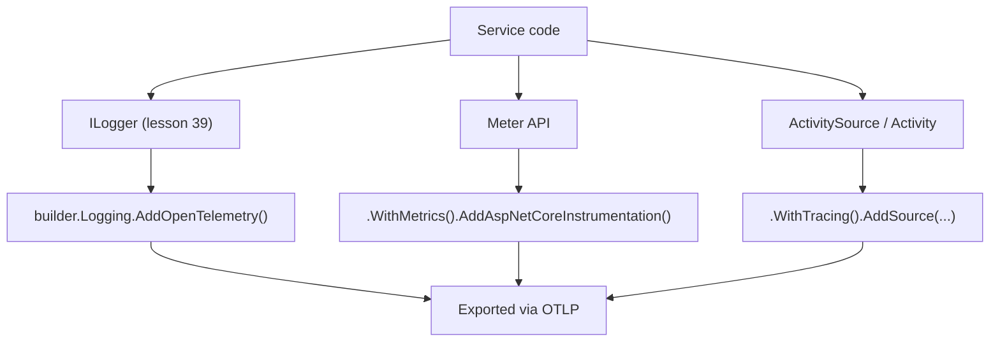

# Lesson 40. OpenTelemetry

**Mission link:** Lesson 39 taught `ILogger` as one operability signal on its own. **OpenTelemetry** is the framework that ties logs together with the other two pillars of observability, metrics and traces, and the fact worth knowing before anything else: .NET already has platform APIs for all three (`ILogger`, the `Meter` API, `Activity`/`ActivitySource`), so OpenTelemetry's job here is to export what's already being emitted, not hand you a new instrumentation API to learn from scratch.
**Primary source:** [Docs: ".NET Observability with OpenTelemetry", Microsoft Learn](https://learn.microsoft.com/en-us/dotnet/core/diagnostics/observability-with-otel), [Docs: "Add distributed tracing instrumentation", Microsoft Learn](https://learn.microsoft.com/en-us/dotnet/core/diagnostics/distributed-tracing-instrumentation-walkthroughs)
**Prerequisites:** [Lesson 39](0039-logging-and-health-checks.md), [Lesson 26](0026-dependency-injection.md)

## Warm-up

1. ▢ Per lesson 39, what does an `ILogger<T>`'s category attach to every entry it writes?

Check

`T`'s full type name, which is what lets a log search narrow down to everything one specific class logged, rather than scrolling through an entire service's undifferentiated output.

2. ▢ Per lesson 26, what registration pattern turns a type into something the container will construct and inject for you?

Check

Calling one of the `AddX` registration methods (`AddScoped`, `AddSingleton`, `AddTransient`) against the service collection, which is what makes the type available to be resolved and injected elsewhere.

## Know this

### .NET already has the three pillars built in; OpenTelemetry exports them

Logs, metrics, and distributed tracing together are described as the three pillars of observability. Most platforms need OpenTelemetry to hand library authors a brand-new instrumentation API before any of this works; .NET already has all three natively, `Microsoft.Extensions.Logging.ILogger` for logs (lesson 39, unchanged), the `Meter` API for metrics, and `System.Diagnostics.Activity`/`ActivitySource` for traces. Telemetry can come from the .NET runtime itself (the garbage collector, the JIT), from libraries like Kestrel and `HttpClient`, and from a service's own code, all through the same platform APIs. OpenTelemetry's role in .NET is specifically to collect and export what these APIs already emit, not to replace them.

### `ActivitySource` is a Tracer, and `Activity` is a Span, by another name

Applications add tracing instrumentation with `System.Diagnostics.ActivitySource` and `System.Diagnostics.Activity`. In OpenTelemetry's own vocabulary, `ActivitySource` is the implementation of what the spec calls a **Tracer**, and `Activity` is the implementation of what it calls a **Span**. The documentation is explicit about why the names differ: .NET's `Activity` type predates the OpenTelemetry specification, and the original .NET naming was kept for consistency within the .NET ecosystem rather than renamed to match the spec. Worth knowing both directions: reading generic OpenTelemetry material, translate Tracer/Span to `ActivitySource`/`Activity`; reading .NET-specific docs, the reverse.

### Tracing costs close to nothing when nobody's listening

`ActivitySource.StartActivity()` checks, internally, whether any listener is actually registered and interested in recording the activity. If there are no listeners, or none interested, it returns `null` and skips creating the `Activity` object entirely, a documented performance optimization for code that calls it frequently. This is a real guarantee, not an assumption: instrumentation left in a hot path costs essentially nothing until an exporter is actually configured and listening, which is exactly what makes it safe to instrument liberally rather than sparingly.

### Wiring all three in is the same `AddX` pattern, once more

A concrete ASP.NET Core setup wires logs with `builder.Logging.AddOpenTelemetry()`, metrics with `.WithMetrics().AddAspNetCoreInstrumentation()` (plus any custom `Meter`s), and traces with `.WithTracing().AddAspNetCoreInstrumentation().AddHttpClientInstrumentation().AddSource(...)` for a custom `ActivitySource`, then exports everything via OTLP. None of this is a new registration mechanism; it's lesson 26's own `AddX` vocabulary and lesson 39's health-check wiring pattern, applied a third time to a telemetry pipeline instead of a DI service or an endpoint.

### A documented footgun: disposing the provider too early stops collection silently

The official guidance warns specifically against disposing a `TracerProvider` instance too early: doing so causes every activity started afterward to simply not be collected, with no exception and no visible symptom besides traces that quietly stop appearing. This is exactly the class of bug this whole arc has been teaching readers to name rather than merely notice: code that compiles, runs, and produces no error, while silently doing less than it looks like it does.

## Practice

1. ▢ A team new to .NET assumes OpenTelemetry requires rewriting every log call and every method boundary to use a brand-new instrumentation API. What's wrong with that assumption?

Hint

Think about what APIs .NET already ships, versus what OpenTelemetry's job actually is on this platform.

Check

.NET already has native APIs for all three pillars: `ILogger` for logs (unchanged from lesson 39), the `Meter` API for metrics, and `Activity`/`ActivitySource` for traces. OpenTelemetry's role here is to collect and export what these existing APIs already emit, not to replace them with a new instrumentation API to adopt.

2. ▢ Reading a generic OpenTelemetry tutorial that talks about a "Tracer" creating a "Span," what are the equivalent .NET types?

Check

`ActivitySource` is the Tracer, and `Activity` is the Span. .NET's `Activity` type predates the OpenTelemetry specification, so the original naming was kept for ecosystem consistency rather than renamed to match the spec's vocabulary.

3. ▢ A method calls `ActivitySource.StartActivity()` on every invocation, in a hot path, before any exporter has been configured for the service. What does this cost?

Check

Close to nothing: `StartActivity()` checks whether any listener is registered and interested, and with none configured it returns `null` and skips creating the `Activity` object entirely. This documented optimization is exactly what makes it safe to instrument a hot path liberally before deciding whether anything is actually listening.

4. ▢ A service disposes its `TracerProvider` early in `Program.cs`'s startup, before the host actually starts serving requests. What happens to traces from activities started afterward, and how would this show up in practice?

Check

Every activity started after the provider is disposed simply isn't collected, with no exception thrown and no obvious error anywhere. In practice, it would show up as traces quietly missing from whatever backend they're exported to, with nothing in the application's own logs pointing at the cause.

5. ▢ Which claim correctly describes wiring OpenTelemetry into an ASP.NET Core service?

    - a) Logs, metrics, and traces each need an entirely separate, unrelated registration mechanism with no shared pattern
    - b) Logs, metrics, and traces are each wired in with the same AddX registration pattern lessons 25, 26, and 39 already used, applied to `builder.Logging`, `.WithMetrics()`, and `.WithTracing()` respectively
    - c) Configuring OpenTelemetry replaces `ILogger` with a new logging API
    - d) Tracing must be avoided in hot paths because `ActivitySource.StartActivity()` always allocates an `Activity` object regardless of whether anything is listening

Check

**b)** That's the actual wiring pattern, and it deliberately reuses vocabulary this arc already taught rather than introducing something unrelated. (a) is false: all three follow the same registration shape. (c) is false: `ILogger` stays exactly as lesson 39 taught it; OpenTelemetry adds an export pipeline on top. (d) is false: `StartActivity()` returns `null` and skips allocation when nothing is listening, which is the documented reason it's safe to leave in a hot path.

## Real-world reps

- [ ] For a service you have access to, check whether it wires up OpenTelemetry for all three pillars or just one (commonly logs alone), and whether `AddAspNetCoreInstrumentation()` is present for the other two.
- [ ] Find a custom `ActivitySource` in code you have access to (or write one), and confirm for yourself that `StartActivity()` returns `null` when no listener is configured, by checking its return value before and after wiring up an exporter.
- [ ] Tomorrow: read the primary source's OTLP example in full, and note which environment variables control where traces, metrics, and logs are actually exported to.

## Going further

- [Docs: ".NET Observability with OpenTelemetry", Microsoft Learn](https://learn.microsoft.com/en-us/dotnet/core/diagnostics/observability-with-otel)
- [Docs: "Add distributed tracing instrumentation", Microsoft Learn](https://learn.microsoft.com/en-us/dotnet/core/diagnostics/distributed-tracing-instrumentation-walkthroughs)
- [Docs: "Example: Use OpenTelemetry with OTLP and the standalone Aspire Dashboard", Microsoft Learn](https://learn.microsoft.com/en-us/dotnet/core/diagnostics/observability-otlp-example)
- [Resources](../RESOURCES.md)

---

Not landing? Reread the primary source at the top, since this lesson compresses it and compression is where understanding leaks. Check the [glossary](../GLOSSARY.md) for any term that felt slippery.

If the lesson itself is unclear rather than the material, that is a defect: [open an issue](https://github.com/TokenCemetery/teach/issues).
