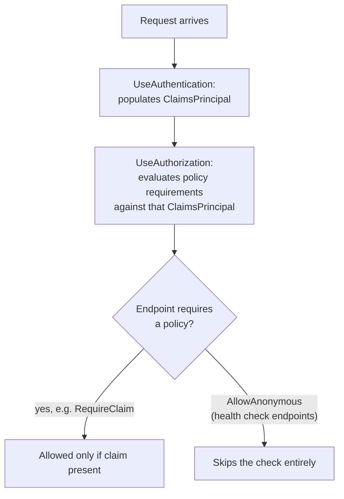

# Lesson 41. Authentication and Authorization

**Mission link:** A typed, tested, observable, health-checked service is still open to anyone who can reach it until this lesson. **Authentication** and **authorization** are documented as two separate, distinct concerns, even though the second depends on the first, and getting that distinction right is what makes lesson 39's health-check endpoints (which nothing ever authenticates against) work at all once the rest of the service requires a real identity.
**Primary source:** [Docs: "Overview of ASP.NET Core Authentication", Microsoft Learn](https://learn.microsoft.com/en-us/aspnet/core/security/authentication/), [Docs: "Introduction to authorization in ASP.NET Core", Microsoft Learn](https://learn.microsoft.com/en-us/aspnet/core/security/authorization/introduction), [Docs: "Policy-based authorization in ASP.NET Core", Microsoft Learn](https://learn.microsoft.com/en-us/aspnet/core/security/authorization/policies)
**Prerequisites:** [Lesson 25](0025-routing-and-middleware.md), [Lesson 39](0039-logging-and-health-checks.md)

## Warm-up

1. ▢ Per lesson 25, what decides whether a middleware placed later in the pipeline can see something a middleware placed earlier already established?

Check

Position in the pipeline: a middleware can only see or use what an earlier middleware already set up, since the pipeline runs in the order it was added, each middleware wrapping the ones after it.

2. ▢ Per lesson 39, what's the difference between what a liveness check and a readiness check each answer?

Check

Liveness answers whether the process has crashed and needs restarting; readiness answers whether the instance is ready to receive requests right now. A slow-starting dependency should fail readiness without failing liveness.

## Know this

### Authentication establishes who; authorization decides what they can do, and the two are documented as separate

**Authentication** is responsible for producing a `ClaimsPrincipal`, the identity authorization then makes decisions against. **Authorization** is explicitly documented as separate and distinct from authentication, even though it relies on an authentication mechanism to have an identity to evaluate in the first place. Registering `AddAuthentication()` answers "who is this," and `AddAuthorization()` (plus whatever policies it configures) answers "is this identity allowed to do the specific thing it's asking to do." Conflating the two is a real habit worth naming: a service can correctly identify a caller and still have to make a completely separate decision about what that caller is permitted to do.

### Middleware order matters here exactly the way lesson 25 already taught

`UseAuthentication` has to run before any middleware that depends on the request already having an authenticated user, the same positional rule lesson 25 taught for routing and endpoint middleware generally: what a later middleware can see depends entirely on what an earlier one already established. Authorization checks that run before authentication has populated the `ClaimsPrincipal` have nothing to evaluate; the pipeline's order is not a formality, it's what makes the identity available at all by the time a permission decision needs it.

### Policies bundle requirements, and a policy is what an endpoint actually asks for

Authorization uses a policy-based model: a **policy** bundles one or more requirements, and a **handler** evaluates a user's claims against those requirements. An endpoint (or controller, or Razor page) asks for a specific policy with `[Authorize(Policy = "...")]` or, for a mapped endpoint, `RequireAuthorization(...)`, rather than hardcoding a permission check inline. This is the same shift lesson 4 already argued for a method signature: declaring what's actually required (a named policy) instead of embedding the check's logic at every call site that needs it.

### The simplest policy just checks whether a claim is present

Claims-based authorization's simplest form checks only for the presence of a specific claim, not its value: `builder.Services.AddAuthorizationBuilder().AddPolicy("EmployeeOnly", policy => policy.RequireClaim("EmployeeNumber"))` grants access to anyone whose `ClaimsPrincipal` carries an `EmployeeNumber` claim at all, whatever it's set to. More elaborate policies can require a claim to carry a specific value, or combine several requirements, but the presence check is the base case worth knowing first, since it's the one most policies in practice actually reduce to.

### `AllowAnonymous` is the deliberate override lesson 39's health checks need

Once a service requires authorization by default, every mapped endpoint inherits that requirement, including a health-check endpoint an orchestrator hits without ever authenticating at all. Chaining `.AllowAnonymous()` onto `MapHealthChecks(...)` (the same fluent style `RequireAuthorization` uses, just the opposite direction) deliberately opts that one endpoint out of the default, which is exactly what lesson 39's liveness and readiness endpoints need to keep working once the rest of the service starts requiring a real identity: an orchestrator that never logs in still has to be able to ask "are you alive."

## Practice

1. ▢ A service correctly identifies a caller (authentication succeeds) but the caller still gets a 403 response on a specific endpoint. Is this a bug?

Hint

Think about what authentication actually establishes versus what authorization separately decides.

Check

Not necessarily. Authentication and authorization are documented as separate, distinct concerns: successfully identifying who someone is says nothing about whether they're permitted to do the specific thing they're asking to do. A correctly authenticated caller can still legitimately fail an authorization check for a specific endpoint's policy.

2. ▢ An authorization check runs before `UseAuthentication` in the middleware pipeline. What does it have to evaluate against, and what's likely to go wrong?

Check

Nothing useful: the `ClaimsPrincipal` authorization needs is populated by authentication middleware, so a check running first has no identity to evaluate a policy's requirements against. This is the same positional rule lesson 25 taught generally: a later step depends on what an earlier one already set up, and skipping that order breaks the dependency.

3. ▢ A policy is defined as `policy.RequireClaim("EmployeeNumber")`, with no specific value specified. What does this actually check?

Check

Only that the `ClaimsPrincipal` carries an `EmployeeNumber` claim at all, regardless of its value. This is the simplest form of claims-based authorization, presence rather than a specific required value, and it's the base case most simple policies reduce to.

4. ▢ A service configures authorization to require a valid identity by default for every endpoint. What happens to its `/healthz/live` endpoint from lesson 39, and what's the fix?

Check

Without any override, the health-check endpoint inherits the default requirement and blocks an orchestrator that never authenticates, defeating its purpose. Chaining `.AllowAnonymous()` onto that specific `MapHealthChecks(...)` call opts it out of the default, letting an unauthenticated caller reach it while the rest of the service still requires a real identity.

5. ▢ Which claim correctly describes the relationship between authentication and authorization?

    - a) They are the same check performed twice, once at the edge and once per endpoint
    - b) Authentication establishes identity (the ClaimsPrincipal); authorization is a separate decision, evaluated against that identity, about what a specific identity is permitted to do
    - c) Authorization always runs first, since it decides whether authentication is even necessary
    - d) A caller who passes authentication is automatically authorized for every endpoint

Check

**b)** That's the documented distinction this lesson is built on. (a) is false: they answer different questions (who versus what's allowed), not the same question twice. (c) is false: authorization relies on authentication having already run, since it needs the `ClaimsPrincipal` authentication produces. (d) is false: passing authentication only establishes identity; a specific endpoint's policy can still deny that identity, which is exactly what the earlier "correctly identified but still 403" question tested.

## Real-world reps

- [ ] For a service you have access to, find where `UseAuthentication` and `UseAuthorization` are called in `Program.cs`, and confirm they appear in that order, before any endpoint that depends on an authenticated user.
- [ ] Find an authorization policy in code you have access to, and check whether it's a simple presence check (`RequireClaim` with no value) or requires a specific value or role.
- [ ] Tomorrow: check whether that same service's health-check endpoints are reachable without authenticating, and if authorization is required by default, confirm `.AllowAnonymous()` is actually applied to them.

## Going further

- [Docs: "Overview of ASP.NET Core Authentication", Microsoft Learn](https://learn.microsoft.com/en-us/aspnet/core/security/authentication/)
- [Docs: "Introduction to authorization in ASP.NET Core", Microsoft Learn](https://learn.microsoft.com/en-us/aspnet/core/security/authorization/introduction)
- [Docs: "Policy-based authorization in ASP.NET Core", Microsoft Learn](https://learn.microsoft.com/en-us/aspnet/core/security/authorization/policies)
- [Docs: "Claim-based authorization in ASP.NET Core", Microsoft Learn](https://learn.microsoft.com/en-us/aspnet/core/security/authorization/claims)
- [Docs: "Health checks in ASP.NET Core", Microsoft Learn](https://learn.microsoft.com/en-us/aspnet/core/host-and-deploy/health-checks)
- [Resources](../RESOURCES.md)

---

Not landing? Reread the primary source at the top, since this lesson compresses it and compression is where understanding leaks. Check the [glossary](../GLOSSARY.md) for any term that felt slippery.

If the lesson itself is unclear rather than the material, that is a defect: [open an issue](https://github.com/TokenCemetery/teach/issues).
