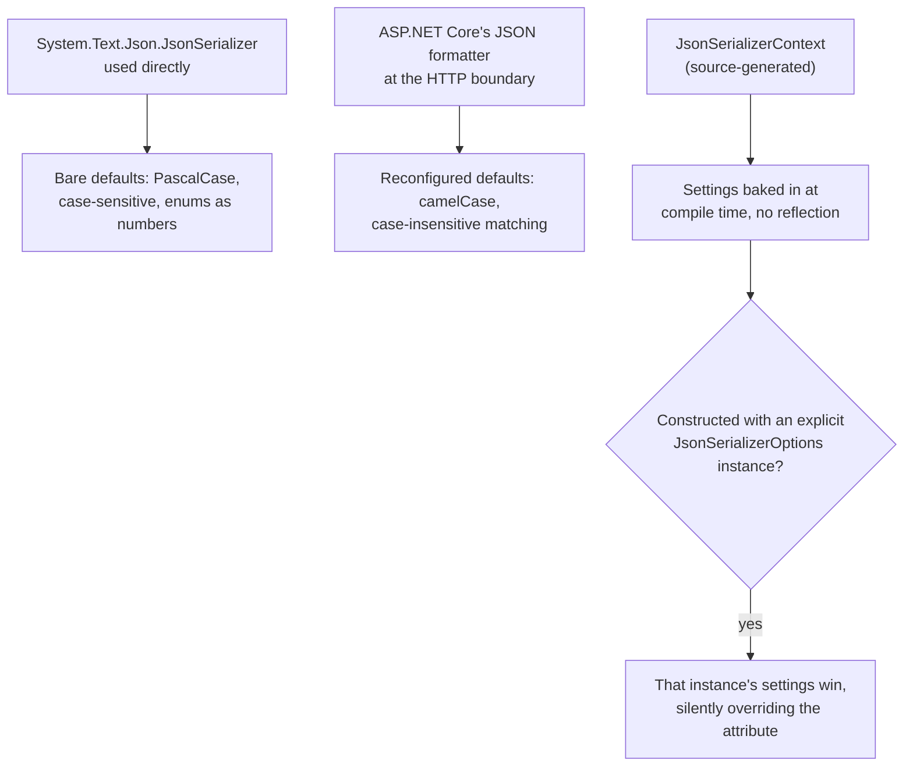

# Lesson 42. System.Text.Json

**Mission link:** Every JSON request and response lesson 29's typed, tested backend sends already goes through `System.Text.Json`, whether anyone configured it deliberately or not. This lesson covers the gap most likely to produce a confusing surprise: the bare serializer's own defaults are not what ASP.NET Core actually configures for you, and testing the serializer directly can produce different output than what a real request through the framework produces.
**Primary source:** [Docs: "Migrate from Newtonsoft.Json to System.Text.Json", Microsoft Learn](https://learn.microsoft.com/en-us/dotnet/standard/serialization/system-text-json/migrate-from-newtonsoft), [Docs: "How to use source generation in System.Text.Json", Microsoft Learn](https://learn.microsoft.com/en-us/dotnet/standard/serialization/system-text-json/source-generation)
**Prerequisites:** [Lesson 29](0029-structuring-a-typed-tested-backend.md), [Lesson 27](0027-configuration.md)

## Warm-up

1. ▢ Per lesson 29, what does structuring a typed, tested backend actually ship: just code that compiles, or something verified to behave a specific way?

Check

Something verified: the whole point of stage 6 was shipping a service whose behavior is checked by tests, not just code that happens to compile.

2. ▢ Per lesson 27, where does a configuration value's actual effective setting come from: the code, or something read at startup?

Check

Something read at startup, from whichever configuration provider supplied it last; the same code can behave differently depending on what configuration it's actually given in a given environment, without any code change.

## Know this

### The bare serializer's own defaults are not camelCase, and not case-insensitive

Used directly, without any ASP.NET Core involvement, `System.Text.Json`'s defaults are: property names and dictionary keys are serialized **unchanged**, including case (a C# `OrderId` stays `OrderId` in the JSON), matching during deserialization is **case-sensitive**, enums serialize as numbers, and properties appear in the order they're declared. None of this is camelCase, and none of it tolerates a mismatched case on the way back in.

### ASP.NET Core deliberately reconfigures all of that for you, at the HTTP boundary

ASP.NET Core specifies its own settings on top of the bare serializer specifically to produce camelCase property names, case-insensitive matching, and deserializing quoted numbers, all enabled by default for requests and responses that pass through the framework's own JSON formatter. This is a real, documented divergence worth knowing explicitly: a unit test that constructs a `JsonSerializerOptions` instance directly and serializes a model gets the bare library's defaults (PascalCase, case-sensitive), while the same model serialized through an actual ASP.NET Core response gets camelCase. Two tests that look like they should agree can disagree for exactly this reason, and the fix isn't a bug in either the serializer or the framework, it's knowing which defaults apply where.

### Overriding the ASP.NET Core default is one line, when the framework's opinion isn't the right one

Setting `PropertyNamingPolicy = null` on the options ASP.NET Core uses restores the bare serializer's original-casing behavior, useful whenever an external contract (an existing API a client already depends on, an already-PascalCase payload another service expects) requires it. The default is the framework's own opinion about what a typical JSON API should look like, not a constraint imposed by the serializer itself, and it's exactly as overridable as any other option lesson 27 already taught you to configure.

### Source generation moves the configuration to compile time, and to reflection-free code

For .NET 8 and later, most of what `JsonSerializerOptions` configures at runtime can instead be declared on a `[JsonSourceGenerationOptions(...)]` attribute over a partial class marked `[JsonSerializable(typeof(YourType))]`, deriving from `JsonSerializerContext`. The generated context's own `Default` property comes preconfigured with everything the attribute specified, computed once at compile time rather than resolved through reflection on every call, which matters both for raw performance and for AOT compilation scenarios that can't rely on runtime reflection at all. One documented gotcha: constructing the generated context through the overload that takes an explicit `JsonSerializerOptions` instance uses *that* instance instead of the attribute's settings, silently, which is easy to trip over if the two are expected to always agree.

### The habit worth taking from both surprises

Testing a serializer's behavior in isolation, outside the pipeline that actually processes production traffic, answers a different question than testing the pipeline itself, the same distinction lesson 29's own testing discipline already drew between a unit test and an integration test. And a compile-time source-generated configuration can be silently bypassed by a runtime options instance passed to the wrong constructor overload, the same "code that compiles and does something other than what it looks like it does" trap this whole arc has been naming since lesson 1.

## Practice

1. ▢ A unit test constructs `new JsonSerializerOptions()` directly, serializes a `record OrderDto(int OrderId)`, and asserts the JSON key is `"OrderId"`. The same DTO returned from an actual ASP.NET Core endpoint produces `"orderId"` instead. Is either result wrong?

Hint

Think about which defaults apply to a bare `JsonSerializerOptions` versus what the framework configures for its own formatter.

Check

Neither is wrong. The bare serializer's own default preserves original casing (`"OrderId"`), which is exactly what the directly-constructed options produce. ASP.NET Core's JSON formatter deliberately reconfigures the defaults to camelCase for anything passing through the framework, which is why the same DTO looks different coming from an actual endpoint. The two contexts have genuinely different default settings.

2. ▢ A service needs to preserve an existing client's expectation of PascalCase JSON keys, but is otherwise a normal ASP.NET Core app (which defaults to camelCase). What's the fix?

Check

Set `PropertyNamingPolicy = null` on the JSON options ASP.NET Core uses, which restores the bare serializer's original-casing behavior instead of the framework's camelCase default. The default is the framework's opinion, not a hard constraint, and it's overridable the same way any other configured option is.

3. ▢ Why does source-generated JSON serialization matter for an AOT-compiled application specifically, beyond raw speed?

Check

Source generation computes the serialization configuration once at compile time and avoids the reflection the ordinary runtime-configured path relies on. AOT compilation can't depend on the same reflection machinery being available at runtime, so a reflection-free, compile-time-generated path isn't just faster, it's what makes serialization work at all in an AOT context.

4. ▢ A `JsonSerializerContext` is generated with `[JsonSourceGenerationOptions(PropertyNamingPolicy = JsonKnownNamingPolicy.CamelCase)]`, but the code constructs it via the overload that takes an explicit `JsonSerializerOptions` instance built elsewhere with no naming policy set. What actually gets used?

Check

The explicitly supplied `JsonSerializerOptions` instance, not the attribute's settings. Passing an options instance to that constructor overload uses that instance instead of what `[JsonSourceGenerationOptions]` specified, silently, which is why the camelCase setting on the attribute wouldn't actually apply here.

5. ▢ Which claim correctly describes the relationship between `System.Text.Json`'s bare defaults and ASP.NET Core's configured defaults?

    - a) They are identical; ASP.NET Core changes nothing about the serializer's behavior
    - b) The bare serializer defaults to unchanged casing and case-sensitive matching; ASP.NET Core reconfigures its own JSON formatter for camelCase output and case-insensitive matching, a real, documented divergence between testing the serializer directly and testing through the framework
    - c) ASP.NET Core's camelCase default cannot be overridden once an app is built on it
    - d) Source generation always produces the same settings as whatever `JsonSerializerOptions` instance happens to be passed to the generated context's constructor

Check

**b)** That's the divergence this lesson names explicitly, and the reason a serializer test in isolation can disagree with the same model serialized through a real endpoint. (a) is false: the two sets of defaults genuinely differ. (c) is false: `PropertyNamingPolicy = null` restores original casing whenever the framework's opinion isn't the right one. (d) has it backwards for the *other* direction: passing an explicit options instance overrides the source-generated attribute's settings, not the reverse.

## Real-world reps

- [ ] For a service you have access to, check whether a unit test constructs its own `JsonSerializerOptions` or actually exercises the ASP.NET Core response pipeline, and confirm the two agree on casing (or note where they'd disagree if you're wrong).
- [ ] Check whether that service's JSON output uses the ASP.NET Core camelCase default or has overridden `PropertyNamingPolicy`, and confirm the choice matches what any existing clients actually expect.
- [ ] Tomorrow: find (or add) a source-generated `JsonSerializerContext` in a project you have access to, and confirm it's constructed with its parameterless constructor rather than one that silently supplies a different `JsonSerializerOptions`.

## Going further

- [Docs: "Migrate from Newtonsoft.Json to System.Text.Json", Microsoft Learn](https://learn.microsoft.com/en-us/dotnet/standard/serialization/system-text-json/migrate-from-newtonsoft)
- [Docs: "How to use source generation in System.Text.Json", Microsoft Learn](https://learn.microsoft.com/en-us/dotnet/standard/serialization/system-text-json/source-generation)
- [Docs: "How to customize property names and values with System.Text.Json", Microsoft Learn](https://learn.microsoft.com/en-us/dotnet/standard/serialization/system-text-json/customize-properties)
- [Resources](../RESOURCES.md)

---

Not landing? Reread the primary source at the top, since this lesson compresses it and compression is where understanding leaks. Check the [glossary](../GLOSSARY.md) for any term that felt slippery.

If the lesson itself is unclear rather than the material, that is a defect: [open an issue](https://github.com/TokenCemetery/teach/issues).
