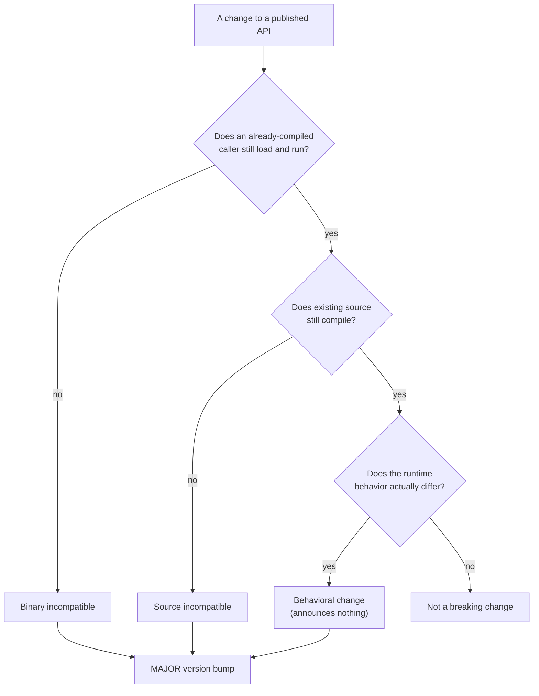

# Lesson 43. API Compatibility

**Mission link:** Every lesson in this arc has named a habit that "merely compiles" as the trap worth catching. Once a type or a library is consumed by someone else's code, that trap gets a second, sharper edge: a change can compile cleanly for you and still break every caller who doesn't recompile, or fail to compile at all for a caller while an already-built binary keeps running fine. This lesson names the categories precisely, because "is this a breaking change" is not one question, it's at least three.
**Primary source:** [Docs: "Breaking changes in .NET", Microsoft Learn](https://learn.microsoft.com/en-us/dotnet/core/compatibility/categories), [Docs: "How the .NET Runtime and SDK are versioned", Microsoft Learn](https://learn.microsoft.com/en-us/dotnet/core/versions/)
**Prerequisites:** [Lesson 24](0024-the-dotnet-cli-and-packages.md)

## Warm-up

1. ▢ Per lesson 24, what does declaring a NuGet package version as `Version="4.0.0"` actually guarantee about what gets resolved?

Check

A floor, not a pin: the resolved version is the nearest minimum version at or above `4.0.0`, so a later, compatible version can be resolved even though `4.0.0` was the exact number written down.

## Know this

### Binary compatibility asks whether an already-compiled caller keeps working, untouched

**Binary compatibility** is about a consumer's existing, already-built binary: can it keep loading and running against a newer version of a library or runtime without being recompiled at all? Adding a new method to a class doesn't affect this, an existing compiled caller never referenced the new method, so it has nothing to break. Removing or altering a public signature a compiled caller already depends on does: the caller's compiled code references a signature that no longer exists in the same shape, and it fails to load or execute, sometimes with no warning until it's actually run.

### Source compatibility asks a different, separate question: does existing source still compile?

**Source compatibility** asks whether existing *source code*, not an already-built binary, still compiles successfully against the new version. This is a genuinely separate axis from binary compatibility, not another name for the same thing: adding a member to a published interface is source-breaking for any class outside the assembly that implements that interface, since its source no longer satisfies the interface's contract and fails to compile, until the new member is added. A caller that only ever calls through the interface, and never implements it, isn't affected the same way at all, at least not until that caller's own code needs to recompile against the change.

### A behavioral change is the one that announces nothing at all

A **behavioral change** keeps the same public signature (both binary and source compatible) while the runtime behavior itself changes: a method starts throwing a different exception, or an internal computation now produces a different result for the same input. This is the hardest category to catch, precisely because neither a compiler error nor a load failure flags it; the only way to notice is running the code and observing that it now does something different than before, the exact "compiles fine, does something else" trap this whole arc has been naming since lesson 1, now applied to an entire library's public contract instead of one habit in one method.

### Binary and source compatibility really are separate axes, and here's the proof

A library can bump its `AssemblyVersion` with zero changes to any public method, property, or type. That alone is a binary-incompatible change: an already-compiled consumer, built against the old `AssemblyVersion`, fails to load the new assembly without an explicit binding redirect, even though its source code is completely unchanged and would recompile against the new version without a single edit. This is the cleanest demonstration that binary and source compatibility are genuinely different questions: the exact same change is source-compatible (nothing to fix in the code) and binary-incompatible (an existing build stops working) at once.

### Semantic versioning is the promise that lets a caller trust a number instead of reading every change

The .NET runtime roughly follows semantic versioning, `MAJOR.MINOR.PATCH`, with a high bar for accepting anything that forces a MAJOR bump: a MAJOR version signals a breaking change of one of the kinds above, MINOR signals new, backward-compatible capability, and PATCH signals a fix with no compatibility impact at all. NuGet packages follow the identical convention. The whole point of the scheme is that a caller shouldn't have to read every change to decide whether upgrading is safe; the version number itself is supposed to already answer that, which is exactly why correctly classifying a change (binary, source, or behavioral) has to happen before the version number that announces it gets chosen.

## Practice

1. ▢ A library removes a public method a compiled consumer's code calls directly. The consumer isn't recompiled. What happens, and which category of compatibility does this break?

Hint

Think about what the consumer's already-built binary actually references.

Check

Binary compatibility. The consumer's already-compiled binary references a method signature that no longer exists in the same shape, so it fails to load or execute against the new version, without the consumer ever recompiling or even seeing a compile-time error.

2. ▢ A published interface gains a new member. A class outside the assembly implements that interface. What happens to that class's source code, and is this the same kind of break as question 1?

Check

The implementing class's source no longer satisfies the interface's full contract and fails to compile until the new member is added. This is a source-incompatible change, a different axis than question 1's binary break: it's about whether existing *source* still compiles, not whether an *already-built binary* still loads and runs.

3. ▢ A method's public signature is completely unchanged, but its internal implementation now throws a different exception type for the same invalid input. Would a compiler or a loader catch this?

Check

Neither. This is a behavioral change: the signature stays binary- and source-compatible, so nothing at compile time or load time flags it. The only way to notice is running the code and observing that it now behaves differently for the same input, which is exactly why behavioral changes are the hardest category to catch.

4. ▢ A library bumps only its `AssemblyVersion`, with no changes to any public method, property, or type. Is this source-compatible, binary-compatible, both, or neither?

Check

Source-compatible but binary-incompatible. Existing source code recompiles cleanly against the new version with no edits needed, but an already-compiled consumer built against the old `AssemblyVersion` fails to load the new assembly without an explicit binding redirect. The two kinds of compatibility genuinely diverge here.

5. ▢ Which claim correctly distinguishes binary, source, and behavioral compatibility?

    - a) They are three names for the same underlying check: whether a change breaks anything at all
    - b) Binary compatibility asks whether an already-compiled caller still loads and runs; source compatibility asks whether existing source still compiles; a behavioral change keeps both intact while the runtime behavior itself differs, announced by neither a compile error nor a load failure
    - c) A binary-incompatible change is always also source-incompatible, since the two always move together
    - d) Behavioral changes are the easiest category to catch, since they show up immediately as a runtime exception

Check

**b)** That's the precise three-way distinction this lesson draws. (a) is false: the `AssemblyVersion` example shows a change can be source-compatible and binary-incompatible at the same time, two genuinely different questions. (c) is false, for the same reason: the interface-member example is source-incompatible without necessarily being binary-incompatible for callers who only invoke through the interface. (d) is false: a behavioral change is the hardest to catch precisely because it's silent at both compile time and load time, discoverable only by actually running the code and comparing behavior.

## Real-world reps

- [ ] For a library or package you maintain or depend on, find its changelog for the last major version bump, and classify at least one listed change as binary-incompatible, source-incompatible, or a behavioral change.
- [ ] Check whether a project you have access to pins a package version or lets it float, per lesson 24's floor-not-pin distinction, and consider what category of change (if any) a floating version could silently pull in.
- [ ] Tomorrow: read the primary source's categories page in full, and find one of the six compatibility types (design-time, backwards, forward) this lesson didn't cover, and note what question it answers that the three covered here don't.

## Going further

- [Docs: "Breaking changes in .NET", Microsoft Learn](https://learn.microsoft.com/en-us/dotnet/core/compatibility/categories)
- [Docs: "How the .NET Runtime and SDK are versioned", Microsoft Learn](https://learn.microsoft.com/en-us/dotnet/core/versions/)
- [Resources](../RESOURCES.md)

---

Not landing? Reread the primary source at the top, since this lesson compresses it and compression is where understanding leaks. Check the [glossary](../GLOSSARY.md) for any term that felt slippery.

If the lesson itself is unclear rather than the material, that is a defect: [open an issue](https://github.com/TokenCemetery/teach/issues).
