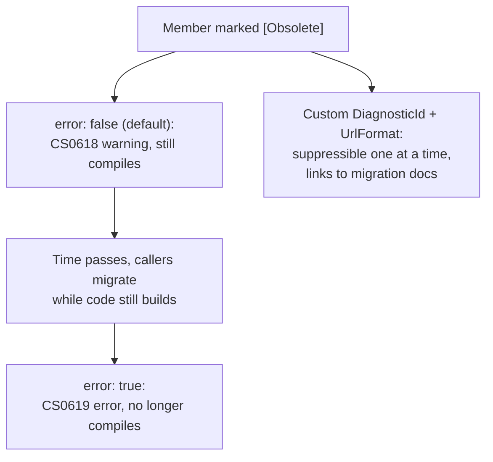

# Lesson 44. Obsolete and Deprecation

**Mission link:** Lesson 43 named what counts as a breaking change; this lesson covers how a published API announces one is coming, before it actually lands. `[Obsolete]` is a deliberate, escalating mechanism: a suppressible warning first, then, on the same member, a real compile error, which is a deliberate source-incompatible change chosen on purpose as a retirement path, in contrast to silently removing the member outright with no warning at all.
**Primary source:** [API: "ObsoleteAttribute Class", Microsoft Learn](https://learn.microsoft.com/en-us/dotnet/api/system.obsoleteattribute), [Docs: "Obsolete features in .NET 5+", Microsoft Learn](https://learn.microsoft.com/en-us/dotnet/fundamentals/syslib-diagnostics/obsoletions-overview)
**Prerequisites:** [Lesson 43](0043-api-compatibility.md)

## Warm-up

1. ▢ Per lesson 43, what makes a behavioral change the hardest category of breaking change to catch?

Check

Neither a compiler error nor a load failure flags it, since the public signature stays both binary- and source-compatible while the runtime behavior itself changes; the only way to notice is running the code and observing the difference.

## Know this

### `[Obsolete]` escalates from a warning to a real error, on purpose

`ObsoleteAttribute` takes a message and an optional `error` flag. Left at its default (`error: false`), using the marked member produces `CS0618`, a compiler *warning*, code using it still compiles and runs. Set `error: true`, and the same usage produces `CS0619`, a compiler *error* instead, code using it no longer compiles at all. This is a deliberate escalation path, not two unrelated settings: mark something obsolete with a warning first, giving callers time to migrate while their code still builds, then flip it to `error: true` once the warning period has run its course, forcing the actual migration before anyone can compile against the old member again.

### The standard diagnostic ID can't be suppressed one obsoletion at a time

Every ordinary `[Obsolete]` member without further configuration shares the same diagnostic ID, `CS0618` for the warning form, `CS0619` for the error form. Suppressing `CS0618` project-wide silences *every* obsolete-member warning in the codebase at once, not just the one specific deprecation a team has deliberately decided to live with for now. This is a real, documented limitation worth knowing before reaching for a blanket suppression.

### `DiagnosticId` and `UrlFormat` fix that, one obsoletion at a time

Setting a custom `DiagnosticId` (the .NET runtime's own convention: `SYSLIB0XXX` for `System*` namespaces, `EXTOBS0XXX` for `Microsoft.Extensions` ones) gives one specific obsoletion its own suppressible identity, so `#pragma warning disable MYLIB0001` silences exactly that one deprecation while every other obsolete member in the project keeps warning normally. Pairing it with `UrlFormat`, a format string like `"https://contoso.com/obsoletion-warnings/{0}"` with `{0}` substituted by the diagnostic ID, points an IDE straight at documentation for that specific obsoletion rather than a generic message, which is exactly the "tells callers what happens next" half of a real deprecation path.

### The message itself is what turns a warning into a usable path forward

`[Obsolete("message")]`'s message argument is what a caller actually reads first, in an IDE tooltip or a build warning, and a message that only says "this is obsolete" tells a caller nothing about what to do instead. Naming the replacement directly in the message (which member, which type, what changed) is what separates a genuine deprecation path from a warning that just tells someone they're doing something wrong without saying what's right.

### Escalating to `error: true` is a deliberate, chosen break, not a silent removal

Flipping an obsoletion from warning to error is, in lesson 43's own vocabulary, a deliberate source-incompatible change: existing code that still calls the member stops compiling. That's a real break, but it's the considered, announced version of one, with a message, a diagnostic ID, and (ideally) a documentation link explaining exactly what to do about it, in contrast to simply deleting the member outright with no warning stage at all, which breaks the same callers with none of that context. The whole value of the warning-then-error sequence is the gap in between: time for callers to migrate while their code still builds, before the actual, harder break lands.

## Practice

1. ▢ A member is marked `[Obsolete("Use NewMethod instead.")]` with no `error` argument specified. Does existing code that calls it still compile?

Check

Yes. The default is `error: false`, which produces a compiler warning (`CS0618`), not an error; code using the member still compiles and runs, just with a warning surfaced.

2. ▢ A team suppresses `CS0618` project-wide to silence one specific obsolete method's warning that they've deliberately decided not to fix yet. What actually happens to every other `[Obsolete]` member in the project?

Check

Every other member marked with the default, unconfigured `[Obsolete]` also stops warning, since they all share the same standard diagnostic ID. The team silenced far more than the one deprecation they meant to acknowledge, which is exactly the documented limitation a custom `DiagnosticId` per obsoletion exists to fix.

3. ▢ Why does `UrlFormat` take a format string like `"https://contoso.com/obsoletion-warnings/{0}"` rather than a fixed URL?

Check

So one generic URL pattern can serve every obsoletion, with `{0}` substituted by that specific member's `DiagnosticId`, rather than requiring the diagnostic ID to be repeated separately inside a hardcoded URL for each obsoletion, which would risk a copy-and-paste mismatch between the ID and the link.

4. ▢ A library flips a member from `[Obsolete(error: false)]` to `[Obsolete(error: true)]` in a new release. In lesson 43's compatibility vocabulary, what kind of change is this, and is it different from deleting the member outright?

Check

It's a deliberate source-incompatible change: existing code calling the member stops compiling. It differs from an outright deletion in that it was preceded by a warning period (while `error` was `false`), giving callers advance notice and time to migrate before the actual, harder break landed, rather than breaking them with no warning at all.

5. ▢ Which claim correctly describes the value of a custom `DiagnosticId` on an `[Obsolete]` member?

    - a) It changes whether the member produces a warning or an error, which `error` alone can't do
    - b) It gives that specific obsoletion its own suppressible identity, separate from every other `[Obsolete]` member sharing the standard `CS0618`/`CS0619` IDs, so one deprecation can be acknowledged without silencing all the others
    - c) It is required before `[Obsolete]` will compile at all
    - d) It replaces the need for a message argument entirely

Check

**b)** That's the specific, documented problem a custom `DiagnosticId` solves. (a) is false: `error` alone already controls warning versus error severity; `DiagnosticId` is about suppressibility, a separate concern. (c) is false: `[Obsolete]` works with no `DiagnosticId` at all, just with the shared-suppression limitation this lesson describes. (d) is false: the message is what tells a caller what to do; `DiagnosticId` only affects suppression and diagnostic identity.

## Real-world reps

- [ ] Find an `[Obsolete]` member in code you have access to (or a NuGet package's public API). Check whether it uses `error: true` or the default warning, and whether it has a custom `DiagnosticId`.
- [ ] Find a place where `#pragma warning disable CS0618` (or an equivalent project-wide suppression) is used, and check whether it's actually suppressing more obsoletions than the one it was meant to acknowledge.
- [ ] Tomorrow: write an `[Obsolete]` attribute for a method you'd actually want to deprecate, with a message naming its replacement, a custom `DiagnosticId`, and a `UrlFormat` pointing at real documentation.

## Going further

- [API: "ObsoleteAttribute Class", Microsoft Learn](https://learn.microsoft.com/en-us/dotnet/api/system.obsoleteattribute)
- [Docs: "Obsolete features in .NET 5+", Microsoft Learn](https://learn.microsoft.com/en-us/dotnet/fundamentals/syslib-diagnostics/obsoletions-overview)
- [Resources](../RESOURCES.md)

---

Not landing? Reread the primary source at the top, since this lesson compresses it and compression is where understanding leaks. Check the [glossary](../GLOSSARY.md) for any term that felt slippery.

If the lesson itself is unclear rather than the material, that is a defect: [open an issue](https://github.com/TokenCemetery/teach/issues).
