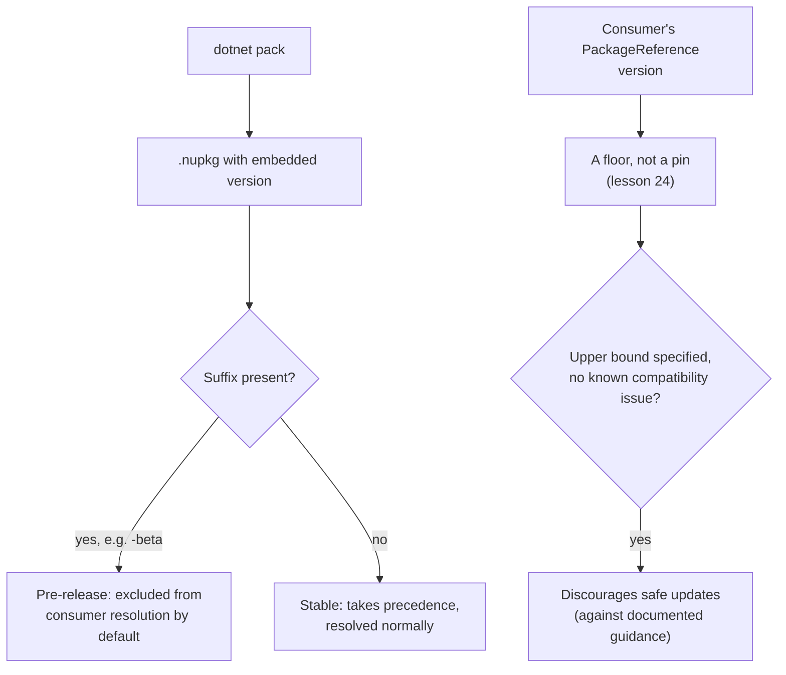

# Lesson 45. NuGet Packaging and Versioning

**Mission link:** Lesson 43 taught what a change actually breaks; lesson 44 taught how to announce one coming. This lesson is where both land on an actual number: the package version a consumer sees, resolves, and depends on, reusing lesson 24's own package-version vocabulary and lesson 43's semantic-versioning framework rather than introducing either from scratch.
**Primary source:** [Docs: "NuGet Package Version Reference", Microsoft Learn](https://learn.microsoft.com/en-us/nuget/concepts/package-versioning), [Docs: "Pre-release versions in NuGet packages", Microsoft Learn](https://learn.microsoft.com/en-us/nuget/create-packages/prerelease-packages)
**Prerequisites:** [Lesson 43](0043-api-compatibility.md), [Lesson 24](0024-the-dotnet-cli-and-packages.md)

## Warm-up

1. ▢ Per lesson 43, what does a MAJOR version bump signal about a change, and what does PATCH signal instead?

Check

MAJOR signals a breaking change of one of lesson 43's categories (binary, source, or behavioral); PATCH signals a fix with no compatibility impact at all.

2. ▢ Per lesson 24, is a package's declared `Version` in a project file a pin or a floor?

Check

A floor: the resolved version is the nearest minimum version at or above the one declared, not necessarily the exact number written down.

## Know this

### A NuGet version is Major.Minor.Patch, optionally with a pre-release suffix, and it's required

NuGet is mostly SemVer 2.0.0-compliant: `Major.Minor.Patch`, optionally followed by a hyphen and a pre-release suffix. A version isn't optional at upload; nuget.org rejects any package with no exact version number specified in its project file or `.nuspec`. This is the exact number lesson 43's compatibility categories exist to justify: MAJOR for a binary, source, or behavioral break, MINOR for a backward-compatible addition, PATCH for a fix, the same framework, now attached to a real, published number a consumer resolves against.

### NuGet enforces nothing about what a pre-release suffix means, only that it is one

Any string after the hyphen marks a version as pre-release; NuGet makes no further interpretation of it at all, leaving the suffix's actual meaning entirely to the package author's own convention and the consumer's judgment. `-alpha`, `-beta`, and `-rc` are common conventions (roughly: early and unstable, feature-complete but possibly buggy, and likely final unless something significant surfaces), but they're conventions a team agrees on, not something the tool checks or enforces. A package could use `-nightly` or `-dev` just as validly; NuGet only cares that a suffix is present at all.

### Dropping the suffix produces the stable version, and consumers don't see pre-release by default

Removing the pre-release suffix produces the stable version, which then takes precedence over any pre-release version with the same base number. Consumers reinforce this on their own side too: NuGet doesn't include pre-release versions by default at all, a consumer has to explicitly opt in (an "Include prerelease" option, or the equivalent CLI flag) to even see one, which is exactly why a pre-release package doesn't accidentally end up in a production dependency tree.

### The instinct to pin an upper bound on a dependency is usually the wrong one

Lesson 24 already established a package version as a floor, not a pin, resolving to the nearest minimum version at or above what's declared. The documented guidance goes further: avoid specifying an upper bound on a version range for a package you don't own, unless you actually know of a specific compatibility problem it needs to guard against. An upper bound doesn't make a dependency safer by default, it actively discourages consumers, including transitively, from receiving updates that might fix a real bug or vulnerability, which is exactly the opposite of what pinning one defensively is usually meant to achieve. The one thing worth never skipping is specifying *some* version or range at all; omitting one entirely means restoring the same project twice isn't guaranteed to produce the same result.

### `dotnet pack` can leave you testing yesterday's package without telling you

`dotnet pack` builds and packages a project into a `.nupkg` file with its version embedded in the filename. The documented catch: rebuilding and repacking a project doesn't automatically make a consumer pick up the new bits, since a version already resolved once gets cached in the global packages folder, and retesting continues to use that cached, stale version until the cache is cleared, especially for a package that doesn't bump to a unique pre-release label on every build. This is the exact "looks like it should have worked" trap this whole arc keeps naming, now specific to a rebuilt package that a consumer's own tooling is quietly still resolving from cache.

## Practice

1. ▢ A team publishes a package with version `2.3.0-nightly.47`. Does NuGet treat `-nightly.47` differently from `-beta` in any enforced way?

Hint

Think about what NuGet itself actually checks versus what a team agrees to mean by a label.

Check

No. NuGet only recognizes that a hyphenated suffix marks the version as pre-release; it makes no further interpretation of what the specific suffix text means. `-alpha`, `-beta`, `-rc`, and `-nightly.47` are all equally valid pre-release markers as far as the tool is concerned, and any distinction between them is a team's own convention.

2. ▢ A consumer runs an ordinary package restore with no special flags. Will it ever resolve a pre-release version of a dependency by accident?

Check

No, not by default. NuGet doesn't include pre-release versions unless a consumer explicitly opts in, so an ordinary restore only resolves stable versions, which is exactly what keeps a pre-release package from accidentally landing in a production dependency tree.

3. ▢ A developer adds `<PackageReference Include="SomeLib" Version="[3.0.0,4.0.0)" />` to guard against a future breaking change, with no specific known issue in mind. What does the documented guidance say about this?

Check

Avoid specifying an upper bound on a package you don't own unless there's an actual, known compatibility problem to guard against. An upper bound with no specific reason behind it doesn't make the dependency safer; it just blocks safe, potentially important updates (bug fixes, security patches) from ever being resolved.

4. ▢ A team fixes a bug, runs `dotnet pack` again, and a consumer's test suite still fails the same way it did before the fix. The consumer confirms it referenced the correct, updated package version number. What's a likely explanation?

Check

The consumer's tooling may still be resolving the package from its global packages folder cache, which can hold onto a previously resolved version, especially one without a unique pre-release label per build, until that cache is explicitly cleared. The version number being correct on paper doesn't guarantee the actual bits being tested are the newly rebuilt ones.

5. ▢ Which claim correctly describes NuGet's pre-release version handling?

    - a) NuGet enforces a specific meaning for `-alpha`, `-beta`, and `-rc`, rejecting any other suffix text
    - b) Any hyphenated suffix marks a version pre-release with no further NuGet-enforced meaning; dropping the suffix produces the stable version, which takes precedence, and consumers don't resolve pre-release versions unless they explicitly opt in
    - c) A pre-release version is included in an ordinary restore by default, the same as a stable one
    - d) Once a version has a pre-release suffix, it can never become the stable version without publishing an entirely new base version number

Check

**b)** That's the complete, documented behavior this lesson describes. (a) is false: NuGet treats any suffix as equally valid; the specific meanings are conventions, not enforcement. (c) is false: pre-release inclusion is opt-in, which is exactly what keeps an ordinary restore stable-only by default. (d) is false: simply dropping the suffix on the same base number produces the stable version.

## Real-world reps

- [ ] For a package you maintain or depend on, check its version history for a pre-release suffix convention (alpha/beta/rc or something else), and confirm whether that convention is documented anywhere a consumer could actually find it.
- [ ] Find a `PackageReference` with an upper-bounded version range in a project you have access to, and check whether there's a documented, known reason for the upper bound or whether it was added defensively with no specific issue behind it.
- [ ] Tomorrow: run `dotnet pack` on a project you have access to, make a small change, repack, and confirm for yourself whether a consumer actually picks up the new version without manually clearing the global packages folder cache first.

## Going further

- [Docs: "NuGet Package Version Reference", Microsoft Learn](https://learn.microsoft.com/en-us/nuget/concepts/package-versioning)
- [Docs: "Pre-release versions in NuGet packages", Microsoft Learn](https://learn.microsoft.com/en-us/nuget/create-packages/prerelease-packages)
- [Docs: "Create a NuGet package with the dotnet CLI", Microsoft Learn](https://learn.microsoft.com/en-us/nuget/create-packages/creating-a-package-dotnet-cli)
- [Resources](../RESOURCES.md)

---

Not landing? Reread the primary source at the top, since this lesson compresses it and compression is where understanding leaks. Check the [glossary](../GLOSSARY.md) for any term that felt slippery.

If the lesson itself is unclear rather than the material, that is a defect: [open an issue](https://github.com/TokenCemetery/teach/issues).
