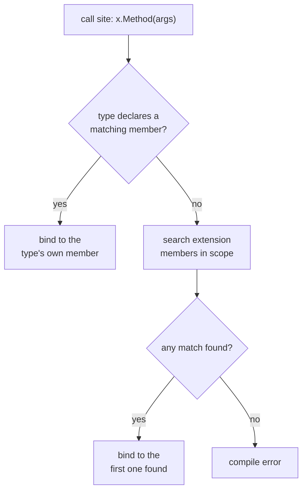
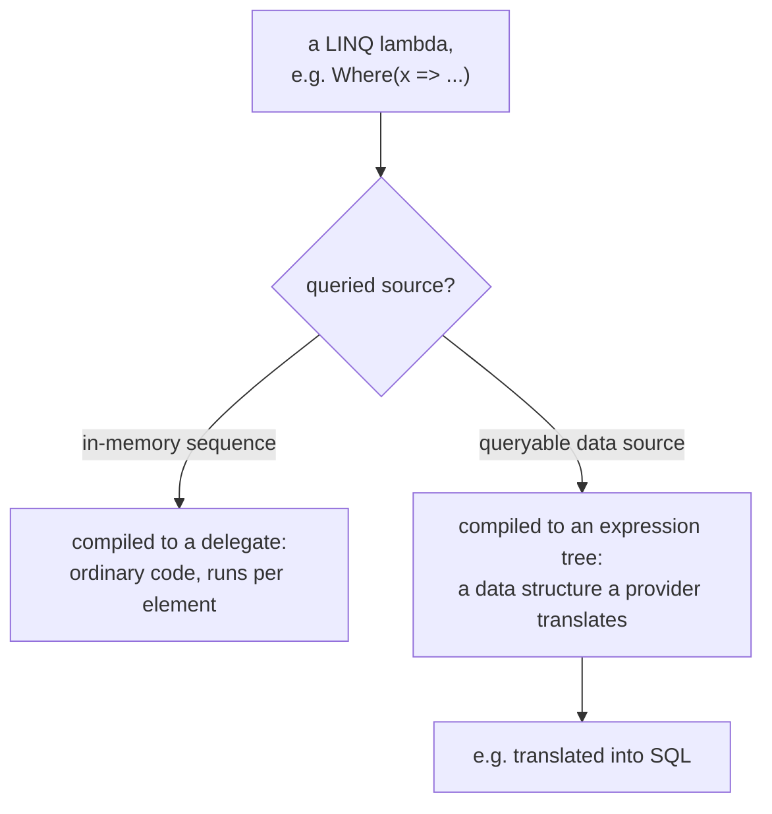
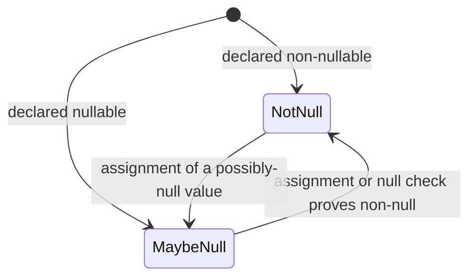

# Idiom

Lookup sheet for stage 3: C# a reviewer would not describe as translated Java.

## The five idioms, at a glance

| Idiom | Replaces |
|---|---|
| Extension members | A static helper class whose calls read inside out |
| LINQ over `IEnumerable<T>` | A loop that builds a list, or a hand-reimplemented stream pipeline |
| Delegates, `Func`/`Action`, `event` | A single-method interface, and `addXListener` by convention |
| Nullable annotations | Defensive null checks standing in for a type the reader could have read |
| Expression-bodied members | Braces and `return` around a single expression |

## Extension methods: the binding rule

Extension members are static methods called as if they were instance methods, added to a `this`-parameter static method or (C# 14+) an `extension` block; both forms compile to the same IL, in a top-level, nongeneric static class.

**Binding always prefers the type's own member:**

Consequences: an extension with the same name and signature as a declared member is **never called**, not just deprioritized. If a type later gains its own member with a matching signature, every call site silently rebinds to it, with no compile error and no warning. Extensions are resolved by discovery (first match), not best-match overload resolution.

Extensions add vocabulary to a type you don't own; they can never override or alter existing behaviour.

## LINQ

The standard query operators (`Where`, `Select`, `GroupBy`, ...) are themselves extension methods over `IEnumerable<T>`.

**Two syntaxes, no semantic or performance difference**: the compiler converts query-expression syntax into the identical method calls at compile time. Some operators (`Count`, `Max`, `ToList`) have no query-expression clause and must be written as method calls; a query expression must begin with `from` and end with `select`/`group`.

**Nothing runs until you iterate.** The query variable holds a *question*, not an answer:

| Consequence | Detail |
|---|---|
| Building a query is nearly free | No work happens at the `from`/`Where`/... line |
| Iterating twice executes twice | A changed source yields different results the second time |
| `Count`, `Max`, `ToList`, ... force execution | They must produce a single value or a materialised collection |

**A lambda compiles to a delegate or an expression tree depending on the source:**

Local code (delegate) may call anything; a translated query (expression tree) can only contain what the provider understands.

## Delegates and events

A delegate is a type representing references to methods with a specific parameter list **and return type** (return type, unlike overload resolution, is part of a delegate's "signature"). `Func`, `Action`, `Predicate` cover most needs, so a delegate type is rarely hand-declared.

**Multicast hazards** (`+=` combines several methods into one invocation list, called in order):

| Hazard | Detail |
|---|---|
| One throwing handler stops the rest | An uncaught exception propagates to the caller; no subsequent handler in the list runs |
| A return value keeps only the last handler's result | Every earlier return value (or `out` parameter) is discarded |
| Reference parameters chain | A change one handler makes is visible to the next |

**`event` restricts a delegate-typed member to `+=`/`-=` from outside code.** A plain public delegate field lets any caller overwrite the whole list (`handlers = MyHandler`) or invoke it to fabricate a notification; `event` removes both. Events with no subscribers are never raised (the raise site must tolerate an empty list); handlers run **synchronously**, so a slow one blocks the publisher and everyone queued behind it. Convention: base data on `EventArgs`/`EventHandler<TEventArgs>`, suffix event-data classes `EventArgs`.

## Nullable reference types are annotations, not a type

| `int?` (lesson 2, value type) | `string?` (this stage, reference type) |
|---|---|
| `Nullable<T>`, a real value type | Not a new type: `string` and `string?` are both `System.String` |
| `HasValue`/`Value` at runtime | Nothing at runtime |
| Boxing/comparison behaviour differs | **No runtime difference** from the non-nullable form |

The compiler adds **no runtime checking**; the entire guarantee is compile-time warnings from tracking each expression's **null-state** (not-null / maybe-null) through assignments and null checks, including pattern matching (`is null`, `is { } bound`) and early returns.

`!` (null-forgiving operator) silences the warning without establishing non-null; each use is a place the compiler can no longer protect the code. Prefer a null check, restructuring, or annotating the source API.

**One exception to "no runtime effect":** a library reading nullable attributes by reflection can act on them. Entity Framework Core interprets a nullable reference property as an optional database column and a non-nullable one as required, so the annotation there is a schema decision, not just compiler advice.

## Expression-bodied members

`=>` has two unrelated jobs: the lambda operator (separating a lambda's parameters from its body) and the expression-body separator (member name/signature from implementation). Same token, different grammar.

| Member kind | Body must be |
|---|---|
| Returns a value | An expression implicitly convertible to the return type |
| `void`, constructor, finalizer, or `set`/`init`/`add`/`remove` accessor | A **statement expression** (assignment, method invocation, object creation, increment/decrement, or `await`); any result is discarded |

Use an expression body when the member genuinely **is** the expression (a computed property, a `ToString`); avoid it when it hides a multi-branch decision that will predictably need a second statement later, since that turns the next change's diff into reformatting mixed with behaviour change.

## Related

- [Lesson 12](../lessons/0012-extension-methods.md), [Lesson 13](../lessons/0013-linq.md), [Lesson 14](../lessons/0014-delegates-and-events.md), [Lesson 15](../lessons/0015-nullable-reference-types.md), [Lesson 16](../lessons/0016-expression-bodied-members.md)
- [Value vs Reference Types](value-vs-reference-types.md): lesson 2's `int?` versus this sheet's `string?`
