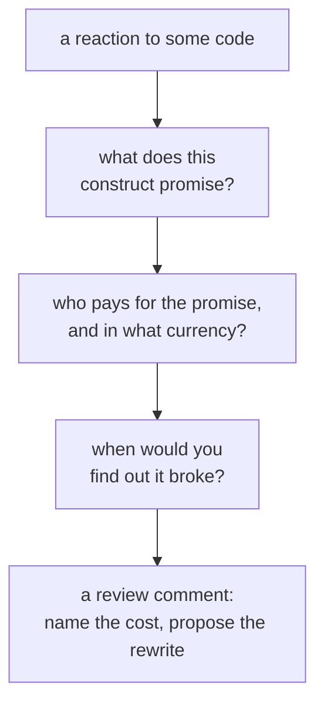

# Judgment

Lookup sheet for stage 7: naming what a construct costs, in C# and against Java.

## `async`/`await` vs Java virtual threads: different layers, same problem

Both solve "a thread waiting on I/O is an expensive resource doing nothing", by changing different layers:

| | C# `async`/`await` | Java virtual threads |
|---|---|---|
| What's made cheap | the wait: method suspends, thread isn't blocked | the thread: plentiful, so blocking one is cheap |
| Who rewrites the code | the compiler, into a state machine | nobody; the runtime unmounts the thread from its carrier |
| Cost to the signature | `async`/`Task<T>` propagate through every caller | nothing; ordinary blocking code |
| What to avoid | `async void`, unawaited tasks, tokens not threaded through | pinning the carrier (`synchronized`), pooling virtual threads, thread-local caching |

**Virtual threads did not make `async`/`await` unnecessary as a style; they made the style itself unnecessary.** Oracle's own guidance: virtual threads "exist to provide scale (higher throughput), not speed (lower latency)"; they are **not faster threads**. The adoption guide says to write **simple, synchronous, blocking-I/O code**, and warns that already-asynchronous code "will not benefit much" from virtual threads. So a Java developer should not treat `async` in C# as an optional optimization (there's no cheap thread underneath to fall back on); a C# developer should not describe Java 21 as "finally getting `async`/`await`" (it got the opposite: a way to avoid needing it).

**The costs land in different places and different visibilities:**

| | Where the cost lands | Visible in source? |
|---|---|---|
| C# | the type system, at every call site (`async` propagation, threaded `CancellationToken`) | Yes |
| Java | runtime behavior and habits carried from platform threads (pinning inside `synchronized`, pooling virtual threads) | **No**: a pinning `synchronized` block looks like ordinary correct code |

## LINQ vs Java `Stream`: laziness ends differently

Both are lazy pipelines with no storage: nothing runs until a terminal operation (LINQ: enumeration; Stream: a terminal op). The agreement stops there:

| | LINQ | Java `Stream` |
|---|---|---|
| What the variable holds | a query, re-executable | a pipeline, **consumed** by its terminal op; cannot be reused |
| Running it twice | runs again | must return to the source for a new stream |
| Where it can run | a delegate, or an **expression tree** a provider translates (e.g. to SQL) | compiled JVM code only |
| Parallelism | not addressed by this arc | explicit opt-in (`parallelStream()`/`.parallel()`); serial by default |

**The expression-tree row is the load-bearing one.** Because a LINQ query can compile to *data describing itself*, a provider can translate it (e.g. into SQL); a Java `Stream`'s lambdas are always just compiled code with nothing for a database to read. This reframes [EF Core's client-vs-server evaluation rule](shipping-the-service.md#entity-framework-core) as the price of a query that can leave the process, not LINQ being awkward, and it's why Java's data-access ecosystem grew separate query languages while C#'s language feature already crossed that boundary.

## Turning a reaction into a review comment

A comment is worth what its cost statement is worth. "Make this a record" is an opinion; "this type has value semantics everywhere else, so as a class two equal orders compare unequal and a lookup two files away silently misses" is a cost, and there's nothing to disagree with.

The third question ranks the finding: a cost discovered "never" or "intermittently, as corruption" outranks one discovered "immediately, as a compile error" (which isn't worth a review comment at all).

**Automate the mechanical half** (brace placement, `System.String` vs `string`) via code analysis + `.editorconfig`, enforced per CI build; a human review spent there is a review not spent on a captive dependency. `var` is a reading rule, not just a writing one: allowed only when the right side makes the type obvious (`new`, an explicit cast, a literal), never from a method name, because every finding below depends on knowing the actual type.

## The review checklist, ordered by what the compiler will never tell you

| What you see | What it costs | How you'd find out |
|---|---|---|
| A class where values are compared, not identified | reference equality: two equal values are unequal, a lookup misses | a wrong result, eventually |
| `catch (Exception)` with no filter, or `throw ex` | the stack trace, and errors with no plan | an unactionable log entry |
| `async void` outside an event handler | the caller's only way to observe completion/failure | an unobserved exception, or a silent no-op |
| Sequential `await`s over independent work | the overlap you meant to have | a latency number nobody questions |
| A slow method with no `CancellationToken` | a decision made on the caller's behalf | never, which is the problem |
| An assertion on a non-virtual member of a substituted class | the test itself | it passes forever |
| `AddSingleton` holding a scoped dependency | the shorter lifetime, silently promoted | under load, or the dev-time scope check |
| `IOptions<T>` where the value must change while running | the reconfiguration | never; it fails by doing nothing |
| Two operations on one `DbContext` before either is awaited | the context, possibly the data | intermittently, or as corruption |
| A `PackageReference` version read as a pin | reproducibility | a build that changed with no commit |

Almost none of these announce themselves, which is the argument for reviewing in *this* order rather than top-to-bottom through the file: spend attention on what no other mechanism reports.

**Name the habit, then write the replacement.** "This is not cancellable" is a complaint; "take a `CancellationToken` and pass it to the calls inside" is a review. A cost named with no proposed rewrite leaves the author holding a verdict with no move, which usually just relocates the problem.

## Related

- [Lesson 30](../lessons/0030-two-comparisons-with-java.md), [Lesson 31](../lessons/0031-reviewing-csharp.md)
- [Async](async.md), [Shipping the Service](shipping-the-service.md), [Testing and Build](testing-and-build.md): the mechanisms behind most of this checklist's rows
