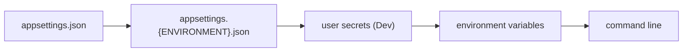

# Shipping the Service

Lookup sheet for stage 6: assembling routing, injection, configuration, and data access into one typed, tested service.

## Two systems in one `Program.cs`

The **pipeline** (`Use`, `Run`, `Map`) runs in the order it was assembled. **Endpoint selection** (`MapGet`, `MapPost`, ...) ignores that order entirely and uses route template precedence instead. They look alike; they obey different rules.

**A middleware is two bodies with everything downstream in between:**


Before `next`, the response is yours to write; after `next` returns, everything downstream has already run, so only non-response work belongs there. Outward halves run in reverse registration order. `Run` takes no `next`: nothing follows it.

**Branching is not one thing:**

| Call | Branches on | Rejoins the main pipeline? |
|---|---|---|
| `Map("/path", branch)` | path prefix | No |
| `MapWhen(predicate, branch)` | any `Func<HttpContext, bool>` | No |
| `UseWhen(predicate, branch)` | any `Func<HttpContext, bool>` | **Yes**, unless the branch short-circuits or is terminal |

`Map` also rewrites the request: matched segments move from `HttpRequest.Path` to `HttpRequest.PathBase`, so code moved into a `Map` branch that reads `Request.Path` silently stops seeing what it used to.

**Middleware position decides what `HttpContext.GetEndpoint()` returns:**

| Position | `GetEndpoint()` | Runs on |
|---|---|---|
| Before `UseRouting` | always `null` | every request |
| Between `UseRouting` and `UseEndpoints` | the matched endpoint, or `null` | every request |
| After `UseEndpoints` | the matched endpoint | **only when nothing matched** (a 404 handler) |

`WebApplicationBuilder` wraps app-registered middleware with `UseRouting`/`UseEndpoints` even when neither is called explicitly, so adding an explicit `UseRouting()` call changes where existing middleware sits relative to it.

**Endpoint selection uses route template precedence, not registration order**: more segments beat fewer, a literal segment beats a parameter segment, a constrained parameter beats an unconstrained one, catch-all is least specific. `/Products/List` always beats `/Products/{id}` for `/Products/List`, regardless of which was registered first.

## Dependency injection: lifetimes are claims, not guarantees

```csharp
builder.Services.AddTransient<IOperationTransient, Operation>();
builder.Services.AddScoped<IOperationScoped, Operation>();
builder.Services.AddSingleton<IOperationSingleton, Operation>();
```

Wrong implementation fails on the first request. Wrong **lifetime** compiles, passes a smoke test, and corrupts data under load. "Scoped" means "revolves around whatever `IServiceScope` it's resolved in", not "the request" specifically: resolving a scoped service from the root container (or with no scope at all) **promotes it to singleton**.

**Captive dependency** (a longer-lived service holding a shorter-lived one):

| Holder | Held | Result |
|---|---|---|
| Singleton | Scoped | **Misconfiguration**: one instance captured for the app's lifetime |
| Singleton | Transient | Allowed, but lives as long as the singleton; may need its own thread safety |
| Scoped | Transient | Fine: lives as long as that scope |

The development-environment default service provider (or `validateScopes: true`) catches scoped-into-singleton at container-build time; this is a **development-only** check, not proof for a shipped build.

**Middleware is constructed once for the whole app**, not per request, so constructor-injecting a scoped service into a middleware **throws at runtime**. Fix: inject into `Invoke`/`InvokeAsync` instead, or use factory-based middleware (activated per request).

**Disposal belongs to the container, never to code that merely received a dependency**: transient/scoped instances are disposed at the end of the scope they were resolved in; singletons at container/app shutdown. Receiving an `IDisposable` through DI does not obligate (or permit) the receiver to call `Dispose` on it.

**Thread safety of the container** (safe to resolve from multiple threads once built) does not extend to a singleton's own state: a singleton holding shared mutable state must synchronize itself.

## Configuration: one flat dictionary, last provider wins

All configuration values are **strings** in **one flat dictionary**; `null` cannot be stored or bound. Hierarchy is a naming convention using a delimiter that differs by source:

| Source | Delimiter |
|---|---|
| Configuration API, JSON files | `:` |
| Environment variables | `__` (auto-converted to `:`; `:` itself doesn't work in Bash) |
| Azure Key Vault | `--` |

Keys are case-insensitive; **named options are not**.

**Precedence is pure order**, last provider added wins, no merge:



Nothing in the reading code records which provider answered; diagnosing a surprising value means walking the provider list backward, not the files.

**Three options interfaces, separated by lifetime:**

| Interface | Registered as | Sees post-startup changes | Injectable into a singleton |
|---|---|---|---|
| `IOptions<T>` | singleton | No | Yes |
| `IOptionsSnapshot<T>` | **scoped** | Yes (per-request snapshot) | **No** (captive dependency) |
| `IOptionsMonitor<T>` | singleton | Yes (live, with change notifications) | Yes |

**Validation runs late by default**: on first access to `.Value`/`.Get`, i.e. on the first affected request, not at startup. Add `.ValidateOnStart()` to fail the deployment instead of serving errors:

```csharp
builder.Services.AddOptions<KeyOptions>()
    .Bind(builder.Configuration.GetSection(KeyOptions.Key))
    .ValidateDataAnnotations()
    .ValidateOnStart();
```

## Entity Framework Core

`AddDbContext<T>` registers a **scoped** service; a `DbContext` is one unit of work, and an HTTP request is usually one unit of work, so tying them together is the right default.

**Change tracking has no equivalent in earlier stages**: every entity has an `EntityState`, and `SaveChanges` acts per state:

| State | Action on `SaveChanges` |
|---|---|
| `Detached` | none |
| `Added` | insert |
| `Unchanged` | none |
| `Modified` | update (per-property) |
| `Deleted` | delete |

All query results start `Unchanged`; **assigning a property alone (no explicit "update" call) is enough to schedule a database write** on the next `SaveChanges`, including an assignment made for an unrelated reason (normalizing a value before returning it).

**`AsNoTracking` changes behavior, not just speed**: no-tracking queries skip identity resolution (return a new instance every time, even for "the same" row appearing twice) and ignore uncommitted local changes/added entities in the same unit of work. `AsNoTrackingWithIdentityResolution` keeps identity resolution without full tracking.

**Client evaluation is allowed in exactly one place**: the top-level (final) `Select()`. An untranslatable expression there falls back to client-side evaluation silently; the same expression anywhere else (e.g. inside `Where`) **throws at runtime**. (Pre-3.0 EF Core allowed client evaluation anywhere, a source of stale advice.)

**One `DbContext` instance cannot run parallel operations**, explicitly including two async queries started before either is awaited. Scoped registration is safe only because one thread serves one request at a time; parallelizing inside a request (stage 4's overlap habit) breaks that premise. Detected as `InvalidOperationException` when lucky; otherwise **undefined behavior, crashes, data corruption**. Fix: await each call immediately, or use a separate `DbContext` per parallel operation (`IServiceScopeFactory`, one scope per thread).

## Structuring and testing: the seam is the container

A service is structured when these four questions all have deliberate answers:

| Question | Answered by | Silent failure otherwise |
|---|---|---|
| How long may this object live? | the registration | a captive dependency |
| Where does this code sit in the pipeline? | `Use` order vs `UseRouting` | reads a null endpoint, or only runs on 404 |
| Where does this value come from? | provider order + validated options | a setting that differs invisibly in production |
| What is one unit of work? | the scope, and the context inside it | parallel-context corruption, or an accidental write-back |

**Tests replace a registration, not a class.** `WebApplicationFactory<TProgram>.ConfigureWebHost` exposes the service collection before the container is built; find the `DbContext` descriptor, remove it, register a test one. The rest of the object graph is assembled by the same container the same way production does.

**Unit test vs integration test**: "if a behavior can be tested using either, choose the unit test." Integration tests use real infrastructure components, cost more to run, and should be limited to the scenarios that actually need the real pipeline/database/etc.

**A green integration suite is not proof of correct lifetimes.** The test host's process is short-lived and configured differently from production; a captive dependency, a startup-validation gap, or a context-concurrency race can all pass an integration suite and still be present. Each of the four failure modes above has its own separate detector (dev-environment scope check, integration test, `ValidateOnStart`, awaiting discipline), and none substitutes for the others.

## Related

- [Lesson 25](../lessons/0025-routing-and-middleware.md), [Lesson 26](../lessons/0026-dependency-injection.md), [Lesson 27](../lessons/0027-configuration.md), [Lesson 28](../lessons/0028-entity-framework-core.md), [Lesson 29](../lessons/0029-structuring-a-typed-tested-backend.md)
- [Testing and Build](testing-and-build.md): xUnit fixtures, and what a substitution library needs to intercept
- [Async](async.md): stage 4's overlap habit, and why it corrupts a single `DbContext`
