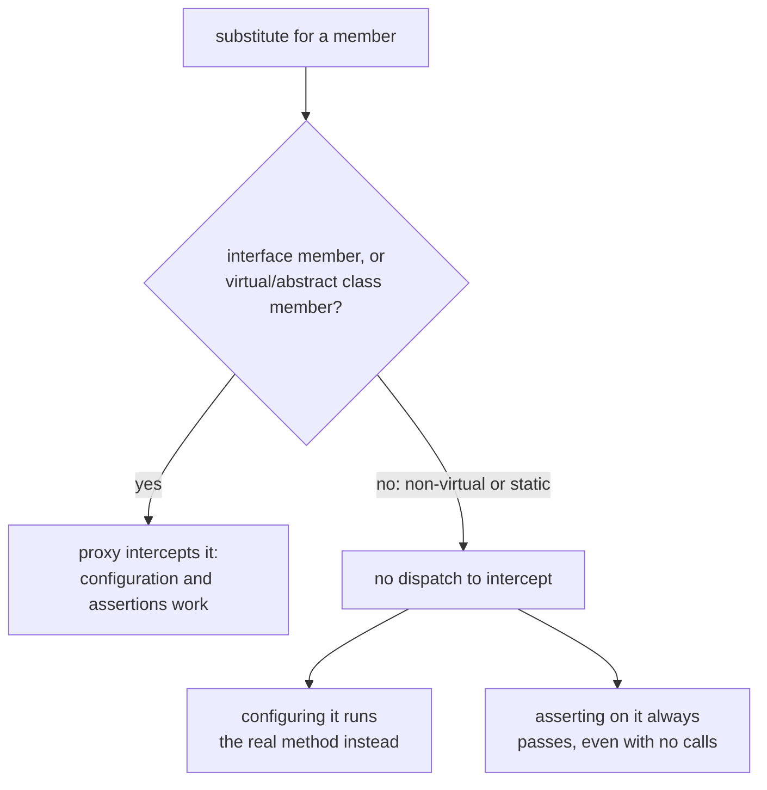

# Testing and Build

Lookup sheet for stage 5: someone else can clone, build, test and run it.

## xUnit vs NUnit: who owns the instance

| Question | xUnit | NUnit |
|---|---|---|
| Instance per test class | **One per test** (isolation is the default) | **One per fixture**, `LifeCycle.SingleInstance` by default (sharing is the default) |
| Marks the class | nothing needed | `[TestFixture]` |
| Marks a test | `[Fact]` | `[Test]` |
| Same code, several inputs | `[Theory]` + `[InlineData(...)]` | `[TestCase(...)]` |
| Before each test | the constructor | `[SetUp]` |
| After each test | `Dispose` | `[TearDown]` |
| Async setup/teardown | `IAsyncLifetime` (`InitializeAsync`/`DisposeAsync`); a constructor can't `await` | n/a |

Because xUnit constructs fresh every time, there's no setup attribute to need: the constructor *is* the setup. Because NUnit shares an instance across a fixture by default, a field left dirty by one test leaks into the next unless reset in `[SetUp]`, or the fixture opts into `[FixtureLifeCycle(LifeCycle.InstancePerTestCase)]` (available since NUnit 3.13).

**`[Theory]` means two different things.** In xUnit, a theory is a test true only for particular data (fed by `[InlineData]`). In NUnit, `[Theory]` is a separate mechanism fed by `[Datapoint]`/`[DatapointSource]`; NUnit's everyday parameterized test is `[TestCase]`. Read the `using` at the top of the file before trusting the attribute name.

**xUnit's sharing scopes, and their parallelism cost:**

| Scope | How |
|---|---|
| Clean context per test | The constructor, plus `Dispose` |
| One context for all tests in a class | `IClassFixture<T>` |
| One context across several classes | `[CollectionDefinition("name")]` + `ICollectionFixture<T>`, `[Collection("name")]` on each class |
| One context for the whole assembly | `[assembly: AssemblyFixture(typeof(T))]` (v3) |

Default parallel mode is `collections`, one collection per class: tests in the same class never run in parallel; tests in different classes do. Sharing a collection fixture across several classes puts them in one collection, which **stops those classes running in parallel with each other**. The assembly fixture is the documented exception: it changes no parallelization.

## Mocking: a substitute is a runtime proxy

A substitution library (Moq, NSubstitute, FakeItEasy) generates an implementation of an interface, or a subclass of a class, **while the test runs**, using dynamic-proxy machinery. It can only override what C# already allows to be overridden:



**C#'s default inverts Java's**: Java methods are overridable unless `final`; C# methods are non-overridable unless `virtual`/`abstract`. A plain C# class therefore exposes nothing a substitution library can touch, and the failure is silent, not a compile error:

| Attempted on a non-virtual member | What actually happens |
|---|---|
| Configure it (e.g. `Setup`/`Returns`) | The real implementation runs |
| Assert on it (e.g. `Received()`) | Always passes, even with zero calls, no error |

Static members (including extension methods) can never be overridden by any substitution library, for the same reason: there is no instance dispatch to intercept.

**Two call-site shapes, same mechanism:**

```csharp
// Moq: a controller object, configured with Setup, read through .Object
var mock = new Mock<IFoo>();
mock.Setup(foo => foo.DoSomething("ping")).Returns(true);
IFoo foo = mock.Object;

// NSubstitute: the interface itself, configured by invoking it
var calculator = Substitute.For<ICalculator>();
calculator.Add(1, 2).Returns(3);
```

NSubstitute configures by invoking, so calling a non-virtual member during "configuration" has already run the real method. Assertions: `Received()` (NSubstitute) vs `Verify` (Moq).

**Fake / stub / mock**, per Microsoft's usage: **fake** is the generic term; a **stub** is a controllable replacement for a dependency (provides data); a **mock** is what decides pass/fail (a mock "begins as a fake and remains a fake until it enters an `Assert`"). Terms are used inconsistently across tools; NSubstitute avoids the distinction entirely and just calls everything a substitute.

## The dotnet CLI: implicit restore

`dotnet restore` runs implicitly before any command that needs it (`new`, `build`, `run`, `test`, `publish`, `pack`); `--no-restore` disables that. A fresh clone typically needs only `dotnet test`, which builds the solution and runs the tests, restore included. Explicit `dotnet restore` matters mainly in CI, where a pipeline wants to control caching/retrying that step separately.

**A project file's edges:**

| Reference kind | XML element | Added by |
|---|---|---|
| A NuGet package | `<PackageReference Include="..." Version="..." />` | `dotnet package add` (.NET 10+) / `dotnet add package` (.NET 9-) |
| Another project in the repo | `<ProjectReference Include="../path/X.csproj" />` | `dotnet reference add` (.NET 10+) / `dotnet add reference` (.NET 9-) |

A missing project reference surfaces as a namespace compile error, not a packaging error.

**`Version` in a `PackageReference` is a floor, not a pin.** NuGet resolves to the *nearest minimum* version available on the feed at restore time:

```text
Version="4.0.0" declared, feed has 4.1.0/4.2.0/4.3.0  -> resolves to 4.1.0
(later) 4.0.0 is published to the feed                -> now resolves to 4.0.0, the exact match
```

Same commit, same file, different build across time. A floating version (`4.*`) states the same risk explicitly. Restore's real input is the direct `PackageReference` set; its output is the full transitive closure, which NuGet cannot always reproduce identically, which is why a lock file exists at all.

**Central package management** moves versions out of every `.csproj` into one `Directory.Packages.props` at the repo root (`ManagePackageVersionsCentrally = true`, `<PackageVersion Include="X" Version="1.0.0" />`); each project's own `PackageReference` then carries no `Version` attribute. `dotnet package add` writes to both files. Cost: a single `.csproj` diff no longer shows a version change happening a directory up.

**Two things changed in .NET 10**, and a copied command line from an older/newer SDK can fail silently as a result: `dotnet reference add`/`dotnet package add` are noun-first (.NET 10+ only; use `dotnet add reference`/`dotnet add package` on .NET 9 and earlier), and `dotnet test`'s runner (VSTest vs Microsoft Testing Platform, .NET 10+ choice) determines which command-line options and behavior are even available. `dotnet --version` is the first check when a "definitely works" command doesn't.

## Stage 5's four questions

1. How many times is this test class constructed, and what survives between its tests?
2. Can this member actually be substituted, or is the test only pretending?
3. What does a fresh clone have to type, and what does that command do on its own?
4. Would this commit build the same thing next month?

## Related

- [Lesson 22](../lessons/0022-xunit-and-nunit.md), [Lesson 23](../lessons/0023-mocking.md), [Lesson 24](../lessons/0024-the-dotnet-cli-and-packages.md)
- [Modelling](modelling.md): interfaces, the extension point a substitution library needs
