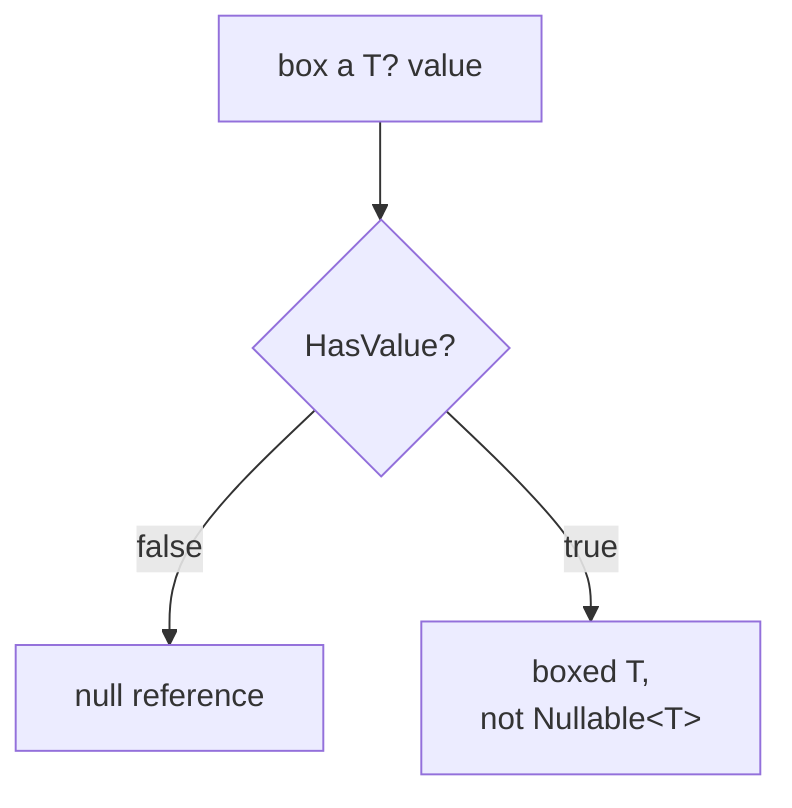

# Value vs Reference Types

What a name actually holds: a value, a reference, or a value plus a flag. Built for lookup when predicting copy-vs-reference behaviour.

## Struct vs class: what assignment does

| | Struct (value type) | Class (reference type) |
|---|---|---|
| Assignment | Copies the entire value | Copies the reference |
| Two variables holding "the same" data | Independent copies; mutating one never affects the other | Can point at the same object; mutating through either is visible through both |
| Where it lives | Typically inline: inside a containing object, an array slot, or on the stack | Always on the managed heap; what you hold is a reference to it |
| Passing to a method | Copies into the parameter | Passes the reference |

Java has no equivalent choice: every user-defined type is a class, so "assignment aliases" is always true there. In C#, that assumption only holds for classes.

## When a struct is the right call

Reach for a `struct` when a type is **small, logically immutable, and represents a single value** (a 2D point, a money amount, an RGB color), the role Java's primitives play, extended to user-defined types. Default to a `class` for anything with identity that matters, anything large, or anything meant to be mutated through shared references.

**The mutable-struct footgun**: because a struct copies on every access, mutating a struct returned from a property or an indexer often mutates a temporary copy, not the object intended, and the compiler doesn't always warn. This is the mirror image of the class-aliasing surprise: there, sharing happens when independence was expected; here, independence happens when sharing was expected.

**A struct as a dictionary key is safe by construction**: it copies on assignment, so its hash can't be mutated out from under the dictionary. A mutable class used as a key is the hazard.

## Nullable value types: null is a flag, not a reference

`T?` is shorthand for `System.Nullable<T>`, still a value type. No reference is involved: the default value of a nullable value type represents `null`, an instance whose `HasValue` is `false`. Java's nullable number is an `Integer`, a heap reference that may point at nothing; C#'s is a value carrying a boolean saying whether it counts.

**Four ways to extract the value:**

| Written | When there is a value | When there is not |
|---|---|---|
| `if (a is int v)` | Binds `v` to the value | Takes the else branch |
| `a.Value` | Returns it | Throws `InvalidOperationException` |
| `a ?? -1` | Returns it | Returns `-1` |
| `(int)a` | Returns it | Throws `InvalidOperationException` at runtime |

`int m = n;` (implicit, no cast) does not compile at all; `int m = (int)n;` compiles and throws. The cast moves the problem from build time to run time.

**Comparison rule** (the part that bites): for `<`, `>`, `<=`, `>=`, a `null` operand makes the result **`false`**, in both directions. `10 >= null` and `10 < null` are both `false`. Do not assume a `false` comparison means the opposite direction is `true`; `!(a >= b)` is not the same claim as `a < b` once either side can be null. (Java's equivalent, unboxing a null `Integer` into a comparison, throws `NullPointerException` instead: loud, where C# is silent.)

**Lifted operators propagate null**: `int? a = 10; int? b = null;` gives `a + b == null`. Exception: `bool?`'s predefined `&` and `|` do not follow this rule and can produce a non-null result from a null operand.

**Boxing erases the wrapper**: boxing a `T?` with `HasValue == false` produces a null reference; boxing one with `HasValue == true` boxes the underlying `T`, not the `Nullable<T>` instance. `GetType()` on a nullable value type therefore reports the underlying type, not "nullable"; ask the type, not the instance: `Nullable.GetUnderlyingType(typeof(int?)) != null`.

Nullable **reference** types (`string?` vs `string`) are a separate, compiler-flow-analysis feature, not this wrapper; same `?`, different mechanism.

## decimal: a built-in value type built for money

`decimal` carries 28-29 significant digits in 16 bytes (versus `double`'s ~15-17 in 8 bytes) and has no `NaN` or infinity to let a bad computation propagate silently. It is a built-in value type with operators, so `total = price * quantity` reads as arithmetic, unlike Java's `BigDecimal`, a class used through method calls (`a.add(b).multiply(c)`).

## Related

- [Lesson 1](../lessons/0001-structs-and-classes.md), [Lesson 2](../lessons/0002-nullable-value-types.md), [Lesson 3](../lessons/0003-basic-types-and-string-interpolation.md), [Lesson 4](../lessons/0004-collections.md), [Lesson 6](../lessons/0006-exceptions.md)
