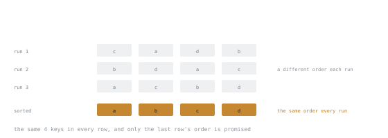

# Lesson 4. Maps and Their Rules

**Mission link:** A map is the default data structure in a Go service, and three of its rules have no equivalent in Java or TypeScript, including one that kills the process rather than raising an error.
**Primary source:** [Go maps in action, The Go Blog](https://go.dev/blog/maps)
**Prerequisites:** [Lesson 3](0003-slices-and-the-backing-array.md)

## Warm-up

1. ▢ `a := []int{1,2,3,4,5}; b := a[:2]; b = append(b, 30)`. What is `a`?

<details markdown="1"><summary>Check</summary>

`[1 2 30 4 5]`. `b` had spare capacity, so `append` wrote into `a`'s backing array instead of allocating.

</details>

2. ▢ What does the three-index form `s[1:3:3]` change, and why would you write it?

<details markdown="1"><summary>Check</summary>

It sets the capacity to 3, so the resulting slice has no spare room and the next `append` must allocate. You write it when handing a sub-slice to code that may append, so that code cannot reach into your storage.

</details>

## Know this

A map is a hash table with a copied pointer for a header, so passing one to a function shares the table. It must be made before it can be written:

```go
m := make(map[string]int)          // empty, ready to write
n := map[string]int{"a": 1}        // literal
p := make(map[string]int, 1000)    // size hint, pre-sizes, avoiding repeated growth
```

The size hint is a hint. It changes allocation behaviour, not semantics, and `cap` is not defined on maps.

### Comma-ok separates absent from zero

`m[k]` always returns something: the zero value if the key is missing. That is convenient and ambiguous, since a stored `0` and a missing key look identical. The second return value resolves it:

```go
v, ok := m["k"]   // ok is false when the key is absent
if !ok { ... }
```

Use the one-value form when the zero value is a fine answer (counters, accumulators). Use comma-ok when absence is a distinct case. `delete(m, k)` is a no-op on a missing key and never panics.

### Iteration order is randomised on purpose

Ranging a map visits keys in an unspecified order, and the runtime deliberately randomises the starting point so the order differs between runs of the same program on the same data. This is not an accident of the implementation. It exists to stop code from depending on an order that was never promised.



Every row holds the same keys. Only the sequence changes, and only the last row's sequence is something you were promised.

To produce stable output, collect and sort:

```go
keys := slices.Sorted(maps.Keys(m))   // Go 1.23: maps.Keys returns an iterator
for _, k := range keys {
    fmt.Println(k, m[k])
}
```

### Elements are not addressable

You cannot take the address of a map element, and the reason is that the table may move entries as it grows, which would leave the pointer dangling. The visible consequence catches everyone once:

```go
type Stat struct{ N int }
m := map[string]Stat{"a": {}}
m["a"].N++     // compile error: cannot assign to struct field m["a"].N in map
```

Two fixes. Store pointers, `map[string]*Stat`, and mutate through them, so the map holds addresses that stay valid. Or read, modify, write back:

```go
s := m["a"]
s.N++
m["a"] = s
```

Pointers are the usual answer when the value is mutated often; the read-modify-write is fine for a value updated in one place. Note that `m[k]++` on a `map[string]int` is legal, because that is a whole-element assignment, not a field assignment.

### A shared map is a fatal error, not a race you get to handle

Maps are not safe for concurrent use, and Go does not leave this to chance. The runtime detects many cases of concurrent access and throws:

```text
fatal error: concurrent map writes
```

A `fatal error` is not a panic. `recover` cannot catch it, deferred functions do not run, and the process dies. That is a deliberate trade: silent corruption of a hash table is worse than a crash.

The detector is best-effort, so a clean run is not proof of correctness; [Lesson 20](0020-memory-model-and-races.md) covers the tool that is. Guard shared maps with a `sync.Mutex`, or use `sync.Map` in the narrow cases it is built for (stage 3).

### Key types must be comparable

Keys must support `==`: booleans, numbers, strings, pointers, channels, interfaces, and structs or arrays of those. Slices, maps and functions are not comparable and cannot be keys. A struct key is idiomatic and useful:

```go
type point struct{ X, Y int }
grid := map[point]string{}
```

An interface key compiles and can still panic at runtime, if the dynamic value inside it turns out to be a slice.

## Practice

1. ▢ `m := map[string]int{"a": 0}`. Distinguish the two cases below in code.

   ```go
   // key "a" exists with value 0
   // key "b" does not exist
   ```

<details markdown="1"><summary>Check</summary>

```go
v, ok := m["a"]  // 0, true
v, ok = m["b"]   // 0, false
```

The one-value form returns `0` for both, which is the ambiguity comma-ok exists to remove. Reaching for a sentinel like `-1` to mean "missing" is the wrong instinct, since the language already gives you a clean answer.

</details>

2. ▢ Why does this fail to compile, and give both fixes.

   ```go
   type Stat struct{ N int }
   m := map[string]Stat{"a": {}}
   m["a"].N++
   ```

<details markdown="1"><summary>Check</summary>

Map elements are not addressable, because the table may relocate entries when it grows, so there is no stable address to assign through.

Fix one: `map[string]*Stat`, then `m["a"].N++` works because you are assigning through a pointer the map merely stores. Fix two: read into a local, mutate, assign back.

</details>

3. ▢ Two goroutines write to the same map with no synchronisation. Which is the most accurate description?

   - a) A data race the detector may report when it is run
   - b) A fatal runtime error that recover cannot intercept
   - c) A panic the caller can recover from and retry
   - d) Undefined behaviour that silently corrupts the table

<details markdown="1"><summary>Check</summary>

**b)** A fatal runtime error that recover cannot intercept.

It is also a data race, so a is true but incomplete, and the practical difference matters: a race may go unreported, whereas the map detector, when it fires, ends the process. It is not a recoverable panic, and it is not silent corruption, because the runtime chose the crash specifically to prevent that.

</details>

4. ▢ A test asserts on the output of a function that ranges a map and writes lines to a buffer. It passes locally and fails in CI. Explain, and fix it.

<details markdown="1"><summary>Check</summary>

Map iteration order is randomised per run, so the lines come out in a different order and the string comparison fails. Locally it passed by luck, and with a small map luck holds surprisingly often.

Fix the function if the output is user-facing, by sorting the keys before ranging. Fix the test if the order is genuinely irrelevant: compare a sorted slice, or a `map[string]string` of expected values, rather than a concatenated string.

</details>

5. ▢ Interleaving Lesson 1 and 3: for each expression, is it safe on a nil value: `len(m)`, `m["k"]`, `range m`, `m["k"] = 1`, `delete(m, "k")`?

<details markdown="1"><summary>Check</summary>

All safe except `m["k"] = 1`, which panics with `assignment to entry in nil map`.

A nil map is a usable empty map for every read-shaped operation, including `delete`. Only a write needs storage. This is exactly the nil-slice rule from Lesson 1, with one carve-out, and that carve-out is the reason a struct field of map type usually does need initialising, while a slice field does not.

</details>

## Real-world reps

- [ ] Write a program that prints the keys of a five-element map, and run it ten times. Watch the order change. Then make the output stable with `slices.Sorted(maps.Keys(m))`.
- [ ] Reproduce the fatal error: start two goroutines writing to one map in a loop. Note that the output says `fatal error`, not `panic`, and that no deferred function runs.
- [ ] Tomorrow: find a `map[string]SomeStruct` in code you work with. Decide whether it should hold pointers, and write down the reason in one sentence. It is a design choice most codebases make by accident.

## Going further

- [Go maps in action, The Go Blog](https://go.dev/blog/maps)
- [`maps` package](https://pkg.go.dev/maps): `Keys`, `Values`, `Clone`, `Equal`
- [Slice and Map Mechanics](../reference/slice-and-map-mechanics.md): the lookup version of this lesson and the last one
- [Resources](../RESOURCES.md)

---

Not landing? Reread the primary source at the top, since this lesson compresses it and compression is where understanding leaks. Check the [glossary](../GLOSSARY.md) for any term that felt slippery.

If the lesson itself is unclear rather than the material, that is a defect: [open an issue](https://github.com/TokenCemetery/teach/issues).
