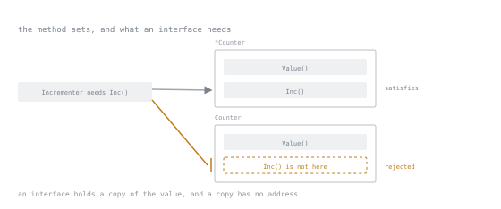

# Lesson 6. Methods and Method Sets

**Mission link:** The receiver choice looks like a mutation question and is really a type question. It decides, silently, whether your type satisfies the interface you are about to write.
**Primary source:** [Go FAQ: Should I define methods on values or pointers?](https://go.dev/doc/faq#methods_on_values_or_pointers)
**Prerequisites:** [Lesson 2](0002-value-semantics-and-pointers.md), [Lesson 4](0004-maps-and-their-rules.md)

## Warm-up

1. ▢ `for i, r := range "héllo"`: why does `i` jump from 1 to 3?

<details markdown="1"><summary>Check</summary>

`i` is a byte index and `é` occupies two bytes. `range` decodes UTF-8 and yields runes, so it skips past the continuation byte.

</details>

2. ▢ A function takes a `[]int`, appends to it, and does not return it. What does the caller see?

<details markdown="1"><summary>Check</summary>

Nothing new. The new length only ever lands in the local copy of the header. Whether the *element* was written into shared storage depends on capacity, but the caller's length never changes.

</details>

## Know this

A method is a function with a receiver, declared on any named type in the same package, not only structs:

```go
type Celsius float64

func (c Celsius) String() string { return fmt.Sprintf("%.1f°C", float64(c)) }
```

Receivers are named with one or two letters, used consistently across every method on the type. `c`, not `this`, not `self`, and not a different name in each method.

### The two receiver forms

```go
func (c Counter) Value() int { return c.n }  // value receiver, operates on a copy
func (c *Counter) Inc()      { c.n++ }       // pointer receiver, operates on the original
```

Go inserts the address or the dereference for you when the value is **addressable**:

```go
var c Counter
c.Inc()   // shorthand for (&c).Inc(), c is a variable, so it has an address
```

Addressability is where it stops being automatic. Map elements and function results have no address, so a pointer method cannot be called on them:

```go
m := map[string]Counter{"a": {}}
m["a"].Inc()   // compile error: cannot call pointer method Inc on Counter
```

Same rule as the unassignable map field from Lesson 4, wearing a different error message.

### The method set is what interfaces see

Here is the part that surprises people, and the reason this is its own lesson:

| Receiver of the method | In the method set of `T` | In the method set of `*T` |
|---|---|---|
| value, `func (t T)` | yes | yes |
| pointer, `func (t *T)` | **no** | yes |

Method sets are asymmetric. `*T` has everything; `T` has only the value-receiver methods. Calling through a variable hides this, since `c.Inc()` works fine, but interface satisfaction does not:

```go
type Incrementer interface{ Inc() }

var _ Incrementer = &Counter{}   // ok
var _ Incrementer = Counter{}    // compile error: Inc method has pointer receiver
```



Satisfaction is membership, not a rule to memorise: `Inc()` is a row in one box and an empty slot in the other, and the check that fails is the one looking in the box without it.

The reason is that an interface holds a copy of the value put into it, and that copy has no address. Letting `Counter{}` satisfy `Incrementer` would mean calling `Inc` on a copy nobody can name, mutating something no one can observe. Rather than allow that, the language removes the method from the set.

`var _ Incrementer = (*Counter)(nil)` at package level is the idiomatic compile-time assertion that the relationship holds. It costs nothing at runtime and it fails the build the day someone changes a receiver.

### Pick one form per type

The rule that keeps this manageable: **choose value or pointer receivers per type, not per method.** Mixing them means the method set depends on which method you are asking about, and callers have to track which form they are holding.

Use pointer receivers when any method mutates, when the type contains a `sync.Mutex` or another copy-hostile field, or when the type is already handled through pointers everywhere. Use value receivers for small immutable types: `time.Time` and the `Celsius` above are the shape. When in doubt on a struct, pointer receivers are the safer default, because adding a mutating method later then costs nothing.

## Practice

1. ▢ `Counter` has only `func (c *Counter) Inc()`. Which compiles: `var c Counter; c.Inc()`, or `var i Incrementer = Counter{}`?

<details markdown="1"><summary>Check</summary>

The first compiles, the second does not.

`c` is a variable and therefore addressable, so Go rewrites the call as `(&c).Inc()`. The interface assignment has no variable to address, because it copies the `Counter` into the interface, so `Inc` is not in `Counter`'s method set and the assignment is rejected.

The lesson is that a working method call tells you nothing about interface satisfaction.

</details>

2. ▢ Why does `m["a"].Inc()` fail when `m` is `map[string]Counter`, but succeed when `m` is `map[string]*Counter`?

<details markdown="1"><summary>Check</summary>

In the first case the element is not addressable, so Go cannot produce the `*Counter` that `Inc` requires. In the second the map already stores a pointer; nothing needs addressing, and the method is called on the value the map handed back.

This is the same constraint as `m["a"].N++` in Lesson 4: the map refusing to hand out addresses into storage it may relocate.

</details>

3. ▢ A type has `func (s Server) Name() string` and `func (s *Server) Start() error`. What does `var _ Runner = Server{}` do, where `Runner` requires both methods?

   - a) Compiles, and `Start` operates on a copy
   - b) Compiles, but panics when `Start` runs
   - c) Fails to compile, because `Start` needs a pointer
   - d) Fails to compile, because receivers are mixed

<details markdown="1"><summary>Check</summary>

**c)** Fails to compile, because `Start` needs a pointer.

`Server`'s method set contains only `Name`. Mixing receiver forms is a style problem rather than a compile error, so d names a real smell but not the reason this line is rejected. `&Server{}` satisfies `Runner`.

</details>

4. ▢ You add a `sync.Mutex` field to a struct whose methods all use value receivers. Name what breaks.

<details markdown="1"><summary>Check</summary>

Every method call copies the struct, and therefore the mutex. Each copy locks its own mutex, so nothing is actually excluded and the type provides no protection while appearing to.

`go vet`'s `copylocks` check reports the copy. The fix is to convert the type to pointer receivers throughout, which is the practical argument for choosing them by default on structs that might ever grow state.

</details>

5. ▢ Interleaving Lesson 1: is `var c Counter`, with no constructor, ready for `c.Inc()`?

<details markdown="1"><summary>Check</summary>

Yes, provided every field is usable at its zero value, which `n int` and an embedded `sync.Mutex` both are.

The zero-value rule and the receiver rule meet here: the type is usable unconstructed, and it must be used through a pointer. `NewCounter() *Counter` earns its place only if it has something real to set.

</details>

## Real-world reps

- [ ] Write `Counter` with a pointer-receiver `Inc` and a value-receiver `Value`. Then declare `var _ Incrementer = Counter{}` and read the compile error carefully. It names the receiver, which is the clue you will want later.
- [ ] Take a type you have written in another language with getters and setters. Write the Go version and count how many methods survive. Most getters do not.
- [ ] Tomorrow: find a struct in a real codebase with mixed receivers. Work out whether the mix was deliberate. Note what it would take to unify them.

## Going further

- [Go FAQ: methods on values or pointers](https://go.dev/doc/faq#methods_on_values_or_pointers)
- [Method sets, in the language spec](https://go.dev/ref/spec#Method_sets)
- [Go Code Review Comments: receiver type](https://go.dev/wiki/CodeReviewComments#receiver-type): the reasoning a reviewer will cite
- [Lesson 11. Interfaces Are Satisfied Implicitly](0011-implicit-interfaces.md): where method sets start to bite
- [Resources](../RESOURCES.md)

---

Not landing? Reread the primary source at the top, since this lesson compresses it and compression is where understanding leaks. Check the [glossary](../GLOSSARY.md) for any term that felt slippery.

If the lesson itself is unclear rather than the material, that is a defect: [open an issue](https://github.com/TokenCemetery/teach/issues).
