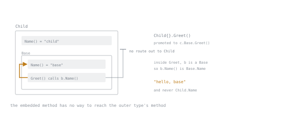

# Lesson 13. Embedding Is Not Inheritance

**Mission link:** Embedding is the feature most often mistaken for something it is not. The mistake produces code that behaves correctly in every test you thought to write and wrongly in the one you did not.
**Primary source:** [Effective Go: Embedding](https://go.dev/doc/effective_go#embedding)
**Prerequisites:** [Lesson 11](0011-implicit-interfaces.md)

## Warm-up

1. ▢ When is an interface value equal to nil?

<details markdown="1"><summary>Check</summary>

Only when both its type word and its value word are nil. A nil pointer stored in an interface makes the interface non-nil.

</details>

2. ▢ What does "accept interfaces, return structs" mean for a constructor?

<details markdown="1"><summary>Check</summary>

Take the narrowest interface you actually use as a parameter, and return the concrete type, so callers keep every method and choose their own abstraction.

</details>

## Know this

An **embedded field** is a field with a type and no name:

```go
type ReadCloser struct {
    io.Reader        // embedded
    name   string    // ordinary field
}
```

Its exported fields and methods are **promoted**: you can call `rc.Read(p)` and Go rewrites it as `rc.Reader.Read(p)`. Promotion is also enough for interface satisfaction, so `ReadCloser` satisfies `io.Reader` without writing a `Read` method.

That is all embedding does: **it saves you writing delegation methods.** There is no subtyping, no protected access, and no virtual dispatch.

### The thing that is not inheritance

```go
type Base struct{}
func (b Base) Name() string  { return "base" }
func (b Base) Greet() string { return "hello, " + b.Name() }

type Child struct{ Base }
func (c Child) Name() string { return "child" }

fmt.Println(Child{}.Greet())   // hello, base
```

In Java this prints `hello, child`. In Go it prints `hello, base`, and the reason is mechanical: `Greet` is a method on `Base` with a `Base` receiver. When it calls `b.Name()`, `b` is a `Base`, and `Base` has exactly one `Name`. `Child` is not a `Base` with extras. It is a struct that *contains* a `Base` and knows nothing about it from the inside.



`Base` is drawn inside `Child` because containment is what the language gives you here. The arrow that resolves goes one box in; the arrow that would reach back out has nothing to travel along.

There is no way to make the embedded method call the outer one. If a type needs that, the outer type must implement `Greet` itself, or the dependency must be inverted with an interface field the outer type supplies. Template-method designs do not port to Go; they get rewritten as a function that takes a function.

### Name resolution

Promotion follows depth. A field or method declared on the outer type shadows a promoted one, and the shallower of two promoted names wins. Two promoted names at the *same* depth are ambiguous, and that is only an error at the point where you use the name, not where you declare the struct:

```go
type A struct{}; func (A) Do() {}
type B struct{}; func (B) Do() {}
type C struct{ A; B }   // fine

c.Do()                  // ambiguous selector c.Do
c.A.Do()                // explicit, fine
```

### Embedding an interface

You can embed an interface in a struct. The struct then satisfies the interface using whatever was stored, and you override only what you need:

```go
type loggingStore struct {
    Store           // embedded interface
    log *slog.Logger
}

func (s loggingStore) Get(ctx context.Context, id string) (*User, error) {
    s.log.Info("get", "id", id)
    return s.Store.Get(ctx, id)
}
```

Every other method passes through untouched. This is the idiomatic decorator, and it survives new methods being added to `Store`, where a hand-written wrapper would fail to compile until updated, which may or may not be what you want. It also means a nil embedded interface panics on any method you did not override, so the decorator must be constructed properly.

### The one to be careful with

```go
type Cache struct {
    sync.Mutex        // Lock and Unlock are now exported API
    m map[string]int
}
```

Embedding promotes exported names, so callers outside the package can now call `cache.Lock()`. That is almost never intended: locking is an implementation detail, and exposing it invites deadlocks from code you do not control. Give it a name instead, `mu sync.Mutex`, and embed only when the promotion is the point.

The same question applies to every embed. Ask what you are exporting, not just what you are reusing.

## Practice

1. ▢ Predict the output, and say what a Java developer would expect.

   ```go
   type Base struct{}
   func (b Base) Name() string  { return "base" }
   func (b Base) Greet() string { return "hello, " + b.Name() }
   type Child struct{ Base }
   func (c Child) Name() string { return "child" }

   fmt.Println(Child{}.Greet())
   ```

<details markdown="1"><summary>Check</summary>

`hello, base`. Java would print `hello, child`.

`Greet` has a `Base` receiver, so `b.Name()` resolves to `Base.Name` at compile time. `Child` is a struct containing a `Base`; the `Base` inside has no reference back to the `Child` that holds it. There is no vtable and no dynamic lookup to redirect the call.

</details>

2. ▢ You embed `sync.Mutex` in an exported struct. What did you just add to your package's API?

<details markdown="1"><summary>Check</summary>

`Lock()` and `Unlock()`, callable by anyone importing the package.

Nothing about your locking discipline holds any more, because a caller can take the lock and never release it, or release one you hold. Use a named field `mu sync.Mutex` unless exposing the lock is a deliberate part of the design, which it occasionally is for types documented as "embed me".

</details>

3. ▢ `type C struct { A; B }`, where both `A` and `B` have a `Do()` method. When does this fail?

   - a) At the struct declaration, as an ambiguous embed
   - b) At the call site `c.Do()`, as an ambiguous selector
   - c) At the call site `c.A.Do()`, which needs qualifying
   - d) At link time, when both methods are present

<details markdown="1"><summary>Check</summary>

**b)** At the call site `c.Do()`, as an ambiguous selector.

The declaration is legal: Go only complains when you use a name it cannot resolve. `c.A.Do()` is the explicit form and always works. This is worth knowing because the error surfaces in a file that did not change.

</details>

4. ▢ You want to log every call to a `Store` interface with twelve methods. Compare embedding the interface against writing a struct that holds it as a named field.

<details markdown="1"><summary>Check</summary>

Embedding gives you the eleven pass-throughs for free; you write only the method you want to log. Adding a thirteenth method to `Store` keeps compiling, silently unlogged.

A named field means writing all twelve delegations, and adding a thirteenth method breaks the build until you write it. Same trade in both directions: embedding optimises for convenience, the named field for being told when the interface grows. Pick by whether silent pass-through is a feature or a hazard. For a logger it is fine; for an authorisation wrapper it is a security bug.

</details>

5. ▢ Interleaving Lesson 11: you have a `Base` with shared behaviour and three types that need to customise one step of it. What is the Go design?

<details markdown="1"><summary>Check</summary>

Not embedding. Make the varying step a parameter: a function value, or a small interface the shared code accepts.

```go
func Run(ctx context.Context, step func(context.Context) error) error
```

The template-method pattern relies on the base calling an overridden method, which is exactly what Go does not do. Passing the behaviour in makes the customisation point visible in the signature, and it is testable without constructing a type.

</details>

## Real-world reps

- [ ] Run the `Base`/`Child` example and confirm the output before reading it again. Then add a `Greet` on `Child` that calls `c.Base.Greet()` and see what changes.
- [ ] Write the logging decorator by embedding an interface. Add a method to the interface afterwards, note that nothing breaks, and decide whether you like that.
- [ ] Tomorrow: find an embedded field in a codebase you work with. Ask what it promotes into the exported API, and whether that was intended.

## Going further

- [Effective Go: Embedding](https://go.dev/doc/effective_go#embedding)
- [Struct embedding, in the language spec](https://go.dev/ref/spec#Struct_types)
- [Go Code Review Comments: interfaces](https://go.dev/wiki/CodeReviewComments#interfaces)
- [Resources](../RESOURCES.md)

---

Not landing? Reread the primary source at the top, since this lesson compresses it and compression is where understanding leaks. Check the [glossary](../GLOSSARY.md) for any term that felt slippery.

If the lesson itself is unclear rather than the material, that is a defect: [open an issue](https://github.com/TokenCemetery/teach/issues).
