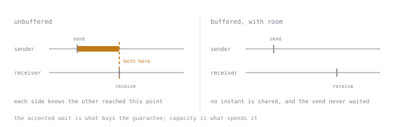

# Lesson 16. Channels

**Mission link:** A channel is Go's synchronisation primitive as well as its queue. Using it as only a queue is how deadlocks and leaks get written.
**Primary source:** [Effective Go: Channels](https://go.dev/doc/effective_go#channels)
**Prerequisites:** [Lesson 15](0015-goroutines-and-what-they-cost.md)

## Warm-up

1. ▢ What happens to running goroutines when `main` returns?

<details markdown="1"><summary>Check</summary>

They are killed where they stand, with no deferred functions run. There is no `Join`, so coordination has to be explicit.

</details>

2. ▢ Since Go 1.22, is the loop variable shared between iterations?

<details markdown="1"><summary>Check</summary>

No, each iteration gets its own. But the behaviour follows the `go` directive in `go.mod`, so a module declaring `go 1.21` still gets the old sharing from a new toolchain.

</details>

## Know this

A channel is a typed conduit with a built-in happens-before guarantee. Creating one requires `make`; the zero value is nil and blocks forever.

```go
ch := make(chan int)      // unbuffered
buf := make(chan int, 8)  // buffered, capacity 8
```

### Unbuffered is a rendezvous

An unbuffered send blocks until a receiver is ready, and an unbuffered receive blocks until a sender is. Both sides leave the exchange knowing the other reached that point. That synchronisation is usually the reason to use one; the value is almost incidental.



The line crossing both lanes is the guarantee, and it exists only because the sender stopped. That is the trade in one picture: the wait is not a cost the channel imposes on the way to delivering a value, it is the thing being bought.

A buffered channel decouples them: a send completes as long as there is room, and the sender learns nothing about the receiver. Capacity buys throughput and gives up the guarantee. Choose the buffer size for a reason you can state, such as a known batch size or a pipeline stage's tolerance for jitter, not to make a deadlock go away. A deadlock that a buffer hides comes back under load.

### Closing is a broadcast

`close(ch)` says *no more values will be sent*. Every receiver is released:

```go
v, ok := <-ch   // ok is false once the channel is closed and drained
for v := range ch { ... }   // ends when the channel is closed
```

Receiving from a closed channel returns the zero value immediately, forever. That makes `close` the standard way to signal many goroutines at once, which is exactly how `context.Done` works.

The rules that produce panics:

| Operation | On a closed channel | On a nil channel |
|---|---|---|
| send | panic | blocks forever |
| receive | zero value, `ok == false` | blocks forever |
| close | panic | panic |

Hence the convention: **only the sender closes, and only when there is exactly one sender.** A receiver closing a channel gives the sender a panic. With multiple senders, close a separate "done" channel, or use `sync.WaitGroup` to wait for all senders and have a single goroutine close after that.

You do not have to close a channel. Closing is a signal, not cleanup: an unclosed channel with no references is garbage collected normally.

### Direction is part of the type

```go
func produce(out chan<- int)   // send-only
func consume(in <-chan int)    // receive-only
```

Conversion from a bidirectional channel is implicit at the call site, so this costs nothing and documents the intent. A `consume` that takes `<-chan int` cannot close the channel or send to it, and the compiler enforces it.

### Nil channels are a tool

A nil channel blocking forever sounds useless until you meet `select` in the next lesson: setting a channel variable to nil disables that case permanently, which is how you stop selecting on a source that is finished.

### Deadlock

If every goroutine is blocked, the runtime detects it and ends the process:

```text
fatal error: all goroutines are asleep - deadlock!
```

This is a fatal error, not a panic: `recover` cannot catch it, exactly like the concurrent map error from Lesson 4. It only fires when *every* goroutine is stuck. Two goroutines deadlocked while a third serves HTTP traffic produce no message at all, which is the common case in a real service, and why Lesson 21 exists.

## Practice

1. ▢ Why does this deadlock?

   ```go
   func main() {
       ch := make(chan int)
       ch <- 1
       fmt.Println(<-ch)
   }
   ```

<details markdown="1"><summary>Check</summary>

The channel is unbuffered, so `ch <- 1` blocks until a receiver is ready. The only code that could receive is the next line in the same goroutine, which will never run. Every goroutine is blocked, so the runtime reports `all goroutines are asleep - deadlock!`.

`make(chan int, 1)` makes it work, and that is the wrong lesson to take: the fix is to receive in another goroutine. A buffer that exists to prevent a deadlock is a deadlock deferred until the buffer fills.

</details>

2. ▢ Three goroutines send on one channel. Who closes it?

<details markdown="1"><summary>Check</summary>

None of them individually. Whoever closes first causes the other two to panic on their next send.

Use a `sync.WaitGroup`: each sender calls `wg.Done` when finished, and one separate goroutine does `wg.Wait()` then `close(ch)`. The receiver's `range` then terminates exactly once, after the last value.

</details>

3. ▢ Which operation panics?

   - a) Receiving from a channel that has been closed
   - b) Sending a value to a channel already closed
   - c) Receiving from a channel that is still nil
   - d) Ranging over a channel that was never closed

<details markdown="1"><summary>Check</summary>

**b)** Sending a value to a channel already closed.

Receiving from a closed channel yields the zero value with `ok == false`. A nil channel blocks forever rather than panicking. Ranging an unclosed channel blocks forever once drained, which is a leak rather than a panic, and the subject of Lesson 21.

</details>

4. ▢ When is a buffered channel the right choice over an unbuffered one?

<details markdown="1"><summary>Check</summary>

When you can name the capacity from the problem: a semaphore of exactly N permits, a batch of known size, a fan-in whose producers should not block on brief consumer jitter.

The wrong reason is "to be faster" or "so the send does not block". Both trade away the delivery guarantee for headroom, and a full buffer blocks anyway, later and further from the cause.

</details>

5. ▢ Interleaving Lesson 4: how does the deadlock message differ from `fatal error: concurrent map writes` in what it tells you?

<details markdown="1"><summary>Check</summary>

Both are fatal errors that `recover` cannot intercept, and both end the process.

The difference is coverage. The map detector fires whenever it observes the misuse, in any goroutine, while a live process keeps serving. The deadlock detector fires only when *every* goroutine in the program is blocked, so in a service with an HTTP listener parked in `Accept` it never fires. Real services deadlock silently and are found with a goroutine profile.

</details>

## Real-world reps

- [ ] Write a producer and a consumer connected by an unbuffered channel. Print before and after each send and receive to see the rendezvous.
- [ ] Take the three-sender case and get the close right with a `WaitGroup`. Then deliberately close from a sender and watch the panic. Recognising it later is worth the two minutes.
- [ ] Tomorrow: find a `make(chan T, N)` in code you work with and ask what chose `N`. If nobody knows, that is a finding.

## Going further

- [Effective Go: Channels](https://go.dev/doc/effective_go#channels)
- [Go Concurrency Patterns: Pipelines and cancellation, The Go Blog](https://go.dev/blog/pipelines)
- [Concurrency Patterns](../reference/concurrency-patterns.md)
- [Resources](../RESOURCES.md)

---

Not landing? Reread the primary source at the top, since this lesson compresses it and compression is where understanding leaks. Check the [glossary](../GLOSSARY.md) for any term that felt slippery.

If the lesson itself is unclear rather than the material, that is a defect: [open an issue](https://github.com/TokenCemetery/teach/issues).
