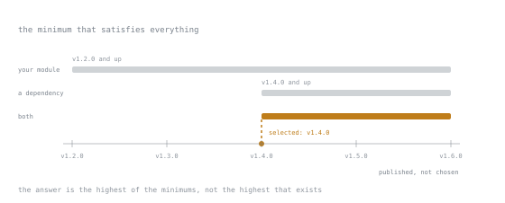

# Lesson 33. Modules and Release Builds

**Mission link:** Shipping means someone else builds your code and someone else runs the binary. Both depend on decisions in `go.mod` and on four build flags.
**Primary source:** [Go Modules Reference, The Go Authors](https://go.dev/ref/mod)
**Prerequisites:** [Lesson 7](0007-packages-and-modules.md), [Lesson 32](0032-escape-analysis-and-allocation.md)

## Warm-up

1. ▢ Which one-line change most reliably removes allocations?

<details markdown="1"><summary>Check</summary>

Preallocating a slice with `make([]T, 0, n)` when the final size is known. It turns repeated grow-and-copy into one allocation.

</details>

2. ▢ How do you ask the compiler why a value escaped?

<details markdown="1"><summary>Check</summary>

`go build -gcflags='-m -m'` and read the reasoning chain for that line.

</details>

## Know this

### Minimal version selection

Go does not resolve dependencies to the newest compatible version. It selects the **minimum version that satisfies every requirement** in the graph. If your module needs `v1.2.0` and a dependency needs `v1.4.0`, you get `v1.4.0`, the highest of the minimums rather than the highest that exists.



Each requirement is everything at or above its minimum, so the answer is just the left edge of the overlap. `v1.6.0` is sitting right there on the axis and nothing reaches for it.

The consequence is worth internalising: **builds are reproducible without a lockfile**, because the answer is a function of the requirements rather than of the day you ran it. Upgrades only happen when someone edits `go.mod`.

```bash
go get example.com/pkg@v1.5.0   # change a requirement
go get -u ./...                 # upgrade everything, deliberately
go mod tidy                     # add what is imported, drop what is not
go mod why example.com/pkg      # why is this in my graph at all
go mod graph                    # the full requirement graph
```

`go.sum` records cryptographic hashes of every module version used. It is not a lockfile, since `go.mod` already pins. It is a tamper check, and it belongs in version control.

### The v2 rule

A module at major version 2 or above must put the major version in its path:

```text
module github.com/you/lib/v2
```

Imports become `github.com/you/lib/v2/thing`. This looks like ceremony and is doing something specific: it makes `v1` and `v2` *different packages*, so one build can contain both. A dependency stuck on `v1` while you move to `v2` is a diamond that would otherwise be unresolvable.

Forgetting the suffix is the most common module mistake. `go get` will keep resolving to `v1.x` and nobody will understand why the new version never arrives.

### Private modules and proxies

`GOPROXY` defaults to the public module proxy, with checksum verification against `GOSUMDB`. For internal code, `GOPRIVATE=github.com/yourorg/*` turns off both for those paths so the go tool fetches directly and does not publish your module names to a public service.

`replace` directives redirect a module path, typically to a local checkout during development. A `replace` in a library's `go.mod` is ignored by consumers and is a common source of "works in the repo, fails for users", so keep them out of anything you publish.

### The `go` and `toolchain` directives

```text
go 1.26
toolchain go1.27.0
```

`go` is the minimum language version, and it selects behaviour: the Lesson 15 loop-variable change and the Lesson 17 timer change are both gated on it. `toolchain` names the toolchain to use, and the go command will download it if the installed one is older. Together they let a repository pin what it builds with while keeping the language floor lower than the newest release.

### Release builds

```bash
CGO_ENABLED=0 go build \
  -trimpath \
  -ldflags="-s -w -X main.version=$(git describe --tags --always)" \
  -o bin/svc ./cmd/svc
```

| Flag | Does |
|---|---|
| `CGO_ENABLED=0` | pure-Go static binary, runs in a `scratch` or `distroless` image with no libc |
| `-trimpath` | removes local filesystem paths from the binary, so builds are reproducible and do not leak your home directory |
| `-ldflags="-s -w"` | strips the symbol table and DWARF data; smaller binary, no debugger |
| `-X main.version=…` | sets a string variable at link time, which is how a binary knows its own version |

Cross-compiling is `GOOS=linux GOARCH=arm64 go build`, and with `CGO_ENABLED=0` it needs no toolchain for the target. That is a genuine Go advantage worth using.

Strip `-s -w` when you need to symbolise a production crash. The size saving is rarely worth a stack trace you cannot read.

### Supply chain

```bash
go install golang.org/x/vuln/cmd/govulncheck@latest
govulncheck ./...
```

`govulncheck` reports known vulnerabilities in your dependencies *and* checks whether your code actually reaches the affected function, so it produces far fewer false alarms than a plain dependency scan. Run it in CI.

Go releases patches roughly every month, and the support policy covers the two most recent major versions, which at the time of writing are Go 1.26 and 1.27. A toolchain older than that receives no security fixes.

## Practice

1. ▢ Your module requires `lib v1.2.0`; a dependency requires `lib v1.4.0`. Which is built?

<details markdown="1"><summary>Check</summary>

`v1.4.0`, the highest of the required minimums.

Minimal version selection takes the maximum across the requirement graph, not the newest published version. So a new release of `lib` does not enter your build until someone edits a `go.mod`, which is what makes builds reproducible without a lockfile.

</details>

2. ▢ You tag `v2.0.0` and nobody's `go get -u` picks it up. Why?

<details markdown="1"><summary>Check</summary>

The module path is missing the `/v2` suffix. Without it, the go tool treats `v2.0.0` as a version of a module that claims to be v1, and it will not select it.

Fix by setting `module github.com/you/lib/v2` in `go.mod` and updating internal imports. It is a breaking change by design: v1 and v2 are different packages, which is exactly what lets both exist in one build.

</details>

3. ▢ Which flag makes a build reproducible across machines?

   - a) `-ldflags="-s -w"` to strip the symbol table
   - b) `-trimpath` to remove local filesystem paths
   - c) `CGO_ENABLED=0` to avoid the C toolchain
   - d) `-race` to enable the data race detector

<details markdown="1"><summary>Check</summary>

**b)** `-trimpath` to remove local filesystem paths.

Without it, the binary embeds the build machine's directory layout, so two builds of identical source differ, and your home directory ships to production. `CGO_ENABLED=0` helps portability rather than reproducibility, stripping changes size, and `-race` belongs nowhere near a release build.

</details>

4. ▢ Why keep `replace` directives out of a published library?

<details markdown="1"><summary>Check</summary>

Because `replace` in a dependency's `go.mod` is ignored: only the main module's directives apply. So the library builds in its own repository and fails for every consumer, with an error pointing at a module path nobody recognises.

Use them for local development and remove them before tagging. In a multi-module repository, a `go.work` file does the same job without touching `go.mod`.

</details>

5. ▢ Interleaving Lesson 15: your `go.mod` says `go 1.21` and you are on the Go 1.27 toolchain. What still behaves as it did in 1.21?

<details markdown="1"><summary>Check</summary>

The loop-variable semantics from Lesson 15 and the timer behaviour from Lesson 17. Both are gated on the `go` directive, not on the installed toolchain.

This is the compatibility mechanism working as designed: upgrading the toolchain never changes your program's behaviour, and raising the `go` line is the deliberate, reviewable step that does. It also means a stale `go` directive quietly keeps you on old semantics.

</details>

## Real-world reps

- [ ] Run `go mod why` on the largest dependency in a project you work on. The answer is often a single transitive import that could be removed.
- [ ] Build a service with `CGO_ENABLED=0 -trimpath -ldflags="-X main.version=..."`, then run the binary and print its version. That is the whole release story in one command.
- [ ] Tomorrow: run `govulncheck ./...` on one repository. It takes a minute, and the reachability analysis makes the output short enough to act on.

## Going further

- [Go Modules Reference](https://go.dev/ref/mod)
- [Module version numbering](https://go.dev/doc/modules/version-numbers)
- [`govulncheck`](https://pkg.go.dev/golang.org/x/vuln/cmd/govulncheck)
- [Go Release History](https://go.dev/doc/devel/release): which versions are still supported
- [Toolchain Commands](../reference/toolchain-commands.md)
- [Resources](../RESOURCES.md)

---

Not landing? Reread the primary source at the top, since this lesson compresses it and compression is where understanding leaks. Check the [glossary](../GLOSSARY.md) for any term that felt slippery.

If the lesson itself is unclear rather than the material, that is a defect: [open an issue](https://github.com/TokenCemetery/teach/issues).
