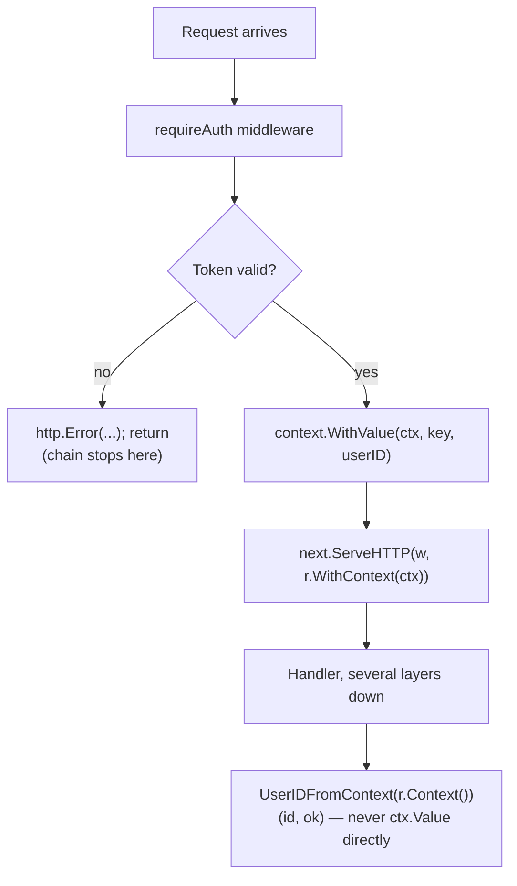

# Lesson 38. Middleware and Request-Scoped Values

**Mission link:** Lesson 22's `withRequestID` middleware wrote a value into the request's context and always called `next`. That's only half the round trip. This lesson is the other half: how a handler several layers down reads that value back out without risking a panic, and the mechanism no example so far has needed, a middleware that decides the request goes no further at all.
**Primary source:** [Go Concurrency Patterns: Context, The Go Blog](https://go.dev/blog/context), [How I write HTTP services in Go, Mat Ryer](https://grafana.com/blog/2024/02/09/how-i-write-http-services-in-go-after-13-years/)
**Prerequisites:** [Lesson 22](0022-an-http-server.md), [Lesson 18](0018-context-cancellation.md)

## Warm-up

1. ▢ Per lesson 18, what rule keeps two packages' context keys from colliding with each other?

<details markdown="1"><summary>Check</summary>

Keys must be an unexported type, such as `type ctxKey struct{}`, so a key one package defines can never be equal to a key another package defines, even if both happen to use the same string value somewhere.

</details>

2. ▢ Per lesson 22, in what order does a chain of middleware see a request, and see the response?

<details markdown="1"><summary>Check</summary>

Inside-out: the outermost wrapper sees the request first and the response last, since each middleware calls the next one and only then does whatever it does with the result on the way back out.

</details>

## Know this

### Retrieving a context value needs the same care storing one didn't show

Lesson 22's `withRequestID` middleware only ever wrote a value in; it never had to read one back out, so it never showed the risk on that side: `ctx.Value(key)` returns `any`, and asserting it to a concrete type directly, `ctx.Value(key).(string)`, panics if the key is missing or the value is some other type. The idiomatic fix is the same comma-ok shape Go already uses everywhere else: an accessor function that performs the assertion once and returns a bool alongside the value.

```go
func RequestIDFromContext(ctx context.Context) (string, bool) {
    id, ok := ctx.Value(ctxKeyRequestID{}).(string)
    return id, ok
}
```

### Business logic calls the accessor, never `ctx.Value` directly

Centralising the type assertion in one function, called everywhere a request ID is needed, means the assertion only has to be gotten right once, and a caller reads `if id, ok := RequestIDFromContext(ctx); ok { ... }` instead of repeating the raw assertion at every call site. This is the same discipline lesson 18 already applied to deciding what belongs in a context at all, "if leaving it out would be a compile error in a well-designed API, it does not belong in a context," now applied to how the value is actually retrieved: a handler's business logic should never touch `ctx.Value` directly, only the named accessor that stands in for it.

### A middleware can simply not call `next`

Every middleware lesson 22 showed always calls `next.ServeHTTP`, eventually, on every request. That's not a requirement of the mechanism, only of those particular examples. An authentication middleware is the clearest case where it isn't true:

```go
func requireAuth(next http.Handler) http.Handler {
    return http.HandlerFunc(func(w http.ResponseWriter, r *http.Request) {
        userID, err := validateToken(r.Header.Get("Authorization"))
        if err != nil {
            http.Error(w, "unauthorized", http.StatusUnauthorized)
            return
        }
        ctx := context.WithValue(r.Context(), ctxKeyUserID{}, userID)
        next.ServeHTTP(w, r.WithContext(ctx))
    })
}
```

On the failure path, the middleware writes the response itself and returns, without ever calling `next`. Nothing downstream, no later middleware and no handler, ever runs for that request; the chain simply stops where the `return` is.

### The two mistakes sit on opposite sides of the same line

Forgetting to call `next` on the success path is a real, silent bug: the request that should have proceeded gets no response at all beyond whatever the middleware itself wrote (or nothing, if it wrote nothing), and there's no error to point at, only a route that mysteriously never runs. Calling `next` anyway on the failure path is the mirror-image mistake: the real handler runs against a request that was supposed to have been rejected, using whatever partial context the middleware built before deciding to fail. Both are the same class of error, calling (or not calling) `next` on the wrong side of a decision, just facing opposite directions.

### One round trip, four places, one accessor function tying them together

An auth middleware validates a request, calls `context.WithValue` with the authenticated user id, and calls `next.ServeHTTP(w, r.WithContext(ctx))`, exactly lesson 22's pattern. Several layers of ordinary function calls later, a handler that has never heard of the middleware calls `UserIDFromContext(r.Context())`, gets a value and an `ok`, and proceeds. Nothing about that handler's signature or its compile-time dependencies mentions the middleware at all; the accessor function is the entire seam between them, which is exactly why lesson 18 restricted context values to metadata like this in the first place, rather than to anything a signature should have named directly.



## Practice

1. ▢ A handler reads a request id with `id := ctx.Value(ctxKeyRequestID{}).(string)` directly, no accessor function, no comma-ok. A request arrives that never passed through the `withRequestID` middleware (a different route, an internal call). What happens?

<details markdown="1"><summary>Hint</summary>

Think about what a missing key's raw `ctx.Value` call actually returns, and what asserting that to `string` does.

</details>

<details markdown="1"><summary>Check</summary>

It panics. `ctx.Value` for a missing key returns `nil`, and a direct, unchecked type assertion to `string` on a `nil` `any` panics rather than returning a usable zero value. The comma-ok accessor form exists precisely to turn this into a checkable `false` instead of a runtime panic.

</details>

2. ▢ Why does centralising `ctx.Value(key).(T)` inside one named accessor function matter beyond just avoiding repetition?

<details markdown="1"><summary>Check</summary>

It means the type assertion only has to be written correctly once, and every caller reads a named, self-documenting function instead of repeating the raw assertion (and its panic risk) at every call site. It's the same reason a well-named function is generally preferred over inlined logic repeated in several places, applied specifically to a place where getting it wrong panics rather than merely duplicating code.

</details>

3. ▢ A middleware's success path calls `next.ServeHTTP(w, r)` using the original request, not `r.WithContext(ctx)`, after building a new context with `context.WithValue`. What's wrong with this?

<details markdown="1"><summary>Check</summary>

The new context, and whatever value was just added to it, never actually reaches `next`, since `r` still carries the original, unmodified context. `next.ServeHTTP` has to be called with `r.WithContext(ctx)`, the request rebuilt to carry the new context, or the value the middleware just stored is invisible to everything downstream.

</details>

4. ▢ An auth middleware's failure branch calls `http.Error(w, "unauthorized", http.StatusUnauthorized)` but forgets the following `return`, so execution falls through to `next.ServeHTTP(...)` afterward. What actually happens to that request?

<details markdown="1"><summary>Check</summary>

The real handler runs anyway, against a request that was supposed to be rejected, likely without a valid user id ever having been placed in the context. This is the calling-next-on-the-failure-path mistake: the response written by `http.Error` and the response the real handler writes both end up attempted against the same request, and the handler is now running with data it should never have received.

</details>

5. ▢ Which claim correctly describes the accessor-function pattern for a context value?

    - a) `ctx.Value(key).(T)` should always be called directly at the point of use, since wrapping it adds indirection with no benefit
    - b) An accessor function wraps the type assertion in a comma-ok return, and business logic should call that accessor rather than touching `ctx.Value` directly, centralising both the assertion's correctness and the panic risk in one place
    - c) A middleware must always call `next.ServeHTTP` exactly once, on every code path, or the program fails to compile
    - d) Storing a value with `context.WithValue` automatically makes it visible to `next.ServeHTTP` regardless of whether the request passed to `next` carries the new context

<details markdown="1"><summary>Check</summary>

**b)** That's the pattern this lesson establishes for safely completing the write-then-read round trip lesson 22 started. (a) is false: a direct, unchecked assertion panics on a missing or wrong-type value, exactly what the accessor's comma-ok form avoids. (c) is false: the compiler enforces nothing about whether `next` gets called; a short-circuiting middleware that never calls it on some path is exactly this lesson's other main point. (d) is false: the new context only reaches `next` if the request is rebuilt with `r.WithContext(ctx)` and that rebuilt request, not the original, is what's passed to `next.ServeHTTP`.

</details>

## Real-world reps

- [ ] Find a `context.WithValue` call in code you have access to, and find where the corresponding value is read back out. Confirm it goes through a named accessor function with a comma-ok return, not a raw, direct type assertion.
- [ ] Find (or write) an authentication or authorization middleware, and confirm its failure path writes a response and returns without calling `next.ServeHTTP`, and that its success path passes the rebuilt request (`r.WithContext(ctx)`), not the original, into `next`.
- [ ] Tomorrow: trace one request-scoped value (a request id, an authenticated user) from the middleware that sets it to the handler that reads it, and write down every place in between that only sees it through the accessor function, never as a compile-time dependency.

## Going further

- [Go Concurrency Patterns: Context, The Go Blog](https://go.dev/blog/context)
- [How I write HTTP services in Go, Mat Ryer](https://grafana.com/blog/2024/02/09/how-i-write-http-services-in-go-after-13-years/)
- [`context` package](https://pkg.go.dev/context)
- [Concurrency Patterns](../reference/concurrency-patterns.md)
- [Resources](../RESOURCES.md)

---

Not landing? Reread the primary source at the top, since this lesson compresses it and compression is where understanding leaks. Check the [glossary](../GLOSSARY.md) for any term that felt slippery.

If the lesson itself is unclear rather than the material, that is a defect: [open an issue](https://github.com/TokenCemetery/teach/issues).
