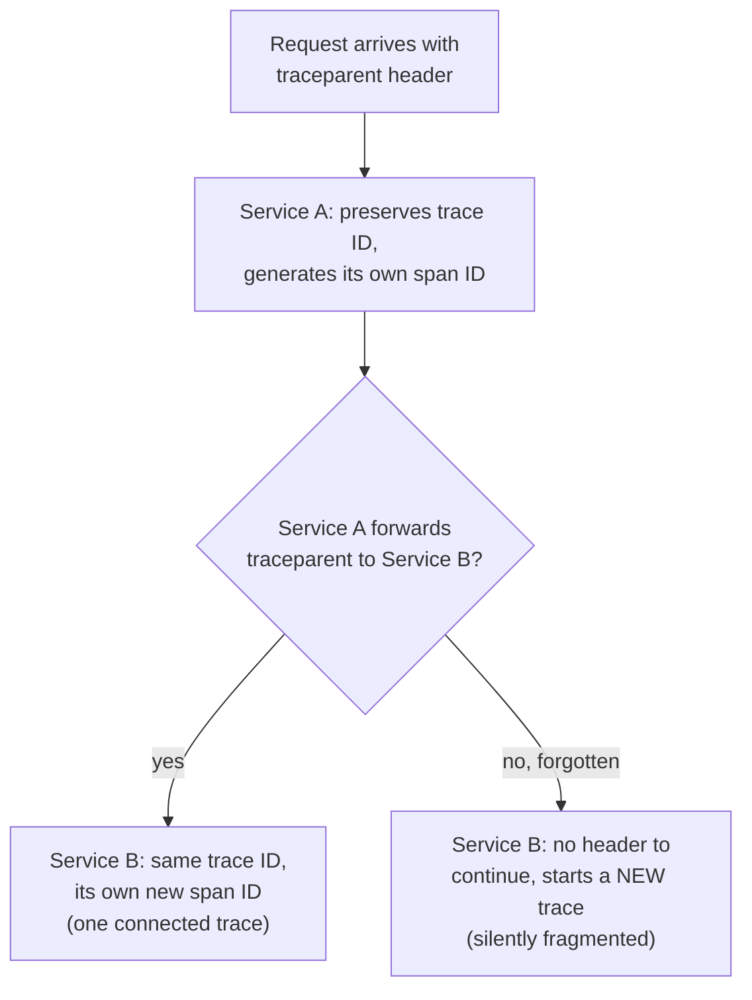

# Lesson 39. Metrics and Tracing

**Mission link:** Lesson 31's `pprof` answers "where did the time and memory in this process go," a question you ask on demand, against one running binary. Metrics and tracing answer two different, ongoing questions in production: how is the service doing right now, in aggregate, and what actually happened to this one specific request as it crossed every service it touched. Neither is what `pprof` measures, and stage 4 shipped a service with logs but neither of these two signals.
**Primary source:** [Instrumentation, OpenTelemetry](https://opentelemetry.io/docs/languages/go/instrumentation/), [Trace Context, W3C](https://www.w3.org/TR/trace-context/)
**Prerequisites:** [Lesson 31](0031-reading-a-pprof-profile.md), [Lesson 38](0038-middleware-and-request-scoped-values.md)

## Warm-up

1. ▢ Per lesson 31, what does a `pprof` profile actually tell you about a running program?

Check

Where the CPU time or memory allocations in that specific process are actually going, sampled on demand, so you can see which functions are doing the work before changing a line to fix it.

2. ▢ Per lesson 38, how does a value set by one middleware reach a handler several layers downstream without the handler depending on that middleware directly?

Check

Through `context.WithValue` on the write side and a named accessor function (a comma-ok wrapper around `ctx.Value(key).(T)`) on the read side; the handler only ever depends on the accessor, never on the middleware that populated it.

## Know this

### RED measures a service from outside; USE measures a resource from inside

**RED** (Rate, Errors, Duration), defined by Tom Wilkie in 2015 and adapted from Google's own Four Golden Signals, instruments a request-driven service from the outside: how many requests per second, how many of them failed, and how long they took. Duration is tracked as percentiles, not an average, because a mean hides exactly the slow tail users actually feel. **USE** (Utilization, Saturation, Errors), from Brendan Gregg, checks a resource, a CPU, a disk, a connection pool, from the inside: how busy it was, how much work is queued waiting for it, and how many errors it produced. The two aren't competing choices; they're scoped differently, RED for the services people talk to, USE for what those services run on, and a production service typically needs both.

### OpenTelemetry keeps traces and metrics as two separate providers

Setting up tracing means constructing a `TracerProvider` with an exporter attached; setting up metrics means constructing a `MeterProvider` and creating a `Meter` from it. They're deliberately separate, since a service can need one signal without the other, and each is configured, and exported, independently.

### The Prometheus exporter is pulled, not pushed

`go.opentelemetry.io/otel/exporters/prometheus` doesn't send metrics anywhere on its own initiative; it's a pull exporter, responding to an incoming HTTP scrape request by converting whatever OpenTelemetry metrics exist into Prometheus's own text format. This is a genuinely different delivery model from a typical trace exporter, which pushes completed spans out to a collector; metrics sit and wait to be scraped, traces get sent as they complete.

### `traceparent` is the actual mechanism that correlates a request across services

The W3C Trace Context standard's `traceparent` header, which OpenTelemetry adopted as its default propagation format, is what makes a request's path across several services show up as one connected trace instead of several unrelated ones: `00-{32-hex trace ID}-{16-hex parent/span ID}-{2-hex flags}`. A service receiving one preserves the trace ID as-is but generates its **own** new span ID for the header it sends onward, since each hop needs its own identifier even while all of them share the same trace.

### Forgetting to propagate the header fragments the trace, silently

A service that receives a `traceparent` header but never forwards it on its own outgoing calls doesn't produce an error anywhere; the downstream service simply has nothing to continue, so it starts a brand new trace instead. The visible symptom, in a tracing backend, is a set of disconnected traces where one connected request's full path should have been, exactly the kind of silent, no-error failure this arc has kept naming: nothing crashes, nothing logs a problem, the correlation just quietly isn't there.

## Practice

1. ▢ A team wants to know whether their checkout service is meeting its latency target for actual users. Should they reach for RED, USE, or both, and on which target?

Hint

Ask whose experience the question is actually about.

Check

RED, on the checkout service itself: Duration (as a percentile, not an average) is exactly the "is this slow for users" question RED is built to answer. USE would answer a different question, about a specific resource's internal busyness, useful for finding *why* duration is bad, but not for stating whether users are actually experiencing it as slow.

2. ▢ Why does tracking request duration as a percentile matter more than tracking its average?

Check

An average is dragged toward the bulk of fast requests and can look fine even while a real, painful slow tail exists; a percentile (p95, p99) reports exactly where that slow tail sits, which is the number closer to what an actual unlucky user experienced.

3. ▢ Why does OpenTelemetry's Prometheus exporter never push a metric out on its own?

Check

Because it's a pull exporter: it waits for an incoming HTTP scrape request and converts whatever metrics currently exist into Prometheus's format at that moment, rather than sending anything proactively. This is a different delivery model from a typical push-based trace exporter, and the two shouldn't be assumed to behave the same way operationally.

4. ▢ Service A receives a request carrying `traceparent: 00-4bf9...-00f0...-01` and calls Service B, forwarding the identical header unchanged, byte for byte. What's wrong with this, even though a header was technically propagated?

Check

The trace ID should stay the same, but the parent/span ID has to be regenerated for Service A's own outgoing call; forwarding the exact same header unchanged means Service B's span isn't correctly identified as its own hop, since every hop in the trace needs its own span ID even while sharing one trace ID.

5. ▢ A service correctly receives and processes `traceparent` headers, but a downstream call it makes never includes the header at all. What actually happens in the tracing backend, and what error message would you expect to see?

Check

No error message at all: the downstream service simply has no `traceparent` to continue from, so it silently starts an entirely new, disconnected trace. In the backend, what should have been one connected request across two services shows up as two unrelated traces instead, a silent fragmentation rather than a visible failure.

## Real-world reps

- [ ] For a service you have access to, check whether it exports RED-style metrics (rate, error rate, duration as a percentile) for its own request-handling, USE-style metrics for the resources it depends on, both, or neither.
- [ ] Check whether that same service propagates `traceparent` correctly on every outgoing call it makes, and confirm in an actual tracing backend that a request spanning two of your own services shows up as one connected trace, not two.
- [ ] Tomorrow: find one metric your service already exports and classify it as RED or USE. If it fits neither cleanly, decide whether it's actually useful or just something that was easy to add.

## Going further

- [Instrumentation, OpenTelemetry](https://opentelemetry.io/docs/languages/go/instrumentation/)
- [Exporters, OpenTelemetry](https://opentelemetry.io/docs/languages/go/exporters/)
- [Trace Context, W3C](https://www.w3.org/TR/trace-context/)
- [The RED Method: How to Instrument Your Services, Grafana Labs](https://grafana.com/blog/the-red-method-how-to-instrument-your-services/)
- [Resources](../RESOURCES.md)

---

Not landing? Reread the primary source at the top, since this lesson compresses it and compression is where understanding leaks. Check the [glossary](../GLOSSARY.md) for any term that felt slippery.

If the lesson itself is unclear rather than the material, that is a defect: [open an issue](https://github.com/TokenCemetery/teach/issues).
