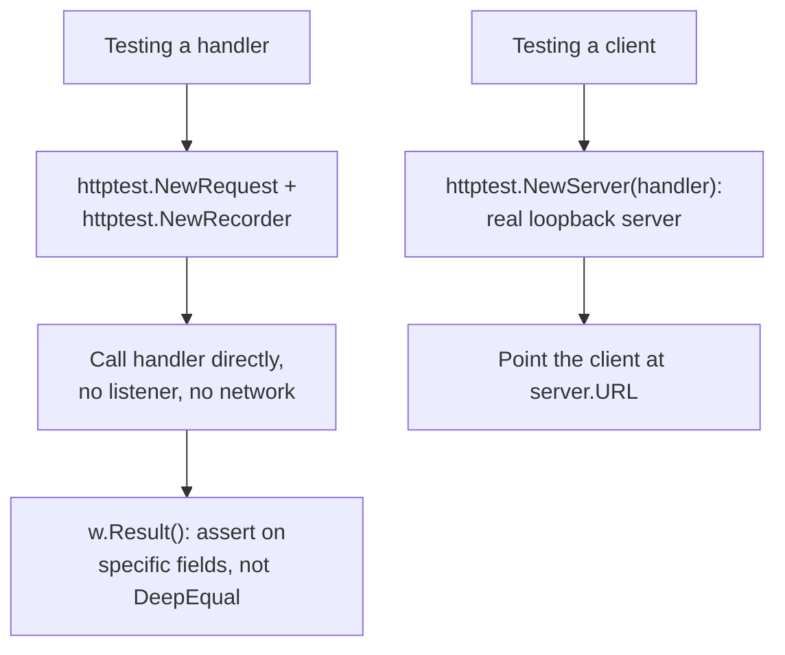

# Lesson 40. Testing an HTTP Handler

**Mission link:** Stage 5 taught table-driven tests, fuzzing and benchmarks, and never tested an HTTP handler. Lesson 22 noted in passing that `httptest.NewRecorder()` returns a `ResponseWriter`, so a handler is testable with no network at all; this lesson is exactly how, why that's true rather than a coincidence, and the tool for a different job (testing a client) that's easy to reach for by mistake.
**Primary source:** [Package `httptest`, Go](https://pkg.go.dev/net/http/httptest)
**Prerequisites:** [Lesson 22](0022-an-http-server.md), [Lesson 11](0011-implicit-interfaces.md)

## Warm-up

1. ▢ Per lesson 11, what does a type need to do to satisfy an interface in Go, and what does it never need to do?

<details markdown="1"><summary>Check</summary>

It needs to implement the interface's method set; it never needs to declare that it implements the interface anywhere. Satisfaction is implicit, decided entirely by whether the methods exist with the right signatures.

</details>

2. ▢ Per lesson 22, what's the whole interface a `net/http` handler actually has to satisfy?

<details markdown="1"><summary>Check</summary>

`ServeHTTP(w http.ResponseWriter, r *http.Request)`, one method, taking a `ResponseWriter` interface and a request. `http.HandlerFunc` adapts a plain function of that shape to satisfy it.

</details>

## Know this

### A handler only ever asks for an interface, never a live connection

`ServeHTTP`'s signature takes an `http.ResponseWriter`, an interface, and a `*http.Request`, an ordinary struct. Nothing about the signature itself requires a real network socket; it only requires something satisfying `ResponseWriter`'s methods and a request value shaped like a real one. Because Go's interfaces are satisfied implicitly, exactly lesson 11's point, anything with the right methods works in a handler's place, including a type built purely for tests.

### `httptest.NewRecorder` is that stand-in, and calling the handler directly needs no server at all

`httptest.NewRecorder()` returns a `ResponseRecorder`, an `http.ResponseWriter` implementation that records whatever a handler writes to it instead of sending anything over a network. Paired with `httptest.NewRequest(method, target, body)`, which builds a request value without ever opening a connection, a handler can simply be called directly:

```go
req := httptest.NewRequest("GET", "/items/42", nil)
w := httptest.NewRecorder()
handler(w, req)

resp := w.Result()
body, _ := io.ReadAll(resp.Body)
```

No listener, no port, no goroutine serving requests; the handler runs in the test's own goroutine, and `w.Result()` returns the `*http.Response` it produced, ready to inspect.

### Don't assert on the whole response; assert on what actually matters

The documentation itself warns that `Result()`'s returned response may gain more populated fields over time, and callers should not compare it wholesale (a `reflect.DeepEqual` across the entire struct). The idiomatic check asserts on the specific fields a test actually cares about, the status code, a particular header, the decoded body, rather than the entire response shape, which is exactly the discipline that keeps a test from breaking the moment the standard library populates one more field nobody asked it to check.

### `httptest.NewServer` is a different tool, for testing a client, not a handler

`httptest.NewServer(handler)` starts a real, if loopback-only, HTTP server backed by a handler you control, meant for testing your own HTTP **client** code against controlled, predictable responses, the reverse direction from testing a handler. Reaching for `NewServer` to test a handler works, but pays for a real listener, a real port, and real network round trips for something `NewRecorder` already does with none of that; reaching for `NewRecorder` to test a client doesn't work at all, since a client needs something to actually dial. The two exist for opposite sides of the same conversation.

### The newer helper ties a server's lifecycle to the test's own cleanup

`httptest.NewTestServer(t testing.TB, handler)` is the newer constructor that registers the server's shutdown as part of the test's own cleanup, so a forgotten `.Close()` call can't leak a listener past the test that started it, the network-testing counterpart to the goroutine-leak discipline lesson 21 already established for anything a test starts and might forget to stop.



## Practice

1. ▢ A test calls `handler(httptest.NewRecorder(), httptest.NewRequest("GET", "/", nil))` directly, with no `httptest.NewServer` anywhere. Does this test actually exercise the handler's real logic, given that no real server is running?

<details markdown="1"><summary>Hint</summary>

Think about what the handler's signature actually requires versus what a real deployment happens to also involve.

</details>

<details markdown="1"><summary>Check</summary>

Yes. The handler's signature only requires something satisfying `http.ResponseWriter` and a `*http.Request`; it has no idea, and no way to know, whether it's being called from a real listener or directly from a test. `ResponseRecorder` and `httptest.NewRequest` supply exactly what the signature needs, nothing about the handler's own logic changes based on how it was invoked.

</details>

2. ▢ A test asserts `reflect.DeepEqual(recorder.Result(), expectedResponse)` across the whole response. What does the documentation warn about this, specifically?

<details markdown="1"><summary>Check</summary>

`Result()`'s returned response may have additional fields populated in future versions, so a whole-struct comparison risks breaking the moment the standard library starts filling in something the test never asked about, unrelated to any actual behavior change in the handler. The documented advice is to assert on the specific fields that matter (status code, a header, the body) instead.

</details>

3. ▢ A team wants to test their own HTTP client's retry logic against a server that returns a 500 on the first two calls and a 200 on the third. Is `httptest.NewRecorder()` the right tool here?

<details markdown="1"><summary>Check</summary>

No. `NewRecorder` stands in for a `ResponseWriter` to test a handler directly; it isn't something a real HTTP client can dial. Testing a client's behavior against a sequence of controlled responses needs `httptest.NewServer(handler)`, a real (loopback) server the client can actually make requests against.

</details>

4. ▢ Why does `httptest.NewTestServer(t, handler)` register the server's shutdown with the test's own cleanup, rather than leaving `.Close()` to the test author?

<details markdown="1"><summary>Check</summary>

So a forgotten `.Close()` call can't leave a listener running past the end of the test that started it. This mirrors lesson 21's goroutine-leak discipline: anything a test starts and might forget to stop is exactly the shape of bug that accumulates silently across a large test suite.

</details>

5. ▢ Which claim correctly distinguishes `httptest.NewRecorder` from `httptest.NewServer`?

    - a) They're interchangeable; either one tests a handler or a client equally well
    - b) `NewRecorder` stands in as a `ResponseWriter` to call a handler directly with no real network, useful for testing the handler itself; `NewServer` starts a real, loopback-only server for testing an HTTP client's behavior against it, the reverse direction
    - c) `NewRecorder` requires a real network port; `NewServer` does not
    - d) Only `NewServer` can be used in a table-driven test

<details markdown="1"><summary>Check</summary>

**b)** That's the precise distinction this lesson draws, between testing a handler directly and testing a client against a real server. (a) is false: reaching for the wrong one either can't work at all (a client with nothing to dial) or pays unnecessary cost (a real server for logic a direct call already tests). (c) is false, and backwards: `NewRecorder` needs no network at all, while `NewServer` is exactly the one that opens a real, if local, port. (d) is false: either fits comfortably inside a table-driven test's structure, since the tool is about what's being tested, not the test's own shape.

</details>

## Real-world reps

- [ ] Find an HTTP handler in code you have access to, and write a test for it using `httptest.NewRequest` and `httptest.NewRecorder`, asserting on the specific status code and body content rather than the whole response.
- [ ] Find (or imagine) a test for your own HTTP client code, and confirm it uses `httptest.NewServer`, not `NewRecorder`, since a client needs something real to dial.
- [ ] Tomorrow: find a test that calls `.Close()` on an `httptest.Server` manually, and check whether `httptest.NewTestServer` (if available in your Go version) would remove that responsibility entirely.

## Going further

- [Package `httptest`, Go](https://pkg.go.dev/net/http/httptest)
- [Lesson 22. An HTTP Server Worth Operating](0022-an-http-server.md)
- [Resources](../RESOURCES.md)

---

Not landing? Reread the primary source at the top, since this lesson compresses it and compression is where understanding leaks. Check the [glossary](../GLOSSARY.md) for any term that felt slippery.

If the lesson itself is unclear rather than the material, that is a defect: [open an issue](https://github.com/TokenCemetery/teach/issues).
