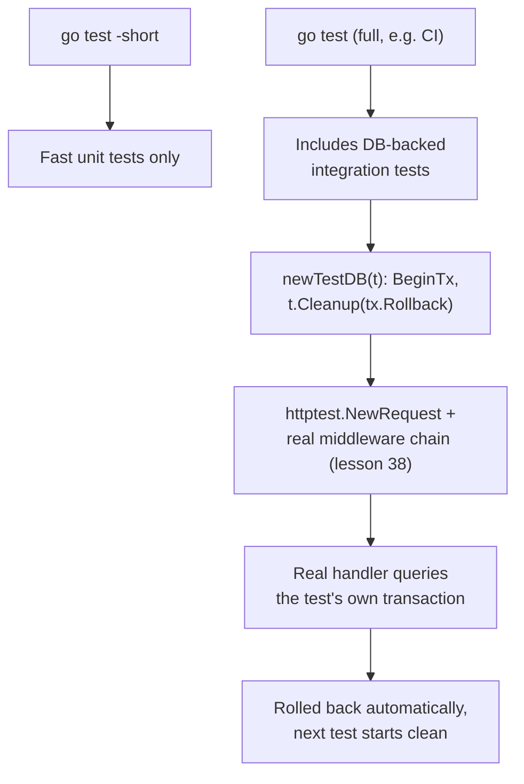

# Lesson 41. Testing Against a Real Database

**Mission link:** This is stage 7's capstone. Lesson 26 taught how a service talks to a database in production; this lesson is how a test does, using the same pool and transaction machinery, but for isolation instead of durability. And it's where lessons 38, 39 and 40 finally meet: one integration test exercising a request through real middleware, a real handler, and a real database, the thing "has shipped a service that survives being operated" actually needs, not only structure around each piece separately.
**Primary source:** [Package `testing`, Go](https://pkg.go.dev/testing), [Accessing relational databases, The Go Authors](https://go.dev/doc/database/)
**Prerequisites:** [Lesson 26](0026-talking-to-a-database.md), [Lesson 40](0040-testing-an-http-handler.md)

## Warm-up

1. ▢ Per lesson 26, what does `defer tx.Rollback()` immediately after `BeginTx` actually do once `Commit` has already succeeded?

<details markdown="1"><summary>Check</summary>

Nothing: it's a no-op once a transaction has already committed successfully. The `defer` exists to cover every early return and panic between `BeginTx` and a successful `Commit`, not to undo a transaction that already went through.

</details>

2. ▢ Per lesson 40, what does `httptest.NewRecorder()` let a test do without a real network connection?

<details markdown="1"><summary>Check</summary>

Call an HTTP handler directly and inspect what it wrote, since `ResponseRecorder` satisfies `http.ResponseWriter` implicitly, with no listener, no port, and no real network round trip involved at all.

</details>

## Know this

### `testing.Short()` keeps a slow database test out of the fast local loop

The standard `testing` package documents exactly this gate: a test checks `if testing.Short() { t.Skip("skipping integration test") }`, and running `go test -short` skips it, while a plain `go test`, the kind a CI pipeline runs in full, executes it along with everything else. This is the mechanism that lets a fast, frequent local test loop stay fast while a slower, database-backed test still runs somewhere that actually checks it, without either group of tests having to live in a separate command or a separate package.

### A transaction that's never committed gives each test a clean slate

The idiomatic isolation pattern begins a transaction before the test body runs, executes the test against it, and rolls back in `t.Cleanup` instead of ever calling `Commit`. This is lesson 26's own `BeginTx`/`defer tx.Rollback()` idiom, deployed deliberately: since the transaction never commits, nothing the test wrote is ever actually visible outside it, and every test starts from the same known database state regardless of what any other test did, without needing to reset or reseed anything between them.

```go
func newTestDB(t *testing.T) *sql.Tx {
    tx, err := db.BeginTx(context.Background(), nil)
    if err != nil {
        t.Fatalf("begin tx: %v", err)
    }
    t.Cleanup(func() { tx.Rollback() })
    return tx
}
```

### Migrations happen before the test's own transaction, never inside it

The schema a test's queries run against has to already exist before that test's isolating transaction begins; running migrations inside the same transaction the test uses for rollback-based isolation risks the schema change itself being rolled back along with everything else, or interacting badly with locks the migration needs. Migrations are a one-time setup step against the test database, done once before any test-level transaction opens, not something a single test's own isolation mechanism should also be responsible for.

### `t.Parallel()` and this pattern need deliberate care together

Naively marking every database-backed test `t.Parallel()` on top of transaction-based isolation can break on exactly the resource lesson 26 already warned about: a connection pool sized too small for the number of tests now running concurrently, or two transactions colliding on visibility of the same rows. The fix is the same discipline lesson 26 already taught for a service's own pool, sizing `SetMaxOpenConns` deliberately, here applied to a test suite instead of a production deployment. A third-party driver-level helper, `go-txdb`, wraps this same rollback-per-connection pattern transparently, letting test code use ordinary `sql.Open`/`Close` while getting the isolation for free, worth knowing as an option rather than something this lesson requires.

### The stage capstone: one test, all four lessons, one real request

A single integration test can now exercise the whole stage together: `httptest.NewRequest` builds the request (lesson 40), it passes through the actual middleware chain, including whatever sets a request id in the context (lesson 38), a real handler processes it against a database connection wrapped in a rolled-back transaction (this lesson), and the same request can be checked for whether it would have emitted the metrics and propagated the `traceparent` lesson 39 introduced. Stage 4's own "has shipped a service that survives being operated" is satisfied by that combination actually being tested together, not merely by each piece existing in isolation: a service with middleware, metrics, tracing, and a database layer that were each only ever exercised alone has never actually proven the request that uses all four at once behaves the way any one piece's own test suggested.



## Practice

1. ▢ A database-backed test has no `testing.Short()` check at all, and a teammate complains that `go test -short` still takes ten seconds because of it. What's missing?

<details markdown="1"><summary>Hint</summary>

Think about what actually causes a test to be skipped under `-short`, versus what merely exists as a slow test.

</details>

<details markdown="1"><summary>Check</summary>

The test itself never checks `testing.Short()` and calls `t.Skip(...)` when it's true. The `-short` flag doesn't skip slow tests automatically; it only sets a flag a test can check, so a test that never checks it runs under `-short` exactly the same as under a full `go test`.

</details>

2. ▢ Two tests run against the same test database, one right after the other, both using the transaction-per-test pattern. The first test inserts a row; does the second test see it?

<details markdown="1"><summary>Check</summary>

No. The first test's transaction is rolled back in `t.Cleanup`, never committed, so the insert never actually becomes visible outside that transaction at all. The second test starts against the same clean state the first one did, regardless of what the first test wrote during its own run.

</details>

3. ▢ A test suite runs a schema migration inside the same transaction one test uses for its own rollback-based isolation. What's the risk?

<details markdown="1"><summary>Check</summary>

The migration itself gets rolled back along with everything else the test did, since it never gets its own, separate commit; the schema change effectively never happened as far as the database is concerned. Migrations need to run once, before any test's isolating transaction begins, not nested inside one.

</details>

4. ▢ A team adds `t.Parallel()` to every database-backed test without changing anything else, and the suite starts failing intermittently with connection errors. What's the likely cause, and which earlier lesson already named it?

<details markdown="1"><summary>Check</summary>

The connection pool is likely sized too small for the number of tests now running concurrently, the same resource-exhaustion shape lesson 26 named for a production service's own `SetMaxOpenConns`. Parallelizing transaction-isolated tests needs the pool sized deliberately for the actual concurrency, not left at whatever default happened to work when tests ran sequentially.

</details>

5. ▢ **Stage capstone.** Walk through what a single integration test needs to actually exercise all four of this stage's lessons together, testing one request end to end rather than each piece in isolation, and name which lesson each step draws on.

<details markdown="1"><summary>Check</summary>

Build the request with `httptest.NewRequest` (lesson 40, no real network needed). Run it through the real middleware chain, including whatever sets a request-scoped value like a request id via `context.WithValue`, reading it back out through the accessor function pattern (lesson 38), not stubbing the middleware out. Let the handler underneath actually query a real database, wrapped in a transaction begun before the test and rolled back in `t.Cleanup` (this lesson), so the test is isolated but the handler's real query logic runs unmodified. Gate the whole test behind `testing.Short()` so it only runs where a database is actually available, typically CI rather than every local `go test`. Optionally, confirm the request would have propagated a `traceparent` header and incremented the RED-style metrics lesson 39 described, if the service under test wires those up. The result tests the request stage 4 shipped a service to handle, exercised the way it actually runs, not four separate pieces each individually confirmed to work.

</details>

## Real-world reps

- [ ] Find a database-backed test in code you have access to, and check whether it's gated behind `testing.Short()`, isolated via a rolled-back transaction, both, or neither.
- [ ] Write (or find) one integration test that sends a request through actual middleware into a handler that queries a real test database, rather than mocking either the middleware or the database away.
- [ ] Tomorrow: check whether your own test suite's database tests are safe to run with `t.Parallel()`, and if not, whether the pool size or the isolation pattern itself is the actual limiting factor.

## Going further

- [Package `testing`, Go](https://pkg.go.dev/testing)
- [Accessing relational databases, The Go Authors](https://go.dev/doc/database/)
- [Lesson 26. Talking to a Database](0026-talking-to-a-database.md)
- [Resources](../RESOURCES.md)

---

Not landing? Reread the primary source at the top, since this lesson compresses it and compression is where understanding leaks. Check the [glossary](../GLOSSARY.md) for any term that felt slippery.

If the lesson itself is unclear rather than the material, that is a defect: [open an issue](https://github.com/TokenCemetery/teach/issues).
