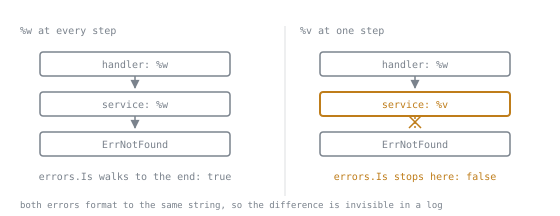

# Error Handling

Lookup sheet for lessons [8](../lessons/0008-errors-are-values.md), [9](../lessons/0009-wrapping-is-and-as.md), [10](../lessons/0010-defer-panic-and-recover.md) and [12](../lessons/0012-the-nil-interface-trap.md).

## The interface

```go
type error interface{ Error() string }
```

Error last in the result list. Checked immediately. No other result is valid when `err != nil` unless documented.

## Creating

| Want | Write |
|---|---|
| fixed message | `errors.New("connection closed")` |
| formatted, no chain | `fmt.Errorf("parse row %d: %v", i, err)` |
| formatted, wrapped | `fmt.Errorf("parse row %d: %w", i, err)` |
| several at once | `errors.Join(err1, err2)`, nil if all nil |
| sentinel | `var ErrNotFound = errors.New("not found")` |

Error strings: lowercase, no trailing punctuation. They get embedded in longer messages.

## `%w` versus `%v`

| Situation | Verb |
|---|---|
| caller may match on the cause | `%w` |
| the cause is an implementation detail | `%v` |
| you are logging and stopping here | neither |

**`%w` makes the wrapped error part of your API.** Anything a caller can `errors.Is` or `errors.As` is a compatibility commitment.



The chain is the whole mechanism, and `%v` is a pair of scissors. This is why the choice above is an API decision rather than a formatting one: both errors read the same in a log, print the same in a test failure, and differ only in an `errors.Is` result somewhere in a caller you may not own.

## Matching

```go
errors.Is(err, ErrNotFound)      // sentinel, anywhere in the chain

var verr *ValidationError
if errors.As(err, &verr) {       // note: pointer to the target variable
    use(verr.Field)
}
```

Never `err == ErrNotFound`: one added `%w` anywhere above breaks it silently.
`errors.As` panics if the second argument is not a pointer. That is deliberate.

## Wrapping discipline

- Add context the error does not already carry: the operation and the identifier, not "failed to".
- Wrap once per meaningful layer, not once per function.
- **Handle an error exactly once**: either handle it and return nil, or return it and say nothing. Never log *and* return.
- Log where the error stops, in middleware or in `main`.

## Traps that compile

| Trap | Symptom | Fix |
|---|---|---|
| concrete error type in a return | `err != nil` always true | return `error`, declare `var err error` |
| `%v` in a middle layer | `errors.Is` stops finding the sentinel | `%w` |
| `data, _ := ...` | silent empty result | handle it, or comment why not |
| `return nil, nil` | caller panics one line later | return a sentinel, or document it |

### The nil interface trap

```go
var p *MyError = nil
var err error = p
p == nil     // true
err == nil   // false, the interface holds a type
```

An interface is nil only when **both** its type word and value word are nil.

## defer, panic, recover

- Arguments are evaluated at the `defer` line; defer a closure to capture the variable.
- Deferred calls run LIFO, on return and on panic.
- `defer` is scoped to the **function**, not the block, so never in a loop over many resources.
- A deferred closure can modify a **named** result. That is the idiom for annotating every error path at once.
- `Close` on a writer returns a real error; do not discard it.

```go
func load(path string) (err error) {
    defer func() {
        if err != nil {
            err = fmt.Errorf("load %s: %w", path, err)
        }
    }()
    ...
}
```

`panic` is for programmer errors: impossible branches, startup invariants, `template.Must`. Not for expected failures.

`recover` works only in a function deferred directly by the panicking function, **in the same goroutine**. It cannot catch a fatal error (`concurrent map writes`, `deadlock!`).

## Errors as HTTP status

One mapping function, not one per handler:

```go
var verr *ValidationError
switch {
case errors.Is(err, store.ErrNotFound):
    return http.StatusNotFound
case errors.As(err, &verr):
    return http.StatusBadRequest
default:
    return http.StatusInternalServerError   // log the detail, do not return it
}
```

Translate third-party errors at the boundary. A repository returning `sql.ErrNoRows` puts `database/sql` in its API.
