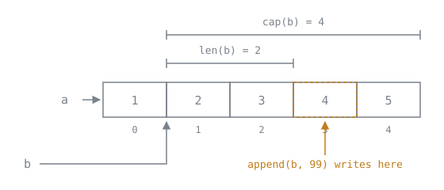

# Slice and Map Mechanics

Lookup sheet for [Lesson 3](../lessons/0003-slices-and-the-backing-array.md) and [Lesson 4](../lessons/0004-maps-and-their-rules.md).

## Slice header

| Word | Read with | Meaning |
|---|---|---|
| pointer | not exposed | where the elements start in the backing array |
| length | `len(s)` | how many elements this slice exposes |
| capacity | `cap(s)` | elements from the pointer to the end of the array |

`s[low:high]` → `len = high-low`, `cap = cap(s)-low`.
`s[low:high:max]` → `len = high-low`, `cap = max-low`.

## Does an append alias the original?

| Condition | `append` behaviour | Original slice |
|---|---|---|
| `len(s) < cap(s)` | writes into the existing array | **modified** |
| `len(s) == cap(s)` | allocates, copies, returns new header | untouched |

Data-dependent, so never rely on it. Growth amount is unspecified and has changed between releases.

```go
a := []int{1, 2, 3, 4, 5}
b := a[1:3]          // len 2, cap 4
b = append(b, 99)    // a is now [1 2 3 99 5]

c := a[1:3:3]        // len 2, cap 2
c = append(c, 99)    // allocates; a untouched
```



The spare capacity is the whole story: `b` may write four elements from where it starts, so the fourth one has somewhere to go, and that somewhere already belongs to `a`. The three-index form of `c` cuts the capacity to the length, which leaves no spare and forces the allocation.

## Handing out a sub-slice safely

```go
return s[0:2:2]        // capacity cut, caller's append must allocate
return slices.Clone(s[:2])  // always copies; costs an allocation
```

## Slice operations

| Want | Write |
|---|---|
| copy elements | `copy(dst, src)`, moves `min(len(dst), len(src))` |
| independent copy | `slices.Clone(s)` |
| append another slice | `s = append(s, other...)` |
| delete index i | `s = slices.Delete(s, i, i+1)` |
| contains | `slices.Contains(s, v)` |
| sort | `slices.Sort(s)` or `slices.SortFunc(s, cmp)` |
| empty it, keep capacity | `s = s[:0]` |

Always `s = append(s, x)`. The new length lives in the returned header.

## nil versus empty slice

| | `var s []int` | `s := []int{}` |
|---|---|---|
| `len`, `range`, `append` | works | works |
| `s == nil` | true | false |
| JSON marshal | `null` | `[]` |
| allocation | none | one |

Prefer nil. Return it for "no results".

## Map rules

| Operation | nil map | Notes |
|---|---|---|
| `len(m)` | 0 | safe |
| `m[k]` | zero value | safe |
| `v, ok := m[k]` | zero, false | safe |
| `range m` | zero iterations | safe |
| `delete(m, k)` | no-op | safe |
| `m[k] = v` | **panic** | `assignment to entry in nil map` |

```go
m := make(map[string]int)        // ready to write
m := make(map[string]int, 1000)  // pre-sized; a hint, not a capacity
```

## Map gotchas

**Iteration order is randomised per run.** Sort for stable output:

```go
for _, k := range slices.Sorted(maps.Keys(m)) { ... }   // Go 1.23+
```

**Elements are not addressable.**

```go
m["a"].N++          // compile error for map[string]Stat
m["a"]++            // fine, whole-element assignment
```

Fix with `map[string]*Stat`, or read-modify-write.

**Concurrent access is a fatal error**, not a recoverable panic:

```text
fatal error: concurrent map writes
```

Best-effort detection: a clean run is not proof. Guard with a `sync.Mutex`.

**Keys must be comparable.** Numbers, strings, bools, pointers, channels, interfaces, and structs or arrays of those. Not slices, maps or functions. An interface key can panic at runtime if it holds a slice.

## Map helpers

| Want | Write |
|---|---|
| keys as a sorted slice | `slices.Sorted(maps.Keys(m))` |
| values | `maps.Values(m)`, an iterator |
| copy | `maps.Clone(m)` |
| compare | `maps.Equal(a, b)` |
| empty it | `clear(m)` |
