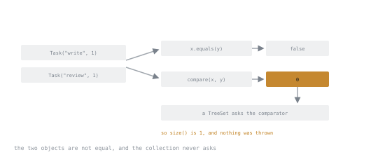

# Lesson 6. Comparable and Comparator

**Mission link:** Ordering is where a contract violation stops being theoretical: an inconsistent comparator makes a `TreeSet` drop elements and makes `sort` throw, and both failures name something other than the comparator.
**Primary source:** [`Comparator`, Java SE 25 API](https://docs.oracle.com/en/java/javase/25/docs/api/java.base/java/util/Comparator.html)
**Prerequisites:** [Lesson 3](0003-equals-and-hashcode.md), [Lesson 5](0005-arrays-and-collections.md)

## Warm-up

1. ▢ What is the difference between `Collections.unmodifiableList(source)` and `List.copyOf(source)`?

<details markdown="1"><summary>Check</summary>

The first is a view: later mutations of `source` show through. The second is a snapshot and is unaffected.

</details>

2. ▢ Why must equal objects have equal hash codes?

<details markdown="1"><summary>Check</summary>

A hash collection locates a key by its hash first. Equal keys hashing differently land in different buckets, so they are never compared and the lookup misses.

</details>

## Know this

There are two ways to order things, and they answer different questions.

**`Comparable`** is implemented by the type itself and defines its **natural ordering**. `String`, the numeric wrappers and `LocalDate` all have one.

**`Comparator`** is a separate object that imposes an ordering from outside. Use it when the type has no natural order, when you need a second order, or when the type is not yours to change.

Both return a negative number, zero, or a positive number. Only the sign matters.

```java
records.sort(Comparator.comparing(Order::createdAt));
records.sort(Comparator.comparing(Order::customer)
                       .thenComparing(Order::createdAt)
                       .reversed());
```

`comparing`, `thenComparing`, `reversed`, `nullsFirst` and `nullsLast` compose, which is how a multi-key ordering stays readable. `comparingInt`, `comparingLong` and `comparingDouble` avoid boxing in the key extractor.

### The contract

For any `x`, `y`, `z`:

- **Antisymmetric in sign:** `sgn(compare(x, y)) == -sgn(compare(y, x))`.
- **Transitive:** if `compare(x, y) > 0` and `compare(y, z) > 0`, then `compare(x, z) > 0`.
- **Consistent on ties:** if `compare(x, y) == 0`, then `x` and `y` compare the same way against every `z`.
- **Deterministic:** the same pair gives the same answer while nothing relevant changes.

And a fifth, which is *strongly recommended* rather than required: **consistency with `equals`**, meaning `compare(x, y) == 0` exactly when `x.equals(y)`.

### Why that last one matters more than "recommended" suggests

A sorted collection uses the ordering and never calls `equals`:

```java
record Task(String name, int priority) {}

Set<Task> set = new TreeSet<>(Comparator.comparingInt(Task::priority));
set.add(new Task("write", 1));
set.add(new Task("review", 1));
System.out.println(set.size());     // 1
```



Two answers exist, and only one of them goes anywhere. The equality answer is drawn with nothing leaving it because nothing consults it.

Two tasks that are not `equals` compared as zero, so the `TreeSet` treated the second as a duplicate and discarded it. Nothing was thrown, and `size()` is the only evidence.

The fix is to make the ordering a total order over distinct elements, by adding a tie-breaker that ends in something unique:

```java
Comparator.comparingInt(Task::priority).thenComparing(Task::name)
```

`TreeMap` behaves the same way with keys, and `binarySearch` gives meaningless results on a list sorted by a different comparator than the one it is passed.

### The subtraction bug

```java
Comparator<Item> byId = (a, b) -> a.id() - b.id();      // BROKEN
Comparator<Item> ok   = Comparator.comparingInt(Item::id);
```

Subtraction overflows. With `a.id()` at `Integer.MIN_VALUE` and `b.id()` positive, the difference wraps to a positive number and the comparator claims the smaller value is larger. It also breaks transitivity, which is what actually corrupts a sort.

Use `Integer.compare`, `Long.compare`, `Double.compare`, or the `comparingInt` family. Never subtract. For `double`, `Double.compare` also handles `NaN` and the two zeros consistently, which a subtraction cannot.

### What a broken comparator does to `sort`

`List.sort` and `Collections.sort` use a merge sort that detects some contract violations and throws:

```text
java.lang.IllegalArgumentException: Comparison method violates its general contract!
```

That message names the sort, not the comparator, and it appears only for some violations and some inputs, which is why it usually arrives long after the comparator was written.

Two ordering properties worth knowing while you are here: sorting a `List` or an object array is **stable**, so equal elements keep their relative order, and sorting a primitive array is **not**, because a different algorithm is used and stability is unobservable for primitives anyway.

## Practice

1. ▢ Predict the size, and explain it.

   ```java
   record Task(String name, int priority) {}
   Set<Task> set = new TreeSet<>(Comparator.comparingInt(Task::priority));
   set.add(new Task("a", 1));
   set.add(new Task("b", 1));
   set.add(new Task("c", 2));
   System.out.println(set.size());
   ```

<details markdown="1"><summary>Check</summary>

`2`.

`TreeSet` decides membership with the comparator, so `"b"` compared as zero against `"a"` and was rejected as a duplicate. The two records are not `equals`, and nothing ever asked them.

Add `.thenComparing(Task::name)` and the size is 3.

</details>

2. ▢ This comparator passes its tests. Name the input that breaks it and the property it violates.

   ```java
   Comparator<Item> byId = (a, b) -> a.id() - b.id();
   ```

<details markdown="1"><summary>Hint</summary>

The tests almost certainly use small positive ids. Ask what the subtraction produces near the extremes of `int`.

</details>

<details markdown="1"><summary>Check</summary>

Any pair whose difference overflows `int`, for example `a.id() == Integer.MIN_VALUE` and `b.id() == 1`: the difference wraps to a large positive number, so the comparator reports that `MIN_VALUE` is greater than `1`.

It violates antisymmetry in sign and transitivity. Transitivity is the damaging one, because it is what a sort relies on, and the visible symptom is either a wrongly ordered result or `IllegalArgumentException: Comparison method violates its general contract!`.

`Comparator.comparingInt(Item::id)` is the fix.

</details>

3. ▢ Which comparator is safe to hand to a `TreeSet<Person>` where `Person` is `record Person(String last, String first)`?

   - a) `Comparator.comparing(Person::last)`
   - b) `Comparator.comparing(Person::last).thenComparing(Person::first)`
   - c) `(a, b) -> a.last().length() - b.last().length()`
   - d) `Comparator.comparing(Person::last).reversed()`

<details markdown="1"><summary>Check</summary>

**b)** only.

Options a and d order by surname alone, so two people sharing a surname compare as zero and one is dropped. Option c compares lengths, which collapses every equal-length surname together and also subtracts, so it carries the overflow bug for good measure.

Only b is a total order over distinct `Person` values, since together the two components identify the record.

</details>

4. ▢ You need to sort orders by customer name, then by date descending, with orders that have no date last. Write it.

<details markdown="1"><summary>Check</summary>

```java
orders.sort(Comparator.comparing(Order::customer)
        .thenComparing(Order::createdAt,
                       Comparator.nullsLast(Comparator.reverseOrder())));
```

The two-argument `thenComparing` takes a key extractor and a comparator for that key, which is what lets the null handling and the reversal apply to the date alone. Writing `.reversed()` at the end instead would reverse the customer ordering too, which is the most common mistake in composed comparators.

</details>

5. ▢ A class implements `Comparable` with an ordering that is deliberately inconsistent with `equals`, and a reviewer says that is acceptable. When are they right, and what must the class do about it?

<details markdown="1"><summary>Check</summary>

They can be right, since the consistency rule is a recommendation and `BigDecimal` is the standard example: `new BigDecimal("1.0")` and `new BigDecimal("1.00")` compare as zero and are not `equals`, because scale is part of the value and not part of the numeric comparison.

What the class must do is say so in its documentation, in the sentence the JDK uses: "this class has a natural ordering that is inconsistent with equals". Then callers know that sorted collections will treat some distinct instances as duplicates, and that a `TreeSet` of these is a different collection from a `HashSet` of them.

</details>

## Real-world reps

- [ ] Build the `TreeSet` from practice 1, watch the size come out at 2, then add the tie-breaker and watch it become 3.
- [ ] Write the subtraction comparator, sort a list containing `Integer.MIN_VALUE`, and see what comes out. Then swap in `comparingInt`.
- [ ] Tomorrow: find a `Comparator` in code you know. Check whether it is a total order over distinct elements, and whether anything sorted by it ever lands in a `TreeSet` or `TreeMap`.

## Going further

- [`Comparator`](https://docs.oracle.com/en/java/javase/25/docs/api/java.base/java/util/Comparator.html): the contract, and every composing factory method
- [`Comparable`](https://docs.oracle.com/en/java/javase/25/docs/api/java.base/java/lang/Comparable.html): natural ordering, and the wording for documenting an inconsistent one
- [`Arrays`](https://docs.oracle.com/en/java/javase/25/docs/api/java.base/java/util/Arrays.html): which sorts are stable, stated per overload
- [Equality, hashing and ordering](../reference/equality-hashing-and-ordering.md): the reference sheet for this stage
- [Resources](../RESOURCES.md)

---

Not landing? Reread the primary source at the top, since this lesson compresses it and compression is where understanding leaks. Check the [glossary](../GLOSSARY.md) for any term that felt slippery.

If the lesson itself is unclear rather than the material, that is a defect: [open an issue](https://github.com/TokenCemetery/teach/issues).
