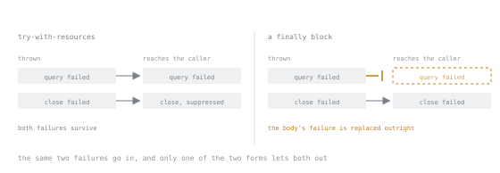

# Lesson 15. Exceptions

**Mission link:** The mission asks you to review a pull request and say precisely why a checked exception is the wrong tool there, and that judgement needs the actual criterion this lesson gives for what checked and unchecked exceptions are each for, not a rule of thumb repeated from habit.
**Primary source:** [JLS Chapter 11, Exceptions, Java SE 25](https://docs.oracle.com/javase/specs/jls/se25/html/jls-11.html)
**Prerequisites:** [Lesson 9](0009-interfaces.md), [Lesson 10](0010-inheritance-and-composition.md)

## Warm-up

1. ▢ In lesson 10's `Logger`/`FileLogger` example, a constructor calls an overridable `status()` method and the result surprises. What does it print, and why doesn't dispatching on the runtime type save it?

<details markdown="1"><summary>Check</summary>

It prints `starting: null`. `status()` does dispatch to `FileLogger.status()`, because dispatch is always on the runtime type, but `Logger`'s constructor runs to completion, including the call to `status()`, before any `FileLogger` field initialiser has run, so `prefix` is still at its default, `null`, when `status()` reads it.

</details>

2. ▢ Lesson 14 distinguished a view from a snapshot. Which one does `Collections.unmodifiableList` return, and which one does `List.copyOf` return?

<details markdown="1"><summary>Check</summary>

`Collections.unmodifiableList` returns a view: it reads through to the backing list, so a later change to that list shows up. `List.copyOf` returns a snapshot: the elements are copied out once, and nothing done to the source afterwards reaches the copy.

</details>

## Know this

### The hierarchy: who is supposed to react

```java
try {
    riskyOperation();
} catch (IllegalArgumentException e) {   // unchecked: a programming mistake
    // ...
} catch (IOException e) {                // checked: the compiler forces a catch or a throws clause
    // ...
} catch (StackOverflowError e) {         // an Error: the JVM's own state, not the program's
    // ...
}
```

`Throwable` sits at the root of everything `catch` and `throw` can see, and splits into two subclasses that mean opposite things about who is supposed to react. `Error` means the virtual machine or the platform is in a state the program did not cause and cannot be trusted to reason about, `OutOfMemoryError` and `StackOverflowError` are the two you actually meet, and the right response to one is almost never a catch block, because there is nowhere sane to continue from. `Exception` means the program itself provoked the failure, and it splits again into `RuntimeException`, which the compiler never forces anyone to acknowledge, and everything else, a checked exception, which the compiler forces every caller to either catch or declare with `throws`.

### Checked against unchecked: a design decision about the caller

Checked exceptions are the language's most argued-about feature, and most of the argument dissolves once the question changes from "does this feel important enough to check" to a single test: can a reasonable caller do something other than give up right here? `IOException` from reading a file is checked because a caller genuinely often has an alternative: retry, fall back to a default, ask for a different path. `IllegalArgumentException` from a negative quantity passed to a constructor is unchecked because the caller already made a programming mistake before the exception was ever thrown, and forcing every call site to catch or declare it would not produce a recovery plan, only ceremony around a bug that testing should have caught first.

The test is about the caller, not about where the failure originates: a network call and a file read can both fail for reasons entirely outside the program, and both are still checked, because a caller of either one commonly has a real next step; a violated precondition stays unchecked even when the code that violates it is complicated, because there was never a next step other than fixing the caller.

### `try`, `catch`, `finally`, and multi-catch

```java
for (String input : new String[] { "12", "oops" }) {
    try {
        int n = Integer.parseInt(input);
        System.out.println(100 / n);
    } catch (NumberFormatException | ArithmeticException e) {
        System.out.println(e.getClass().getSimpleName() + ": " + e.getMessage());
    }
}
```

```text
8
NumberFormatException: For input string: "oops"
```

Multi-catch (Java 7) lets one `catch` clause handle several exception types that share nothing but this block's reaction to them; inside the block `e` is typed as the nearest common supertype the listed types share, here `RuntimeException`, and the branch runs once, whichever of the listed types actually arrived. `finally` runs after the `try` and after whichever `catch` matched, whether the block finished normally, threw, or returned, which is exactly why it is the traditional place to put cleanup, and exactly why it needs the care the next two sections give it.

### try-with-resources and close order

```java
class Connection implements AutoCloseable {
    private final String name;
    Connection(String name) { this.name = name; }
    @Override public void close() { System.out.println("closing " + name); }
}

try (Connection a = new Connection("A"); Connection b = new Connection("B")) {
    System.out.println("using both");
}
```

```text
using both
closing B
closing A
```

try-with-resources (Java 7) declares one or more `AutoCloseable` resources in the parentheses after `try`, and closes every one of them automatically when the block exits, whether it falls off the end, returns, or throws. Resources close in the reverse of declaration order, last opened closed first, which is the discipline a hand-written cleanup would need to get right on purpose and this construct gives you for free.

### The suppressed exception, and what a hand-written `finally` loses

```java
class Connection implements AutoCloseable {
    @Override public void close() { throw new IllegalStateException("close failed"); }
}

try (Connection c = new Connection()) {
    throw new RuntimeException("query failed");
}
```

```text
Exception in thread "main" java.lang.RuntimeException: query failed
	at Cleanup.main(Cleanup.java:11)
	Suppressed: java.lang.IllegalStateException: close failed
		at Connection.close(Cleanup.java:4)
		at Cleanup.main(Cleanup.java:10)
```

Both the body and `close` failed here, and try-with-resources keeps both: the body's exception propagates as the main one, and `close`'s exception attaches to it as a **suppressed exception**, retrievable from `getSuppressed()` and printed under the main trace exactly as shown above. Write the same cleanup by hand with a `finally` block instead, and the second exception does not attach, it replaces the first outright, because a `finally` block that throws discards whatever the `try` block was already throwing:

```java
class Connection {
    void close() { throw new IllegalStateException("close failed"); }
}

Connection c = new Connection();
try {
    throw new RuntimeException("query failed");
} finally {
    c.close();
}
```

```text
Exception in thread "main" java.lang.IllegalStateException: close failed
	at Connection.close(HandWritten.java:3)
	at HandWritten.main(HandWritten.java:13)
```

The `RuntimeException` from the body is gone without a trace, replaced by the `IllegalStateException` from `close`, and nothing at the call site can tell the query ever failed at all. That silent replacement, not the extra typing of writing `close()` by hand, is the real reason try-with-resources replaced `finally` for anything closeable.



The left column is identical in both panels. Only the right one differs, and the failure that goes missing there is the one that says what actually went wrong.

### Exception chaining, and the cost of dropping the cause

```java
class OrderException extends RuntimeException {
    OrderException(String message, Throwable cause) { super(message, cause); }
}

static void placeOrder() {
    try {
        parseQuantity();
    } catch (NumberFormatException e) {
        throw new OrderException("could not place order", e);
    }
}
```

```text
Exception in thread "main" OrderException: could not place order
	at ChainedOrder.placeOrder(ChainedOrder.java:12)
	at ChainedOrder.main(ChainedOrder.java:21)
Caused by: java.lang.NumberFormatException: For input string: "twelve"
	at java.base/java.lang.NumberFormatException.forInputString(NumberFormatException.java:67)
	at java.base/java.lang.Integer.parseInt(Integer.java:565)
	at java.base/java.lang.Integer.parseInt(Integer.java:662)
	at ChainedOrder.parseQuantity(ChainedOrder.java:17)
	at ChainedOrder.placeOrder(ChainedOrder.java:10)
	... 1 more
```

Passing `e` as the cause to `OrderException`'s constructor is what produces the `Caused by:` section, and `... 1 more` is the JVM eliding the trace frames the two exceptions already share, `main` in this case, rather than repeating them. Whoever reads this trace can see exactly what actually broke, a malformed quantity string three calls down, not just that placing an order failed somewhere.

```java
} catch (NumberFormatException e) {
    throw new OrderException("could not place order");   // e is gone
}
```

```text
Exception in thread "main" OrderException: could not place order
	at DroppedOrder.placeOrder(DroppedOrder.java:12)
	at DroppedOrder.main(DroppedOrder.java:21)
```

Same failure, one constructor argument short, and the trace no longer leads anywhere: no `Caused by:`, no hint that a `NumberFormatException` was ever involved, and whoever is on call is left reconstructing what happened from the message string alone. Dropping the cause is the single most common way to make a production failure unreadable, and it costs nothing to avoid: pass the caught exception to a constructor that takes a cause, or call `initCause` on a type that predates one.

### When to catch

Catch at the boundary where a decision is actually possible: the top of a request handler that can return an error response, the edge of a retry loop that can try again, the point where a user-facing message can be shown. Catching earlier purely to log the exception and rethrow the same one is the pattern to avoid, since it produces two log entries for one failure and tells the next reader nothing that the original stack trace, left to propagate on its own, would not have said better.

### What never to do

```java
static void recurse() { recurse(); }

try {
    recurse();
} catch (Throwable t) {
    System.out.println("caught: " + t.getClass().getSimpleName());
}
System.out.println("still running");
```

```text
caught: StackOverflowError
still running
```

`catch (Throwable t)` compiles and, as shown, actually catches a `StackOverflowError`, which is exactly the problem: the program limps on believing it recovered, in whatever state a blown stack left its data structures, rather than failing loudly the moment something the JVM itself gave up on occurred. Swallowing, a `catch (Exception e) {}` with an empty body, is the same mistake without even the excuse of trying to continue: the failure disappears with no log line and no metric, and the next person to see it is a confused user. And spending an exception on a condition that is expected and common, reaching the end of input, a cache miss, a form failing validation, pays the cost of building a stack trace for something a returned value or an `Optional` (lesson 16) would say more cheaply and more clearly.

### Custom exception types

```java
class OrderException extends RuntimeException {
    OrderException(String message, Throwable cause) { super(message, cause); }
}

class InsufficientStockException extends OrderException {
    InsufficientStockException(String sku) {
        super("insufficient stock: " + sku, null);
    }
}
```

One base exception type per package, `OrderException` here, lets a caller catch every failure that package can produce with a single `catch (OrderException e)`, without knowing the full list of specific subtypes that exist today or will exist next release. A specific subtype such as `InsufficientStockException` still exists for the caller that wants to react differently to that one case; the base type is there for the far more common caller that just wants to handle "this package failed" in one place.

### `finally` overriding a `return`

```java
static int compute() {
    try {
        throw new RuntimeException("boom");
    } finally {
        return 42;
    }
}

System.out.println(compute());
```

```text
42
```

```text
warning: [finally] finally clause cannot complete normally
```

`return` inside `finally` completes the method with that value and discards whatever the `try` block was doing, including an exception already in flight: `compute()` returns `42`, and the `RuntimeException` never reaches the caller, silently. The compiler's own `-Xlint:finally` flag names the shape that causes this, "finally clause cannot complete normally", because any abrupt completion from `finally`, a `return`, a `break`, or another `throw`, overrides whatever the `try` or `catch` was already doing. Never put a `return`, `break`, or `continue` in a `finally` block; if cleanup needs to run and produces nothing of its own, let it do exactly that and nothing more.

## Practice

1. ▢ Predict the output, and explain it.

   ```java
   static String tag() {
       try {
           return "try";
       } finally {
           return "finally";
       }
   }
   System.out.println(tag());
   ```

<details markdown="1"><summary>Hint</summary>

Both blocks try to return. Only one value can leave the method: which block's completion is allowed to win?

</details>

<details markdown="1"><summary>Check</summary>

`finally`. The `try` block's `return "try"` starts to complete the method, but `finally` always runs before that completion actually happens, and a `return` inside `finally` is itself an abrupt completion that overrides the one already in progress. The `try` block's return value is discarded exactly the way an exception in flight would be.

</details>

2. ▢ Find the bug. This cleanup code compiles, and the author believes it is equivalent to try-with-resources.

   ```java
   Connection c = new Connection();
   try {
       runQuery(c);
   } finally {
       c.close();
   }
   ```

<details markdown="1"><summary>Hint</summary>

Make `runQuery` throw and make `close` throw too. Which exception does the caller actually see?

</details>

<details markdown="1"><summary>Check</summary>

When both `runQuery` and `close` throw, only `close`'s exception reaches the caller; the one from `runQuery`, the one that actually explains what went wrong, is silently replaced rather than kept. try-with-resources does not have this problem: it attaches `close`'s exception to the original as a suppressed exception instead of discarding the original, so the fix is `try (Connection c = new Connection()) { runQuery(c); }`.

</details>

3. ▢ Predict the close order, and explain it.

   ```java
   try (Connection a = new Connection("A");
        Connection b = new Connection("B");
        Connection c = new Connection("C")) {
       System.out.println("using all three");
   }
   ```

<details markdown="1"><summary>Check</summary>

`using all three`, then `closing C`, `closing B`, `closing A`. Resources close in the reverse of the order they were declared, so the last one opened is the first one closed, the same way you would unwind nested resources by hand if you wanted to get it right.

</details>

4. ▢ You are writing `Config loadConfig(Path path)`. It can fail two ways: the file does not exist, or the file exists but its contents are malformed. Using the criterion from this lesson, should either failure be a checked exception? Justify each answer separately.

<details markdown="1"><summary>Check</summary>

A missing file is a reasonable candidate for checked: a caller often has a real next step, falling back to a default configuration or prompting for a different path, so forcing that caller to at least decide what to do is earning its keep. Malformed contents are more defensible as unchecked, `IllegalStateException` or a dedicated `RuntimeException`, because the usual caller has no next step beyond failing the operation that needed the config, and a config file that parses but is wrong is closer to a bug in deployment than a condition the calling code can act on differently. Reasonable engineers land in different places on the second one, and that disagreement is itself the lesson: the criterion narrows the argument, it does not remove it.

</details>

5. ▢ A teammate wraps an entire request-handling method in `catch (Throwable t)`, arguing it is defensive: no exception should ever crash the server. What is wrong with that reasoning, and what would you write instead?

<details markdown="1"><summary>Check</summary>

Catching `Throwable` catches `Error` along with everything else, including `OutOfMemoryError` and `StackOverflowError`, conditions where the JVM itself is compromised and continuing to serve requests on a corrupted heap or a nearly exhausted one is worse than failing that request. It also hides every unanticipated `RuntimeException` behind one generic response, which is a bug report the team will never see. The better shape is a boundary that catches the specific exception types the handler can meaningfully react to, RuntimeException subtypes the application itself defines, and lets an `Error` propagate to whatever supervises the process, a container or a process manager that can restart cleanly rather than keep serving from a state nobody trusts.

</details>

## Real-world reps

- [ ] Find a `try`/`catch` in code you have access to and decide whether it catches at a boundary where a decision is actually possible, or earlier, out of habit.
- [ ] Take a class that closes two resources by hand in a `finally` block, rewrite it as try-with-resources, then make `close` throw on purpose and read the suppressed exception it produces.
- [ ] Look at one custom exception type you already have and check whether its constructor accepts a cause, and whether every call site that catches something and rethrows actually passes it through.
- [ ] Tomorrow: pick one checked exception in code you already have, and decide with today's criterion whether it should still be checked, or whether nothing at any of its call sites can do anything but give up.

## Going further

- [`Throwable`](https://docs.oracle.com/en/java/javase/25/docs/api/java.base/java/lang/Throwable.html): `getCause`, `getSuppressed`, and the constructors that set each
- [try-with-resources, JLS 14.20.3](https://docs.oracle.com/javase/specs/jls/se25/html/jls-14.html#jls-14.20.3): the exact suppression and close-order rules, stated precisely
- [Book: "Effective Java", Joshua Bloch](https://openlibrary.org/isbn/9780134685991): the exceptions chapter, items 69 to 77, argued in far more depth than one lesson can give
- [Idiom and the library](../reference/idiom-and-library.md): the reference sheet for this stage
- [Resources](../RESOURCES.md)

---

Not landing? Reread the primary source at the top, since this lesson compresses it and compression is where understanding leaks. Check the [glossary](../GLOSSARY.md) for any term that felt slippery.

If the lesson itself is unclear rather than the material, that is a defect: [open an issue](https://github.com/TokenCemetery/teach/issues).
