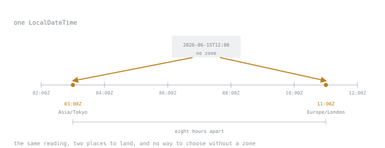

# Lesson 20. Dates and Times

**Mission link:** Every service boundary carries a timestamp somewhere, a log line, a database column, a scheduled job, and reaching for the local-looking type when the job needed a point in time is how two machines that disagree about the time corrupt a customer's invoice without either one raising an exception.
**Primary source:** [`java.time`, Java SE 25 API](https://docs.oracle.com/en/java/javase/25/docs/api/java.base/java/time/package-summary.html)
**Prerequisites:** [Lesson 14](0014-immutability-as-a-default.md), [Lesson 8](0008-records.md)

## Warm-up

1. ▢ `LocalDate.of(2026, 8, 31).plusDays(10)` does not change the object it was called on. What is a method shaped like that called, and what does the pattern buy a caller who never checks whether something else changed the date under them?

<details markdown="1"><summary>Check</summary>

It is a wither method: it returns a new instance with one part changed rather than mutating this one. The caller does not have to coordinate with anyone else holding a reference to the same object, because nothing holding that reference can ever observe it change.

</details>

2. ▢ An enum's `values()` method returns a fresh array on every call. Why does mutating the array you get back never affect the enum itself, and what does calling `values()` inside a loop cost?

<details markdown="1"><summary>Check</summary>

The array is a copy handed to you, not the enum's own storage, so nothing done to it reaches the constants. Calling `values()` inside a loop allocates a fresh array on every iteration, which is wasted work if the values were only ever going to be read.

</details>

## Know this

### Six types, six different questions

`java.time` gives you six point-in-time-shaped types, and the six exist because each answers a different question, not because six is a round number.

- **`Instant`**: a count of seconds and nanoseconds since the epoch, with no calendar and no zone attached. This is what "a point in time" means once every human convention is stripped away, and it is the type to reach for whenever the question is when, exactly, on the one universal timeline.
- **`LocalDate`**: a calendar date with no time-of-day and no zone, such as a birthday or a public holiday, the same date everywhere because nobody asked what time it is where you are.
- **`LocalTime`**: a time-of-day with no date and no zone, such as "the shop opens at 09:00", true every day the shop is open, in whichever zone the shop happens to sit.
- **`LocalDateTime`**: a date and a time-of-day with no zone. It looks like a timestamp and is not one, which is the next section.
- **`ZonedDateTime`**: a `LocalDateTime` plus a `ZoneId`, a named region whose rules can change the offset on a date its legislature decides to change it. This is the type for what actually happened, in that place, correct across a daylight-saving transition.
- **`OffsetDateTime`**: a `LocalDateTime` plus a fixed `ZoneOffset`, with no region and no rules attached. Reach for it for a timestamp that needs a fixed offset for interchange, such as a log line or a wire format, where nobody downstream needs to know a region's daylight-saving rules.

The decision rule: universal instant, `Instant`. A date on a calendar with no time attached, `LocalDate`. A specific place's wall clock that has to keep meaning the same wall-clock moment across that place changing its clocks, `ZonedDateTime`. A timestamp that only needs a fixed offset for interchange, `OffsetDateTime`. `LocalTime` and `LocalDateTime` belong inside a day's schedule or a form field, never as the record of when something on a server actually happened.

### The mistake `LocalDateTime` cannot warn you about

`LocalDateTime` is not a point in time, and this is the single most common mistake in this API, because the type reads like a timestamp and the compiler happily lets you build one, print it, and store it, right up until the moment you try to turn it into an `Instant`:

```java
LocalDateTime ldt = LocalDateTime.now();
Instant i = ldt.toInstant();
```

```text
error: method toInstant in interface ChronoLocalDateTime<D> cannot be applied to given types;
  required: ZoneOffset
  found:    no arguments
```

There is no zero-argument `toInstant`. `LocalDateTime` has no idea which timeline it sits on, so the compiler demands the missing piece rather than guessing it, and the required argument is itself the proof that a `LocalDateTime` alone was never enough. The same local reading means something different depending on where you stand:

```java
LocalDateTime wall = LocalDateTime.of(2026, 6, 15, 12, 0);
Instant asLondon = wall.atZone(ZoneId.of("Europe/London")).toInstant();
Instant asTokyo = wall.atZone(ZoneId.of("Asia/Tokyo")).toInstant();
```

`asLondon` comes out as `2026-06-15T11:00:00Z` and `asTokyo` as `2026-06-15T03:00:00Z`, two different instants from one `LocalDateTime`, because "12:00" was never a claim about the universal timeline in the first place. Store a `LocalDateTime` as "when this happened" and every comparison across two services in different zones, or the same service after a deployment changes the default zone, is comparing numbers that were never on the same timeline to begin with.



The reading itself is drawn off the line, because that is where it is: it names no point on the timeline until a zone is supplied, and the two zones here put it eight hours apart. The compiler's refusal above is that gap, caught before it becomes a stored value.

### `ZoneId` against `ZoneOffset`

A `ZoneOffset`, such as `+02:00`, is a fixed difference from UTC and nothing else; it is also a `ZoneId`, since `ZoneOffset extends ZoneId` and an offset can be used anywhere a zone is asked for, confirmed with `instanceof`. A region-based `ZoneId`, such as `America/New_York`, is not fixed: it carries a table of rules that can hand back a different offset depending on the date asked about.

```java
ZoneId ny = ZoneId.of("America/New_York");
ny.getRules().getOffset(LocalDateTime.of(2026, 1, 15, 12, 0));   // -05:00
ny.getRules().getOffset(LocalDateTime.of(2026, 7, 15, 12, 0));   // -04:00
```

Same zone, same method, two different offsets six months apart. A `ZoneOffset` alone can never do this, which is exactly why it is the wrong choice whenever daylight saving is part of the picture: it locks in whichever offset happened to be current when you wrote it down.

### `Duration` against `Period`, and the day that was twenty-three hours long

`Duration` is an exact number of seconds and nanoseconds, the right unit for arithmetic on `Instant` and for measuring elapsed machine time. `Period` is years, months and days on a calendar, the right unit for arithmetic on `LocalDate`. Adding one calendar day is not the same operation as adding twenty-four hours, and a daylight-saving transition is where the difference stops being academic:

```java
ZoneId ny = ZoneId.of("America/New_York");
ZonedDateTime start = ZonedDateTime.of(LocalDateTime.of(2026, 3, 8, 0, 30), ny);
ZonedDateTime byDuration = start.plus(Duration.ofDays(1));
ZonedDateTime byPlusDays = start.plusDays(1);
```

`start` is `2026-03-08T00:30-05:00`. Clocks in `America/New_York` spring forward at 02:00 that night, so `byDuration`, which adds a genuine twenty-four hours of elapsed time, lands at `2026-03-09T01:30-04:00`; `byPlusDays`, which adds one calendar day and keeps the same wall-clock reading, lands at `2026-03-09T00:30-04:00`, one hour earlier. Between 00:30 on the 8th and 00:30 on the 9th, the wall clock in that zone only advanced twenty-three real hours, because one hour of it was skipped. `plusDays` and `Period` both follow the calendar and land on the same wall-clock time the next day; `Duration` follows the clock and does not care what the calendar called it.

### The gap and the overlap

Springing forward creates a **gap**: a stretch of local time that never happens, because the clock jumped straight over it. Falling back creates an **overlap**: a stretch of local time that happens twice. `ZonedDateTime.of(LocalDateTime, ZoneId)` has to do something sensible with both.

```java
LocalDateTime gapLocal = LocalDateTime.of(2026, 3, 8, 2, 30);
ZonedDateTime.of(gapLocal, ny);
// 2026-03-08T03:30-04:00[America/New_York]
```

`02:30` on 8 March 2026 in `America/New_York` never happens, since the clock jumps from `02:00` straight to `03:00`. Asked for it anyway, `ZonedDateTime` moves the requested time later by the length of the gap, one hour, and lands in the offset that applies after the jump.

```java
LocalDateTime overlapLocal = LocalDateTime.of(2026, 11, 1, 1, 30);
ZonedDateTime.of(overlapLocal, ny);
// 2026-11-01T01:30-04:00[America/New_York]
```

`01:30` on 1 November 2026 happens twice in that zone, once before the fall-back and once after, at offsets `-04:00` and `-05:00` respectively, both valid for that exact local reading. `ZonedDateTime.of` picks the earlier of the two, `-04:00`, as its documented default. `withEarlierOffsetAtOverlap()` and `withLaterOffsetAtOverlap()` exist for the cases where the default answer is the wrong one and the choice needs to be explicit rather than assumed.

### `Clock`, so time is something you can inject

`Instant.now()` and `LocalDate.now()` read the system clock directly, which makes any code that calls them impossible to test without waiting for the calendar to cooperate. Every one of those `now()` methods has an overload that takes a `Clock`, and a class that asks for a `Clock` in its constructor rather than calling `Instant.now()` internally can be handed `Clock.fixed` in a test:

```java
Clock fixed = Clock.fixed(Instant.parse("2026-01-01T00:00:00Z"), ZoneOffset.UTC);
LocalDate.now(fixed);   // 2026-01-01
```

Every run of that test sees the same instant, chosen by the test rather than by whichever moment happened to be current when it ran.

### Formatting and parsing without reaching for a pattern

`DateTimeFormatter` has predefined constants, `ISO_INSTANT`, `ISO_LOCAL_DATE`, `ISO_DATE_TIME` and others, for the standard forms most interchange already uses, which is why a custom pattern is needed less often than it looks:

```java
DateTimeFormatter.ISO_INSTANT.format(Instant.now());
// 2026-08-31T19:36:52.573162Z
```

Reach for `DateTimeFormatter.ofPattern("...")` for a genuinely custom shape, such as a display format for a user interface, and treat a hand-written pattern for anything that crosses a service boundary as a sign that one of the ISO constants was overlooked.

### `Instant.now()`, and how precise it actually is in practice

`Instant` stores nanoseconds, but that is a claim about what the type can represent, not about what any given call to `now()` actually fills in. One observed run of `Instant.now()` produced a nano-of-second field ending in three zeros, `573162000`, meaning the observed resolution that time was microseconds, not nanoseconds, even though the field has room for nanosecond precision. Treat the precision `Instant.now()` actually delivers as something to check where it runs rather than something the type's declared range promises.

### Clamping at the end of the month

`plusMonths` clamps to the shorter month's last day when the starting day-of-month does not exist in the target month, and it does not remember the original day once it has clamped:

```java
LocalDate.of(2025, 1, 31).plusMonths(1);                  // 2025-02-28
LocalDate.of(2025, 1, 31).plusMonths(1).plusMonths(1);     // 2025-03-28
```

31 January clamps to 28 February, since 2025 is not a leap year, and 28 February plus one month is 28 March, not 31 March: the second call has no memory of the 31st, only of the 28th it landed on. A recurring "last day of every month" job has to ask for that explicitly, with `TemporalAdjusters.lastDayOfMonth()`, rather than trust that repeated `plusMonths` calls will keep landing there.

### `java.util.Date` and `Calendar`, named as legacy

`java.util.Date` and `java.util.Calendar` predate `java.time` (added in Java 8) and are mutable, badly named, thread-unsafe, and confuse a point in time with a calendar reading in ways `java.time` was written specifically to stop doing. They are still what some older APIs hand you or demand back, so the conversions matter more than the types themselves:

```java
Date legacy = Date.from(instant);
Instant back = legacy.toInstant();
Calendar cal = GregorianCalendar.from(zonedDateTime);
```

`Date.from` and `Date.toInstant()` convert in both directions against `Instant`; `GregorianCalendar.from(ZonedDateTime)` and `Calendar.toInstant()` do the same for the calendar type. A `Date`, despite the name, is actually a thin wrapper around a single instant, which is worth knowing the one time it saves an argument about what the class is for.

### Storing time

Store an instant, in UTC, as the fact of when something happened; `Instant`, or its equivalent as an epoch value, is what survives being read back on a different machine in a different zone with the same meaning intact. When the zone itself is part of the business rule, such as "run this job at 9am for this customer, in their zone, forever", storing a precomputed `Instant` is the wrong move, because the next daylight-saving transition moves 9am somewhere else while the stored instant stays put. Store the wall-clock time and the `ZoneId` separately, and recompute the `ZonedDateTime`, and the instant it resolves to, at the moment it is needed, so the daylight-saving rules that were current then are the ones applied.

## Practice

1. ▢ Predict what each line prints, and explain why they differ.

   ```java
   ZoneId ny = ZoneId.of("America/New_York");
   ZonedDateTime start = ZonedDateTime.of(LocalDateTime.of(2026, 3, 8, 0, 30), ny);
   System.out.println(start.plus(Duration.ofDays(1)));
   System.out.println(start.plusDays(1));
   ```

<details markdown="1"><summary>Check</summary>

`2026-03-09T01:30-04:00[America/New_York]`, then `2026-03-09T00:30-04:00[America/New_York]`.

Clocks in that zone spring forward one hour on the night of 8 March 2026. `plus(Duration.ofDays(1))` adds a genuine twenty-four hours of elapsed time and lands an hour later on the wall clock than the calendar day would suggest. `plusDays(1)` follows the calendar instead, keeping the same wall-clock reading on the next date, which only took twenty-three real hours to arrive at because one hour of that night never happened.

</details>

2. ▢ Find the bug.

   ```java
   LocalDateTime placedAt = LocalDateTime.now();
   order.setPlacedAt(placedAt);
   // later, on a different server, possibly in a different zone
   if (order.getPlacedAt().isBefore(cutoff)) { ... }
   ```

<details markdown="1"><summary>Hint</summary>

Ask what `LocalDateTime.now()` actually knows about, and what it does not.

</details>

<details markdown="1"><summary>Check</summary>

`LocalDateTime.now()` reads the wall clock of whichever machine and default zone happen to be running the code, with no zone recorded alongside the reading, so `placedAt` and `cutoff` are only comparable if every server that ever touches this value runs in the same zone, forever. The fix is to record an `Instant` (`Instant.now()`) instead, which means the same point in time regardless of which server reads or writes it, and to convert to a local, zoned reading only at the edge where a human needs to see it in their own zone.

</details>

3. ▢ Predict both lines.

   ```java
   LocalDate d = LocalDate.of(2025, 1, 31);
   System.out.println(d.plusMonths(1));
   System.out.println(d.plusMonths(1).plusMonths(1));
   ```

<details markdown="1"><summary>Check</summary>

`2025-02-28`, then `2025-03-28`.

`plusMonths` clamps 31 January to the last day February actually has, 28 in 2025. The second call starts from that clamped 28th, not from the original 31st, so it lands on 28 March rather than 31 March. Clamping loses the original day-of-month rather than remembering it for later.

</details>

4. ▢ A subscription has to renew at 9am local time for the customer, every month, forever, and the customer's zone observes daylight saving. Would you store the renewal moment as a precomputed `Instant`, or as a wall-clock time plus a `ZoneId`? Justify it.

<details markdown="1"><summary>Check</summary>

Store the wall-clock time and the `ZoneId` separately, and compute the `ZonedDateTime`, and the `Instant` it resolves to, at the point the job actually needs to run. A precomputed `Instant` freezes today's offset forever, so the first daylight-saving transition after it was stored moves the renewal to 8am or 10am on the customer's wall clock, which is exactly the failure this design is meant to avoid. The zone rules that matter are whichever ones are current at the moment the job runs, not whichever ones were current when the subscription was created.

</details>

5. ▢ `ZonedDateTime.of(LocalDateTime.of(2026, 3, 8, 2, 30), ZoneId.of("America/New_York"))` is asked for a local time that does not exist, because the clock springs forward from 02:00 to 03:00 that night. Predict the result, and say what rule produced it.

<details markdown="1"><summary>Check</summary>

`2026-03-08T03:30-04:00[America/New_York]`. There is no valid offset for a local time inside the gap, so `ZonedDateTime` moves the requested reading later by the length of the gap, one hour, landing on the offset that applies after the transition rather than throwing or guessing at the offset before it.

</details>

## Real-world reps

- [ ] Run the spring-forward comparison from practice 1 for a transition your own zone observes, and confirm which of `plus(Duration.ofDays(1))` and `plusDays(1)` lands an hour ahead of the other.
- [ ] Find a field in code you have named something like `createdAt`, `timestamp` or `placedAt`, check its declared type, and decide whether `LocalDateTime` is quietly doing the job an `Instant` was supposed to do.
- [ ] Take a method that currently calls `Instant.now()` or `LocalDate.now()` directly, change it to accept a `Clock`, and write one test that passes `Clock.fixed` instead of waiting on the real calendar.
- [ ] Tomorrow: pick a scheduled or recurring time in a system you own, a cron job, a renewal date, a reminder, and check whether it is stored the way practice 4 argues for.

## Going further

- [`java.time`](https://docs.oracle.com/en/java/javase/25/docs/api/java.base/java/time/package-summary.html): the package overview, and the full list of types this lesson only covers six of
- [`ZonedDateTime`](https://docs.oracle.com/en/java/javase/25/docs/api/java.base/java/time/ZonedDateTime.html): the gap and overlap rules, stated precisely, and the two `withXOffsetAtOverlap` methods
- [`DateTimeFormatter`](https://docs.oracle.com/en/java/javase/25/docs/api/java.base/java/time/format/DateTimeFormatter.html): every predefined ISO constant, and the pattern letters for a custom one
- [Idiom and the library](../reference/idiom-and-library.md): the reference sheet for this stage
- [Resources](../RESOURCES.md)

---

Not landing? Reread the primary source at the top, since this lesson compresses it and compression is where understanding leaks. Check the [glossary](../GLOSSARY.md) for any term that felt slippery.

If the lesson itself is unclear rather than the material, that is a defect: [open an issue](https://github.com/TokenCemetery/teach/issues).
