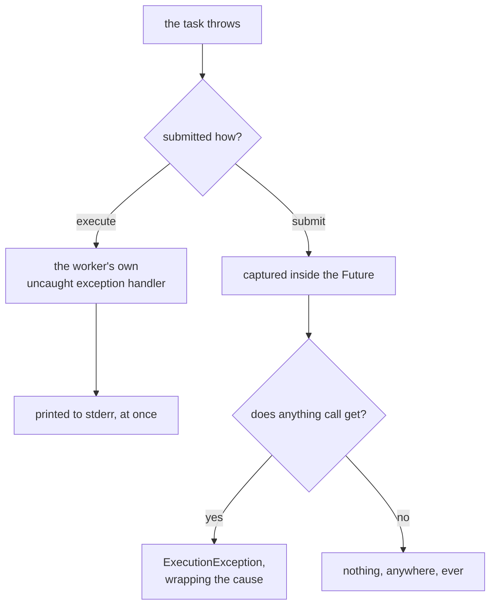

# Lesson 26. Executors and Futures

**Mission link:** A service under load is defined by what its thread pool's queue and rejection policy do when work arrives faster than it can be finished, and the review skill the mission asks for starts with the exact defect this lesson demonstrates: an exception from a submitted task that nobody ever reads.
**Primary source:** [`ExecutorService`, Java SE 25 API](https://docs.oracle.com/en/java/javase/25/docs/api/java.base/java/util/concurrent/ExecutorService.html)
**Prerequisites:** [Lesson 22](0022-threads.md), [Lesson 15](0015-exceptions.md)

## Warm-up

1. ▢ On a `ConcurrentHashMap`, calling `get` and then `put` to implement "insert only if absent" is not one atomic operation. What can go wrong under concurrent callers, and which method does the whole thing atomically instead?

<details markdown="1"><summary>Check</summary>

Two threads can both see nothing from `get`, both decide to insert, and both `put`, so the second call silently overwrites the first, or, if the value is expensive to build, the map ends up with more objects having been built than it has keys. `putIfAbsent`, or `computeIfAbsent` when building the value is not trivial, performs the check and the insert as a single atomic step.

</details>

2. ▢ Lesson 15 warned about dropping the cause when wrapping an exception. What is lost, concretely, in the stack trace when the cause is dropped?

<details markdown="1"><summary>Check</summary>

The `Caused by:` section never appears, so the trace shows only where the wrapping exception was thrown, not what actually broke underneath. Whoever debugs the failure is left with a message string instead of the real origin, three or four calls further down, that a passed-through cause would have shown.

</details>

## Know this

### The executor as a boundary

```java
new Thread(() -> handle(request)).start();   // what runs, and where it runs, are one decision
executor.submit(() -> handle(request));       // now they are two
```

An `ExecutorService` separates the decision of *what* runs from the decision of *where and how many at once*. Code that wants work done submits a `Runnable` or a `Callable`; the executor decides which thread runs it, whether it queues first, and what happens when too much of it arrives. A raw thread per unit of work makes that second decision by accident, one thread at a time, which is why lesson 22 called it almost always a defect in a service.

### The factory methods, and what each one actually builds

```java
Executors.newFixedThreadPool(4);          // fixed core and max threads, LinkedBlockingQueue, unbounded
Executors.newCachedThreadPool();          // 0 core, Integer.MAX_VALUE max, threads created on demand and reused
Executors.newSingleThreadExecutor();      // exactly one thread, unbounded queue, restarted if it dies
Executors.newScheduledThreadPool(2);      // fixed core, for delayed and periodic tasks
```

Every one of these is a `ThreadPoolExecutor` (or `ScheduledThreadPoolExecutor`) configured with a particular queue and a particular pool size, and the honest note is about that queue: `newFixedThreadPool` backs its threads with an unbounded `LinkedBlockingQueue`, so a burst of work larger than the pool queues instead of running, and the queue growing is the only symptom, since nothing is ever rejected. Submitting a hundred thousand tasks to a one-thread fixed pool proved this rather than just asserting it: every single one was accepted, none rejected, while only one ran at a time and the rest waited.

```text
accepted 100000 extra tasks onto a 1-thread pool with none rejected
```

An unbounded queue does not resist overload, it hides it, turning a capacity problem into a memory and latency problem that shows up later and somewhere else. `newCachedThreadPool` has the opposite failure mode, an effectively unbounded number of threads instead of an unbounded queue, which is why both are a poor default for a service under load and `ThreadPoolExecutor` built directly, with a bounded queue and a stated rejection policy, is what production code actually wants.

### `execute` against `submit`: the exception that vanishes

```java
ExecutorService pool = Executors.newFixedThreadPool(1);
Future<?> f = pool.submit(() -> { throw new IllegalStateException("boom from submit"); });
Thread.sleep(200);
System.out.println("about to call get()");
try {
    f.get();
} catch (ExecutionException e) {
    System.out.println("get() threw: " + e);
}
```

Running this prints nothing about the exception until `get()` is actually called, and only then:

```text
about to call get()
get() threw: java.util.concurrent.ExecutionException: java.lang.IllegalStateException: boom from submit
```

`submit` captures whatever the task throws inside the `Future` it returns instead of letting it propagate, and if nothing ever calls `get`, the exception simply never surfaces, anywhere. The same task, submitted with `execute` instead:

```java
pool.execute(() -> { throw new IllegalStateException("boom from execute"); });
```

```text
Exception in thread "pool-2-thread-1" java.lang.IllegalStateException: boom from execute
	at SubmitVsExecute.lambda$main$1(SubmitVsExecute.java:24)
	at java.base/java.util.concurrent.ThreadPoolExecutor.runWorker(ThreadPoolExecutor.java:1090)
```

`execute` takes a plain `Runnable` with nowhere to store a result, so the pool's worker thread lets the exception reach its own uncaught exception handler, the one lesson 22 covered, and by default that prints the trace to standard error immediately. The trap is not that one method is broken, it is that the two look interchangeable for a task that returns nothing, and only one of them tells you when that task fails.



Only one branch of that tree ends without telling anyone, and reaching it takes no mistake beyond calling the method whose return value you had no use for. A task that returns nothing invites `submit` and then invites discarding the `Future` it hands back, which is exactly the path to the bottom right.

### `Future.get`, `ExecutionException`, and the cause underneath

`Future.get()` blocks until the task finishes, then either returns its result or throws `ExecutionException` wrapping whatever the task actually threw. `getCause()` is what recovers the original:

```text
cause: java.lang.IllegalStateException: boom from submit
```

A caller that catches `ExecutionException` and reports its own message alone is making the same mistake lesson 15 warned about with a dropped cause, except the wrapping is done for you here and skipping `getCause()` is the equivalent of never asking. `get(long, TimeUnit)` adds a `TimeoutException` if the task has not finished in time, and `Future.cancel(boolean mayInterruptIfRunning)` requests cancellation, interrupting a running task only if the argument is `true`.

### `invokeAll` and `invokeAny`

```java
List<Callable<Integer>> tasks = List.of(() -> 1, () -> 2, () -> 3);
List<Future<Integer>> results = pool.invokeAll(tasks);
```

```text
invokeAll results (all present, task order): [1, 2, 3]
```

`invokeAll` submits every task, blocks until every one has completed (successfully or not), and returns a `Future` per task in the same order the tasks were given, regardless of which finished first. `invokeAny` submits every task and returns the result of whichever finishes successfully first, cancelling the rest:

```java
List<Callable<String>> raceTasks = List.of(
    () -> { Thread.sleep(300); return "slow"; },
    () -> { Thread.sleep(10);  return "fast"; }
);
pool.invokeAny(raceTasks);   // "fast"
```

If every task in the collection throws, `invokeAny` throws `ExecutionException` itself rather than returning anything, since there is no successful result to hand back.

### `ScheduledExecutorService`

```java
ScheduledExecutorService sched = Executors.newScheduledThreadPool(1);
sched.schedule(() -> "fired", 200, TimeUnit.MILLISECONDS).get();   // waits, then returns "fired"
sched.scheduleAtFixedRate(() -> count++, 0, 50, TimeUnit.MILLISECONDS);
```

`schedule` runs a task once after a delay; `scheduleAtFixedRate` runs it repeatedly at a fixed period measured from each execution's start, and `scheduleWithFixedDelay` instead measures the period from each execution's end, which differs whenever the task itself can take a noticeable slice of the period. Timing one run on one machine, a fixed-rate task at a 50ms period fired six times over roughly 260ms, which is what a period of 50ms starting immediately predicts; the exact count is a measurement of one run and would move a little on another one, the transferable fact is that it fires close to once per period rather than once total.

### Shutdown, `shutdownNow`, and the pool that will not let the process exit

```java
Executors.newFixedThreadPool(2).submit(() -> System.out.println("task ran"));
// no shutdown() called, main returns
```

Left running for five seconds and then forcibly killed to end the test, the process never exited on its own, even after the one task it had printed and finished:

```text
main returning without shutdown
task ran
STILL RUNNING after 5s, killing
```

A pool's worker threads are non-daemon by default, so the JVM will not exit while any of them is alive, and an idle pool thread stays alive indefinitely waiting for more work. `shutdown()` stops accepting new tasks and lets queued and running ones finish; `shutdownNow()` additionally interrupts every running task and drains the queue, returning the tasks that never started. Interrupting a task that is actually sleeping shows the effect directly:

```text
task sleeping
calling shutdownNow()
task caught InterruptedException, interrupted flag now: false
```

The flag reads `false` because catching `InterruptedException` clears it, exactly as lesson 22 described; the task saw the interruption, it just did nothing to restore the flag afterwards, which is the same two-correct-responses point from that lesson applied to a pool's own tasks. `awaitTermination(timeout, unit)` blocks until the pool has actually finished shutting down or the timeout elapses, and is normally called right after one of the two shutdown methods, since neither one blocks by itself.

### Try-with-resources on an executor

`ExecutorService` implements `AutoCloseable` as of Java 19, and its `close()` is not a shortcut for `shutdownNow()`:

```java
try (ExecutorService pool = Executors.newFixedThreadPool(1)) {
    pool.submit(() -> { Thread.sleep(1000); System.out.println("task done"); });
    System.out.println("leaving try block");
}
System.out.println("closed");
```

```text
leaving try block
task done
closed
```

`close()` calls `shutdown()` and then waits, repeatedly, for termination, exactly the same as calling `shutdown()` followed by an `awaitTermination` loop by hand; if the waiting thread is itself interrupted, `close()` escalates to `shutdownNow()` and keeps waiting rather than returning early. Timing the block above on one run on one machine, `close()` did not return until a little over a second had passed, the length of the one task's own sleep, which is the transferable point: try-with-resources here waits for the work to actually finish, it does not abandon it the way leaving scope with a raw thread would.

### `CompletableFuture`: composing dependent work, and its two traps

```java
CompletableFuture.supplyAsync(() -> loadOrder(id))
    .thenApply(Order::total)
    .thenCompose(total -> chargeAsync(total))
    .thenAccept(receipt -> notify(receipt));
```

`thenApply` transforms a result with a plain function; `thenCompose` is for a step that itself returns a `CompletableFuture`, flattening the result instead of nesting one future inside another the way `thenApply` would; `CompletableFuture.allOf(futures...)` completes once every listed future has, returning nothing itself, so its result is read from the originals once it completes. The first trap is where the continuation runs: `supplyAsync` and `thenApply` with no executor argument run on the shared `ForkJoinPool.commonPool()`, confirmed directly:

```text
supplyAsync/runAsync with no executor runs on: ForkJoinPool.commonPool-worker-1
runAsync with an explicit executor runs on: my-pool-thread
```

That shared pool is sized to the number of processors and used by every other unrelated `CompletableFuture` and parallel stream in the same process, so a chain that blocks on I/O there starves everything else quietly sharing it; passing an explicit `Executor` as the last argument to `supplyAsync`, `thenApplyAsync`, and the rest is how a service keeps its own work off that pool. The second trap is the same one `submit` has, restated: a failure inside the chain is stored, not thrown, and vanishes if nothing reads it.

```java
CompletableFuture.supplyAsync(() -> { throw new RuntimeException("boom"); });
// nothing printed, ever, about the exception
```

```text
no exceptionally, no join: nothing above this line about the exception
```

`exceptionally` supplies a fallback and observes the failure; `join()` (or `get()`) rethrows it, wrapped in `CompletionException` for `join`, once something finally asks for the result:

```text
join() threw: java.util.concurrent.CompletionException: java.lang.RuntimeException: boom 3
cause: java.lang.RuntimeException: boom 3
```

A `CompletableFuture` that nothing ever joins or attaches `exceptionally` to is exactly as silent about its own failure as a `Future` from `submit` that nothing ever calls `get` on. It is the same trap wearing a more composable interface.

### Pool sizing: a measured decision

There is no formula that turns "how many threads" into a correct number from first principles; it depends on how much of each task is CPU-bound against how much is spent blocked on something else, and on what else is competing for the same cores. This lesson does not attempt one, both because guessing it here would be exactly the kind of unverified concurrency claim the workspace's notes single out as the easiest to get wrong, and because stage 6 covers the profiling that actually answers it. Treat a chosen pool size as a hypothesis to measure, not a setting to reason your way to once and leave.

### `ThreadPoolExecutor` directly, and rejection policies

When a factory method's queue and pool shape are not what a service needs, `ThreadPoolExecutor`'s own constructor takes the queue and the policy explicitly:

```java
new ThreadPoolExecutor(1, 1, 0, TimeUnit.SECONDS,
    new ArrayBlockingQueue<>(1), new ThreadPoolExecutor.AbortPolicy());
```

With one core thread and a queue that holds exactly one more, a third task submitted while the first is still running and the second is still queued has nowhere to go, and `AbortPolicy` makes that a thrown exception at the call site rather than a silently growing queue:

```text
submitted task 0
submitted task 1
RejectedExecutionException on submit: Task ...@... rejected from java.util.concurrent.ThreadPoolExecutor@...[Running, pool size = 1, active threads = 1, queued tasks = 1, completed tasks = 0]
```

`CallerRunsPolicy` picks a different consequence for the same overload: instead of throwing, it runs the rejected task on the thread that tried to submit it, which slows that caller down rather than failing it, confirmed by the task in the example above running on the thread named `main` rather than on any pool thread. `DiscardPolicy` drops the task silently and `DiscardOldestPolicy` drops the oldest queued task to make room for the new one; both throw away work with no signal at all, and neither belongs anywhere the missing work would matter.

## Practice

1. ▢ Predict what the following prints, in order, and explain why the exception's message never appears in it.

   ```java
   ExecutorService pool = Executors.newSingleThreadExecutor();
   Future<?> f = pool.submit(() -> { throw new RuntimeException("gone"); });
   System.out.println("submitted");
   pool.shutdown();
   ```

<details markdown="1"><summary>Hint</summary>

What does `submit` do with a thrown exception, and does anything in this snippet ever call the one method that would surface it?

</details>

<details markdown="1"><summary>Check</summary>

Only `submitted` prints. `submit` stores the thrown `RuntimeException` inside the `Future` returned as `f`, and nothing here ever calls `f.get()`, so it never propagates anywhere, not to standard error, not to a log, not anywhere; `shutdown()` lets the already-running task finish, exception and all, and returns without looking at it.

</details>

2. ▢ Find the bug. This method is meant to report every failure from a batch of uploads, and it misses some.

   ```java
   void uploadAll(List<Path> files, ExecutorService pool) {
       for (Path f : files) {
           pool.execute(() -> upload(f));
       }
   }
   ```

<details markdown="1"><summary>Check</summary>

`execute` takes a `Runnable`, so `upload`'s checked exceptions have to be caught inside the lambda or this does not even compile as written, and any unchecked exception `upload` throws goes to the uncaught exception handler of whichever pool thread happened to run it, which by default prints a trace but does not let `uploadAll` itself know anything failed. Switching to `pool.submit(() -> upload(f))`, collecting the returned `Future` per file, and calling `get()` on each afterwards is what actually reports every failure back to the caller, at the cost of `submit`'s own trap: a `get()` that is never called is exactly as silent as `execute` was.

</details>

3. ▢ A service uses `Executors.newFixedThreadPool(8)` and, under a traffic spike, latency climbs steadily for several minutes before anything actually fails. Using what this lesson showed about the default queue, explain the shape of that failure and what a bounded queue with `CallerRunsPolicy` would do differently.

<details markdown="1"><summary>Check</summary>

`newFixedThreadPool`'s unbounded queue accepts every task the spike sends, so nothing is ever rejected, work simply piles up behind the eight running threads and each task waits longer than the one before it, latency climbing smoothly with no error to point at until requests start timing out somewhere else entirely, memory holding the growing queue, or both. A bounded queue with `CallerRunsPolicy` instead makes the caller feel the overload directly and immediately, since a caller that gets made to run the task itself is a caller that is now measurably slower per request, which is a symptom that shows up as soon as the pool saturates rather than minutes into a slow decline, and it naturally throttles the rate new work arrives at, since the caller cannot submit the next one until it finishes running this one.

</details>

4. ▢ Predict what happens to a task that is still sitting in the queue, never started, when `shutdownNow()` is called, against a task that is already running.

<details markdown="1"><summary>Check</summary>

A queued task that never started is simply removed from the queue and returned in the list `shutdownNow()` hands back, and it never runs at all. A running task is sent an interrupt, which only has an effect at a point the task itself checks for it or is blocked in a call that turns an interrupt into `InterruptedException`; a running task that never checks and is not blocked anywhere interruptible keeps running to completion regardless of `shutdownNow()` having been called.

</details>

5. ▢ A colleague writes `CompletableFuture.supplyAsync(this::loadUser).thenApply(User::displayName)` inside a request handler that already runs on a bounded, per-request thread pool, and never passes an executor to either call. What is the risk, and what should they write instead?

<details markdown="1"><summary>Check</summary>

With no executor argument, both stages run on `ForkJoinPool.commonPool()`, a pool shared by every other unrelated asynchronous computation in the process, sized to the number of processors rather than to this service's needs; if `loadUser` blocks on I/O, it occupies one of a small, shared, fixed number of threads that other code in the same process is also relying on, which starves unrelated work rather than merely slowing this one request handler. They should pass the request handler's own executor as an extra argument to `supplyAsync` and `thenApplyAsync`, keeping this handler's blocking work confined to the pool that was actually sized for it.

</details>

## Real-world reps

- [ ] Write the `submit`-versus-`execute` example yourself, run both, and watch the exception surface in one and not the other before reading it here.
- [ ] Take a raw `new Thread(...).start()` in code you know, replace it with a small fixed-thread-pool executor, and check what the code now has to do about shutdown that it did not before.
- [ ] Find a `CompletableFuture` chain in code you have access to and check whether any stage passes its own executor, or whether every one of them is quietly sharing the common pool.
- [ ] Tomorrow: find an `ExecutorService` in code you know that is never shut down explicitly, and decide whether try-with-resources would fit it better than whatever currently manages its lifetime.

## Going further

- [`CompletableFuture`](https://docs.oracle.com/en/java/javase/25/docs/api/java.base/java/util/concurrent/CompletableFuture.html): every composing method this lesson used, and the ones it did not
- [`ThreadPoolExecutor`](https://docs.oracle.com/en/java/javase/25/docs/api/java.base/java/util/concurrent/ThreadPoolExecutor.html): the constructor arguments and the built-in rejection policies
- [`ScheduledExecutorService`](https://docs.oracle.com/en/java/javase/25/docs/api/java.base/java/util/concurrent/ScheduledExecutorService.html): `schedule`, `scheduleAtFixedRate` and `scheduleWithFixedDelay`, precisely
- [Concurrency](../reference/concurrency.md): the reference sheet for this stage
- [Resources](../RESOURCES.md)

---

Not landing? Reread the primary source at the top, since this lesson compresses it and compression is where understanding leaks. Check the [glossary](../GLOSSARY.md) for any term that felt slippery.

If the lesson itself is unclear rather than the material, that is a defect: [open an issue](https://github.com/TokenCemetery/teach/issues).
