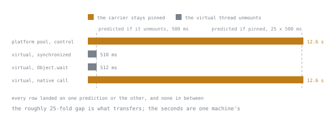

# Lesson 27. Virtual Threads

**Mission link:** The mission asks for someone who can use virtual threads where they pay and name exactly what still blocks a carrier thread, and pinning is the one part of that claim where trusting a description instead of measuring it would teach something already out of date.
**Primary source:** [JEP 444: Virtual Threads](https://openjdk.org/jeps/444)
**Prerequisites:** [Lesson 26](0026-executors-and-futures.md), [Lesson 22](0022-threads.md)

## Warm-up

1. ▢ A task is submitted to an `ExecutorService` with `submit` rather than `execute`, and it throws. If nobody calls `get` on the returned `Future`, what happens to the exception, and how would you actually see it?

<details markdown="1"><summary>Check</summary>

The exception is captured inside the `Future` and nothing is printed or reported until something calls `get`, at which point it throws `ExecutionException` with the original exception as its cause. Submitting the same failing task with `execute` instead sends the exception straight to the thread's uncaught exception handler, which is why the two methods behave so differently on failure even though they look interchangeable on success.

</details>

2. ▢ A thread's loop body catches `InterruptedException` with an empty catch block. What has that thread lost, and what are the two acceptable responses?

<details markdown="1"><summary>Check</summary>

Catching the exception clears the interrupt flag, so an empty catch destroys the only signal anyone had that cancellation was requested, and nothing downstream can tell it happened. The two acceptable responses are to propagate the failure, usually by rethrowing or wrapping it, or to restore the flag with `Thread.currentThread().interrupt()` so a later check in the same thread still sees that interruption was asked for.

</details>

## Know this

### What a virtual thread is

A virtual thread is a thread the JVM schedules itself rather than one the operating system schedules: the JDK's own scheduler, a work-stealing `ForkJoinPool` running in FIFO mode, assigns a virtual thread to run on a platform thread by mounting it there, which makes that platform thread the virtual thread's carrier for as long as it runs there. When a virtual thread blocks on ordinary I/O or another blocking JDK call, it unmounts from its carrier instead of occupying it, freeing that carrier to run a different virtual thread, and it remounts, possibly on a different carrier, once the blocking operation is ready to complete. The scheduler's parallelism, meaning the number of carriers it has to work with, defaults to the number of available processors and can be set with the `jdk.virtualThreadScheduler.parallelism` system property, which is also how the experiments later in this lesson force a small, known number of carriers so that the effect of blocking becomes visible rather than lost in noise. This is what makes blocking cheap: a virtual thread blocked on I/O costs nothing while it waits beyond its own small stack, so the straightforward thread-per-request style, one thread per request for the request's whole duration, scales to however many requests are actually in flight rather than to however many operating-system threads the process can afford. Virtual threads became a permanent part of the platform in Java 21, after two rounds as a preview feature.

```java
Thread.currentThread().isVirtual();   // false, on an ordinary main thread or a platform thread
```

### Creating one

```java
Thread.ofVirtual().name("worker").start(() -> System.out.println(Thread.currentThread()));

Thread.startVirtualThread(() -> System.out.println(Thread.currentThread()));

try (ExecutorService pool = Executors.newVirtualThreadPerTaskExecutor()) {
    pool.submit(() -> System.out.println(Thread.currentThread()));
}
```

Running the first two prints something like:

```text
VirtualThread[#26,worker]/runnable@ForkJoinPool-1-worker-1
VirtualThread[#29]/runnable@ForkJoinPool-1-worker-1
```

The `@ForkJoinPool-1-worker-1` suffix names the current carrier, which is worth noticing once: it is the platform thread doing the actual running at that instant, and it can be a different one the next time the same virtual thread is checked. `Thread.ofVirtual()` returns a builder, useful when a name or other detail is wanted before starting; `Thread.startVirtualThread` is the one-line shortcut for the common case; `Executors.newVirtualThreadPerTaskExecutor()` is the form to reach for when the code already deals in `ExecutorService`, `submit` and `Future`, carried over unchanged from lesson 26.

### The rule that pools are for expensive things, and virtual threads are not one

A thread pool exists to share an expensive resource, an operating-system thread, across many tasks, which is why every factory method in lesson 26 hands back a pool. A virtual thread costs little enough that there is nothing to share: `Executors.newVirtualThreadPerTaskExecutor()` looks like a pool because it implements the same `ExecutorService` interface, but it starts a fresh virtual thread for every submitted task and lets that thread end with the task, so calling it a pool the way a fixed-size executor is a pool is wrong, and pooling virtual threads on top of it buys nothing but extra bookkeeping. The one thing a thread pool's size was also doing, besides sharing threads, was capping how many tasks could run at once, and that job does not disappear just because the resource being shared did. A `Semaphore` acquired before the blocking work and released after states that limit directly, independent of how many threads exist, which is the correct replacement for a pool size that was really being used as a concurrency limit rather than as resource sharing.

### Pinning, measured rather than quoted

Pinning is what happens when a virtual thread cannot unmount from its carrier while it blocks, so the carrier stays occupied by that one virtual thread for as long as the blocking lasts, exactly as an ordinary platform thread would. JEP 444, the JEP that finalised virtual threads in Java 21, documented two things as pinning a carrier: a virtual thread blocked inside a `synchronized` method or statement, including a `wait` call made from inside one, and a virtual thread blocked inside native code. It also said the `synchronized` case might be fixed in a future release, while the native case was described as a harder, more permanent limitation. That sentence is now more than one release old, so the only way to know what is true on the current release is to measure it rather than repeat it.

The experiment: start a batch of virtual threads that each enter a `synchronized` block guarding nothing but a private, per-thread monitor object, so there is no real lock contention to confuse the result, and then block for a fixed duration inside that block, while the virtual thread scheduler's parallelism is pinned down to two carriers with `jdk.virtualThreadScheduler.parallelism`. If the block still pins, none of those virtual threads can unmount, so the batch can only make two threads' worth of progress at a time and the total wall time should sit near `(threads / 2) * duration`. If it does not pin, every one of them can unmount while blocked, the scheduler cycles far more than two virtual threads through the two carriers, and the total wall time should stay near one `duration` regardless of how many threads there are. As a control for what the genuinely pinned shape looks like in wall time, the identical workload run on a plain two-worker platform-thread pool, `Executors.newFixedThreadPool(2)`, where nothing can unmount because no virtual thread scheduler is involved at all, gives a real reference point rather than a guess.

| Workload | Carriers | Threads | Block | Elapsed |
|---|---|---|---|---|
| Platform-thread pool (control, unmounting is not possible) | 2 workers | 50 tasks | `Thread.sleep(500)` | about 12.6 s, three runs |
| Virtual threads, `synchronized` on a private monitor, then `Thread.sleep(500)` | 2 | 50 | 500 ms | about 510 ms, four runs |
| Virtual threads, `synchronized` on a private monitor, then `Object.wait(500)` | 2 | 50 | 500 ms | about 512 ms, four runs |
| Virtual threads, blocking native `usleep(500000)` via the Foreign Function & Memory API | 2 | 50 | 500 ms | about 12.6 s, three runs |



The experiment predicted two times and every row landed on one of them, with nothing in between. That is what makes it a result rather than four numbers: a partial or intermittent effect would have put a bar somewhere in the middle of that gap, and none is.

Every figure above is one machine's numbers from a handful of runs, and the roughly 25-fold gap between the pinned rows and the unpinned rows is the part that would transfer elsewhere, not the absolute seconds. What the numbers support: on this release, neither `synchronized` nor `Object.wait` pins the carrier, which contradicts the JEP 444 sentence two paragraphs up and matches [JEP 491, Synchronize Virtual Threads without Pinning](https://openjdk.org/jeps/491), delivered in JDK 24, which closed exactly that gap and explicitly covers both the plain `synchronized` case and the `wait`-inside-`synchronized` case JEP 444 had called out separately. A blocking call through the Foreign Function & Memory API, finalised in Java 22 and used here only as a way to make a real blocking native call from pure Java, still pins exactly as before, its measured time matching the control almost exactly rather than either unpinned row.

An independent check corroborates the timing. JDK Flight Recorder's `jdk.VirtualThreadPinned` event, which fires whenever a virtual thread tries to park while pinned, recorded zero occurrences during both the `synchronized`-plus-sleep run and the `synchronized`-plus-`wait` run, agreeing with the wall-clock result. It also recorded zero occurrences during the native-call run, despite that run's timing showing real pinning, which is worth sitting with rather than explaining away: the event fires on a failed attempt to unmount, and a plain blocking native call never attempts to unmount at all, it simply occupies the carrier for the call's whole duration, so there is nothing for that specific event to catch even though the carrier truly was unavailable to every other virtual thread the entire time. The timing test caught what the purpose-built diagnostic did not. The other diagnostic JEP 444 introduced, the `-Djdk.tracePinnedThreads` system property, produced no output in any of the runs above, which is expected rather than a further finding: JEP 491 documents that this property is now inert, since the case it traced, pinning inside `synchronized`, no longer occurs.

JEP 491 also names a few narrower cases that still pin a carrier and were not reproduced here: blocking while a class is being loaded, blocking inside a class's static initialiser, and waiting for another thread to finish initialising a class. All three pin because of a native frame the JVM itself puts on the stack, not because of anything application code wrote, and the JEP calls them rare enough to revisit only if they prove otherwise. One further piece of fallout worth naming directly: JEP 444's advice to replace a frequently blocking `synchronized` block with a `ReentrantLock`, specifically to avoid pinning, no longer has that reason behind it on this release. `ReentrantLock` still has its own advantages, covered in lesson 24, but pinning stopped being one of them.

### `ThreadLocal` at this scale

Virtual threads support `ThreadLocal` and `InheritableThreadLocal` exactly like platform threads, so old code that reads one keeps working unchanged. The place it stops being harmless is the pattern of caching an expensive resource, a database connection being the usual example, in a thread-local so that every task sharing a pooled thread can reuse it: migrate that same code to a virtual thread per task and the cache stops caching anything, since each virtual thread now runs exactly one task and is then discarded, so the expensive resource gets built once per task instead of once per pool slot. Setting the `jdk.traceVirtualThreadLocals` system property to `true` prints a stack trace at every `ThreadLocal.set` made from a virtual thread, for example:

```text
VirtualThread[#26]/runnable@ForkJoinPool-1-worker-1
    java.base/java.lang.ThreadLocal.set(ThreadLocal.java:231)
```

which is a fast way to find every place that pattern is hiding before it costs anything under load.

### No speedup for CPU-bound work, and the bottleneck that moves elsewhere

Running the same fixed amount of CPU-bound arithmetic across a platform-thread pool sized to the available processors, against the same work split across a virtual-thread-per-task executor, gave times within a few percent of each other across three runs, with the virtual-thread version never faster and consistently a little behind: 667 ms against 692 ms, 498 ms against 553 ms, and 581 ms against 585 ms for the platform pool and the virtual-thread executor respectively. That is the expected result: a running virtual thread still occupies exactly one platform thread's worth of one processor core while it runs, the scheduler does not conjure extra cores from nowhere, so CPU-bound work has nothing to gain from the switch and a small amount of scheduling machinery to lose. The workload that does gain is blocking I/O-bound work: a hundred thousand virtual threads each sleeping one second finished in under two seconds across three runs, not the far longer time a genuinely limited number of workers running them a handful at a time would take, which is the same unmounting behaviour the pinning experiment above relied on. The place that gain can bite back is a pooled resource with its own hard limit, a database connection pool being the standard example: a pool sized to match a platform-thread pool's count was implicitly also capping the number of concurrent database calls, and removing the thread-count ceiling by moving to virtual threads does not remove the database's ceiling, it only exposes it, usually as connection-acquisition timeouts under load where there used to be a queue of waiting threads instead. The fix is to size the resource's own limit for the resource, with a `Semaphore` or the resource pool's own bound, rather than relying on a thread pool's size to do that job by accident.

### Monitoring more threads than a flat list can show

The traditional thread dump obtained through `jstack` or a plain `jcmd Thread.print` lists platform threads only, which is deliberate: a flat list is workable for dozens or hundreds of threads and useless for the number of virtual threads a real workload can have. `jcmd <pid> Thread.dump_to_file -format=json <file>` is the form built for virtual threads instead: run against a program holding two thousand blocked virtual threads, it wrote one JSON file containing one entry per virtual thread, each carrying its own stack, confirmed by counting matching entries in the output. A dump at that shape scales by writing one structured file rather than printing one line per thread, which is what makes it usable at far larger counts than were tried here, where a thread dump genuinely is a different problem from the dozens-of-threads case `jstack` was built for.

### Migrating existing code

Most of the time, moving a blocking I/O-bound service to virtual threads is a small change: replace the fixed-size or cached thread pool behind an `ExecutorService` with `Executors.newVirtualThreadPerTaskExecutor()`, covered in lesson 26, and leave the rest of the code alone, since it was already written in the plain blocking style that virtual threads make cheap again. Three habits from the pooled-thread era are worth auditing on the way past: a pool size that was quietly capping concurrency against some other resource, covered above; a `ThreadLocal` caching something expensive per pooled thread, covered above; and any advice to avoid `synchronized` purely to dodge pinning, which this lesson has just measured away on this release.

## Practice

1. ▢ Fifty virtual threads each enter a `synchronized` block on their own private monitor and then call `Thread.sleep(500)` inside it, with `-Djdk.virtualThreadScheduler.parallelism=2` set on the command line. Predict roughly how long the batch takes on this release, and say what it would have been if `synchronized` still pinned the carrier.

<details markdown="1"><summary>Check</summary>

Close to 500 ms, the time for one sleep, since `synchronized` no longer pins a virtual thread's carrier as of JEP 491 in JDK 24, so all fifty threads can unmount while sleeping and the two carriers cycle through them freely. If `synchronized` still pinned, the two carriers could only run two threads at a time, so the batch would take roughly `(50 / 2) * 500` ms, about 12.5 seconds, which is exactly what the measured control with a genuine two-worker pool and no unmounting gave.

</details>

2. ▢ Find the bug in this migration from a fixed thread pool to a virtual thread per task.

   ```java
   static final ThreadLocal<Connection> CONN =
       ThreadLocal.withInitial(Database::openExpensiveConnection);

   ExecutorService pool = Executors.newVirtualThreadPerTaskExecutor();
   pool.submit(() -> handle(request, CONN.get()));
   ```

<details markdown="1"><summary>Hint</summary>

Ask how many tasks a single virtual thread runs over its lifetime, and compare that with how many tasks a single platform thread ran in the pool this code replaced.

</details>

<details markdown="1"><summary>Check</summary>

Each virtual thread runs exactly one task and is then discarded, so the thread-local cache never gets reused the way it did on a pooled platform thread that served many tasks in turn: every submitted task now opens a brand new expensive connection instead of sharing one, which is worse than the pooled version it replaced rather than merely no better. Connection pooling belongs to a real resource pool, such as a JDBC connection pool, sized for the database, not to a per-thread cache, since thread identity no longer correlates with task count once threads are this cheap.

</details>

3. ▢ A service used a fixed pool of 20 platform threads to call a downstream API, which had the side effect of never sending more than 20 concurrent calls to it. After moving the same code to `Executors.newVirtualThreadPerTaskExecutor()`, the downstream API starts returning far more rate-limit errors under the same load. What broke, and what replaces the number 20?

<details markdown="1"><summary>Check</summary>

The pool size of 20 was doing two jobs at once: sharing platform threads, and limiting concurrency against the downstream API as a side effect of there being only 20 threads to make calls with. Virtual threads removed the need to share threads, but along with it the accidental concurrency cap disappeared too, so calls now go out as fast as requests arrive. A `Semaphore` initialised with 20 permits, acquired before each call and released after, states the same limit directly and keeps enforcing it regardless of how many threads exist.

</details>

4. ▢ The same fifty-thread, two-carrier experiment from question 1 is run again, but each virtual thread calls a blocking native function, through the Foreign Function & Memory API, instead of `Thread.sleep`. Predict the elapsed time, then name one diagnostic that would confirm it and one that would not.

<details markdown="1"><summary>Check</summary>

Close to `(50 / 2) * 500` ms, about 12.5 seconds, since a blocking native call still pins its carrier on this release, unlike `synchronized`: measured, it comes out essentially the same as the genuinely-pinned platform-thread control. Comparing the batch's wall-clock time against that known-carrier-count control confirms it. The `jdk.VirtualThreadPinned` JFR event does not: it fires only on a failed attempt to unmount, and a plain blocking native call never attempts to unmount at all, so the event stays at zero even while the carrier is genuinely unavailable the whole time, and `jdk.tracePinnedThreads` confirms nothing either, since JEP 491 made that property inert.

</details>

5. ▢ A teammate switches a CPU-bound image-resizing task from a platform-thread pool to virtual threads, measures no improvement, and asks what to do next. What do you tell them?

<details markdown="1"><summary>Check</summary>

There is nothing to fix in the threading model: virtual threads only help work that spends time blocked, and CPU-bound work is never blocked, it is always running, so a running virtual thread occupies exactly one core the whole time, the same as a platform thread would. Switching thread flavours cannot speed up work that has no waiting to remove, which is exactly what running the same arithmetic on a platform-thread pool against a virtual-thread-per-task executor shows: near-identical times, with the virtual-thread version never ahead. The next move is to look for a way to parallelise the computation itself across more cores, not to change which kind of thread runs it.

</details>

## Real-world reps

- [ ] Run the two-carrier, fifty-thread experiment yourself, `synchronized` on a private monitor plus `Thread.sleep(500)` inside a virtual thread, timed against the same shape on a genuinely two-worker platform-thread pool, and watch the roughly 25-fold gap between them.
- [ ] Find a fixed-size thread pool in code you have and check whether its size exists to share threads, to cap concurrency against something else, or both; if it caps concurrency, sketch the `Semaphore` that would replace it under a virtual-thread-per-task executor.
- [ ] Search code you know for a `ThreadLocal` caching something expensive per worker thread, and check whether it would still cache anything if every task got its own fresh thread instead.
- [ ] Tomorrow: pick one blocking-I/O service in code you have, swap its executor for `Executors.newVirtualThreadPerTaskExecutor()`, run its existing load test, and see which resource other than thread count hits a limit first.

## Going further

- [JEP 444: Virtual Threads](https://openjdk.org/jeps/444): the feature itself, mounting, unmounting, and the pinning behaviour it originally shipped with
- [JEP 491: Synchronize Virtual Threads without Pinning](https://openjdk.org/jeps/491): what changed in JDK 24, and the narrower cases that still pin
- [`Thread`, Java SE 25 API](https://docs.oracle.com/en/java/javase/25/docs/api/java.base/java/lang/Thread.html): `ofVirtual`, `startVirtualThread`, `isVirtual`, and the rest of the API this lesson used
- [Concurrency](../reference/concurrency.md): the reference sheet for this stage
- [Resources](../RESOURCES.md)

---

Not landing? Reread the primary source at the top, since this lesson compresses it and compression is where understanding leaks. Check the [glossary](../GLOSSARY.md) for any term that felt slippery.

If the lesson itself is unclear rather than the material, that is a defect: [open an issue](https://github.com/TokenCemetery/teach/issues).
