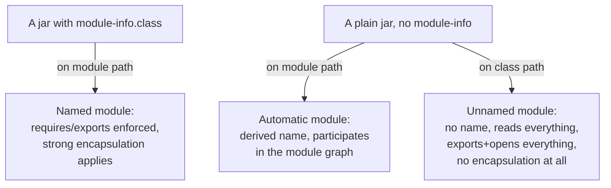

# Lesson 50. The Module System

**Mission link:** Lesson 35 showed that even a plain jar with no `module-info.class` is visible to the module system, as an automatic module, and read what `jar --describe-module` derives for one from nothing but a file name. It never explained what a real module declares, or what changes the moment code moves from "automatic" to actually named. That gap is this lesson.
**Primary source:** [Introduction to Modules in Java, dev.java](https://dev.java/learn/modules/intro/)
**Prerequisites:** [Lesson 35](0035-a-runnable-artifact.md)

## Warm-up

1. ▢ Per lesson 35, what did `jar --describe-module` report for a plain jar with no module descriptor, and where did the module name it printed actually come from?

<details markdown="1"><summary>Check</summary>

`No module descriptor found. Derived automatic module`, followed by a name derived from the jar's own file name, or from an `Automatic-Module-Name` manifest attribute if the author set one. Nothing in the jar's code decided that name; the file name, or its absence of one, did.

</details>

2. ▢ Per lesson 9, what did marking a class or member `public` used to mean about who could use it?

<details markdown="1"><summary>Check</summary>

That any other code, anywhere on the class path, could use it, with no further gate beyond the keyword itself. This lesson is exactly the gate the module system adds on top of that keyword.

</details>

## Know this

### `module-info.java` declares a boundary the compiler and runtime both recognise

```java
module com.example.app {
    requires java.sql;
    exports com.example.app.api;
}
```

A JAR, before modules existed, had no boundary at all: every public type inside one was reachable from anywhere else on the class path, and reflection could reach the private ones too. A module is different. `requires` names another module this one depends on, and module resolution follows these edges from the initial module outward, building a module graph and failing at launch, not partway through some later call, if a required module cannot be found. `exports` names which of a module's own packages make up its public API; everything else stays inside, regardless of whether the classes in it are marked `public`.

### Strong encapsulation: `public` is necessary and no longer sufficient

A type declared in one module is usable from another module only if three things are all true: the type itself is `public`, the package it lives in is `exported`, and the module trying to use it actually `requires` (reads) the module that exports it. A public class sitting in a package the module declaration never exports is invisible to every other module, exactly as if it were package-private, which is new: before the module system, "public" and "reachable from anywhere" were the same fact, and now they are two separate ones. This is what finally let the JDK itself lock away internal packages like `sun.*` that used to be merely-discouraged rather than actually unreachable.

### `opens` reopens a package for reflection, at run time only

```java
module com.example.app {
    opens com.example.entities;
}
```

`opens` is a different directive from `exports`, aimed specifically at reflection. At compile time, an opened package is exactly as encapsulated as an unexported one: code outside the module still cannot compile against its types directly. At run time, the opposite: reflection can reach every member of every type in that package, public or not, through `setAccessible`, exactly as it could reach anything before modules existed. A package that is neither exported nor opened refuses reflective access at run time with `InaccessibleObjectException`, the concrete, new failure mode strong encapsulation introduced; `opens` is how a framework that needs to reach into an entity class's private fields keeps working without every one of that module's internals becoming part of its compiled-against API. `open module` opens every package in one declaration, for a module with too many packages to list individually.

### The module path decides whether a jar becomes a module at all

The **module path** parallels the class path, but it is a different list, and which one a jar sits on decides everything this lesson has described so far. A plain jar placed on the module path becomes an automatic module, exactly as lesson 35 showed, readable by name from other modules' `requires` clauses. The identical jar, unchanged, placed on the class path instead becomes part of the single **unnamed module**: no name, so nothing can `require` it by name, but it reads every module that makes it into the graph and exports and opens every one of its own packages, meaning no encapsulation applies to class-path code at all. Whether a given jar's code is encapsulated is therefore a decision made at launch time, by which path it is placed on, not a property fixed inside the jar the way lesson 35 showed a jar's *name* mostly is.



## Practice

1. ▢ `com.example.app`'s module declaration exports nothing from `com.example.app.internal`, which contains a `public class Helper`. Predict whether code in a different module, that `requires com.example.app`, can compile a call to `new Helper()`.

<details markdown="1"><summary>Check</summary>

It fails to compile. `Helper` is `public`, but its package is not exported, so the third and second conditions strong encapsulation demands, an exported package and a reading module, are both unmet regardless of the class's own visibility keyword.

</details>

2. ▢ Same module as question 1, `com.example.app.internal` still not exported and not opened. A different module uses reflection, calling `field.setAccessible(true)` on a private field of a class in that package. Predict the outcome.

<details markdown="1"><summary>Check</summary>

It throws `InaccessibleObjectException`. Strong encapsulation applies to reflective access exactly as it does to a direct compiled reference; without an `opens` directive on that package, `setAccessible` cannot force its way past the module boundary the way it could reach any private member before modules existed.

</details>

3. ▢ A framework needs to read and write private fields on classes in `com.example.entities` reflectively, but application code should never be allowed to compile a direct reference to those classes' internals. Should the module declare `exports com.example.entities` or `opens com.example.entities`?

<details markdown="1"><summary>Check</summary>

`opens`. It grants reflective access at run time while leaving the package exactly as encapsulated at compile time as if neither directive were present, which is precisely the split this scenario needs: no compiled-against API, full reflective reach for a framework that only touches it at run time.

</details>

4. ▢ A non-modular library jar, with no `module-info.class`, is run twice: once with it placed on the class path, once with the identical file placed on the module path instead, nothing else changed. A caller in each run uses reflection to reach into one of the library's private fields with `setAccessible(true)`. Predict whether this succeeds in both runs.

<details markdown="1"><summary>Check</summary>

It succeeds on the class path run, since the jar's code lives in the unnamed module there, which opens all of its own packages, and it depends on the automatic module's own packages not being exported or opened on the module path run, since an automatic module derived from a plain jar with no descriptor is treated as exporting and opening everything it contains too, for compatibility with code that predates modules. In this specific case both actually succeed, but for different reasons, which is the point: the guarantee comes from which kind of module the code ended up in, not from the file itself.

</details>

5. ▢ A module's declaration includes `requires com.example.missing`, a module that does not exist anywhere on the module path. At what point does this actually surface: compile time, module resolution at launch, or the first line of code that would have used something from it?

<details markdown="1"><summary>Check</summary>

Module resolution at launch, before any application code runs at all. Resolution follows every `requires` edge outward from the initial module and fails immediately if one cannot be found, which is deliberately earlier than the class-path era's `NoClassDefFoundError`, thrown only once execution actually reached the missing class.

</details>

## Real-world reps

- [ ] Add a `module-info.java` to a small multi-package project, export exactly one package, and confirm a second module can use that package's public types but not a type from an unexported one.
- [ ] From a different module, try `setAccessible(true)` reflectively on a private field in a package that is neither exported nor opened, and read the exact exception it throws.
- [ ] Tomorrow: run `jar --describe-module` on the module you just built and compare its output, side by side, with lesson 35's automatic-module output for a plain jar with no descriptor.

## Going further

- [Introduction to Modules in Java, dev.java](https://dev.java/learn/modules/intro/)
- [Reflective Access with Open Modules and Open Packages, dev.java](https://dev.java/learn/modules/opening-for-reflection/)
- [Code on the Class Path - the Unnamed Module, dev.java](https://dev.java/learn/modules/unnamed-module/)
- [Lesson 35. A Runnable Artifact](0035-a-runnable-artifact.md)
- [The Module System](../reference/the-module-system.md): the stage 8 sheet
- [Resources](../RESOURCES.md)

---

Not landing? Reread the primary source at the top, since this lesson compresses it and compression is where understanding leaks. Check the [glossary](../GLOSSARY.md) for any term that felt slippery.

If the lesson itself is unclear rather than the material, that is a defect: [open an issue](https://github.com/TokenCemetery/teach/issues).
