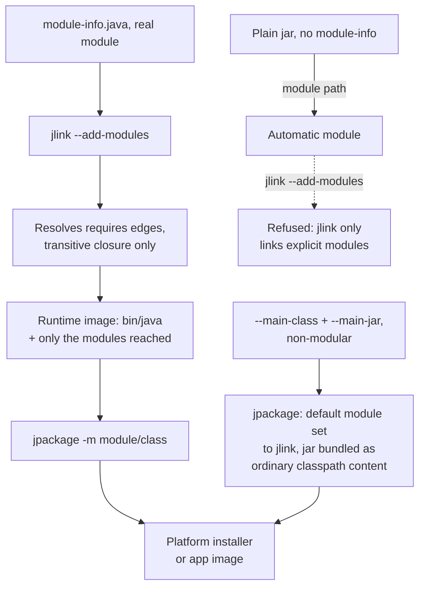

# Lesson 51. Runtime Images

**Mission link:** Lesson 35 named `jlink` and `jpackage`, said both solve a real problem, shipping to a machine with no separately installed JDK, and said both assume a modular application as a starting point, a bigger step than that lesson took. Lesson 50 is what makes that step precise: a real module, not an automatic one. This lesson is the step itself, and the reason the commons-lang3 dependency lesson 35 added, an ordinary jar with no module descriptor of its own, closes this particular door rather than merely complicating it.
**Primary source:** [The jlink Command, Oracle](https://docs.oracle.com/en/java/javase/25/docs/specs/man/jlink.html)
**Prerequisites:** [Lesson 50](0050-the-module-system.md), [Lesson 35](0035-a-runnable-artifact.md)

## Warm-up

1. ▢ Per lesson 35, what did the plain jar packaging strategy require of the target machine that the uber jar and `Class-Path` strategies also required, and what did lesson 35 say `jlink` was for instead?

<details markdown="1"><summary>Check</summary>

All three still required a separately installed JDK on the target machine to run `java` at all; lesson 35 named `jlink` as the tool for the one problem none of the three solved, a target with no JDK installed, but did not teach it because it assumes a modular application first.

</details>

2. ▢ Per lesson 50, what happens to a plain jar with no `module-info.class` when it is placed on the module path?

<details markdown="1"><summary>Check</summary>

It becomes an automatic module: readable by name from other modules' `requires` clauses, exporting and opening every package it contains, with a name derived from the manifest or the file name. This lesson asks what `jlink` does with one of those.

</details>

## Know this

### `jlink` assembles an image from the transitive closure of what you name, nothing more

```text
$ jlink --module-path mlib --add-modules com.greetings --output greetingsapp
$ greetingsapp/bin/java --list-modules
com.greetings
java.base@11
java.logging@11
org.astro@1.0
```

`--add-modules` names the modules to start resolution from, `--module-path` says where to find them, and `--output` is the directory the image is written into. Resolution follows `requires` edges exactly as an ordinary launch would, per lesson 50, and everything it reaches, root modules plus every transitive dependency, ends up copied into the image; nothing else does. The image's own `bin/java` is a complete, runnable JVM, needing no separately installed JDK on the machine it ships to, which is precisely the property lesson 35 said `jlink` bought and did not demonstrate.

### `jlink` refuses an automatic module outright

`jlink`'s own documentation is direct about this: it "only operates on explicit modules, so an application depending on automatic modules can't be linked into an image." Lesson 35's `commons-lang3` dependency, added with no module descriptor of its own, becomes exactly such an automatic module the moment it sits on a module path; that project can run perfectly well, as an automatic module or on the plain class path, and still cannot be linked into a runtime image at all, not degraded, not warned about, refused. Modularizing an application for `jlink` therefore means every dependency in the graph needs a real module declaration, not only the application's own code, which is the actual size of the step lesson 35 pointed at.

### `jlink`'s own resolution is narrower than an ordinary launch's

Two further differences from a normal launch, both in the direction of a smaller image: service provider modules are not bound by default, so a module that supplies an implementation `ServiceLoader` would otherwise pull in automatically has to be added by hand with `--add-modules` (or included wholesale with `--bind-services`); and optional dependencies, declared `requires static`, are never resolved automatically either. An application that runs correctly today, letting the ordinary module system pull in a service or an optional dependency it needs, can still fail to link with `jlink` for exactly that reason, since `jlink`'s resolution was deliberately built to include less than a full launch would, not to mirror it.

### Stripping and compressing decide most of the size

```text
$ jlink --add-modules jdk.localedata --strip-debug --compress=2 --include-locales=fr --output compressedrt
$ jlink --add-modules jdk.localedata --include-locales=fr --output fr_rt
$ du -sh ./compressedrt ./fr_rt
23M     ./compressedrt
36M     ./fr_rt
```

The same module set, `--strip-debug` and `--compress=2` against nothing, is the entire difference between these two numbers: debug symbols and uncompressed resources make up a real fraction of an image's size, and neither buys anything once the image is meant to run rather than to be debugged from source.

### `jpackage` wraps a runtime image into something a user double-clicks

`jpackage` takes a Java application and a runtime image, one it builds itself via `jlink` if `--runtime-image` is not supplied, defaulting to `--strip-native-commands --strip-debug --no-man-pages --no-header-files`, and produces a platform-specific application image or installer. It accepts a genuinely modular application the same way `jlink` does, `-m moduleName/className`, subject to the identical automatic-module refusal; it also accepts a plain, non-modular one, `--main-class` plus `--main-jar`, in which case the module list handed to its internal `jlink` run falls back to a default platform set rather than linking the application's own classes as a module at all, and the jar travels inside the produced image as ordinary classpath content instead. That second path is why `jpackage` can package an application `jlink` alone would refuse: it never tries to link the application's own code as a module in the first place.



## Practice

1. ▢ A module `com.greetings` `requires org.astro`, which in turn `requires java.logging`. Predict what `jlink --module-path mlib --add-modules com.greetings --output img` includes in the resulting image's module list.

<details markdown="1"><summary>Check</summary>

`com.greetings`, `org.astro`, `java.logging`, and `java.base`: resolution follows every `requires` edge transitively from the named root module, so both the direct and the indirect dependency end up in the image, exactly as the worked example in this lesson showed.

</details>

2. ▢ Lesson 35's project, depending on `commons-lang3` with no module descriptor of its own, is placed on the module path alongside a `module-info.java` for the project's own code. Predict whether `jlink --module-path ... --add-modules greeting --output img` succeeds.

<details markdown="1"><summary>Hint</summary>

Ask what kind of module `commons-lang3` becomes the moment it sits on the module path with no descriptor, and what `jlink` does with that kind.

</details>

<details markdown="1"><summary>Check</summary>

It fails. `commons-lang3` becomes an automatic module the moment it is placed on the module path, and `jlink` only operates on explicit modules; an application depending on even one automatic module cannot be linked into an image, regardless of whether the application's own code is a real module.

</details>

3. ▢ The same module set is linked twice: once with `--strip-debug --compress=2`, once with neither. Per the numbers this lesson quoted from the documentation's own example, which is smaller, and by roughly how much?

<details markdown="1"><summary>Check</summary>

The stripped, compressed image is smaller, 23M against 36M in the documentation's own worked example for one module with French locale data, a reduction of roughly a third from removing debug symbols and compressing resources, on identical module content.

</details>

4. ▢ `jpackage -i inputDir -n name --main-class Foo --main-jar myJar.jar` is run, with no `--module-path` and no `-m`. Is `myJar.jar` linked into the runtime image as a module, or something else?

<details markdown="1"><summary>Check</summary>

Something else. With `--main-jar` and no module specified, `jpackage` passes a default set of platform modules to its internal `jlink` run rather than linking the application's own jar as a module at all; `myJar.jar` is bundled into the produced image as ordinary classpath content instead, which is exactly why this path works for a non-modular application that `jlink` alone would refuse.

</details>

5. ▢ A module declares `requires static com.example.optional;`, an optional dependency. Predict whether a plain `jlink --add-modules mainModule --output img`, with no further options, includes `com.example.optional` in the resulting image.

<details markdown="1"><summary>Check</summary>

No. `jlink`'s resolution does not resolve optional dependencies automatically, exactly as it does not bind services automatically; either has to be named explicitly with `--add-modules` if the image is meant to include it, even though an ordinary launch might pull the optional module in if it happens to be present.

</details>

## Real-world reps

- [ ] Build a runtime image with `jlink` for a small modular "hello world" application, and confirm `bin/java --list-modules` lists only the modules actually reached, not a full JDK's worth.
- [ ] Take lesson 35's `commons-lang3`-dependent project, place its dependency on the module path, and confirm `jlink` refuses to link it; then decide, honestly, what would actually be required to fix that.
- [ ] Tomorrow: run `jpackage --type app-image` against one small project two ways, once with `-m module/class` and once with `--main-class`/`--main-jar`, and compare what each produced image actually contains.

## Going further

- [The jlink Command, Oracle](https://docs.oracle.com/en/java/javase/25/docs/specs/man/jlink.html)
- [The jpackage Command, Oracle](https://docs.oracle.com/en/java/javase/25/docs/specs/man/jpackage.html)
- [Creating Runtime and Application Images with JLink, dev.java](https://dev.java/learn/jlink/)
- [Lesson 35. A Runnable Artifact](0035-a-runnable-artifact.md)
- [Lesson 50. The Module System](0050-the-module-system.md)
- [The Module System](../reference/the-module-system.md): the stage 8 sheet
- [Resources](../RESOURCES.md)

---

Not landing? Reread the primary source at the top, since this lesson compresses it and compression is where understanding leaks. Check the [glossary](../GLOSSARY.md) for any term that felt slippery.

If the lesson itself is unclear rather than the material, that is a defect: [open an issue](https://github.com/TokenCemetery/teach/issues).
