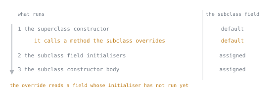

# Modelling

Lookup sheet for stage 2. The question it exists to answer: **which construct should model this, and what does choosing it commit me to?**

## Choosing the construct

| Construct | For | Forbids | Tell you picked wrong |
|---|---|---|---|
| class | general state and behaviour, mutable by default | nothing extra, it is the general case | hand-writing `equals`, `hashCode` and `toString` for what is really just a header of final data |
| record | a transparent, immutable carrier: a header plus a rule | extending anything, since the one superclass slot is spent on `java.lang.Record`; an instance field beyond the header, `error: field declaration must be static`; being non-final | wanting a setter, or wanting to subclass it |
| enum | a fixed, small set of interchangeable instances sharing one shape | instantiation outside the declared constants, `error: enum classes may not be instantiated`; a public constructor, `modifier public not allowed here` | two "constants" need to carry data the other one has no room for |
| sealed interface | a closed set of alternatives that carry different data or behaviour per case | an implementor outside `permits`; a permitted type with no `final`, `sealed` or `non-sealed` of its own, `error: sealed, non-sealed or final modifiers expected` | writing an `instanceof` chain, or a `switch` with a `default` that would swallow a case nobody has written yet |
| interface, open | a contract with no state, open to any number of implementors | a field with no initialiser, `error: = expected`, since a `final` field needs a value and there is no constructor to give it one | declaring a field that is not a constant, or wanting to close off who may implement it |
| abstract class | shared state and construction logic across subclasses in a genuine is-a relationship | direct instantiation, `error: Shape is abstract; cannot be instantiated` | the subclasses share a method list but no real state or construction logic worth inheriting |

## What a record generates

| Per component | Generated |
|---|---|
| field | `private final`, named for the component |
| accessor | `componentName()`, never `getComponentName()` |
| constructor | one canonical constructor, taking every component in header order |
| `equals` | true when the runtime type matches and every component is equal, by that component's own `equals` |
| `hashCode` | combined from every component's hash code, so equal records always hash the same |
| `toString` | every component in header order, `Type[component=value, ...]` |

| A record refuses | Because |
|---|---|
| extending anything | its single superclass slot is already spent on `java.lang.Record` |
| an instance field beyond its components | `error: field declaration must be static` |
| being non-final | implicitly `final`, no keyword written or permitted |

`equals` on a `double` component follows `Double`'s boxed semantics rather than `==`: two `NaN` values compare equal, and `-0.0` does not equal `0.0`. An array component breaks both `equals` (identity, not content) and `toString` (no contents shown), since a record does not special-case arrays. A compact constructor that copies a mutable component on the way in stops the leak from the constructor argument; it does nothing about the generated accessor still handing back the same mutable field, which needs its own override to close.

## Construction order

1. The superclass constructor runs to completion first, including its own field initialisers and instance initialiser blocks.
2. This class's field initialisers and instance initialiser blocks run, in source order, interleaved exactly as written.
3. The constructor body runs last.

Consequence: a superclass constructor that calls a method the subclass overrides sees that override read the subclass's own fields still at their default, because the subclass's field initialisers have not run yet.

The override does not run between the numbered steps, it runs **inside** step 1, and step 2 is what would have given the field its value. That ordering is why calling an overridable method from a constructor is a defect rather than a style preference: no amount of care in the subclass can fix it, because the subclass has not started yet.

## Overriding rules

| An override may | An override may never |
|---|---|
| widen access | narrow access, `attempting to assign weaker access privileges; was public` |
| return a covariant subtype (final in Java 5) | return an unrelated type |
| drop or narrow checked exceptions, down to none | add a new checked exception, `overridden method does not throw SQLException` |

| Looks like an override | Is actually |
|---|---|
| a `static` method with the same signature in a subclass | hiding, resolved on the reference's declared type, not the object's runtime type |
| a field with the same name in a subclass | hiding, resolved on the reference's declared type the same way |
| a method with the same name but a different parameter type | overloading, resolved at compile time from the static argument types, `@Override` fails it with `method does not override or implement a method from a supertype` |

## Inheritance smells and their replacement

| Smell | Replacement |
|---|---|
| Subclassing only for code reuse, with no real is-a relationship (a `HashSet` subclass double-counting through `addAll` calling `add`) | Delegation: hold the object as a field, implement its interface, forward every method, override only what genuinely changes |
| A constructor calls a method the subclass overrides | Make the method `final` or `private`, or move the call out of the constructor entirely |
| Every `protected` member becomes a permanent contract with subclasses you do not control (the fragile base class problem) | Keep the base minimal, or seal it, and expose behaviour through composition instead of a `protected` hook |
| `equals` fights symmetry once a subclass adds a field | Composition, holding a field instead of extending, or `getClass()` equality on both sides instead of `instanceof` |
| Reaching for `extends` only to share constants | A class with a private constructor, or an enum, holding the constants instead of an interface |

## Pattern matching forms

| Form | Syntax | Finalised in |
|---|---|---|
| `instanceof` pattern | `if (o instanceof Circle c) { ... }` | Java 16 |
| type pattern in `switch` | `case Circle c -> ...` | Java 21 |
| record pattern | `case Circle(double r) -> ...` | Java 21 |
| nested record pattern | `case Circle(Point(var x, var y), var r) -> ...` | Java 21 |
| `when` guard | `case Login(var u, var a) when a > 3 -> ...` | Java 21 |
| `case null` | `case null -> ...` | Java 21 |

## Exhaustiveness

`default` may be omitted when either holds:

- the selector's type is `sealed` and every permitted subtype has a `case`
- the selector is an enum and the `switch` is an expression covering every constant

| A switch can still fail at run time by | Cause |
|---|---|
| `MatchException` | the switch was compiled against an older version of the sealed hierarchy or enum; a case added later and shipped without recompiling the switch is left unhandled |
| `NullPointerException` | the selector is `null` and no `case null` label is present, even though every non-null case is covered |

## Enum facts worth looking up

| Fact | Detail |
|---|---|
| `values()` allocates per call | a fresh array every time, copied from the constants the language holds; mutating the returned array changes nothing |
| `ordinal()` must never be persisted | it is a declaration-order position; inserting a constant later shifts every ordinal after it, silently, with nothing to catch the mismatch |
| `EnumMap` and `EnumSet` | index by `ordinal()` into an array-backed structure, iterate in declaration order regardless of insertion order, and beat a `HashMap` or `HashSet` for an enum key |
| `==` is correct | the constants are the only instances that will ever exist, the same guarantee a string pool gives interned literals |

`valueOf(String)` throws `IllegalArgumentException: No enum constant Type.name` on an unknown name; store `name()` if a value must survive a redeclaration, since a rename is at least visible in the diff that caused it.

## Generics

| Wildcard | Use for | Forbids |
|---|---|---|
| `? extends T` | reading only, a producer | writing anything, `incompatible types: int cannot be converted to CAP#1` |
| `? super T` | writing only, a consumer | reading anything typed more precisely than `Object` |
| `?`, unbounded | a type argument that is unknown, not raw | any write that is not `null`, `incompatible types: String cannot be converted to CAP#1` |

Erasure removes the type argument at run time, so `List<String>` and `List<Integer>` share one `Class` object, and every rule below follows from there being nothing left to check against:

| Erasure forbids | Real compiler message |
|---|---|
| `new T[]` | `error: generic array creation` |
| `instanceof` against a parameterised type | `error: Object cannot be safely cast to List<String>` |
| two methods differing only after erasure | `error: name clash: process(List<Integer>) and process(List<String>) have the same erasure` |
| a type parameter in a static context | `error: non-static type variable T cannot be referenced from a static context` |
| assigning `List<String>` to `List<Object>` | `incompatible types: List<String> cannot be converted to List<Object>` |

A raw type switches checking off entirely instead of failing: `warning: [unchecked] unchecked call to add(E) as a member of the raw type List`. Reach for a `Class<T>` token when a genuine run-time type is needed, to validate a cast or drive a reflective construction, since erasure has already thrown the compile-time `T` away by the time the program runs.

## The immutability recipe

- No setters, and no other method that mutates state after construction.
- Every field `final`.
- The class itself `final`, or `sealed` with permitted subtypes that keep the same discipline.
- A defensive copy of any mutable argument on the way in.
- A defensive copy or an unmodifiable view of any mutable field on the way out, meaning the accessor, not only the constructor.
- No reference to the object escaping before its constructor finishes.

A record supplies every line except the copying, both directions, which is why a `List` or array component is the recipe's most common gap.

| | `List.copyOf` | `Collections.unmodifiableList` |
|---|---|---|
| Kind | snapshot | view |
| Later change to the backing list | not visible | visible |
| Already-immutable input | returns the same instance if it is `List.copyOf`'s own prior result, otherwise copies | always wraps, never copies |

Neither one touches the **elements**: an unmodifiable list of mutable elements still lets every element change, since the list only ever refused writes to itself.

## Feature to release

| Feature | Finalised in |
|---|---|
| Covariant return types | Java 5 |
| `enum` | Java 5 |
| Diamond operator, `new Box<>()` | Java 7 |
| Default interface methods | Java 8 |
| Static interface methods | Java 8 |
| `@FunctionalInterface` | Java 8 |
| Private interface methods | Java 9 |
| `var` for locals | Java 10 |
| Single-file source launcher, `java Foo.java` (JEP 330) | Java 11 |
| Switch expressions | Java 14 |
| `instanceof` pattern matching | Java 16 |
| Records, local records | Java 16 |
| Sealed classes and interfaces | Java 17 |
| Pattern matching for `switch`, record patterns, nested record patterns, `when` guards, `case null`, `MatchException` | Java 21 |
| Flexible constructor bodies, statements before `this(...)` or `super(...)` | Java 25 |

## Sources

- [JLS Chapter 8, Classes](https://docs.oracle.com/javase/specs/jls/se25/html/jls-8.html)
- [JLS 8.4.8, Inheritance, Overriding, and Hiding](https://docs.oracle.com/javase/specs/jls/se25/html/jls-8.html#jls-8.4.8)
- [JLS 8.9, Enum Classes](https://docs.oracle.com/javase/specs/jls/se25/html/jls-8.html#jls-8.9)
- [JLS 8.10, Record Classes](https://docs.oracle.com/javase/specs/jls/se25/html/jls-8.html#jls-8.10)
- [JLS Chapter 9, Interfaces](https://docs.oracle.com/javase/specs/jls/se25/html/jls-9.html)
- [JLS 4.6, Type Erasure](https://docs.oracle.com/javase/specs/jls/se25/html/jls-4.html#jls-4.6)
- [JEP 395, Records](https://openjdk.org/jeps/395)
- [JEP 409, Sealed Classes](https://openjdk.org/jeps/409)
- [JEP 441, Pattern Matching for switch](https://openjdk.org/jeps/441)
- [`Record`](https://docs.oracle.com/en/java/javase/25/docs/api/java.base/java/lang/Record.html)
- [`Enum`](https://docs.oracle.com/en/java/javase/25/docs/api/java.base/java/lang/Enum.html)
- [`List`](https://docs.oracle.com/en/java/javase/25/docs/api/java.base/java/util/List.html)
- [`Class`](https://docs.oracle.com/en/java/javase/25/docs/api/java.base/java/lang/Class.html)
