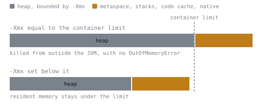

# The Runtime

## Memory areas at a glance

A JVM process is at least five separate pools, not one. `-Xmx` bounds exactly one row of this table. See [lesson 36](../lessons/0036-where-memory-goes.md).

| Area | Holds | Bounded by | Does `-Xmx` touch it? |
|---|---|---|---|
| Heap | Objects created by `new` and everything that compiles down to it | `-Xmx` | Yes, this is the row it bounds |
| Metaspace | Loaded classes' metadata: constant pool, bytecode, field layout | `-XX:MaxMetaspaceSize`, unbounded by default | No |
| Thread stacks | Call frames, one stack per thread | `-Xss`, times the number of live threads | No |
| JIT code cache | Compiled native machine code | `-XX:ReservedCodeCacheSize` | No |
| Native and direct memory | Direct buffers, JNI allocations, memory-mapped files, the collector's own bookkeeping | `-XX:MaxDirectMemorySize`, or the heap ceiling if that is left unset | No |

Resident memory, the number a container's own out-of-memory killer watches, is the sum of all five rows. A container given a memory limit, with a JVM inside it told only `-Xmx` equal to that same limit, has zero headroom for the other four, and the kill that follows leaves no `OutOfMemoryError` and no application log line, because the JVM was never asked to throw anything.

The four non-heap areas are drawn the same width in both bars, which is the point: `-Xmx` does not bound them, so lowering it does not shrink them. It only buys them somewhere to live. The proportions above are illustrative, since what each of the four actually costs is a property of the workload and has to be measured.

## Heap sizing flags that matter

| Flag | Sets | Reported tag | Notes |
|---|---|---|---|
| `-Xmx` | Maximum heap size | set explicitly, or `{ergonomic}` if left unset | The one ceiling every other flag in this table exists to protect headroom around |
| `-Xms` | Initial heap size | set explicitly, or `{ergonomic}` if left unset | Starting small and growing costs nothing most services notice |
| `-XX:MaxRAMPercentage` | The share of visible memory the heap ergonomically claims | `25.000000 {default}` | A literal constant, the same on every machine, until overridden |
| `InitialHeapSize` / `MaxHeapSize` | The computed result of applying that percentage | `{ergonomic}` | Not a constant: recalculated from whatever the JVM believes the available memory to be |

`{default}` and `{ergonomic}` are different claims. A `{default}` value is a fixed number baked into the JVM; an `{ergonomic}` value was computed at startup from the machine the JVM believes it is running on, so the same unflagged command can report a different heap ceiling on a different machine, and, inside a container, a different ceiling again if the JVM reads the host's total memory instead of the container's own cgroup limit. That is the container caveat: leave headroom below the container's limit for the other four areas, and set `-Xmx` (or a checked `-XX:MaxRAMPercentage`) to a number verified against the container's real limit, rather than trusting ergonomics to have seen the same ceiling the container enforces. See [lesson 36](../lessons/0036-where-memory-goes.md).

## `OutOfMemoryError` to cause

Each message text is an index into the memory-areas table above, not a generic complaint. See [lesson 36](../lessons/0036-where-memory-goes.md).

| Message | Names | What to check |
|---|---|---|
| `Java heap space` | The heap | Too many live objects, or `-Xmx` set too low for the workload |
| `Metaspace` | Metaspace | A classloader leak, or runtime class generation that never lets classes unload |
| `unable to create native thread` | Thread stacks and the operating system's own thread ceiling | Too many platform threads, often one-thread-per-request under load |
| `Direct buffer memory` | Native and direct memory | Direct buffers allocated and never released, or `-XX:MaxDirectMemorySize` set too low |
| `GC overhead limit exceeded` | The heap, specifically | The collector running almost continuously and reclaiming almost nothing; a sizing problem, not a collector complaint |
| `Requested array size exceeds VM limit` | The heap, at one allocation | An overflowed or miscalculated length, rarely a genuine capacity need |

Five of these six rows throw the short name as the entire message. The direct-buffer row does not: the text actually thrown is `Cannot reserve 1000000 bytes of direct buffer memory (allocated: 16000000, limit: 16777216)`, and `Direct buffer memory` is a phrase found inside that longer, templated sentence, not the whole of what gets printed. Do not go looking for `Direct buffer memory` as a standalone line; look for the phrase embedded in a message about reserving bytes.

`StackOverflowError` is not a row in this table and does not belong in it. `OutOfMemoryError` means a shared pool, checked from outside the thread that triggered it, has nothing left for anyone. `StackOverflowError` means one thread's own stack, a resource nobody else was using, ran past what `-Xss` reserved for it. Raising `-Xmx` changes nothing for a runaway recursion; raising `-Xss` buys more depth before the identical error fires, at the cost of that larger reservation applying to every thread the process creates afterwards, not only the one that needed it.

## Object cost

Every object's bytes are header, then fields, then padding up to the next 8-byte boundary; none of the three appears in the declaration. See [lesson 37](../lessons/0037-the-shape-of-an-object.md).

| Object | Declared data | Measured size | Breakdown |
|---|---|---|---|
| `record Point(int x, int y)`, default headers | 8 bytes (two `int`) | 24 bytes | 12-byte header, 8 bytes of data, 4 bytes padding |
| Same record, `-XX:+UseCompactObjectHeaders` | 8 bytes | 16 bytes | 8-byte header, 8 bytes of data, no padding |
| `int[5]` | 20 bytes (five `int`) | 40 bytes | 16-byte header (12-byte base plus 4-byte length), 20 bytes payload, 4 bytes padding |

The default header is 12 bytes; the compact header is 8. That single fact explains both record measurements: 12 plus 8 rounds up to 24, and 8 plus 8 needs no rounding, landing exactly on 16. A small object is where the header dominates most, since there is less data to dilute a fixed cost.

Boxing pays the same tax again, once per box. A `Map<String, Integer>` counter is never four bytes per count: each entry is a map-internal node (a hash, a key reference, a value reference), the boxed `Integer` the node points to, and the `String` key, each carrying its own header. `UseCompressedOops`, on by default and reported `{ergonomic}`, shrinks every reference field to a 32-bit offset instead of a full 8-byte address wherever the heap is small enough for the trick to still reach every object; it attacks the reference inside an object, where compact headers attack the header in front of one, and the two compound rather than compete.

## Compact object headers

| Property | Value on JDK 25 |
|---|---|
| Flag | `-XX:+UseCompactObjectHeaders` |
| Reported tag | `{product lp64_product}` |
| Default | `false` |
| Unlock flag needed | None; accepted directly |
| Source | JEP 519 |

The flag was experimental in JDK 24 behind `-XX:+UnlockExperimentalVMOptions`; JEP 519 promotes it to an ordinary product flag on JDK 25, still off by default, and JEP 519 states as an explicit non-goal that becoming the default is not what this change is for. A related JEP, 534, targets flipping that default to `true` on a later release, so "off by default" is a JDK 25 fact rather than a permanent one.

Before enabling it anywhere that matters, weigh two things rather than assume. First, whether the workload's actual bottleneck is the volume of small objects it allocates, a question a profiler answers and someone else's case study does not. Second, whether anything in the toolchain inspects raw object layout directly: JOL, the tool most articles reach for, needs a dynamically attached agent the platform already warns it intends to disallow by default, and does not complete on JDK 25 by any of its three invocation methods. Object sizes in this stage were measured with the allocation profiler's bytes-per-operation reading instead, which needs no agent and no extra flag. See [lesson 37](../lessons/0037-the-shape-of-an-object.md).

## Escape analysis

Escape analysis asks one question: can anything outside the method that created this object ever observe it? If nothing can, the just-in-time compiler is free to scalar-replace it, keeping its fields as plain values and never building the object at all. See [lesson 38](../lessons/0038-the-allocation-that-never-happened.md).

| What the code does | Escapes? | Why |
|---|---|---|
| Read fields once, discard the reference | No | The compiler can read the object's entire lifetime in one pass |
| Store the reference into an instance or static field | Yes | Anything that later reads that field, including another thread, can now observe the object |
| Return the reference from the method | Yes | The caller now has it, and the compiler cannot generally see every caller |
| Pass it to a method the compiler does not inline | Yes | A call it cannot see past is a boundary it must assume the worst about |
| Put it into a collection | Yes | The collection exists to keep the reference reachable well past the call that inserted it |

Measured effect, two methods doing identical arithmetic on a `Point`, differing by one field store: the non-escaping version measured 0.597 ns/op with allocation reported as effectively zero, roughly 10 to the minus 5 bytes per operation, measurement noise around a true value of zero. The escaping version measured 2.878 ns/op and allocated the full 24 bytes per operation, the same figure this sheet's object-cost table gives for that record with default headers: about 4.8 times slower, measured on one machine with this workload, a ratio a different machine should reproduce even if its absolute numbers differ. None of this is guaranteed behaviour: whether it fires depends on inlining and compilation-tier decisions the source code does not record, so the only way to know is to measure bytes per operation, not to reason about the code.

## Collector selection

Every collector answers the same three questions, and none answers all three well at once: throughput is how much machine time goes to the program rather than to collecting, pause time is how long any one collection may stop the program for, and footprint is how much bookkeeping a collector needs beyond the objects themselves. Buying more of one costs one of the other two, for structural reasons rather than for lack of a cleverer collector. See [lesson 39](../lessons/0039-collectors-and-the-trade.md).

| Collector | Optimises for | Pays for it in | Right for |
|---|---|---|---|
| Serial | Footprint and simplicity | Throughput and pause time both scale with heap size, with nothing spent hiding it | A heap small enough, or a machine constrained enough, that the other two corners never come up |
| Parallel | Throughput | Pause time, fully stop-the-world, sized to accumulated garbage | Batch and offline work where nobody is waiting on any particular moment |
| G1 | A balance of all three | The best case in any single one of them | The default: a service with no unusual requirement pulling it toward one corner |
| ZGC | Pause time, independent of heap size | Footprint, for the concurrent bookkeeping that keeps pauses short as the heap grows | Large heaps under a hard latency ceiling |
| Shenandoah | Pause time, independent of heap size | Footprint, by a different concurrent mechanism aimed at the same target as ZGC | The same latency requirement as ZGC, chosen after measuring both against the real workload |

All five are present and accepted on JDK 25; asking for any of them by name produces no error. G1 is what an unflagged JVM on a server-class machine runs, reported `{ergonomic}` rather than as a default anyone typed, because the runtime looked at the processor count and memory it could see and judged G1 to fit. Neither ZGC nor Shenandoah is anyone's ergonomic default, so reaching for either is already deliberate, and the honest way to choose between the two is to measure both against the real workload rather than pick from reputation. ZGC has no non-generational mode left to opt out of: JEP 490 removed it, and the old flag `-XX:+ZGenerational` now produces `OpenJDK 64-Bit Server VM warning: Ignoring option ZGenerational; support was removed in 24.0` and runs anyway, silently, on ZGC's only remaining mode.

The order of leverage, smallest to largest: tuning one collector's own flags only adjusts how it spends a budget that already exists; changing which collector runs at all is a bigger lever, since the five are different algorithms making different structural bets, not five settings on one machine; not allocating in the first place is bigger than either, since a removed allocation is removed for every collector at once and forever. Pick the collector from a stated requirement, tune it only once a measurement says it is the bottleneck, and ask what is being allocated unnecessarily before either.

## Garbage collection log fields

A collector that is doing its job produces no output at all by default. `-Xlog:gc` asks for the narrow view, one line per collection; `-Xlog:gc*` asks for every tag the subsystem can emit. Either can be pointed at a file with `file=`. See [lesson 40](../lessons/0040-reading-a-gc-log.md).

| `-Xlog` form or decorator | Gives you |
|---|---|
| `-Xlog:gc` | One line per collection, the view most reading starts from |
| `-Xlog:gc*` | Every garbage collection tag: regions, concurrent phases, per-thread timing |
| `file=gc.log` | Writes to a file rather than the console, for anything longer than you intend to watch |
| `time` | A wall-clock timestamp on every line |
| `uptime` | Seconds since the JVM started |
| `level` | The line's severity, `info` for an ordinary collection report |
| `tags` | The logging component that produced the line, `gc` for these |

Decomposing one line, `GC(1) Pause Young (Normal) (G1 Evacuation Pause) 114M->15M(258M) 3.946ms`:

| Field | Value in this line | Meaning |
|---|---|---|
| Sequence | `GC(1)` | A counter incremented once per collection, never reset or reused |
| Pause kind | `Pause Young (Normal)` | An ordinary young collection, as opposed to one starting concurrent marking or falling back to a full sweep |
| Cause | `(G1 Evacuation Pause)` | For an ordinary young collection, always that the young generation filled and had to be evacuated |
| Occupancy | `114M->15M(258M)` | In use immediately before, still live immediately after, currently committed |
| Duration | `3.946ms` | How long every application thread was stopped for this one collection |

The committed figure in parentheses is not `-Xmx`. It is what the collector happens to be holding right now, free to grow toward the ceiling as demand requires; `-Xmx` is the promise about the largest it may ever grow to. A run capped at `-Xmx512m` showing `(258M)` committed is comfortably under its ceiling, not close to it.

## What a log's aggregate says

Reading one line teaches the format. Reading the whole log means totalling across every line, then computing one number before touching a single flag: the pause fraction, total pause time divided by the run's wall-clock time. Measured on one machine, over a 200,000-line, 40-round run: 44.2 ms of pauses against a 7,441 ms run, a little under six thousandths, 0.6 per cent. See [lesson 40](../lessons/0040-reading-a-gc-log.md).

| Shape in the log | Verdict | Whose territory the fix is in |
|---|---|---|
| Pause fraction low (measured: 0.6 per cent) | The collector is not the problem; no change to it can win back more than that same fraction | Profiling the other 99.4 per cent, [lesson 42](../lessons/0042-from-profile-to-proof.md) |
| Pause fraction in double figures (10 per cent or more) | Real time is on the table; sizing the heap or the generation split from the log's own occupancy numbers is a legitimate next move | Collector choice or tuning, [lesson 39](../lessons/0039-collectors-and-the-trade.md) |
| Repeated full collections, each reducing occupancy only a little | Promotion pressure: objects survive into the old generation faster than anything there reclaims them | Heap sizing, [lesson 39](../lessons/0039-collectors-and-the-trade.md) |
| Rising post-collection occupancy that never returns to an earlier baseline | A growing live set: something is retained that a young collection correctly leaves alone | What the program holds a reference to and why, [lesson 36](../lessons/0036-where-memory-goes.md) |
| Humongous allocation cause appears | A single object at least half a region's size took a special path outside ordinary young allocation | The size of a specific allocation, not the collector's health |

A log is also read for what it does not contain. Sixty young collections and no full collection at all means nothing is being promoted faster than the young generation can reclaim it; no humongous-allocation cause anywhere means nothing this program built approached half a region's size on its own.

## Benchmark setup checklist

- Declare `jmh-core` and `jmh-generator-annprocess` at the same version, `1.37` on JDK 25; the two artifacts share one version number.
- Do not rely on `jmh-generator-annprocess` sitting on the classpath at `provided` scope to get itself invoked. On JDK 25, `javac` does not run an annotation processor merely because its jar is present, and it says nothing about not running it. Rechecked on JDK 26: the build still succeeds, still warns about nothing, and still produces no `META-INF/BenchmarkList`, while the `annotationProcessorPaths` fix still generates it.
- The canonical setup that most write-ups show, `provided`-scoping the generator, therefore compiles cleanly, packages cleanly, and produces a jar with zero benchmarks, with no warning anywhere in the build. It fails only when run: `Exception in thread "main" java.lang.RuntimeException: ERROR: Unable to find the resource: /META-INF/BenchmarkList`.
- Fix it by naming the processor explicitly on `maven-compiler-plugin` (`3.15.0` or later) as an `annotationProcessorPaths` entry, which makes annotation processing something the build asks for by name rather than something that happens because a jar was reachable.
- Verify by checking the packaged jar for `META-INF/BenchmarkList` before trusting a single benchmark result from it.

See [lesson 41](../lessons/0041-a-benchmark-you-can-trust.md).

## Benchmark trust checklist

| Check | What it protects against |
|---|---|
| Read the error before the mean | An error close to or larger than the mean means the run has not converged; `6.227 ± 16.560 ns/op` supports an interval running from a large negative number to a large positive one, which is not a result |
| Compare whole intervals, not means | Two means can differ while their intervals overlap entirely; only non-overlapping intervals support a conclusion of a real difference |
| Respect the measurement floor | An empty method measured 0.590 ns/op, and several cheap expressions all landed between 0.589 and 0.646 ns/op; below that level you are measuring the harness, not the code |
| Use enough forks and iterations | One fork, three short iterations produced `6.227 ± 16.560`; two forks, five two-second iterations produced `6.795 ± 0.017` on identical code |
| Consume every result | Return the value, or hand it to a `Blackhole`; whether an unconsumed computation gets removed depends on the compiler, the platform and the surrounding code, and is not predictable in either direction |
| Watch the blackhole mode line | JMH auto-detects and reports which mode keeps results alive; comparing scores taken under different modes is not meaningful, by JMH's own warning |
| Fix the locale | Scores print with the platform's default locale; a comma-decimal locale turns `86.412 ns/op` into `86,412 ns/op`, misread as an integer in the tens of thousands. Pass `-Duser.language=en -Duser.country=US` before sharing a result |

The two intervals `1880.3 ± 110.6 us/op` and `1662.7 ± 19.2 us/op`, from a three-fork, five-warmup, five-measurement-iteration run, do not overlap and support a real improvement of about 1.13 times. The same comparison, run with one fork and five iterations, reported `1761.6 ± 500.0` against `1679.2 ± 88.1`, intervals that overlap entirely, supporting no conclusion at all. Identical code, opposite conclusions; only the error bars changed. See [lesson 41](../lessons/0041-a-benchmark-you-can-trust.md).

## Flight Recorder commands

`-XX:StartFlightRecording=filename=rec.jfr,settings=profile` needs no separate agent and no extra dependency, since Flight Recorder ships inside the JDK. `settings=default` samples roughly once every 20 ms and favours low overhead for an always-on recording; `settings=profile` samples more aggressively and turns on more event types, including allocation sampling, at a heavier but still small cost, measured on one machine as about 1.0 MB for an 8-second run. See [lesson 42](../lessons/0042-from-profile-to-proof.md).

| Command | Answers |
|---|---|
| `jfr summary rec.jfr` | A table of contents: event types, counts and sizes, the first thing to read |
| `jfr print --events jdk.ExecutionSample rec.jfr` | Which stack frames the profiler caught the program standing on, and how often |
| `jfr print --events jdk.ObjectAllocationSample rec.jfr` | Which types were caught being allocated, and how often |
| Reading `jdk.AllocationRequiringGC` in the summary | Whether allocation is outrunning the collector's ability to keep free space ready; a count of 0 means it never has |
| Reading `jdk.GarbageCollection`'s count against a separate `-Xlog:gc` run | Whether two instruments agree on the same run; matching counts are two tools confirming one fact rather than two separate facts |

A sampling profiler interrupts the program at intervals and tallies what it finds on the stack; that tally correlates with time spent but is not the same measurement, and it is blind to anything between two samples. Six hundred or so samples are enough to see a lopsided signal but not enough to defend an exact percentage for any single method. When sampling is not decisive enough, async-profiler, a separate, actively maintained project rather than something built into the JDK, is the tool most engineers reach for next.

## The optimisation loop

1. **Measure first**, so you know whether there is a problem at all and roughly how large it is. A pause-fraction calculation from a garbage collection log is this step for the collector, and it is the step most likely to tell you to stop looking there.
2. **Profile to find where**, once measurement has said there is a problem worth chasing. A recording turns "the program is slow" into a ranked list of named frames.
3. **Form a hypothesis.** The profile names where time and allocation go; it has no opinion on what change fixes that, and more than one fix is usually possible for the same named frame.
4. **Change one thing.** Never two changes at once, or the next measurement cannot tell you which change produced the result.
5. **Benchmark it**, with enough forks and iterations that the error bars are narrow enough to support a conclusion, and the allocation profiler running alongside the clock.
6. **Keep or revert on the evidence.** A change that lands inside the original's error bars gets reverted, not kept out of hope.

See [lesson 42](../lessons/0042-from-profile-to-proof.md).

## Symptom to cause

| Symptom | What it actually means |
|---|---|
| A container is killed with no Java stack trace, despite `-Xmx` matching the container's limit | Resident memory is the heap plus metaspace, stacks, code cache and native memory; the container's out-of-memory killer acts from outside the JVM, which was never asked to throw anything (lesson 36) |
| `OutOfMemoryError: Direct buffer memory` while a heap dashboard shows headroom | The bytes behind `ByteBuffer.allocateDirect` live outside the heap, in a pool the dashboard never watches (lesson 36) |
| `OutOfMemoryError: Metaspace` after many hot reloads or generated proxy classes | Metaspace is freed by unloading a whole classloader, not object by object; one live reference to the old classloader keeps every class it defined un-collectable (lesson 36) |
| A method's allocation shows up in a profile on one run and not another, with no code change | Escape analysis and scalar replacement depend on inlining and compilation-tier decisions, not on the source shape alone (lesson 38) |
| Throughput drops after an apparently harmless line, such as a logging call, is added to a hot method | The new call is likely uninlined, which defeats escape analysis on an object that used to scalar-replace cleanly; confirm with bytes-per-operation, not the throughput drop alone (lesson 38) |
| A tuning sprint is proposed for a collector nobody has measured | The pause fraction from a garbage collection log may already show the collector is a rounding error, in which case no flag can win back more than that fraction (lessons 39, 40) |
| A collector flag from an old article does nothing and raises no error | Version-sensitive advice is a claim about a specific release; `-XX:+ZGenerational` is silently ignored with an easily missed warning on the current release (lesson 39) |
| A JMH module builds and packages cleanly but runs zero benchmarks | The annotation processor was on the classpath but never invoked; declare it explicitly with `annotationProcessorPaths` (lesson 41) |
| Two implementations' benchmark scores disagree between runs | Error bars were wide enough in one run to swallow the entire gap; only non-overlapping intervals license a conclusion (lesson 41) |
| A shared benchmark report shows a score like an unexplained large integer | The platform's default locale printed a comma decimal separator (lesson 41) |
| Fixing the profile's loudest named frame recovers only a small fraction of the available speed-up | The frames underneath the fix, not the one named loudest, were the real cost, and they only disappear when the underlying approach changes (lesson 42) |

## Version table

| Item | Value on JDK 25 |
|---|---|
| Baseline release | JDK 25, the current long-term-support release; the long-term-support line is 8, 11, 17, 21, 25, next 29 |
| Default collector, unflagged, server-class machine | G1, reported `{ergonomic}` |
| `MaxRAMPercentage` default | 25.0, reported `{default}` |
| `UseCompressedOops` default | `true`, reported `{ergonomic}` |
| Collectors present and accepted | Serial, Parallel, G1, ZGC, Shenandoah, all with no error when named |
| ZGC mode | Generational only; the non-generational mode was removed (JEP 490) |
| `-XX:+UseCompactObjectHeaders` | `{product lp64_product}`, default `false`, no unlock flag needed (JEP 519) |
| `jmh-core` / `jmh-generator-annprocess` | `1.37`, one shared version number |
| `maven-compiler-plugin` | `3.15.0`, needed for the `annotationProcessorPaths` fix |
| JOL (Java Object Layout) | `0.17`, does not complete on JDK 25 or JDK 26 by any of its three invocation methods, and each fails differently: self-attach throws after warning that `sun.misc.Unsafe::arrayBaseOffset` is terminally deprecated, `-Djdk.attach.allowAttachSelf` attaches and then produces no layout at all, and `-javaagent` stops the virtual machine starting because the jar has no premain class; not recommended |

## Sources

- [HotSpot Virtual Machine Garbage Collection Tuning Guide, Release 25](https://docs.oracle.com/en/java/javase/25/gctuning/index.html)
- [JEP 519, Compact Object Headers](https://openjdk.org/jeps/519)
- [JEP 490, ZGC: Remove the Non-Generational Mode](https://openjdk.org/jeps/490)
- [JEP 498, Warn upon Use of Memory-Access Methods in `sun.misc.Unsafe`](https://openjdk.org/jeps/498)
- [Java Flight Recorder API Programmer's Guide, Release 25](https://docs.oracle.com/en/java/javase/25/jfapi/index.html)
- [JMH samples, OpenJDK](https://github.com/openjdk/jmh/tree/master/jmh-samples/src/main/java/org/openjdk/jmh/samples)
- [The Garbage Collection Handbook](https://gchandbook.org/)
- [async-profiler](https://github.com/async-profiler/async-profiler)
