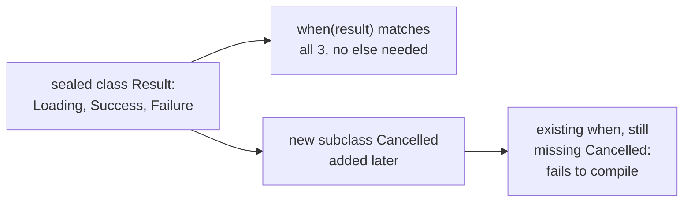

# Lesson 9. Sealed Classes and Exhaustive when

**Mission link:** Lesson 6 named `when`-as-expression's exhaustiveness requirement without giving it real teeth beyond a manual `else`. This lesson is where that requirement becomes compiler-checked against every actual case, the same "compile time, not runtime" move null safety (lesson 1) made for nullability.
**Primary source:** [Docs: "Sealed classes and interfaces", Kotlin](https://kotlinlang.org/docs/sealed-classes.html)
**Prerequisites:** [Lesson 8](0008-data-classes.md), [Platform type](../GLOSSARY.md)

## Warm-up

1. ▢ List the four members `data class` generates automatically from primary-constructor properties.

Check

`equals()`/`hashCode()` (structural equality), `toString()` (a readable representation), `componentN()` functions (destructuring), and `copy()` (a new instance with some properties changed).

2. ▢ Why are `componentN()` and `copy()` disallowed from custom implementations, unlike `equals()`, `hashCode()`, and `toString()`?

Check

Disallowing custom `componentN()`/`copy()` implementations keeps them mechanically tied to the primary constructor's actual current properties, guaranteeing they always reflect the real shape of the data rather than a hand-maintained version that could silently drift out of sync.

## Know this

### A sealed hierarchy means every subclass is known at compile time

A **sealed class** (or **sealed interface**) restricts inheritance: every direct subclass must be declared within the same module and package as the sealed declaration itself, so the compiler knows the complete, closed set of possible subclasses at compile time. This is a fundamentally different guarantee than an ordinary open class or interface, where any code, anywhere, could add a new subclass the original author never anticipated. Sealing trades that openness for a specific, valuable guarantee: nothing outside this known set can ever appear.

### `when` over a sealed type is exhaustive without an `else`, and the compiler proves it

Lesson 6 established that `when`-as-expression requires exhaustiveness, ordinarily satisfied with an `else` branch covering anything not explicitly matched. Matching on a sealed type changes this: since the compiler knows every possible subclass, a `when` covering every one of them is exhaustive *without* an `else` at all, and the compiler verifies this by checking the sealed hierarchy's actual, closed member list against the branches written. If a new subclass is later added to the sealed hierarchy, every `when` over that type that lacks an `else` immediately fails to compile until the new case is handled, turning "someone forgot to update this `when`" from a silent runtime gap into a compile error at the exact place it needs fixing.

### This is the same shape of guarantee null safety gave nullability

Before sealed classes, modelling a fixed set of possible states (a network request that's loading, succeeded, or failed) with an open class hierarchy or an exception-based signal leaves handling every case as a manual discipline: nothing stops a developer from forgetting the "failed" branch, the same way nothing in Java stops a developer from forgetting a null check. Sealing the hierarchy moves that discipline into the type system, exactly the way `String?` moved "could this be null" out of a runtime surprise. A sealed class used with `when` is the mission's clearest example of "type-safe design," modelling a domain so the compiler itself enforces every case is handled, not the developer's memory.

### Where sealed classes actually fit, versus an ordinary open hierarchy or an enum

Sealed classes fit specifically when there's a limited, closed set of variants known in advance, each variant potentially carrying different data (unlike an enum, lesson 10, where every case is a similar, typically data-less constant); type safety and exhaustive pattern matching genuinely matter, as in state management or a library's public error hierarchy; or a closed API needs to guarantee third-party code can't add unexpected subclasses that break assumptions the library depends on. A hierarchy that's genuinely meant to be extended by other code (a plugin system, a framework users are meant to subclass) is exactly the case sealing is wrong for, since sealing's entire point is preventing exactly that kind of extension.

## Practice

1. ▢ What does sealing a class or interface actually guarantee about its subclasses, compared to an ordinary open class?

Check

Every direct subclass of a sealed class or interface must be declared within the same module and package as the sealed declaration, so the compiler knows the complete, closed set of subclasses at compile time. An ordinary open class or interface has no such guarantee; any code anywhere could add a new subclass the original author never anticipated.

2. ▢ Why can a `when` expression over a sealed type skip the `else` branch and still compile as exhaustive?

Hint

Consider what the compiler actually knows about a sealed type's subclasses that it doesn't know about an ordinary open type.

Check

Because the compiler knows the sealed type's complete, closed set of subclasses, it can check whether a `when`'s branches cover every one of them directly, without needing a catch-all `else` for cases it can't otherwise account for. A `when` over an open type has no such closed set to check against, which is why `else` (or exhaustively matching every currently-known subclass, with no compiler guarantee that's actually complete) is needed instead.

3. ▢ A sealed class gets a new subclass added later. What happens to an existing `when` expression over that type that has no `else` branch and doesn't yet handle the new subclass?

Check

It fails to compile: since the compiler checks the `when`'s branches against the sealed hierarchy's actual, current member list, adding a new subclass makes any exhaustive `when` lacking a branch for it immediately incomplete, and the compiler flags this at the exact `when` expression that needs updating, rather than letting the gap pass silently until it causes a runtime problem.

4. ▢ Why is a plugin system, where third-party code is meant to add its own subclasses of a base type, exactly the wrong fit for sealing that type?

Check

Sealing's entire purpose is guaranteeing that no subclasses exist outside the ones known at compile time within the sealing module; a plugin system's whole design depends on external code being able to add new subclasses freely. Sealing the base type would directly contradict the extensibility the plugin system requires.

5. ▢ Which claim correctly describes sealed classes and exhaustive `when`?

    - a) Sealing a class prevents it from having any subclasses at all
    - b) A sealed hierarchy has a complete, compiler-known set of subclasses, letting a `when` over it be exhaustive without an `else`, and the compiler re-checks this exhaustiveness whenever the hierarchy changes
    - c) Sealed classes and enums serve the same purpose and are interchangeable
    - d) A sealed interface can be implemented by any class in any module, as long as it's within the same package as some subclass

Check

**b)** That's the precise guarantee and the compiler-checked consequence this lesson covers. (a) is false: sealing restricts subclasses to being declared within the same module and package, it doesn't forbid subclasses entirely. (c) is false: sealed classes fit a closed set of variants that can each carry different data, while enums (lesson 10) are typically data-less constants; they solve related but distinct modelling needs. (d) is false: implementations must be within the same module and package as the sealed declaration itself, not merely "some" package.

## Real-world reps

- [ ] Find a place in a codebase you know of that models a fixed set of states (a request result, a parsing outcome, a UI state) using an open class hierarchy, an enum with extra fields bolted on awkwardly, or an exception. Consider whether sealing the hierarchy would let a `when` catch missing cases at compile time.
- [ ] Find a `when` expression over a sealed type. Confirm it has no `else` branch and genuinely covers every subclass, then consider what would happen if a new subclass were added tomorrow.
- [ ] Tomorrow: read the primary source's use case scenarios in full, and note one example where a sealed interface (not class) fits better than a sealed class, and why.

## Going further

- [Docs: "Sealed classes and interfaces", Kotlin](https://kotlinlang.org/docs/sealed-classes.html)
- [Docs: "Conditions and loops", Kotlin](https://kotlinlang.org/docs/control-flow.html)
- [Resources](../RESOURCES.md)

---

Not landing? Reread the primary source at the top, since this lesson compresses it and compression is where understanding leaks. Check the [glossary](../GLOSSARY.md) for any term that felt slippery.

If the lesson itself is unclear rather than the material, that is a defect: [open an issue](https://github.com/TokenCemetery/teach/issues).
